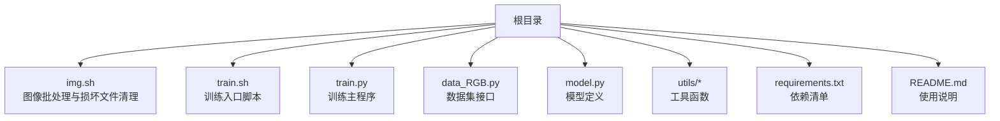
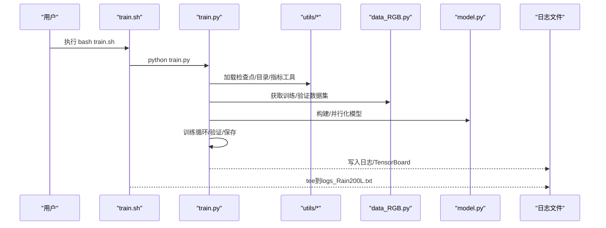
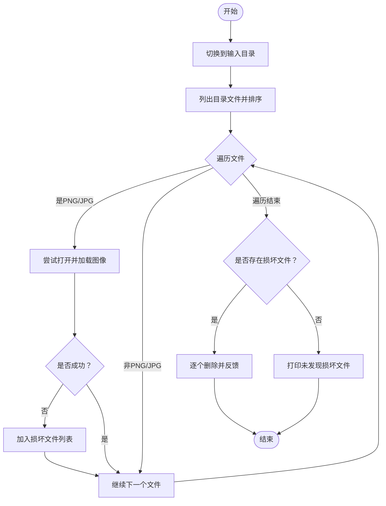
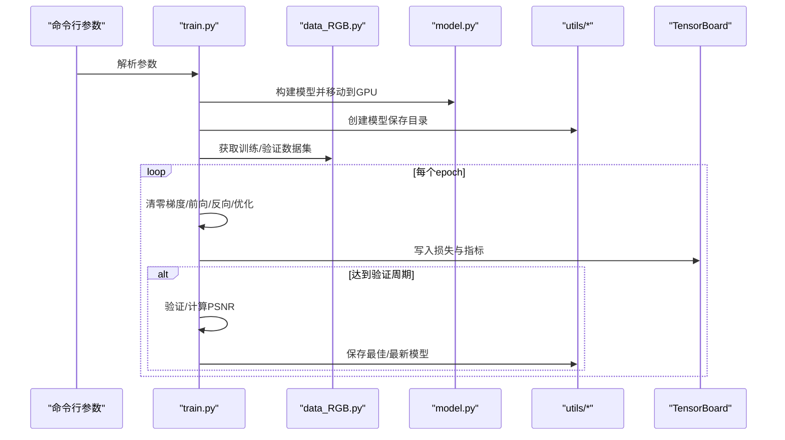
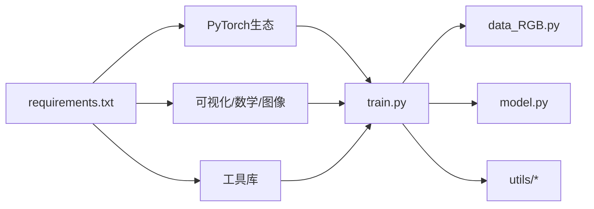

# Shell脚本工具

<cite>
**本文引用的文件**
- [img.sh](file://img.sh)
- [train.sh](file://train.sh)
- [train.py](file://train.py)
- [README.md](file://README.md)
- [requirements.txt](file://requirements.txt)
- [utils/dataset_utils.py](file://utils/dataset_utils.py)
- [utils/dir_utils.py](file://utils/dir_utils.py)
- [utils/image_utils.py](file://utils/image_utils.py)
- [data_RGB.py](file://data_RGB.py)
- [model.py](file://model.py)
</cite>

## 目录
1. [简介](#简介)
2. [项目结构](#项目结构)
3. [核心组件](#核心组件)
4. [架构总览](#架构总览)
5. [详细组件分析](#详细组件分析)
6. [依赖分析](#依赖分析)
7. [性能考虑](#性能考虑)
8. [故障排查指南](#故障排查指南)
9. [结论](#结论)
10. [附录](#附录)

## 简介
本文件面向Shell脚本工具的使用者与维护者，系统化梳理并解释两个关键脚本：图像处理脚本img.sh与训练脚本train.sh。内容涵盖：
- 图像批处理与损坏文件检测删除（img.sh）
- 训练脚本的执行流程、参数配置、GPU与日志管理（train.sh与train.py）
- 使用示例与命令行参数说明
- 修改建议与扩展思路，帮助开发者按需定制

## 项目结构
该仓库围绕“图像去雨”任务构建，包含训练、测试、评估与工具脚本。与本文件相关的组织方式如下：
- 工具脚本位于根目录：img.sh（图像处理）、train.sh（训练入口）
- 训练主程序：train.py
- 数据加载与模型定义：data_RGB.py、model.py
- 实用工具：utils/*（目录、文件、图像指标等）
- 依赖声明：requirements.txt
- 使用说明：README.md

图表来源
- [img.sh](file://img.sh)
- [train.sh](file://train.sh)
- [train.py](file://train.py)
- [data_RGB.py](file://data_RGB.py)
- [model.py](file://model.py)
- [utils/dir_utils.py](file://utils/dir_utils.py)
- [requirements.txt](file://requirements.txt)
- [README.md](file://README.md)

章节来源
- [README.md](file://README.md)
- [requirements.txt](file://requirements.txt)

## 核心组件
- img.sh：在指定输入目录中扫描PNG/JPG图像，验证可读性，输出损坏文件列表，并可选删除。
- train.sh：提交SLURM作业，激活环境（注释），运行train.py并将标准输出重定向到日志文件。
- train.py：训练主程序，负责参数解析、数据加载、模型构建、优化器与学习率调度、训练循环、验证与保存检查点、TensorBoard写入等。

章节来源
- [img.sh](file://img.sh)
- [train.sh](file://train.sh)
- [train.py](file://train.py)

## 架构总览
下图展示从脚本到训练主程序的整体调用链路与数据流。

图表来源
- [train.sh](file://train.sh)
- [train.py](file://train.py)
- [data_RGB.py](file://data_RGB.py)
- [model.py](file://model.py)
- [utils/dir_utils.py](file://utils/dir_utils.py)
- [utils/image_utils.py](file://utils/image_utils.py)

## 详细组件分析

### 图像处理脚本：img.sh
- 功能概述
  - 切换至指定测试输入目录
  - 使用Python脚本扫描目录中的PNG/JPG文件
  - 尝试打开并加载每个图像，捕获IO/OS错误
  - 统计并打印损坏文件列表
  - 若存在损坏文件，则逐个删除并反馈删除结果；否则提示未发现损坏文件

- 关键行为与流程
  - 目录遍历与排序
  - 文件类型过滤（仅PNG/JPG）
  - 异常捕获与记录
  - 删除确认与反馈

图表来源
- [img.sh](file://img.sh)

章节来源
- [img.sh](file://img.sh)

### 训练脚本：train.sh
- 功能概述
  - SLURM作业头：选择分区与最大运行时长
  - 可选环境激活（注释）
  - 运行train.py并将标准输出与错误重定向到日志文件

- 作业头参数说明
  - 分区选择：gpu20
  - 最大运行时间：7天

- 日志管理
  - 使用tee将训练过程输出同时写入终端与日志文件，便于离线查看

- 建议
  - 如需多GPU或多节点，可在作业头添加相应指令
  - 可将日志路径改为动态参数或基于会话名生成

章节来源
- [train.sh](file://train.sh)

### 训练主程序：train.py
- 参数解析与默认值
  - 训练/验证数据目录
  - 模型保存目录
  - 会话名称、模式、裁剪尺寸、训练轮次、批次大小、验证间隔
  - 预训练权重路径（可选）

- 设备与并行
  - 显卡可见性设置
  - 多GPU并行（DataParallel）
  - cuDNN加速开关

- 模型与损失
  - 模型类：MultiscaleNet
  - 损失函数组合：Charbonnier、边缘、FFT、L1
  - 学习率调度：预热后余弦退火

- 数据加载
  - 训练/验证数据集接口
  - DataLoader参数：打乱、单进程、固定内存等

- 训练循环与验证
  - 每轮清零梯度、前向、反向、优化、累计损失
  - 定期验证，计算PSNR并保存最佳/最新模型
  - TensorBoard写入各类损失与指标

- 恢复与预训练
  - 支持从上次断点恢复
  - 支持加载预训练权重（可选）

- 日志与输出
  - 控制台打印每轮耗时、损失与学习率
  - 日志文件由train.sh统一收集

图表来源
- [train.py](file://train.py)
- [data_RGB.py](file://data_RGB.py)
- [model.py](file://model.py)
- [utils/dir_utils.py](file://utils/dir_utils.py)
- [utils/image_utils.py](file://utils/image_utils.py)

章节来源
- [train.py](file://train.py)

## 依赖分析
- Python依赖
  - PyTorch生态：torch、torchvision、torchaudio
  - 可视化：tensorboard
  - 数学与图像：kornia、scikit-image、opencv-python、Pillow
  - 工具：einops、natsort、tqdm、warmup-scheduler
  - 其他：matplotlib、requests等

- 训练脚本对依赖的使用
  - train.py直接导入torch、torch.nn、torch.optim、DataLoader、SummaryWriter等
  - utils/*提供目录创建、检查点加载/保存、PSNR计算等辅助能力
  - data_RGB.py封装数据集接口
  - model.py实现多尺度网络结构

图表来源
- [requirements.txt](file://requirements.txt)
- [train.py](file://train.py)
- [data_RGB.py](file://data_RGB.py)
- [model.py](file://model.py)
- [utils/dir_utils.py](file://utils/dir_utils.py)
- [utils/image_utils.py](file://utils/image_utils.py)

章节来源
- [requirements.txt](file://requirements.txt)
- [train.py](file://train.py)

## 性能考虑
- GPU利用率
  - 多GPU并行（DataParallel）可提升吞吐，但需注意数据分发与同步开销
  - 单GPU场景下可通过增大batch_size或启用cudnn加速提升性能

- 数据加载
  - DataLoader使用单进程与pin_memory，适合中小规模数据集
  - 对大规模数据集可考虑增加num_workers并评估内存占用

- 学习率调度
  - 预热+余弦退火策略有助于稳定初期训练与后期收敛

- I/O与日志
  - tee写入日志文件可能成为瓶颈，建议在高并发场景下采用异步写入或减少频繁刷新

## 故障排查指南
- 图像处理脚本（img.sh）
  - 症状：无法删除文件或提示权限不足
  - 排查：确认当前用户对目标目录有写权限；检查文件是否被其他进程占用
  - 症状：误删或漏删
  - 排查：先不执行删除逻辑，仅打印损坏列表进行核对

- 训练脚本（train.sh）
  - 症状：作业长时间处于排队状态
  - 排查：检查分区gpu20负载与配额限制
  - 症状：日志文件为空
  - 排查：确认python路径正确、环境变量已生效、train.py可正常运行

- 训练主程序（train.py）
  - 症状：显存不足或OOM
  - 排查：降低batch_size或patch_size；关闭不必要的并行；检查数据集路径
  - 症状：训练不收敛或波动大
  - 排查：调整学习率、预热轮次、损失权重；检查数据质量与MixUp增强
  - 症状：断点恢复失败
  - 排查：确认检查点文件存在且格式匹配；必要时禁用多GPU保存/加载的兼容性处理

章节来源
- [img.sh](file://img.sh)
- [train.sh](file://train.sh)
- [train.py](file://train.py)

## 结论
- img.sh提供了简单可靠的图像批处理与损坏文件清理能力，适合在训练前进行数据质量检查与预处理。
- train.sh与train.py构成完整的训练流水线，具备参数化配置、多GPU支持、日志与TensorBoard集成、断点恢复与验证机制。
- 建议结合实际硬件与数据规模对参数进行微调，并在生产环境中完善日志与监控策略。

## 附录

### 使用示例与命令行参数说明
- 图像处理（img.sh）
  - 适用场景：训练前检查Rain200L等数据集输入目录的PNG/JPG文件完整性
  - 操作步骤：确保脚本可执行，直接运行即可；如需删除损坏文件，请在确认列表后再执行

- 训练（train.sh）
  - 适用场景：在SLURM集群上提交训练作业
  - 操作步骤：在项目根目录执行bash train.sh，等待作业完成并在checkpoints目录查看模型与日志

- 训练参数（train.py）
  - 主要参数（节选）
    - --train_dir：训练数据目录
    - --val_dir：验证数据目录
    - --model_save_dir：模型保存根目录
    - --mode：任务模式
    - --session：会话标识
    - --patch_size：裁剪尺寸
    - --num_epochs：训练轮次
    - --batch_size：批次大小
    - --val_epochs：验证间隔
  - 可选参数
    - --pretrain_weights：预训练权重路径（启用预训练时使用）

- 环境准备
  - 安装依赖：pip install -r requirements.txt
  - 安装warmup调度器：cd pytorch-gradual-warmup-lr && python setup.py install && cd ..

章节来源
- [README.md](file://README.md)
- [requirements.txt](file://requirements.txt)
- [train.py](file://train.py)

### 修改建议与扩展方法
- img.sh
  - 增加Dry-run选项，先打印将要删除的文件列表再决定是否删除
  - 支持递归子目录扫描
  - 增加统计信息（总文件数、损坏比例等）

- train.sh
  - 将日志文件名参数化，避免硬编码
  - 支持多GPU/多节点配置（如sbatch --gres/gres-flags）
  - 添加邮件通知或作业状态回调

- train.py
  - 参数化学习率、损失权重与验证策略
  - 支持混合精度训练（AMP）以提升吞吐
  - 增加早停策略与动态调整batch_size的机制
  - 扩展数据增强（MixUp等）为可配置项
  - 支持分布式训练（DDP）以进一步提升效率

章节来源
- [img.sh](file://img.sh)
- [train.sh](file://train.sh)
- [train.py](file://train.py)
- [utils/dataset_utils.py](file://utils/dataset_utils.py)
- [utils/dir_utils.py](file://utils/dir_utils.py)
- [utils/image_utils.py](file://utils/image_utils.py)
- [data_RGB.py](file://data_RGB.py)
- [model.py](file://model.py)