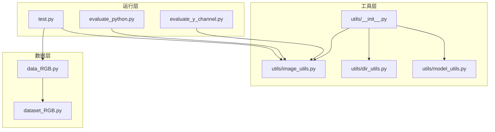
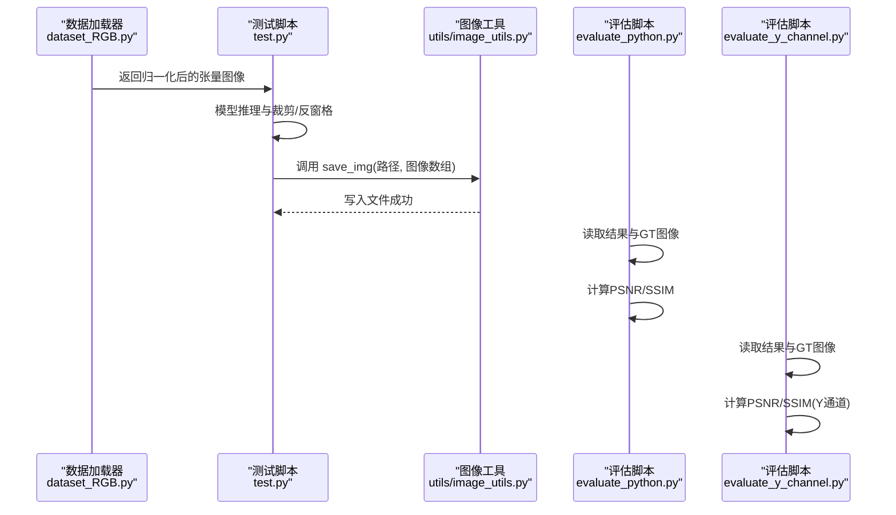
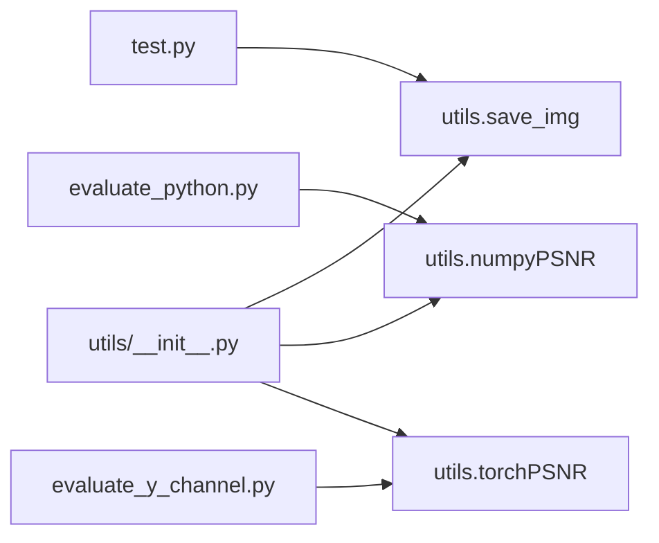

# 图像处理工具

<cite>
**本文引用的文件**
- [utils/image_utils.py](file://utils/image_utils.py)
- [utils/__init__.py](file://utils/__init__.py)
- [test.py](file://test.py)
- [evaluate_python.py](file://evaluate_python.py)
- [evaluate_y_channel.py](file://evaluate_y_channel.py)
- [data_RGB.py](file://data_RGB.py)
- [dataset_RGB.py](file://dataset_RGB.py)
- [utils/dir_utils.py](file://utils/dir_utils.py)
- [utils/model_utils.py](file://utils/model_utils.py)
- [README.md](file://README.md)
</cite>

## 目录
1. [简介](#简介)
2. [项目结构](#项目结构)
3. [核心组件](#核心组件)
4. [架构总览](#架构总览)
5. [详细组件分析](#详细组件分析)
6. [依赖分析](#依赖分析)
7. [性能考虑](#性能考虑)
8. [故障排查指南](#故障排查指南)
9. [结论](#结论)
10. [附录](#附录)

## 简介
本文件面向“图像处理工具”模块，聚焦于 utils/image_utils.py 中的图像处理相关工具函数，系统阐述其功能、参数、返回值、异常处理与使用场景，并结合训练与测试脚本中的实际调用方式，给出数据预处理与后处理阶段的实践建议。同时提供性能优化建议与常见问题的解决方案，帮助读者在图像去雨等任务中高效、稳定地使用这些工具。

## 项目结构
该仓库围绕图像去雨任务组织，图像处理工具位于 utils/image_utils.py；训练与测试流程由 test.py 驱动；评估脚本 evaluate_python.py 与 evaluate_y_channel.py 提供 PSNR/SSIM 计算与对比；数据加载由 data_RGB.py/dataset_RGB.py 提供，统一通过 utils/__init__.py 导出。

图表来源
- [utils/image_utils.py:1-19](file://utils/image_utils.py#L1-L19)
- [utils/__init__.py:1-5](file://utils/__init__.py#L1-L5)
- [test.py:1-69](file://test.py#L1-L69)
- [evaluate_python.py:1-119](file://evaluate_python.py#L1-L119)
- [evaluate_y_channel.py:133-201](file://evaluate_y_channel.py#L133-L201)
- [data_RGB.py:1-161](file://data_RGB.py#L1-L161)
- [dataset_RGB.py:1-161](file://dataset_RGB.py#L1-L161)

章节来源
- [utils/image_utils.py:1-19](file://utils/image_utils.py#L1-L19)
- [utils/__init__.py:1-5](file://utils/__init__.py#L1-L5)
- [test.py:1-69](file://test.py#L1-L69)
- [evaluate_python.py:1-119](file://evaluate_python.py#L1-L119)
- [evaluate_y_channel.py:133-201](file://evaluate_y_channel.py#L133-L201)
- [data_RGB.py:1-161](file://data_RGB.py#L1-L161)
- [dataset_RGB.py:1-161](file://dataset_RGB.py#L1-L161)

## 核心组件
本模块的核心是三个图像处理工具函数：
- torchPSNR：基于 PyTorch 的张量计算峰值信噪比（PSNR），适用于模型输出与目标之间的质量评估。
- save_img：将 NumPy 图像保存为文件，内部完成 RGB/BGR 颜色空间转换。
- numpyPSNR：基于 NumPy 的 PSNR 计算，常用于离线评估脚本。

章节来源
- [utils/image_utils.py:5-18](file://utils/image_utils.py#L5-L18)

## 架构总览
下图展示了从数据加载到图像保存与评估的整体流程，以及工具函数在其中的位置。

图表来源
- [test.py:47-68](file://test.py#L47-L68)
- [utils/image_utils.py:11-12](file://utils/image_utils.py#L11-L12)
- [evaluate_python.py:92-100](file://evaluate_python.py#L92-L100)
- [evaluate_y_channel.py:176-201](file://evaluate_y_channel.py#L176-L201)

## 详细组件分析

### 函数：torchPSNR
- 功能：对两个张量形式的图像进行 PSNR 计算，输入范围通常为 [0,1]。
- 参数
  - tar_img：目标图像张量，形状一般为 C×H×W 或 N×C×H×W。
  - prd_img：预测图像张量，形状与目标一致。
- 处理逻辑
  - 对输入进行裁剪至 [0,1]，避免数值溢出。
  - 计算差值的均方根误差（RMSE），再根据公式 20*log10(1/RMSE) 得到 PSNR。
- 返回值：标量或批量的 PSNR 值。
- 异常与边界
  - 当 RMSE 接近 0 时，PSNR 趋向无穷大；若输入为全零或完全相同，需确保数值稳定。
  - 输入维度不匹配会引发张量运算错误，应保证形状一致。
- 使用场景
  - 在训练日志、验证阶段对模型输出进行快速质量评估。
- 性能提示
  - 在 GPU 上直接计算，避免不必要的 CPU/GPU 数据传输。
  - 批量计算时注意内存占用，必要时分批处理。

章节来源
- [utils/image_utils.py:5-9](file://utils/image_utils.py#L5-L9)

### 函数：save_img
- 功能：将 NumPy 图像保存为文件。
- 参数
  - filepath：保存路径字符串。
  - img：NumPy 图像数组，通常为 H×W×C 的 RGB。
- 处理逻辑
  - 使用 OpenCV 将 RGB 转换为 BGR 后写入文件。
- 返回值：无（写入文件）。
- 异常与边界
  - 若 img 不是 H×W×C 形状，OpenCV 可能报错。
  - 若目录不存在，需要先创建目录（可配合 utils/mkdirs 使用）。
- 使用场景
  - 测试阶段将模型输出的图像写入磁盘，便于人工检查或进一步评估。
- 性能提示
  - 保存前尽量将数据类型转为合适的整型（如 uint8），减少存储体积。
  - 批量保存时可考虑异步或队列化，避免阻塞主线程。

章节来源
- [utils/image_utils.py:11-12](file://utils/image_utils.py#L11-L12)

### 函数：numpyPSNR
- 功能：基于 NumPy 的 PSNR 计算，适用于离线评估。
- 参数
  - tar_img：目标图像数组，通常为 H×W×C 的 RGB，像素值范围 0–255。
  - prd_img：预测图像数组，形状与目标一致。
- 处理逻辑
  - 将输入转换为浮点型，计算差值平方的均值，再根据公式 20*log10(255/RMSE) 得到 PSNR。
- 返回值：标量或批量的 PSNR 值。
- 异常与边界
  - 当 RMSE 接近 0 时，PSNR 趋向无穷大；若输入为全零或完全相同，需确保数值稳定。
  - 输入维度不匹配会引发数组运算错误，应保证形状一致。
- 使用场景
  - 评估脚本中对结果图像与 GT 进行 PSNR 计算，常用于批量统计。
- 性能提示
  - 在批量计算时，尽量使用向量化操作，避免 Python 循环。
  - 注意内存峰值，必要时分块处理。

章节来源
- [utils/image_utils.py:14-18](file://utils/image_utils.py#L14-L18)

### 实际使用示例与代码片段路径
- 测试阶段保存图像
  - 调用链：test.py -> utils.save_img
  - 关键步骤：将模型输出从张量转为 NumPy，再调用保存函数。
  - 示例路径：[test.py:65-68](file://test.py#L65-L68)
- 评估阶段读取与计算 PSNR/SSIM
  - 调用链：evaluate_python.py -> OpenCV 读取 -> numpyPSNR 或自定义 SSIM
  - 示例路径：[evaluate_python.py:92-100](file://evaluate_python.py#L92-L100)
- 评估阶段读取与计算 Y 通道 PSNR/SSIM
  - 调用链：evaluate_y_channel.py -> OpenCV 读取 -> Y 通道提取 -> PSNR/SSIM
  - 示例路径：[evaluate_y_channel.py:176-201](file://evaluate_y_channel.py#L176-L201)

章节来源
- [test.py:65-68](file://test.py#L65-L68)
- [evaluate_python.py:92-100](file://evaluate_python.py#L92-L100)
- [evaluate_y_channel.py:176-201](file://evaluate_y_channel.py#L176-L201)

## 依赖分析
- 模块导出
  - utils/__init__.py 将 utils/image_utils.py 中的函数导入到 utils 命名空间，便于在其他模块中直接使用。
- 外部依赖
  - OpenCV：用于图像读写与颜色空间转换。
  - NumPy：用于数组运算与 PSNR 计算。
  - PyTorch：用于张量运算与 PSNR 计算。
- 调用关系
  - test.py 直接调用 utils.save_img。
  - evaluate_python.py 与 evaluate_y_channel.py 间接依赖 utils/image_utils.py 中的 PSNR 计算能力（尽管它们各自实现了 PSNR/SSIM，但工具函数仍可复用）。

图表来源
- [utils/__init__.py:1-5](file://utils/__init__.py#L1-L5)
- [test.py:65-68](file://test.py#L65-L68)
- [evaluate_python.py:92-100](file://evaluate_python.py#L92-L100)
- [evaluate_y_channel.py:176-201](file://evaluate_y_channel.py#L176-L201)

章节来源
- [utils/__init__.py:1-5](file://utils/__init__.py#L1-L5)
- [test.py:65-68](file://test.py#L65-L68)
- [evaluate_python.py:92-100](file://evaluate_python.py#L92-L100)
- [evaluate_y_channel.py:176-201](file://evaluate_y_channel.py#L176-L201)

## 性能考虑
- I/O 与颜色空间
  - OpenCV 默认读取为 BGR，而大多数深度学习库与显示库使用 RGB。在保存图像前进行 RGB→BGR 转换，避免颜色偏差。
  - 保存前将数据类型转换为 uint8，有助于减小文件体积。
- 批量处理
  - 在测试阶段，将批量输出一次性写入磁盘可能造成 I/O 压力。可采用分批写入或异步写入策略。
- 内存管理
  - 在大规模评估时，逐张读取与计算，避免同时加载所有图像到内存。
- 计算效率
  - torchPSNR 与 numpyPSNR 均采用向量化运算，适合批量计算；注意控制输入规模，避免内存峰值过高。

## 故障排查指南
- 保存图像颜色异常
  - 现象：保存的图像颜色偏移。
  - 排查：确认是否进行了 RGB→BGR 转换；确保输入数组为 H×W×C 的 RGB。
  - 参考路径：[utils/image_utils.py:11-12](file://utils/image_utils.py#L11-L12)
- 无法读取评估图像
  - 现象：评估脚本报错找不到 GT 或结果图像。
  - 排查：检查路径拼接是否正确；确认文件扩展名与大小写；评估脚本提供了多种 GT 目录名尝试。
  - 参考路径：[evaluate_y_channel.py:133-147](file://evaluate_y_channel.py#L133-L147)
- 维度不匹配导致的计算错误
  - 现象：PSNR 计算时报错或结果异常。
  - 排查：确保 tar_img 与 prd_img 的形状一致；在评估脚本中注意尺寸裁剪与对齐。
  - 参考路径：[evaluate_y_channel.py:190-196](file://evaluate_y_channel.py#L190-L196)
- GPU 内存不足
  - 现象：训练/测试过程中显存溢出。
  - 排查：降低批大小、窗口大小或关闭不必要的数据增强；在循环中及时释放缓存。
  - 参考路径：[test.py:52-53](file://test.py#L52-L53)

章节来源
- [utils/image_utils.py:11-12](file://utils/image_utils.py#L11-L12)
- [evaluate_y_channel.py:133-147](file://evaluate_y_channel.py#L133-L147)
- [evaluate_y_channel.py:190-196](file://evaluate_y_channel.py#L190-L196)
- [test.py:52-53](file://test.py#L52-L53)

## 结论
utils/image_utils.py 提供了简洁高效的图像处理工具：torchPSNR、save_img、numpyPSNR。它们分别适用于训练/验证阶段的质量评估、测试阶段的结果保存与离线评估脚本中的 PSNR 计算。结合数据加载与评估脚本，可以构建从数据预处理到后处理与评估的完整流水线。建议在实际使用中关注颜色空间一致性、维度匹配与内存管理，以获得稳定且高性能的图像处理体验。

## 附录
- 相关文件与用途
  - utils/image_utils.py：图像处理工具函数（PSNR、保存图像）
  - utils/__init__.py：模块导出入口
  - test.py：测试流程，调用 save_img 保存结果
  - evaluate_python.py：离线评估脚本，读取图像并计算 PSNR/SSIM
  - evaluate_y_channel.py：离线评估脚本，读取图像并计算 Y 通道 PSNR/SSIM
  - data_RGB.py / dataset_RGB.py：数据加载与增强
  - utils/dir_utils.py：目录创建与路径管理
  - utils/model_utils.py：模型权重加载与状态字典处理