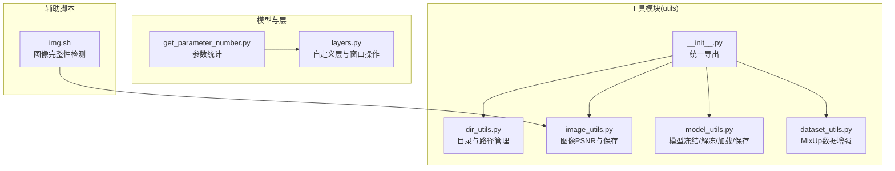
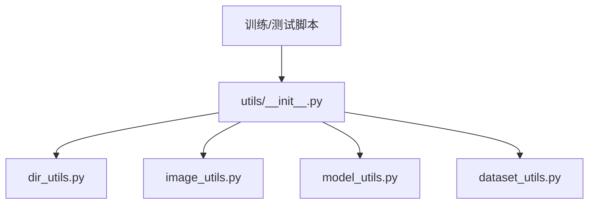
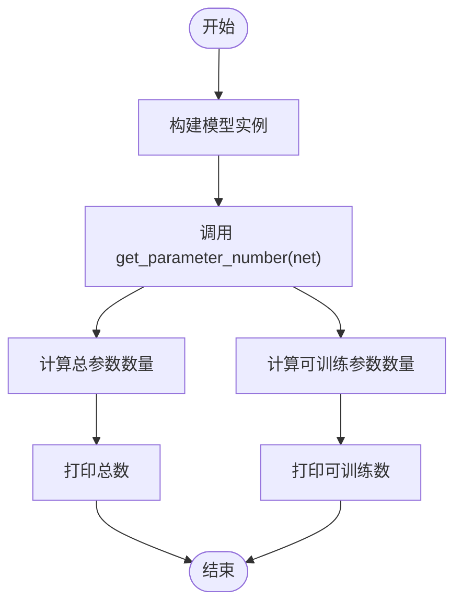
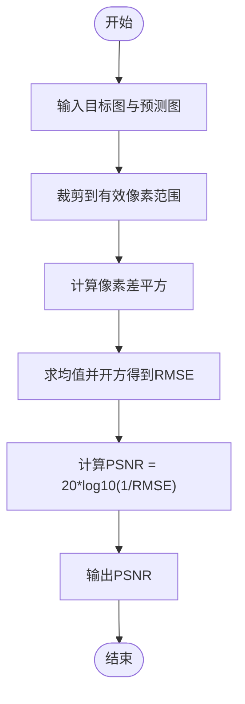
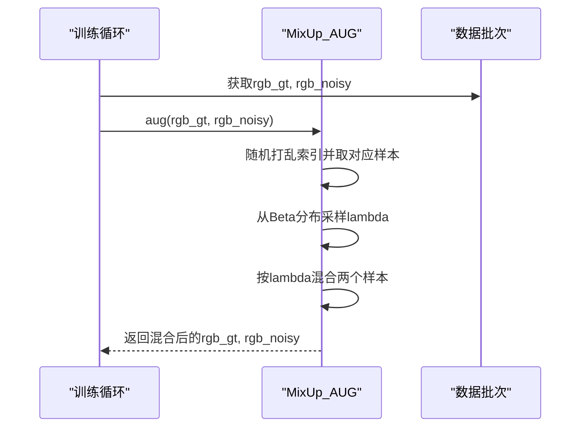
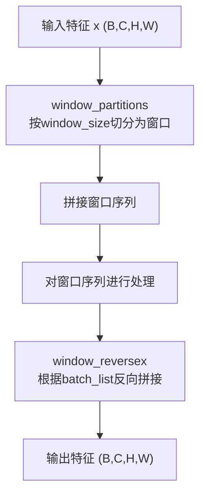
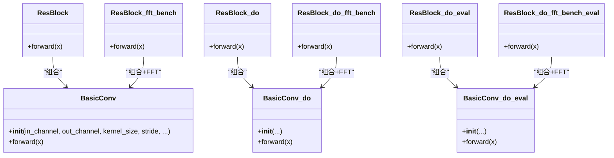
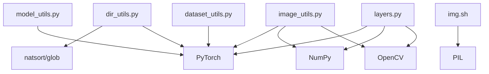

# 工具函数与实用程序

<cite>
**本文档引用的文件**
- [utils/__init__.py](file://utils/__init__.py)
- [utils/dir_utils.py](file://utils/dir_utils.py)
- [utils/image_utils.py](file://utils/image_utils.py)
- [utils/model_utils.py](file://utils/model_utils.py)
- [utils/dataset_utils.py](file://utils/dataset_utils.py)
- [get_parameter_number.py](file://get_parameter_number.py)
- [layers.py](file://layers.py)
- [img.sh](file://img.sh)
- [README.md](file://README.md)
- [requirements.txt](file://requirements.txt)
</cite>

## 目录
1. [简介](#简介)
2. [项目结构](#项目结构)
3. [核心组件](#核心组件)
4. [架构概览](#架构概览)
5. [详细组件分析](#详细组件分析)
6. [依赖分析](#依赖分析)
7. [性能考虑](#性能考虑)
8. [故障排除指南](#故障排除指南)
9. [结论](#结论)
10. [附录](#附录)

## 简介
本文件系统性梳理了项目中的工具函数与实用程序模块，覆盖数据处理、图像处理、模型工具以及自定义神经网络层等关键能力。重点解析以下内容：
- utils/目录下的工具模块：目录管理、图像度量与保存、数据集增强、模型加载与保存等
- 模型参数统计工具：get_parameter_number.py 的实现原理与使用场景
- 自定义层：layers.py 中的通用卷积层、可分离方向卷积层及窗口分块/反向操作
- Shell脚本：img.sh 的图像完整性检测与清理流程
- API参考与最佳实践：函数签名、输入输出约定、常见错误与优化建议

## 项目结构
工具相关的核心位置如下：
- utils/：统一导出各类工具函数（目录管理、图像处理、模型工具、数据集工具）
- get_parameter_number.py：模型参数与计算复杂度统计
- layers.py：自定义卷积层与窗口分块算法
- img.sh：图像文件完整性检测与删除脚本

**图表来源**
- [utils/__init__.py:1-5](file://utils/__init__.py#L1-L5)
- [utils/dir_utils.py:1-18](file://utils/dir_utils.py#L1-L18)
- [utils/image_utils.py:1-19](file://utils/image_utils.py#L1-L19)
- [utils/model_utils.py:1-111](file://utils/model_utils.py#L1-L111)
- [utils/dataset_utils.py:1-18](file://utils/dataset_utils.py#L1-L18)
- [get_parameter_number.py:1-20](file://get_parameter_number.py#L1-L20)
- [layers.py:1-392](file://layers.py#L1-L392)
- [img.sh:1-32](file://img.sh#L1-L32)

**章节来源**
- [utils/__init__.py:1-5](file://utils/__init__.py#L1-L5)
- [README.md:25-59](file://README.md#L25-L59)

## 核心组件
本节对各工具模块进行功能与使用方法的深入说明，并给出API参考与最佳实践。

### 目录与路径管理（utils/dir_utils.py）
- 功能概述
  - 创建多级目录：支持单个路径或路径列表
  - 获取会话最新子路径：基于自然排序与通配匹配
- 关键函数
  - mkdirs(paths)：批量创建目录
  - mkdir(path)：创建单个目录
  - get_last_path(path, session)：返回包含会话标识的最新子路径
- 使用示例（路径引用）
  - [mkdirs:5-10](file://utils/dir_utils.py#L5-L10)
  - [mkdir:12-14](file://utils/dir_utils.py#L12-L14)
  - [get_last_path:16-18](file://utils/dir_utils.py#L16-L18)
- 最佳实践
  - 在训练日志与模型保存前先调用 mkdirs 确保目录存在
  - 使用 get_last_path 组织实验结果时，确保会话标识唯一且可被自然排序识别

**章节来源**
- [utils/dir_utils.py:1-18](file://utils/dir_utils.py#L1-L18)

### 图像处理与度量（utils/image_utils.py）
- 功能概述
  - 计算张量域PSNR（torchPSNR）与NumPy域PSNR（numpyPSNR）
  - 将RGB图像保存为BGR格式（OpenCV兼容）
- 关键函数
  - torchPSNR(tar_img, prd_img)：返回标量PSNR值
  - save_img(filepath, img)：保存图像至指定路径
  - numpyPSNR(tar_img, prd_img)：返回标量PSNR值
- 使用示例（路径引用）
  - [torchPSNR:5-9](file://utils/image_utils.py#L5-L9)
  - [save_img:11-12](file://utils/image_utils.py#L11-L12)
  - [numpyPSNR:14-18](file://utils/image_utils.py#L14-L18)
- 最佳实践
  - 评估阶段优先使用 torchPSNR 以避免数据类型转换开销
  - 保存图像前确保像素范围已归一化到对应格式要求

**章节来源**
- [utils/image_utils.py:1-19](file://utils/image_utils.py#L1-L19)

### 模型工具（utils/model_utils.py）
- 功能概述
  - 冻结/解冻模型参数
  - 加载/保存检查点（含多GPU权重键名适配）
  - 从压缩权重中重建DoConv参数
- 关键函数
  - freeze(model)：将所有参数requires_grad置False
  - unfreeze(model)：将所有参数requires_grad置True
  - is_frozen(model)：判断是否存在未冻结参数
  - save_checkpoint(model_dir, state, session)：按epoch与会话保存
  - load_checkpoint(model, weights)：常规加载（兼容module.前缀）
  - load_checkpoint_compress_doconv(model, weights)：重建DoConv权重
  - load_checkpoint_hin(model, weights)：直接加载字典
  - load_checkpoint_multigpu(model, weights)：去除module.前缀
  - load_start_epoch(weights)：读取起始epoch
  - load_optim(optimizer, weights)：加载优化器状态
- 使用示例（路径引用）
  - [freeze:5-7](file://utils/model_utils.py#L5-L7)
  - [unfreeze:9-11](file://utils/model_utils.py#L9-L11)
  - [is_frozen:13-15](file://utils/model_utils.py#L13-L15)
  - [save_checkpoint:17-20](file://utils/model_utils.py#L17-L20)
  - [load_checkpoint:22-36](file://utils/model_utils.py#L22-L36)
  - [load_checkpoint_compress_doconv:38-79](file://utils/model_utils.py#L38-L79)
  - [load_checkpoint_hin:80-91](file://utils/model_utils.py#L80-L91)
  - [load_checkpoint_multigpu:92-99](file://utils/model_utils.py#L92-L99)
  - [load_start_epoch:101-104](file://utils/model_utils.py#L101-L104)
  - [load_optim:106-110](file://utils/model_utils.py#L106-L110)
- 最佳实践
  - 多GPU训练后测试或推理需使用 load_checkpoint_multigpu 或 load_checkpoint 做键名适配
  - 保存模型时同时记录 epoch 与优化器状态，便于断点续训

**章节来源**
- [utils/model_utils.py:1-111](file://utils/model_utils.py#L1-L111)

### 数据集工具（utils/dataset_utils.py）
- 功能概述
  - MixUp增强：对成对样本按Beta分布混合，支持批量随机置换与lambda采样
- 关键类
  - MixUp_AUG：初始化Beta分布，提供aug接口
- 使用示例（路径引用）
  - [MixUp_AUG.__init__:3-5](file://utils/dataset_utils.py#L3-L5)
  - [MixUp_AUG.aug:7-16](file://utils/dataset_utils.py#L7-L16)
- 最佳实践
  - 在训练循环中按需调用 aug 对输入与目标进行一致性混合
  - 注意lambda的维度广播与设备放置（如需）

**章节来源**
- [utils/dataset_utils.py:1-18](file://utils/dataset_utils.py#L1-L18)

### 模型参数统计（get_parameter_number.py）
- 功能概述
  - 统计模型总参数量与可训练参数量
  - 结合ptflops进行计算复杂度与参数量的可视化输出
- 关键函数
  - get_parameter_number(net)：打印总数与可训练数
- 使用示例（路径引用）
  - [get_parameter_number:3-8](file://get_parameter_number.py#L3-L8)
- 最佳实践
  - 在模型构建完成后立即调用以核验参数规模
  - 配合外部FLOPS工具进行性能对比

**章节来源**
- [get_parameter_number.py:1-20](file://get_parameter_number.py#L1-L20)

### 自定义层（layers.py）
- 功能概述
  - 通用卷积层、可分离方向卷积层及其推理版本
  - 可选归一化、激活函数与转置卷积
  - 窗口分块与反向拼接（支持不完整边界）
  - FFT基准残差块（可选归一化模式）
- 关键类与函数
  - BasicConv：标准卷积，支持组卷积、转置卷积、BN与ReLU
  - BasicConv_do / BasicConv_do_eval：方向卷积变体（训练/推理）
  - ResBlock / ResBlock_do / ResBlock_do_eval：残差块
  - ResBlock_do_fft_bench / ResBlock_fft_bench / ResBlock_do_fft_bench_eval：FFT增强残差块
  - window_partitions / window_reverses：窗口分块与反向拼接
  - window_partitionx / window_reversex：带边界处理的分块/反向
- 使用示例（路径引用）
  - [BasicConv:12-38](file://layers.py#L12-L38)
  - [BasicConv_do:40-68](file://layers.py#L40-L68)
  - [ResBlock:100-109](file://layers.py#L100-L109)
  - [window_partitions:212-225](file://layers.py#L212-L225)
  - [window_reversex:274-304](file://layers.py#L274-L304)
- 最佳实践
  - 方向卷积层适合需要方向感知的任务；推理阶段使用 *_eval 变体
  - 窗口分块用于大尺寸图像的内存友好处理，注意边界补全策略

**章节来源**
- [layers.py:1-392](file://layers.py#L1-L392)

### Shell脚本（img.sh）
- 功能概述
  - 扫描指定目录下的PNG/JPG图像，检测损坏文件并删除
- 关键逻辑
  - 列举文件、尝试打开、捕获异常、收集坏文件、删除并反馈
- 使用示例（路径引用）
  - [img.sh:1-32](file://img.sh#L1-L32)
- 最佳实践
  - 在数据准备阶段运行该脚本，确保输入数据质量
  - 调整路径与权限，确保脚本可在目标环境中执行

**章节来源**
- [img.sh:1-32](file://img.sh#L1-L32)

## 架构概览
工具模块通过统一入口导出，形成“工具聚合层”，供训练/测试脚本与评估流程复用。

**图表来源**
- [utils/__init__.py:1-5](file://utils/__init__.py#L1-L5)
- [utils/dir_utils.py:1-18](file://utils/dir_utils.py#L1-L18)
- [utils/image_utils.py:1-19](file://utils/image_utils.py#L1-L19)
- [utils/model_utils.py:1-111](file://utils/model_utils.py#L1-L111)
- [utils/dataset_utils.py:1-18](file://utils/dataset_utils.py#L1-L18)

## 详细组件分析

### 模型参数统计流程（get_parameter_number.py）
- 流程图

**图表来源**
- [get_parameter_number.py:3-8](file://get_parameter_number.py#L3-L8)

**章节来源**
- [get_parameter_number.py:1-20](file://get_parameter_number.py#L1-L20)

### 图像PSNR计算流程（utils/image_utils.py）
- 流程图

**图表来源**
- [utils/image_utils.py:5-9](file://utils/image_utils.py#L5-L9)

**章节来源**
- [utils/image_utils.py:1-19](file://utils/image_utils.py#L1-L19)

### MixUp数据增强流程（utils/dataset_utils.py）
- 序列图

**图表来源**
- [utils/dataset_utils.py:3-16](file://utils/dataset_utils.py#L3-L16)

**章节来源**
- [utils/dataset_utils.py:1-18](file://utils/dataset_utils.py#L1-L18)

### 窗口分块与反向拼接（layers.py）
- 流程图

**图表来源**
- [layers.py:212-225](file://layers.py#L212-L225)
- [layers.py:274-304](file://layers.py#L274-L304)

**章节来源**
- [layers.py:212-304](file://layers.py#L212-L304)

### 自定义层类关系（layers.py）
- 类图

**图表来源**
- [layers.py:12-131](file://layers.py#L12-L131)
- [layers.py:134-211](file://layers.py#L134-L211)

**章节来源**
- [layers.py:12-211](file://layers.py#L12-L211)

## 依赖分析
- 模块内聚与耦合
  - utils/各模块相对独立，通过 __init__.py 聚合导出，降低上层依赖复杂度
  - layers.py 引入方向卷积（DOConv2d/DOConv2d_eval），但未在当前文件中实现，需外部提供
- 外部依赖
  - PyTorch、NumPy、OpenCV-Python、PIL、natsort、glob 等
- 依赖关系图

**图表来源**
- [requirements.txt:1-67](file://requirements.txt#L1-L67)
- [utils/model_utils.py:1-111](file://utils/model_utils.py#L1-L111)
- [utils/image_utils.py:1-19](file://utils/image_utils.py#L1-L19)
- [utils/dir_utils.py:1-18](file://utils/dir_utils.py#L1-L18)
- [utils/dataset_utils.py:1-18](file://utils/dataset_utils.py#L1-L18)
- [layers.py:1-392](file://layers.py#L1-L392)
- [img.sh:1-32](file://img.sh#L1-L32)

**章节来源**
- [requirements.txt:1-67](file://requirements.txt#L1-L67)

## 性能考虑
- 图像PSNR
  - torchPSNR 避免重复类型转换，适合大规模评估
  - numpyPSNR 适用于离线批处理与可视化
- 模型工具
  - 多GPU权重键名适配仅在加载时进行一次映射，不影响后续推理速度
  - 保存检查点时建议同时保存优化器状态以减少恢复时间
- 窗口分块
  - 合理设置窗口大小平衡显存占用与计算效率
  - 边界处理（window_partitionx/window_reversex）在不规则尺寸时会增加少量额外计算

## 故障排除指南
- 图像完整性检测
  - 若 img.sh 报错“无法打开文件”，确认文件是否损坏或权限不足
  - 删除前建议备份目录，避免误删
- 模型加载失败
  - 多GPU训练后使用 load_checkpoint_multigpu 或 load_checkpoint 做键名适配
  - 若出现键名不匹配，检查权重文件是否来自不同训练环境
- 方向卷积不可用
  - layers.py 中引用 DOConv2d/DOConv2d_eval，需确保外部安装相应包或提供实现

**章节来源**
- [img.sh:1-32](file://img.sh#L1-L32)
- [utils/model_utils.py:92-99](file://utils/model_utils.py#L92-L99)
- [layers.py:1-11](file://layers.py#L1-L11)

## 结论
本文件系统化梳理了工具函数与实用程序模块，明确了各模块职责、API约定与最佳实践。通过统一导出与清晰的依赖关系，这些工具能够高效支撑训练、评估与部署全流程。建议在实际工程中：
- 将工具模块作为基础设施复用，避免重复造轮子
- 在模型与数据处理的关键节点使用对应的工具函数，提升稳定性与可维护性
- 结合性能分析工具（如参数统计与FLOPS）持续优化模型规模与计算效率

## 附录
- 快速参考
  - 目录管理：mkdirs/mkdir/get_last_path
  - 图像度量：torchPSNR/numpyPSNR/save_img
  - 模型工具：freeze/unfreeze/is_frozen/save_checkpoint/load_checkpoint/*
  - 数据增强：MixUp_AUG.aug
  - 参数统计：get_parameter_number
  - 自定义层：BasicConv/BasicConv_do/ResBlock/窗口分块与FFT增强
  - 图像检测：img.sh