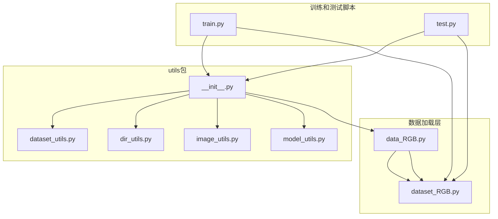
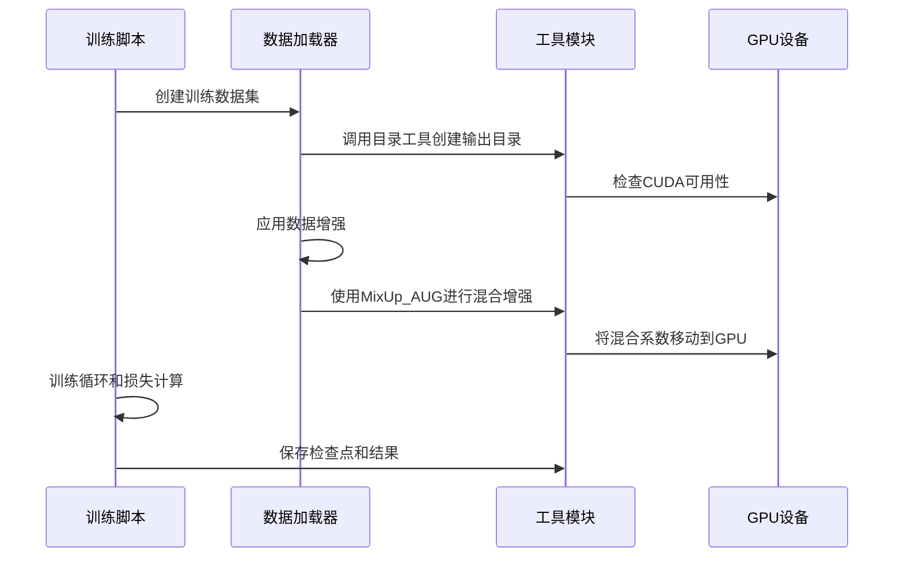
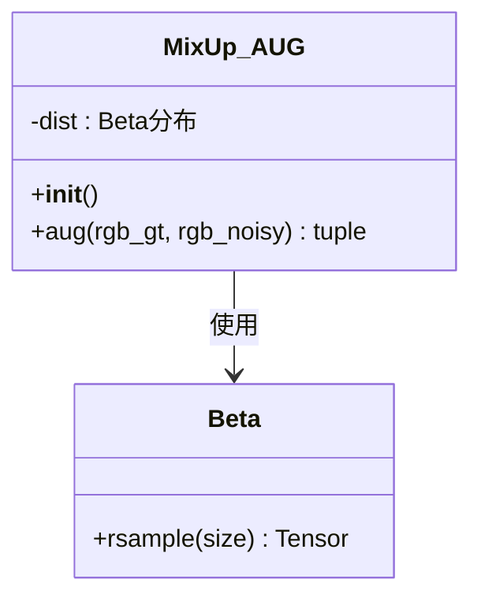
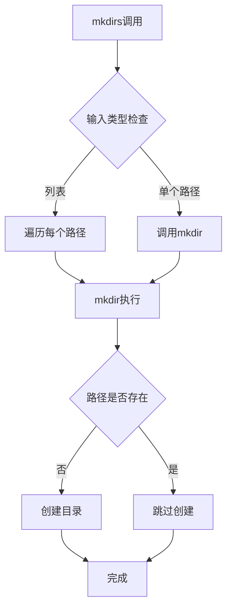
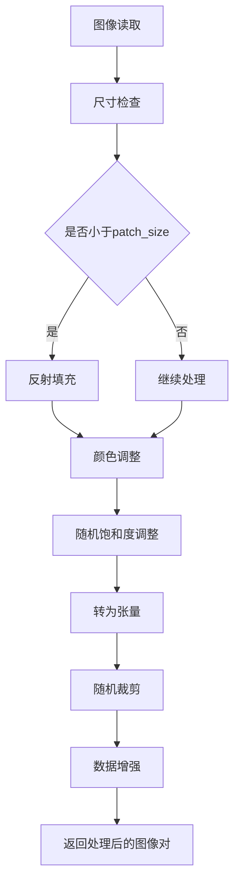
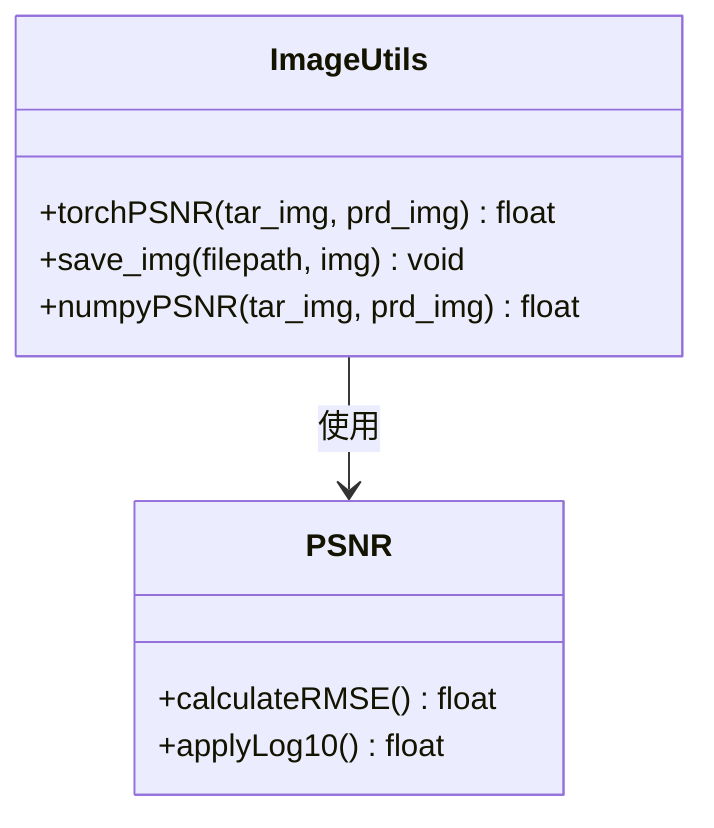
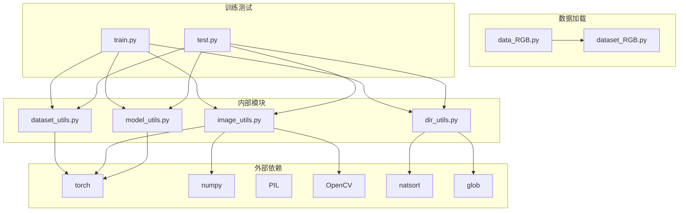

# 数据处理工具

<cite>
**本文档引用的文件**
- [dataset_utils.py](file://utils/dataset_utils.py)
- [dir_utils.py](file://utils/dir_utils.py)
- [image_utils.py](file://utils/image_utils.py)
- [model_utils.py](file://utils/model_utils.py)
- [__init__.py](file://utils/__init__.py)
- [data_RGB.py](file://data_RGB.py)
- [dataset_RGB.py](file://dataset_RGB.py)
- [train.py](file://train.py)
- [test.py](file://test.py)
</cite>

## 目录
1. [简介](#简介)
2. [项目结构](#项目结构)
3. [核心组件](#核心组件)
4. [架构概览](#架构概览)
5. [详细组件分析](#详细组件分析)
6. [依赖关系分析](#依赖关系分析)
7. [性能考虑](#性能考虑)
8. [故障排除指南](#故障排除指南)
9. [结论](#结论)

## 简介

本文件详细介绍了NeRD-Rain项目中的数据处理工具模块，重点分析了以下两个核心工具文件：

- **dataset_utils.py**: 包含数据增强相关的工具函数，特别是MixUp_AUG类的实现
- **dir_utils.py**: 提供目录操作和文件管理的实用工具函数

这些工具在训练和测试流程中发挥着关键作用，确保数据处理的一致性和高效性。文档将深入解释每个组件的实现原理、使用方法、错误处理机制和最佳实践建议。

## 项目结构

数据处理工具位于`utils/`目录下，采用模块化设计，每个工具文件负责特定的功能领域：

**图表来源**
- [__init__.py:1-5](file://utils/__init__.py#L1-L5)
- [dataset_RGB.py:1-162](file://dataset_RGB.py#L1-L162)
- [train.py:1-218](file://train.py#L1-L218)
- [test.py:1-69](file://test.py#L1-L69)

**章节来源**
- [__init__.py:1-5](file://utils/__init__.py#L1-L5)
- [dataset_RGB.py:1-162](file://dataset_RGB.py#L1-L162)

## 核心组件

### 数据集处理工具 (dataset_utils.py)

该模块提供了数据增强功能，特别是MixUp_AUG类实现了混合增强技术：

- **MixUp_AUG类**: 使用Beta分布生成混合系数，对输入图像和目标图像进行线性插值
- **Beta分布参数**: α=0.6, β=0.6，产生偏向于0和1的混合权重
- **CUDA支持**: 混合系数直接分配到GPU内存

### 目录操作工具 (dir_utils.py)

提供文件系统操作的实用函数：

- **mkdirs函数**: 支持单个路径或路径列表的批量创建
- **mkdir函数**: 单个目录创建，避免重复创建已存在的目录
- **get_last_path函数**: 基于会话标识符查找最新文件

### 图像处理工具 (image_utils.py)

包含图像质量评估和保存功能：

- **torchPSNR**: PyTorch张量的峰值信噪比计算
- **save_img**: OpenCV图像格式转换和保存
- **numpyPSNR**: NumPy数组的峰值信噪比计算

### 模型工具 (model_utils.py)

提供模型检查点管理和参数控制：

- **freeze/unfreeze**: 冻结/解冻模型参数
- **load_checkpoint系列**: 多种检查点加载策略
- **参数状态查询**: 检查模型参数的梯度状态

**章节来源**
- [dataset_utils.py:1-18](file://utils/dataset_utils.py#L1-L18)
- [dir_utils.py:1-18](file://utils/dir_utils.py#L1-L18)
- [image_utils.py:1-19](file://utils/image_utils.py#L1-L19)
- [model_utils.py:1-111](file://utils/model_utils.py#L1-L111)

## 架构概览

数据处理工具在整个训练和测试流程中扮演着重要角色：

**图表来源**
- [train.py:125-132](file://train.py#L125-L132)
- [dataset_RGB.py:74-96](file://dataset_RGB.py#L74-L96)
- [dataset_utils.py:7-18](file://utils/dataset_utils.py#L7-L18)

## 详细组件分析

### MixUp_AUG类分析

MixUp_AUG类实现了数据增强中的混合技术：

**图表来源**
- [dataset_utils.py:3-18](file://utils/dataset_utils.py#L3-L18)

#### 实现原理

1. **Beta分布初始化**: 使用α=0.6, β=0.6创建分布，产生偏向边缘的混合权重
2. **随机索引生成**: 对批次大小应用随机排列，创建对应的标签对
3. **混合系数计算**: 为每个样本生成混合系数λ
4. **线性插值**: 对输入图像和目标图像执行λx₁ + (1-λ)x₂

#### 使用场景

在训练过程中，MixUp_AUG用于：
- 提高模型的泛化能力
- 减少过拟合风险
- 增强对抗噪声的能力

**章节来源**
- [dataset_utils.py:3-18](file://utils/dataset_utils.py#L3-L18)

### 目录操作工具分析

dir_utils模块提供了文件系统管理功能：

**图表来源**
- [dir_utils.py:5-14](file://utils/dir_utils.py#L5-L14)

#### get_last_path函数

该函数用于查找最新的检查点文件：
1. 使用glob模式匹配包含会话标识符的文件
2. 通过natsorted进行自然排序
3. 返回最后一个匹配的文件路径

**章节来源**
- [dir_utils.py:1-18](file://utils/dir_utils.py#L1-L18)

### 数据加载器分析

数据加载器实现了完整的数据预处理流程：

**图表来源**
- [dataset_RGB.py:31-99](file://dataset_RGB.py#L31-L99)

#### 数据增强策略

数据加载器实现了多种增强技术：
- **翻转增强**: 水平翻转、垂直翻转
- **旋转增强**: 90°、180°、270°旋转及组合
- **颜色调整**: 饱和度调整
- **几何变换**: 中心裁剪、随机裁剪

**章节来源**
- [dataset_RGB.py:13-162](file://dataset_RGB.py#L13-L162)

### 图像质量评估分析

image_utils模块提供了多种图像质量评估方法：

**图表来源**
- [image_utils.py:5-18](file://utils/image_utils.py#L5-L18)

#### torchPSNR实现

torchPSNR函数的计算步骤：
1. **张量裁剪**: 将预测和目标图像限制在[0,1]范围内
2. **差值计算**: 计算像素差值
3. **均方根误差**: 计算差值平方的平均值并开平方
4. **对数计算**: 应用20log₁₀(1/rmse)

**章节来源**
- [image_utils.py:1-19](file://utils/image_utils.py#L1-L19)

## 依赖关系分析

**图表来源**
- [dataset_utils.py:1](file://utils/dataset_utils.py#L1)
- [dir_utils.py:1](file://utils/dir_utils.py#L1)
- [image_utils.py:1](file://utils/image_utils.py#L1)
- [model_utils.py:1](file://utils/model_utils.py#L1)
- [dataset_RGB.py:1](file://dataset_RGB.py#L1)

**章节来源**
- [dataset_RGB.py:1-162](file://dataset_RGB.py#L1-L162)
- [train.py:1-218](file://train.py#L1-L218)
- [test.py:1-69](file://test.py#L1-L69)

## 性能考虑

### CUDA优化

- **混合系数GPU分配**: MixUp_AUG类直接将混合系数分配到GPU内存，避免CPU-GPU传输开销
- **批量处理**: 所有工具函数都支持批量操作，提高处理效率

### 内存管理

- **惰性创建**: 目录创建仅在需要时执行，避免不必要的文件系统操作
- **张量裁剪**: 在PSNR计算前进行张量裁剪，防止数值溢出

### 并行处理

- **多进程数据加载**: 训练脚本使用DataLoader的多进程功能
- **GPU并行**: 支持多GPU训练，通过DataParallel实现

## 故障排除指南

### 常见问题和解决方案

#### 目录创建失败
**问题**: 目录权限不足导致创建失败
**解决方案**: 
- 检查用户权限
- 使用管理员权限运行
- 验证父目录存在性

#### 文件路径错误
**问题**: get_last_path函数无法找到匹配文件
**解决方案**:
- 验证会话标识符正确性
- 检查文件命名约定
- 确认文件存在且可访问

#### CUDA内存不足
**问题**: MixUp_AUG操作导致显存溢出
**解决方案**:
- 减小批次大小
- 降低图像分辨率
- 清理GPU缓存

#### 数据加载异常
**问题**: 图像文件损坏或格式不支持
**解决方案**:
- 验证图像文件完整性
- 检查文件扩展名
- 使用正确的图像格式

**章节来源**
- [dir_utils.py:16-18](file://utils/dir_utils.py#L16-L18)
- [dataset_utils.py:13](file://utils/dataset_utils.py#L13)
- [dataset_RGB.py:10-11](file://dataset_RGB.py#L10-L11)

## 结论

数据处理工具模块为NeRD-Rain项目提供了完整的数据处理解决方案。通过模块化的架构设计，各个工具组件职责明确，相互协作，形成了高效的数据处理流水线。

### 主要优势

1. **模块化设计**: 每个工具文件专注于特定功能，便于维护和扩展
2. **性能优化**: 充分利用GPU加速和批量处理技术
3. **错误处理**: 完善的异常处理机制确保系统的稳定性
4. **灵活性**: 支持多种数据增强策略和配置选项

### 最佳实践建议

1. **合理配置参数**: 根据数据集特点调整增强参数
2. **监控资源使用**: 定期检查内存和GPU使用情况
3. **备份重要文件**: 定期备份训练检查点和中间结果
4. **版本控制**: 对数据处理脚本进行版本管理

这些工具为图像去雨任务提供了坚实的技术基础，通过合理的使用和配置，可以显著提升模型的训练效果和推理性能。