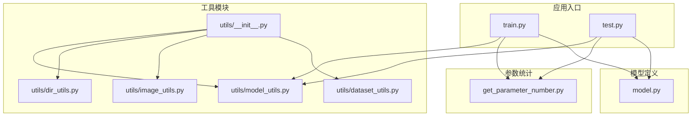
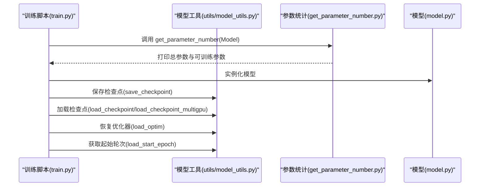
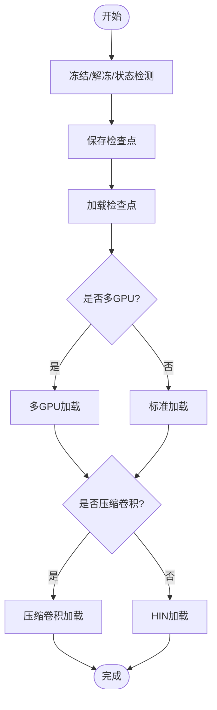
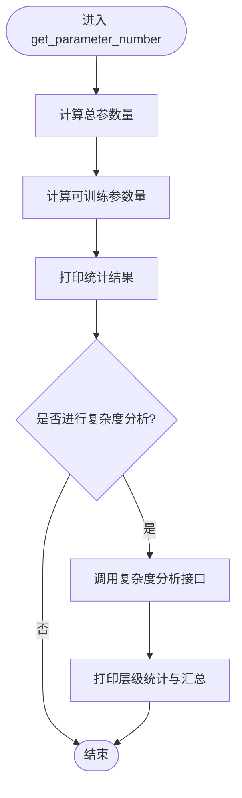
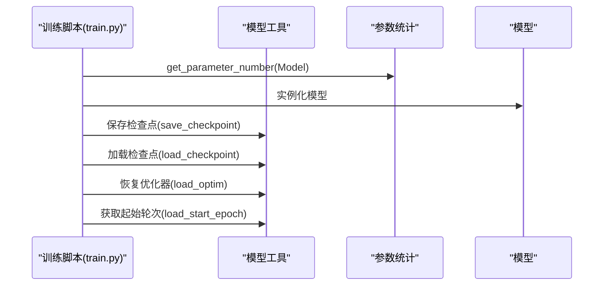
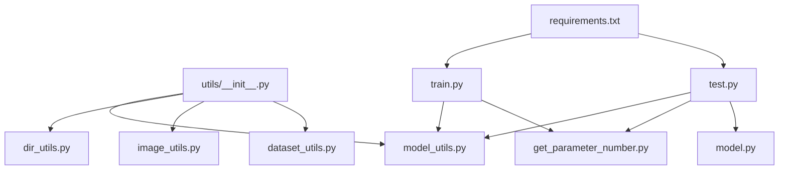

# 模型工具

<cite>
**本文引用的文件**
- [utils/model_utils.py](file://utils/model_utils.py)
- [get_parameter_number.py](file://get_parameter_number.py)
- [train.py](file://train.py)
- [test.py](file://test.py)
- [model.py](file://model.py)
- [utils/dataset_utils.py](file://utils/dataset_utils.py)
- [utils/dir_utils.py](file://utils/dir_utils.py)
- [utils/image_utils.py](file://utils/image_utils.py)
- [utils/__init__.py](file://utils/__init__.py)
- [requirements.txt](file://requirements.txt)
</cite>

## 目录
1. [简介](#简介)
2. [项目结构](#项目结构)
3. [核心组件](#核心组件)
4. [架构概览](#架构概览)
5. [详细组件分析](#详细组件分析)
6. [依赖分析](#依赖分析)
7. [性能考虑](#性能考虑)
8. [故障排查指南](#故障排查指南)
9. [结论](#结论)
10. [附录](#附录)

## 简介
本文件聚焦于模型工具模块，系统梳理并深入解析以下两个关键工具：
- 模型工具：位于 utils/model_utils.py，提供模型参数冻结/解冻、多类检查点加载（含单卡/多卡、压缩卷积、特定网络格式）以及优化器状态恢复等能力，贯穿训练与推理全流程。
- 参数统计与复杂度分析：位于 get_parameter_number.py，提供模型总参数量与可训练参数量统计，并集成复杂度分析工具进行层级统计与计算复杂度评估。

该文档旨在帮助读者理解这些工具在模型训练与评估中的作用，掌握最佳实践，并能快速定位常见问题。

## 项目结构
围绕模型工具与参数统计，项目的关键文件组织如下：
- 工具模块：utils/model_utils.py、utils/dataset_utils.py、utils/dir_utils.py、utils/image_utils.py、utils/__init__.py
- 参数统计：get_parameter_number.py
- 训练与测试入口：train.py、test.py
- 模型定义：model.py（用于示例与参数统计）

图表来源
- [utils/model_utils.py:1-111](file://utils/model_utils.py#L1-L111)
- [get_parameter_number.py:1-20](file://get_parameter_number.py#L1-L20)
- [train.py:1-218](file://train.py#L1-L218)
- [test.py:1-69](file://test.py#L1-L69)
- [model.py:1-673](file://model.py#L1-L673)
- [utils/__init__.py:1-5](file://utils/__init__.py#L1-L5)

章节来源
- [utils/model_utils.py:1-111](file://utils/model_utils.py#L1-L111)
- [get_parameter_number.py:1-20](file://get_parameter_number.py#L1-L20)
- [train.py:1-218](file://train.py#L1-L218)
- [test.py:1-69](file://test.py#L1-L69)
- [model.py:1-673](file://model.py#L1-L673)
- [utils/__init__.py:1-5](file://utils/__init__.py#L1-L5)

## 核心组件
本节对模型工具与参数统计的核心函数进行逐项解析，涵盖功能、输入输出、异常处理与适用场景。

- 模型参数冻结/解冻与状态检测
  - 冻结：将模型所有参数的 requires_grad 设为 False，常用于固定部分网络或仅训练特定模块。
  - 解冻：将模型所有参数的 requires_grad 设为 True。
  - 状态检测：判断当前模型是否处于冻结状态（存在未冻结参数则返回 False）。
  - 适用场景：迁移学习、渐进式训练、特征提取器冻结等。

- 检查点保存
  - 将 epoch、模型状态字典、优化器状态字典统一保存为 .pth 文件，文件名包含轮次与会话标识，便于后续恢复训练。

- 多类检查点加载
  - 标准加载：直接从 checkpoint 字典中读取 state_dict 并加载到模型。
  - 多GPU兼容加载：去除 state_dict 键前缀 module.，以适配 DataParallel 训练后保存的权重。
  - 压缩卷积加载（DoConv）：针对特定键命名规则（如 W/D/D_diag），将压缩形式的权重矩阵重塑为标准卷积形状，并进行矩阵运算融合，再加载到模型。
  - HIN 加载：兼容另一种 checkpoint 结构，同样处理 module. 前缀。
  - 起始轮次加载：从 checkpoint 中读取 epoch 字段，用于断点续训时的起始轮次推导。
  - 优化器状态加载：从 checkpoint 中读取 optimizer 字典并恢复优化器内部状态。

- 参数统计与复杂度分析
  - 总参数量：遍历模型所有参数张量，计算其元素总数之和。
  - 可训练参数量：仅统计 requires_grad=True 的参数元素总数。
  - 复杂度分析：通过外部工具接口（ptflops）对指定输入尺寸进行 MACs 与参数量的层级统计与汇总。

章节来源
- [utils/model_utils.py:5-111](file://utils/model_utils.py#L5-L111)
- [get_parameter_number.py:3-19](file://get_parameter_number.py#L3-L19)

## 架构概览
下图展示了训练脚本如何调用模型工具与参数统计工具，以及它们在整个训练流程中的位置与交互。

图表来源
- [train.py:71-115](file://train.py#L71-L115)
- [utils/model_utils.py:17-111](file://utils/model_utils.py#L17-L111)
- [get_parameter_number.py:3-7](file://get_parameter_number.py#L3-L7)

## 详细组件分析

### 组件A：模型工具（utils/model_utils.py）
该模块提供模型生命周期管理与权重加载/保存能力，支持多种部署与训练场景。

- 函数族与职责
  - 冻结/解冻/状态检测：控制参数梯度开关，便于分阶段训练与特征冻结。
  - 保存检查点：将 epoch、state_dict、optimizer 三元组持久化。
  - 多类加载器：
    - 标准加载：直接加载 state_dict；若失败则尝试去除 module. 前缀。
    - 多GPU加载：统一去除 module. 前缀。
    - 压缩卷积加载：按键名规则识别 W/D/D_diag，融合 D 与 D_diag，重塑并计算 DoW，再加载。
    - HIN 加载：兼容另一种 checkpoint 结构，同样处理 module. 前缀。
  - 优化器状态恢复与起始轮次读取：用于断点续训。

- 关键实现要点
  - 前缀处理：统一将 module. 前缀移除，确保与模型结构匹配。
  - 压缩卷积融合：对特定键进行矩阵运算与形状重塑，保证加载权重与模型期望一致。
  - 异常回退：当直接加载失败时，自动尝试去除 module. 前缀的方式，提升兼容性。

- 使用示例路径
  - 训练保存与恢复：参见训练脚本中保存与加载检查点的调用位置。
  - 多GPU权重加载：参见多GPU加载函数的调用位置。
  - 压缩卷积权重加载：参见压缩卷积加载函数的调用位置。

图表来源
- [utils/model_utils.py:5-111](file://utils/model_utils.py#L5-L111)

章节来源
- [utils/model_utils.py:5-111](file://utils/model_utils.py#L5-L111)

### 组件B：参数统计与复杂度分析（get_parameter_number.py）
该模块负责模型参数统计与复杂度分析，便于在训练前评估模型规模与计算开销。

- 功能与实现
  - 参数统计：遍历模型参数张量，分别计算总参数量与可训练参数量。
  - 复杂度分析：通过外部工具接口对给定输入尺寸进行层级统计与汇总，打印 MACs 与参数量。

- 使用示例路径
  - 训练前统计：参见训练脚本中调用参数统计函数的位置。
  - 测试前统计：参见测试脚本中调用参数统计函数的位置。

图表来源
- [get_parameter_number.py:3-19](file://get_parameter_number.py#L3-L19)

章节来源
- [get_parameter_number.py:3-19](file://get_parameter_number.py#L3-L19)

### 组件C：训练与测试脚本中的工具调用
- 训练脚本（train.py）
  - 在模型实例化后调用参数统计函数，打印总参数与可训练参数。
  - 支持预训练与断点续训：通过工具函数加载检查点与优化器状态，并设置学习率调度器。
  - 定期保存检查点：包含 epoch、state_dict、optimizer，便于后续恢复。
- 测试脚本（test.py）
  - 在加载权重前调用参数统计函数，确认模型规模。
  - 使用 DataParallel 进行推理加速，并对输入图像进行窗口分割与拼接以提升大图推理效率。

图表来源
- [train.py:71-115](file://train.py#L71-L115)
- [utils/model_utils.py:17-111](file://utils/model_utils.py#L17-L111)
- [get_parameter_number.py:3-7](file://get_parameter_number.py#L3-L7)

章节来源
- [train.py:71-115](file://train.py#L71-L115)
- [test.py:31-37](file://test.py#L31-L37)

## 依赖分析
- 工具模块聚合
  - utils/__init__.py 将目录内工具函数统一导出，便于上层脚本直接导入 utils.* 使用。
- 外部依赖
  - 训练与测试脚本依赖 PyTorch、Kornia、TensorBoard、tqdm 等；参数统计模块依赖 ptflops 进行复杂度分析。
- 模块耦合
  - 训练/测试脚本与模型工具之间为松耦合：通过函数调用传递模型与权重路径，避免硬编码。
  - 参数统计模块与外部复杂度分析工具为弱耦合：仅在需要时启用。

图表来源
- [utils/__init__.py:1-5](file://utils/__init__.py#L1-L5)
- [requirements.txt:1-67](file://requirements.txt#L1-L67)

章节来源
- [utils/__init__.py:1-5](file://utils/__init__.py#L1-L5)
- [requirements.txt:1-67](file://requirements.txt#L1-L67)

## 性能考虑
- 检查点加载兼容性
  - 多GPU训练后保存的权重键带有 module. 前缀，需在加载时统一去除，避免键不匹配导致的加载失败。
  - 压缩卷积加载涉及矩阵运算与形状重塑，建议在 CPU 上进行权重转换后再加载至 GPU，减少显存碎片。
- 参数统计与复杂度分析
  - 参数统计为 O(N) 遍历，通常不影响训练速度；复杂度分析依赖外部工具，建议在小批量或低分辨率下进行快速评估。
- 推理加速
  - 测试脚本中采用窗口分割与拼接策略，有助于处理大尺寸输入，但需注意边界重叠与内存占用平衡。

## 故障排查指南
- 检查点加载失败
  - 症状：加载时报错提示键名不匹配。
  - 排查：确认是否为多GPU训练后保存的权重；优先尝试多GPU加载函数或标准加载函数（后者会自动去除 module. 前缀）。
  - 参考路径：[utils/model_utils.py:22-35](file://utils/model_utils.py#L22-L35)、[utils/model_utils.py:92-99](file://utils/model_utils.py#L92-L99)
- 压缩卷积权重加载异常
  - 症状：加载后模型维度不一致或报错。
  - 排查：确认权重键命名是否符合 W/D/D_diag 规范；检查矩阵运算与 reshape 形状是否正确。
  - 参考路径：[utils/model_utils.py:38-79](file://utils/model_utils.py#L38-L79)
- 断点续训起始轮次错误
  - 症状：训练从错误轮次开始。
  - 排查：确认检查点中 epoch 字段是否正确；加载优化器状态后是否正确推进学习率调度器。
  - 参考路径：[utils/model_utils.py:101-104](file://utils/model_utils.py#L101-L104)、[train.py:103-114](file://train.py#L103-L114)
- 参数统计与复杂度分析
  - 症状：打印结果异常或复杂度分析报错。
  - 排查：确认输入尺寸与模型期望一致；检查 ptflops 是否安装且版本兼容。
  - 参考路径：[get_parameter_number.py:3-7](file://get_parameter_number.py#L3-L7)、[get_parameter_number.py:10-19](file://get_parameter_number.py#L10-L19)

章节来源
- [utils/model_utils.py:22-35](file://utils/model_utils.py#L22-L35)
- [utils/model_utils.py:38-79](file://utils/model_utils.py#L38-L79)
- [utils/model_utils.py:101-104](file://utils/model_utils.py#L101-L104)
- [train.py:103-114](file://train.py#L103-L114)
- [get_parameter_number.py:3-7](file://get_parameter_number.py#L3-L7)
- [get_parameter_number.py:10-19](file://get_parameter_number.py#L10-L19)

## 结论
模型工具模块与参数统计模块共同构成了本项目在模型训练与评估过程中的基础设施：
- 模型工具提供了灵活的参数控制、多场景检查点加载与优化器状态恢复能力，显著提升了训练的鲁棒性与可维护性。
- 参数统计与复杂度分析为模型规模与计算开销提供了量化依据，有助于在训练前进行合理的资源配置与算法选择。

建议在实际工程中：
- 明确冻结/解冻策略，结合任务需求进行阶段性训练。
- 统一检查点命名规范，确保多GPU与单GPU权重的兼容性。
- 在训练前进行参数统计与复杂度分析，合理规划硬件资源与超参数。

## 附录
- 相关文件路径参考
  - 模型工具：[utils/model_utils.py:1-111](file://utils/model_utils.py#L1-L111)
  - 参数统计：[get_parameter_number.py:1-20](file://get_parameter_number.py#L1-L20)
  - 训练脚本：[train.py:1-218](file://train.py#L1-L218)
  - 测试脚本：[test.py:1-69](file://test.py#L1-L69)
  - 模型定义：[model.py:1-673](file://model.py#L1-L673)
  - 工具聚合：[utils/__init__.py:1-5](file://utils/__init__.py#L1-L5)
  - 依赖清单：[requirements.txt:1-67](file://requirements.txt#L1-L67)