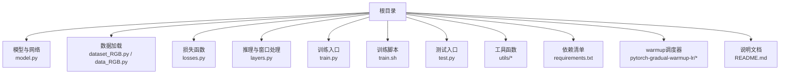
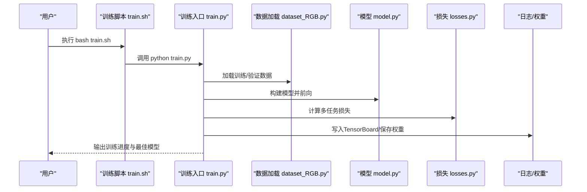
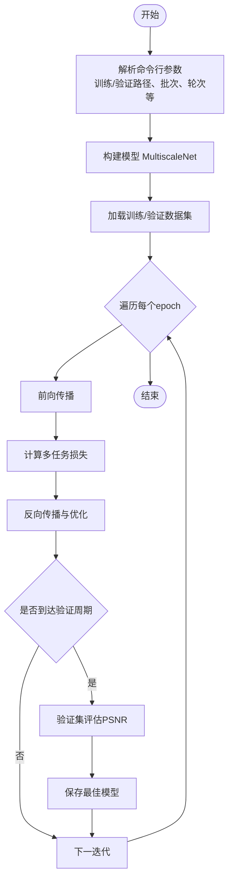
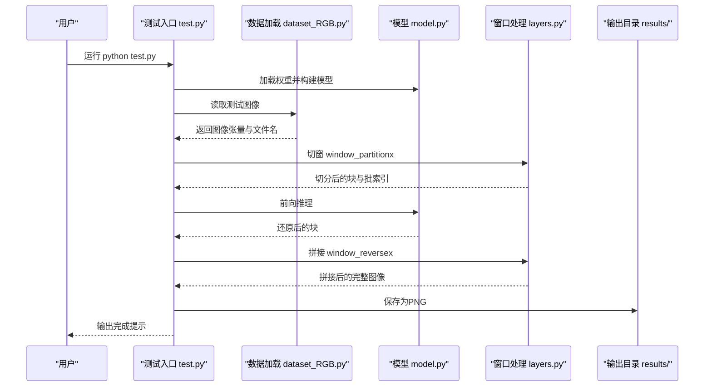
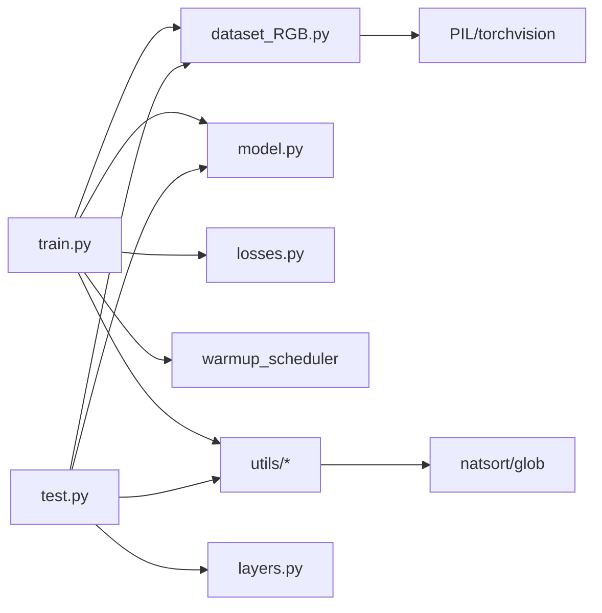

# 快速开始

<cite>
**本文引用的文件**   
- [README.md](file://README.md)
- [requirements.txt](file://requirements.txt)
- [train.sh](file://train.sh)
- [train.py](file://train.py)
- [test.py](file://test.py)
- [model.py](file://model.py)
- [dataset_RGB.py](file://dataset_RGB.py)
- [data_RGB.py](file://data_RGB.py)
- [losses.py](file://losses.py)
- [layers.py](file://layers.py)
- [utils/dataset_utils.py](file://utils/dataset_utils.py)
- [utils/dir_utils.py](file://utils/dir_utils.py)
- [utils/image_utils.py](file://utils/image_utils.py)
- [utils/model_utils.py](file://utils/model_utils.py)
- [pytorch-gradual-warmup-lr/setup.py](file://pytorch-gradual-warmup-lr/setup.py)
- [img.sh](file://img.sh)
</cite>

## 目录
1. [简介](#简介)
2. [项目结构](#项目结构)
3. [核心组件](#核心组件)
4. [架构总览](#架构总览)
5. [详细组件分析](#详细组件分析)
6. [依赖关系分析](#依赖关系分析)
7. [性能注意事项](#性能注意事项)
8. [故障排除指南](#故障排除指南)
9. [结论](#结论)
10. [附录](#附录)

## 简介
本指南面向新手开发者，帮助你在约30分钟内完成NeRD-Rain项目的环境搭建与首次去雨示例运行。你将学到：
- Python版本与依赖安装
- warmup调度器安装
- 数据集准备（Rain200L、Rain200H、DID-Data、DDN-Data、SPA-Data）
- 训练与测试流程（train.sh、train.py、test.py）
- 结果输出位置与评估路径
- 常见问题与排障建议

## 项目结构
仓库采用按功能分层的组织方式：模型定义、数据加载、工具函数、训练与测试脚本、warmup调度器子模块等。

图表来源
- [model.py:303-673](file://model.py#L303-L673)
- [dataset_RGB.py:13-162](file://dataset_RGB.py#L13-L162)
- [data_RGB.py:1-15](file://data_RGB.py#L1-L15)
- [losses.py:1-52](file://losses.py#L1-L52)
- [layers.py:212-304](file://layers.py#L212-L304)
- [train.py:1-218](file://train.py#L1-L218)
- [train.sh:1-7](file://train.sh#L1-L7)
- [test.py:1-69](file://test.py#L1-L69)
- [utils/dir_utils.py:1-18](file://utils/dir_utils.py#L1-L18)
- [utils/model_utils.py:1-111](file://utils/model_utils.py#L1-L111)
- [requirements.txt:1-67](file://requirements.txt#L1-L67)
- [README.md:25-59](file://README.md#L25-L59)

章节来源
- [README.md:25-59](file://README.md#L25-L59)
- [requirements.txt:1-67](file://requirements.txt#L1-L67)

## 核心组件
- 模型：多尺度双向隐式神经表示网络（MultiscaleNet），包含编码器-潜空间-解码器与跨尺度融合。
- 数据加载：支持训练/验证/测试三类数据集，自动扫描input/target对或仅输入图像。
- 损失函数：Charbonnier、边缘、频域一致性等多任务损失。
- 推理窗口化：大图推理时切窗与拼接，避免显存不足。
- 训练与测试：命令行参数驱动，支持断点续训、学习率warmup与余弦退火调度。

章节来源
- [model.py:303-673](file://model.py#L303-L673)
- [dataset_RGB.py:13-162](file://dataset_RGB.py#L13-L162)
- [losses.py:1-52](file://losses.py#L1-L52)
- [layers.py:212-304](file://layers.py#L212-L304)
- [train.py:40-218](file://train.py#L40-L218)
- [test.py:15-69](file://test.py#L15-L69)

## 架构总览
下图展示从命令行到模型推理的关键调用链路。

图表来源
- [train.sh:1-7](file://train.sh#L1-L7)
- [train.py:1-218](file://train.py#L1-L218)
- [dataset_RGB.py:13-162](file://dataset_RGB.py#L13-L162)
- [model.py:303-673](file://model.py#L303-L673)
- [losses.py:1-52](file://losses.py#L1-L52)

## 详细组件分析

### 环境与依赖安装
- 安装Python依赖：根据依赖清单一次性安装所有必要包。
- 安装warmup调度器：进入warmup子模块并安装本地包。
- CUDA/GPU：训练脚本默认启用GPU；如需CPU运行，请在相应脚本中调整设备设置。

章节来源
- [README.md:25-35](file://README.md#L25-L35)
- [requirements.txt:1-67](file://requirements.txt#L1-L67)
- [pytorch-gradual-warmup-lr/setup.py:1-26](file://pytorch-gradual-warmup-lr/setup.py#L1-L26)

### 数据集准备
- 下载地址：Rain200L、Rain200H、DID-Data、DDN-Data、SPA-Data均提供百度网盘链接。
- 组织方式：将对应数据集放入根目录下的“Datasets”文件夹，并按“Rain200L/H/SPA-Data/DID-Data/DDN-Data”的子目录组织。
- 训练/测试数据结构：每个数据集包含input与target两个子目录，分别存放带雨图像与干净图像。

章节来源
- [README.md:37-49](file://README.md#L37-L49)
- [dataset_RGB.py:17-21](file://dataset_RGB.py#L17-L21)

### 训练流程（train.sh 与 train.py）
- 使用训练脚本启动训练，日志与权重输出至“checkpoints”目录。
- 训练入口负责：
  - 设置随机种子与CUDNN加速
  - 构建模型、优化器与warmup+余弦退火学习率调度器
  - 多任务损失计算与反向传播
  - 定期验证并保存最佳模型与最新模型
  - TensorBoard可视化

图表来源
- [train.py:40-218](file://train.py#L40-L218)
- [model.py:303-673](file://model.py#L303-L673)
- [losses.py:1-52](file://losses.py#L1-L52)

章节来源
- [train.sh:1-7](file://train.sh#L1-L7)
- [train.py:1-218](file://train.py#L1-L218)

### 测试流程（test.py 推理）
- 默认从指定权重加载模型，对测试集进行推理。
- 支持窗口化推理以适配大图，避免显存溢出。
- 输出结果保存在“results/”目录下，文件名为原图名后缀“.png”。

图表来源
- [test.py:15-69](file://test.py#L15-L69)
- [dataset_RGB.py:141-162](file://dataset_RGB.py#L141-L162)
- [model.py:303-673](file://model.py#L303-L673)
- [layers.py:249-304](file://layers.py#L249-L304)

章节来源
- [test.py:1-69](file://test.py#L1-L69)

### 关键工具与模块
- 目录与检查点管理：创建目录、查找最近权重、加载/保存模型状态。
- 图像与指标：PSNR计算、OpenCV保存图像。
- 数据增强：MixUp、几何变换与亮度/饱和度扰动。
- 窗口化：切窗与拼接，支持不整除尺寸的边界处理。

章节来源
- [utils/dir_utils.py:1-18](file://utils/dir_utils.py#L1-L18)
- [utils/model_utils.py:1-111](file://utils/model_utils.py#L1-L111)
- [utils/image_utils.py:1-19](file://utils/image_utils.py#L1-L19)
- [utils/dataset_utils.py:1-18](file://utils/dataset_utils.py#L1-L18)
- [layers.py:212-304](file://layers.py#L212-L304)

## 依赖关系分析
- 训练入口依赖：数据加载、模型、损失、warmup调度器、工具函数。
- 测试入口依赖：数据加载、模型、窗口化处理、图像保存工具。
- 数据加载依赖：PIL、torchvision、glob/natsort等。

图表来源
- [train.py:1-218](file://train.py#L1-L218)
- [test.py:1-69](file://test.py#L1-L69)
- [dataset_RGB.py:1-162](file://dataset_RGB.py#L1-L162)
- [model.py:1-673](file://model.py#L1-L673)
- [losses.py:1-52](file://losses.py#L1-L52)
- [layers.py:1-392](file://layers.py#L1-L392)
- [utils/dir_utils.py:1-18](file://utils/dir_utils.py#L1-L18)

章节来源
- [train.py:1-218](file://train.py#L1-L218)
- [test.py:1-69](file://test.py#L1-L69)

## 性能注意事项
- 显存占用：大图推理建议使用较小窗口尺寸（例如256）以降低显存压力。
- 多卡训练：若有多GPU，训练入口会自动切换DataParallel模式。
- 学习率策略：warmup阶段平滑提升学习率，余弦退火稳定收敛。
- 数据增强：训练时随机裁剪与翻转可提升泛化能力。

## 故障排除指南
- 权重文件不存在
  - 现象：测试时报错提示未找到权重文件。
  - 处理：确认权重路径正确，或修改命令行参数指向有效权重。
  - 参考：[test.py:27-30](file://test.py#L27-L30)
- CUDA设备不可用
  - 现象：无法使用GPU或报设备相关错误。
  - 处理：检查CUDA可见设备号，或在脚本中调整设备设置。
  - 参考：[test.py:24-25](file://test.py#L24-L25)、[train.py:3-4](file://train.py#L3-L4)
- 数据集路径错误
  - 现象：找不到input/target目录或文件列表为空。
  - 处理：确保数据集按要求放置在“Datasets/”下，并保持input/target子目录结构一致。
  - 参考：[dataset_RGB.py:17-21](file://dataset_RGB.py#L17-L21)
- 图像损坏
  - 现象：部分图像无法打开导致训练中断。
  - 处理：使用提供的图片检查脚本清理损坏文件。
  - 参考：[img.sh:1-32](file://img.sh#L1-L32)
- warmup调度器导入失败
  - 现象：训练启动时报调度器模块缺失。
  - 处理：先安装warmup调度器子模块后再运行训练。
  - 参考：[README.md:31-35](file://README.md#L31-L35)、[pytorch-gradual-warmup-lr/setup.py:1-26](file://pytorch-gradual-warmup-lr/setup.py#L1-L26)

章节来源
- [test.py:24-30](file://test.py#L24-L30)
- [dataset_RGB.py:17-21](file://dataset_RGB.py#L17-L21)
- [img.sh:1-32](file://img.sh#L1-L32)
- [README.md:31-35](file://README.md#L31-L35)
- [pytorch-gradual-warmup-lr/setup.py:1-26](file://pytorch-gradual-warmup-lr/setup.py#L1-L26)

## 结论
通过本指南，你已掌握NeRD-Rain的环境搭建、数据准备、训练与测试全流程。建议先在小规模数据上验证流程，再扩展到完整数据集进行训练与评估。

## 附录
- 快速命令清单
  - 安装依赖：pip install -r requirements.txt
  - 安装warmup调度器：cd pytorch-gradual-warmup-lr && python setup.py install && cd ..
  - 启动训练：bash train.sh
  - 执行测试：python test.py
- 结果输出
  - 训练日志与权重：checkpoints/（由训练入口写入）
  - 推理结果：results/（由测试入口写入）