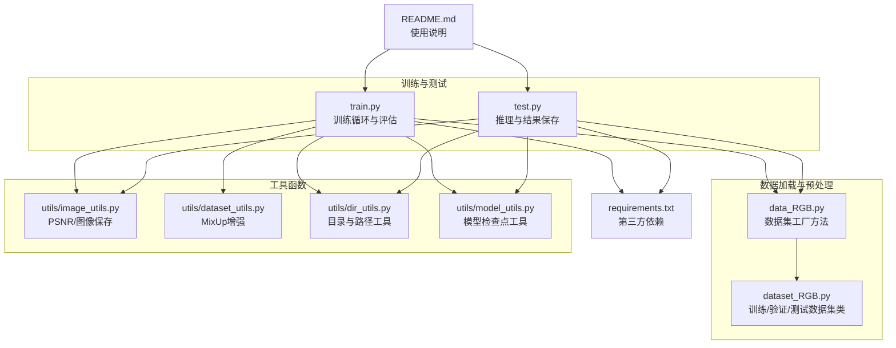
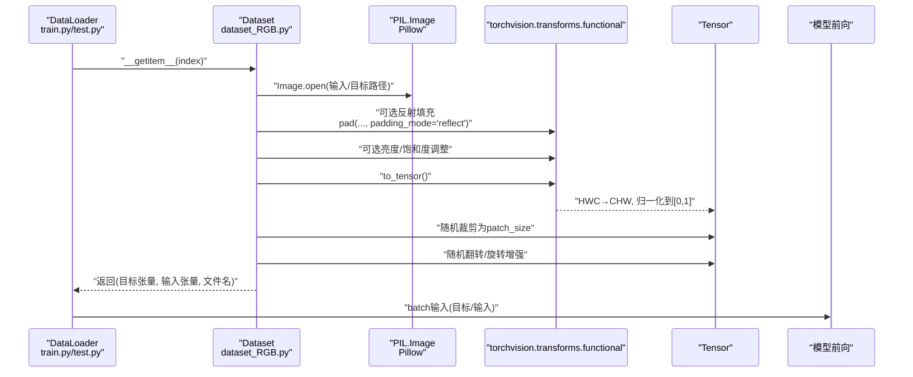
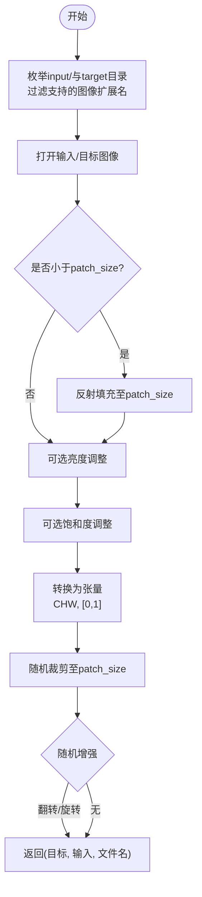
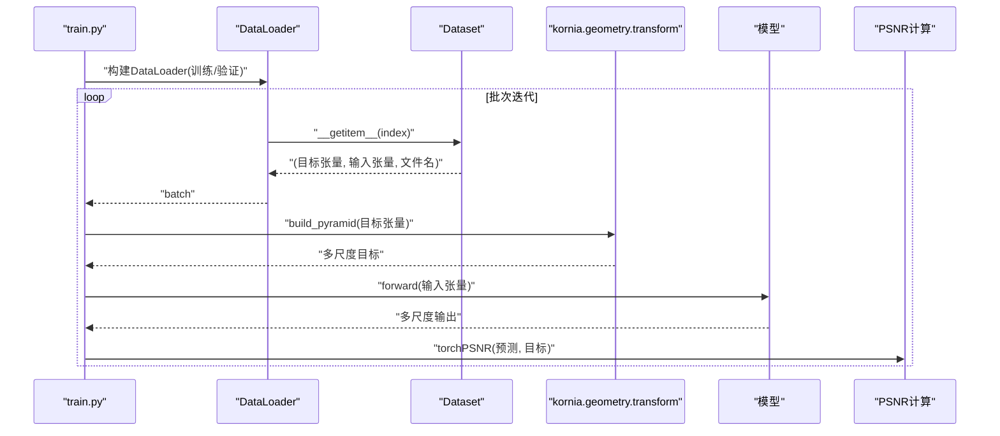
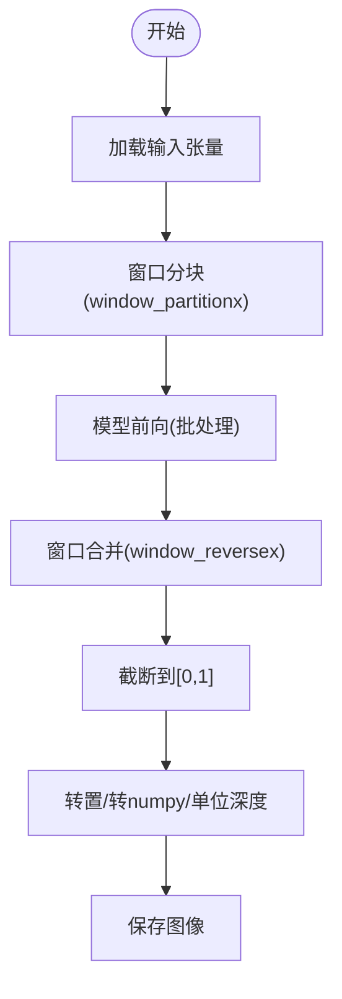
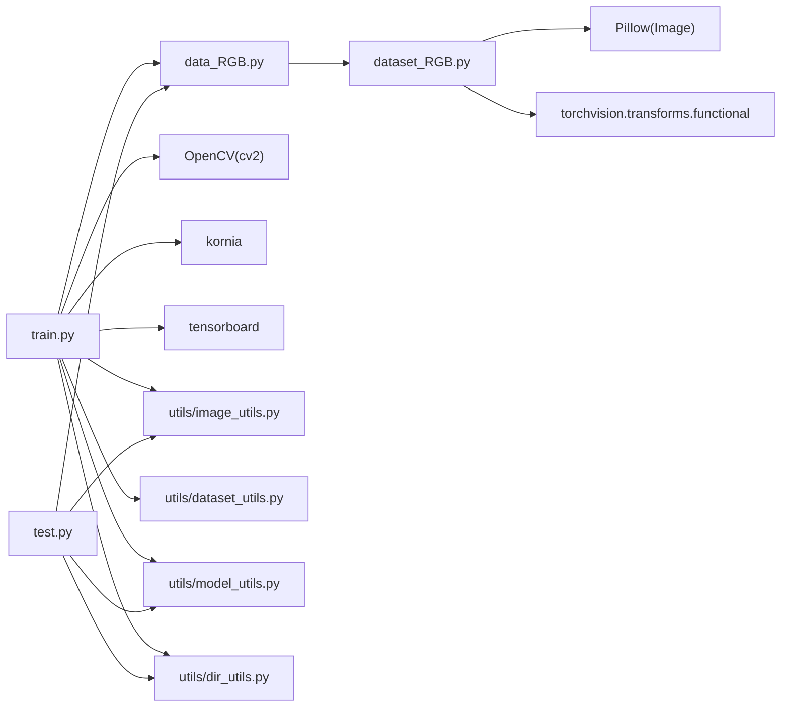

# 图像预处理

<cite>
**本文引用的文件**
- [dataset_RGB.py](file://dataset_RGB.py)
- [data_RGB.py](file://data_RGB.py)
- [train.py](file://train.py)
- [test.py](file://test.py)
- [utils/image_utils.py](file://utils/image_utils.py)
- [utils/dataset_utils.py](file://utils/dataset_utils.py)
- [utils/dir_utils.py](file://utils/dir_utils.py)
- [utils/model_utils.py](file://utils/model_utils.py)
- [requirements.txt](file://requirements.txt)
- [README.md](file://README.md)
</cite>

## 目录
1. [引言](#引言)
2. [项目结构](#项目结构)
3. [核心组件](#核心组件)
4. [架构总览](#架构总览)
5. [详细组件分析](#详细组件分析)
6. [依赖分析](#依赖分析)
7. [性能考虑](#性能考虑)
8. [故障排查指南](#故障排查指南)
9. [结论](#结论)
10. [附录](#附录)

## 引言
本文件系统性梳理本项目的图像预处理流程与数据加载管线，覆盖以下方面：
- 图像读取、张量转换、尺寸调整、反射填充等基础预处理步骤
- 训练/验证/测试三阶段的数据加载与增强策略
- 不同数据集格式（输入/目标成对、仅输入）的兼容性处理
- 图像质量检查与异常处理机制
- 性能优化与内存管理策略
- 自定义预处理函数的开发指南与最佳实践

## 项目结构
围绕“图像预处理”的关键文件组织如下：
- 数据加载与预处理：dataset_RGB.py、data_RGB.py
- 训练与测试入口：train.py、test.py
- 工具函数：utils/image_utils.py、utils/dataset_utils.py、utils/dir_utils.py、utils/model_utils.py
- 环境与依赖：requirements.txt
- 使用说明与数据准备：README.md

图表来源
- [dataset_RGB.py:1-162](file://dataset_RGB.py#L1-L162)
- [data_RGB.py:1-15](file://data_RGB.py#L1-L15)
- [train.py:1-218](file://train.py#L1-L218)
- [test.py:1-69](file://test.py#L1-L69)
- [utils/image_utils.py:1-19](file://utils/image_utils.py#L1-L19)
- [utils/dataset_utils.py:1-18](file://utils/dataset_utils.py#L1-L18)
- [utils/dir_utils.py:1-18](file://utils/dir_utils.py#L1-L18)
- [utils/model_utils.py:1-35](file://utils/model_utils.py#L1-L35)
- [requirements.txt:1-67](file://requirements.txt#L1-L67)
- [README.md:1-121](file://README.md#L1-L121)

章节来源
- [dataset_RGB.py:1-162](file://dataset_RGB.py#L1-L162)
- [data_RGB.py:1-15](file://data_RGB.py#L1-L15)
- [train.py:1-218](file://train.py#L1-L218)
- [test.py:1-69](file://test.py#L1-L69)
- [utils/image_utils.py:1-19](file://utils/image_utils.py#L1-L19)
- [utils/dataset_utils.py:1-18](file://utils/dataset_utils.py#L1-L18)
- [utils/dir_utils.py:1-18](file://utils/dir_utils.py#L1-L18)
- [utils/model_utils.py:1-35](file://utils/model_utils.py#L1-L35)
- [requirements.txt:1-67](file://requirements.txt#L1-L67)
- [README.md:1-121](file://README.md#L1-L121)

## 核心组件
- 数据集工厂与数据加载器
  - 工厂方法：根据目录与选项返回训练/验证/测试数据集实例
  - 数据集类：统一处理图像读取、反射填充、随机裁剪、数据增强、张量转换
- 训练/测试入口
  - 训练：构建数据加载器、迭代批次、调用预处理与损失计算
  - 测试：窗口分块推理、结果拼接、图像保存
- 工具函数
  - PSNR计算与图像保存
  - MixUp增强
  - 目录与检查点管理

章节来源
- [data_RGB.py:1-15](file://data_RGB.py#L1-L15)
- [dataset_RGB.py:13-162](file://dataset_RGB.py#L13-L162)
- [train.py:125-132](file://train.py#L125-L132)
- [test.py:40-69](file://test.py#L40-L69)
- [utils/image_utils.py:5-19](file://utils/image_utils.py#L5-L19)
- [utils/dataset_utils.py:3-18](file://utils/dataset_utils.py#L3-L18)
- [utils/dir_utils.py:5-18](file://utils/dir_utils.py#L5-L18)
- [utils/model_utils.py:17-35](file://utils/model_utils.py#L17-L35)

## 架构总览
下图展示从数据加载到模型前向的端到端流程，重点标注预处理步骤与数据类型转换。

图表来源
- [train.py:125-132](file://train.py#L125-L132)
- [test.py:40-69](file://test.py#L40-L69)
- [dataset_RGB.py:31-99](file://dataset_RGB.py#L31-L99)

## 详细组件分析

### 数据集与数据加载器（训练/验证/测试）
- 训练集（DataLoaderTrain）
  - 输入/目标成对目录结构：input/、target/
  - 支持的图像扩展名：jpeg/JPEG、jpg、png、JPG、PNG、gif
  - 预处理流程
    - 读取后若宽高小于patch_size，则进行反射填充
    - 可选亮度/饱和度调整
    - 转换为张量（CHW，像素值范围[0,1]）
    - 随机裁剪至指定patch_size
    - 随机增强：水平翻转、垂直翻转、旋转（0/90/180/270°、含镜像组合）
  - 返回内容：目标张量、输入张量、文件名
- 验证集（DataLoaderVal）
  - 中心裁剪到patch_size（若配置）
  - 其余流程与训练集一致
- 测试集（DataLoaderTest）
  - 仅输入目录，按顺序读取
  - 返回：输入张量、文件名

图表来源
- [dataset_RGB.py:10-99](file://dataset_RGB.py#L10-L99)

章节来源
- [dataset_RGB.py:10-99](file://dataset_RGB.py#L10-L99)
- [dataset_RGB.py:101-139](file://dataset_RGB.py#L101-L139)
- [dataset_RGB.py:141-162](file://dataset_RGB.py#L141-L162)
- [data_RGB.py:4-14](file://data_RGB.py#L4-L14)

### 训练入口（train.py）中的预处理集成
- 数据加载器参数
  - 批大小、打乱、多进程、内存固定等
- 预处理链路
  - 数据集返回张量（CHW, [0,1]）
  - 训练时将目标张量构建金字塔（kornia），随后进入模型前向与损失计算
- 评估指标
  - 使用工具函数计算PSNR

图表来源
- [train.py:125-132](file://train.py#L125-L132)
- [train.py:154-166](file://train.py#L154-L166)
- [train.py:177-189](file://train.py#L177-L189)
- [utils/image_utils.py:5-9](file://utils/image_utils.py#L5-L9)

章节来源
- [train.py:125-132](file://train.py#L125-L132)
- [train.py:154-166](file://train.py#L154-L166)
- [train.py:177-189](file://train.py#L177-L189)
- [utils/image_utils.py:5-9](file://utils/image_utils.py#L5-L9)

### 测试入口（test.py）中的预处理与后处理
- 窗口分块推理
  - 将输入按窗口大小切分为多个子块
  - 对每个子块执行前向推理，再按原位置拼接
- 结果后处理
  - 截断到[0,1]，转置与CPU移出，保存为图像

图表来源
- [test.py:58-68](file://test.py#L58-L68)

章节来源
- [test.py:40-69](file://test.py#L40-L69)

### 工具函数与辅助能力
- PSNR计算
  - 支持torch与numpy两种实现
- 图像保存
  - 将RGB数组写回BGR（OpenCV约定）
- MixUp增强
  - Beta分布采样混合系数，对输入与目标同时混合
- 目录与检查点
  - 创建目录、查找最新检查点、加载/保存模型权重

章节来源
- [utils/image_utils.py:5-19](file://utils/image_utils.py#L5-L19)
- [utils/dataset_utils.py:3-18](file://utils/dataset_utils.py#L3-L18)
- [utils/dir_utils.py:5-18](file://utils/dir_utils.py#L5-L18)
- [utils/model_utils.py:17-35](file://utils/model_utils.py#L17-L35)

## 依赖分析
- 第三方依赖
  - Pillow：图像读取与张量转换
  - torchvision.transforms.functional：填充、裁剪、调整亮度/饱和度、to_tensor
  - OpenCV：图像保存（BGR）
  - kornia：多尺度目标构建
  - tensorboard：日志记录
- 内部模块耦合
  - train.py/test.py 通过 data_RGB.py 的工厂方法获取 Dataset 实例
  - Dataset 内部使用 PIL 与 TF 进行预处理
  - 工具模块被训练/测试脚本与Dataset共享

图表来源
- [train.py:125-132](file://train.py#L125-L132)
- [test.py:40-69](file://test.py#L40-L69)
- [data_RGB.py:1-15](file://data_RGB.py#L1-L15)
- [dataset_RGB.py:1-7](file://dataset_RGB.py#L1-L7)
- [requirements.txt:1-67](file://requirements.txt#L1-L67)

章节来源
- [requirements.txt:1-67](file://requirements.txt#L1-L67)
- [dataset_RGB.py:1-7](file://dataset_RGB.py#L1-L7)
- [data_RGB.py:1-15](file://data_RGB.py#L1-L15)
- [train.py:125-132](file://train.py#L125-L132)
- [test.py:40-69](file://test.py#L40-L69)

## 性能考虑
- I/O与解码
  - 使用Pillow读取常见格式；建议确保输入图像已压缩至合适分辨率以减少解码开销
- 内存管理
  - 训练/测试中使用pin_memory与num_workers控制数据加载性能
  - 测试阶段在循环内主动清理CUDA缓存，避免显存碎片累积
- 张量转换与设备迁移
  - 在DataLoader返回的张量基础上直接迁移至GPU，避免重复转换
- 多尺度目标构建
  - kornia构建金字塔会增加计算与内存开销，可根据需要调整层数或关闭
- 窗口分块推理
  - 合理设置窗口大小，在精度与速度之间平衡；注意边缘拼接的重叠处理

章节来源
- [train.py:125-132](file://train.py#L125-L132)
- [test.py:52-54](file://test.py#L52-L54)
- [test.py:58-60](file://test.py#L58-L60)

## 故障排查指南
- 数据集路径与格式
  - 确认输入/目标目录存在且包含受支持的图像扩展名
  - 若图像尺寸小于patch_size，将触发反射填充；如出现边界伪影，可增大patch_size或调整填充策略
- 训练/验证数据加载失败
  - 检查DataLoader参数（batch_size、num_workers、pin_memory）与系统资源
  - 若GPU显存不足，降低batch_size或启用窗口分块推理
- 图像保存异常
  - 保存函数使用BGR通道顺序，请确认输入为RGB数组后再转换
- 混合精度与梯度
  - 如需AMP，可在训练脚本中引入GradScaler；当前仓库未包含AMP示例

章节来源
- [dataset_RGB.py:10-11](file://dataset_RGB.py#L10-L11)
- [dataset_RGB.py:45-48](file://dataset_RGB.py#L45-L48)
- [utils/image_utils.py:11-12](file://utils/image_utils.py#L11-L12)
- [train.py:125-132](file://train.py#L125-L132)
- [test.py:52-54](file://test.py#L52-L54)

## 结论
本项目的图像预处理以PIL与torchvision.transforms.functional为核心，结合反射填充、随机裁剪与增强，形成稳定的训练/验证数据流；测试阶段采用窗口分块推理与结果拼接，兼顾精度与效率。通过工具模块与清晰的工厂接口，预处理逻辑易于扩展与维护。

## 附录

### 数据集格式与兼容性
- 训练/验证：要求输入/目标成对目录（input/、target/），文件名一一对应
- 测试：仅输入目录（inp_dir），按顺序读取
- 支持的图像扩展名：jpeg/JPEG、jpg、png、JPG、PNG、gif

章节来源
- [dataset_RGB.py:17-21](file://dataset_RGB.py#L17-L21)
- [dataset_RGB.py:105-109](file://dataset_RGB.py#L105-L109)
- [dataset_RGB.py:145-146](file://dataset_RGB.py#L145-L146)
- [dataset_RGB.py:10-11](file://dataset_RGB.py#L10-L11)

### 自定义预处理函数开发指南与最佳实践
- 设计原则
  - 保持输入/输出张量形状一致（CHW, [0,1]）
  - 明确可选增强开关，便于在训练/验证间切换
  - 避免在数据集内部进行昂贵的I/O操作，尽量在__getitem__中完成必要转换
- 推荐步骤
  - 图像读取：使用Pillow读取，统一转RGB
  - 尺寸与填充：先判断尺寸，再进行反射填充或中心裁剪
  - 转换与归一化：使用to_tensor自动完成归一化
  - 增强：在训练集启用随机翻转/旋转/亮度/饱和度等
  - 返回：返回目标张量、输入张量与文件名，便于调试与评估
- 性能建议
  - 批量处理：在DataLoader中合理设置num_workers与pin_memory
  - 显存优化：在推理阶段及时释放缓存，避免长时间占用
  - 多尺度：如需金字塔目标，控制层数以平衡精度与速度

章节来源
- [dataset_RGB.py:31-99](file://dataset_RGB.py#L31-L99)
- [dataset_RGB.py:119-139](file://dataset_RGB.py#L119-L139)
- [dataset_RGB.py:154-161](file://dataset_RGB.py#L154-L161)
- [train.py:125-132](file://train.py#L125-L132)
- [test.py:52-54](file://test.py#L52-L54)