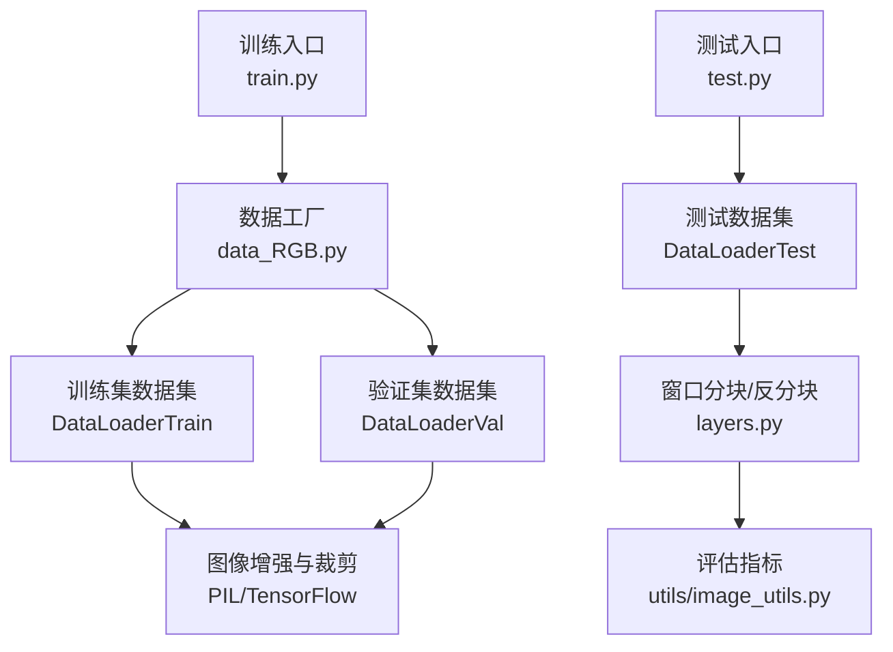
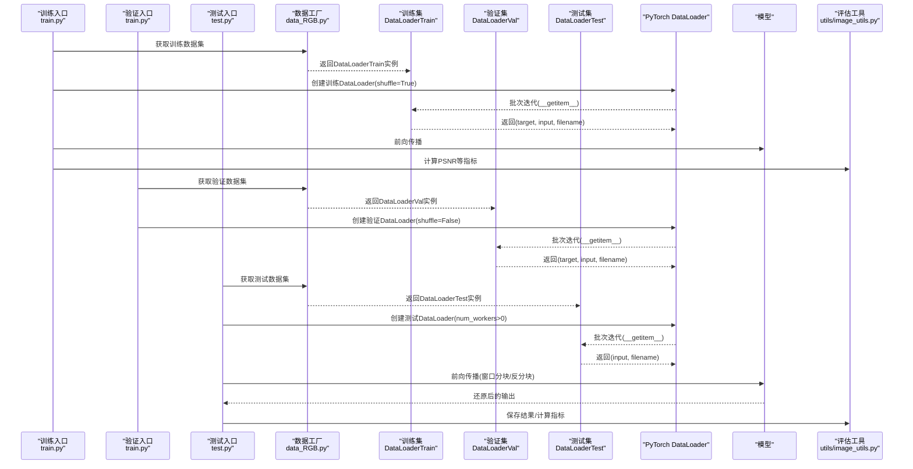
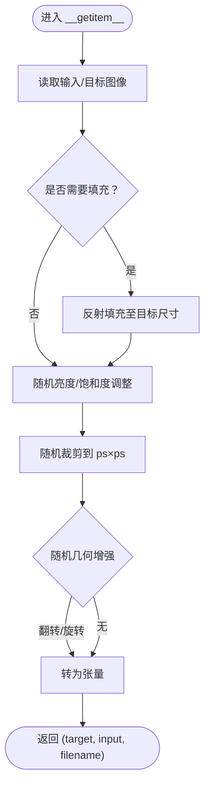
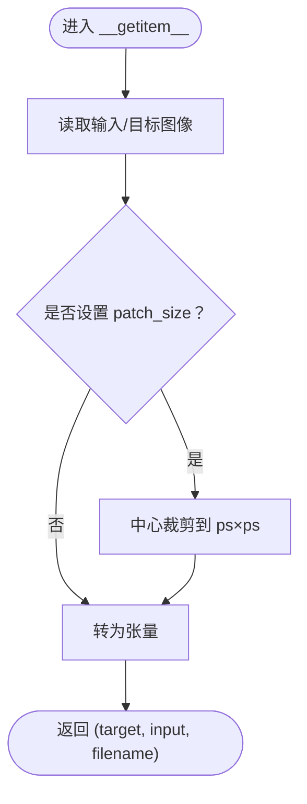
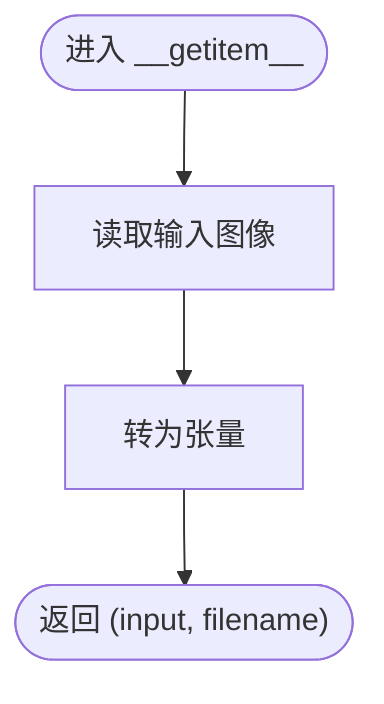
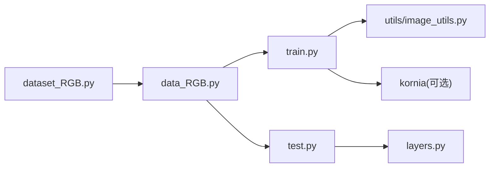

# 数据加载器

<cite>
**本文引用的文件**
- [dataset_RGB.py](file://dataset_RGB.py)
- [data_RGB.py](file://data_RGB.py)
- [train.py](file://train.py)
- [test.py](file://test.py)
- [layers.py](file://layers.py)
- [utils/dataset_utils.py](file://utils/dataset_utils.py)
- [utils/image_utils.py](file://utils/image_utils.py)
- [README.md](file://README.md)
</cite>

## 目录
1. [简介](#简介)
2. [项目结构](#项目结构)
3. [核心组件](#核心组件)
4. [架构总览](#架构总览)
5. [详细组件分析](#详细组件分析)
6. [依赖分析](#依赖分析)
7. [性能考虑](#性能考虑)
8. [故障排查指南](#故障排查指南)
9. [结论](#结论)
10. [附录](#附录)

## 简介
本文件系统性地解析本仓库中的数据加载器设计与实现，重点覆盖以下三类数据集类：DataLoaderTrain（训练集）、DataLoaderVal（验证集）与DataLoaderTest（测试集）。我们将从初始化参数、文件路径组织、数据读取与增强流程、训练/验证/测试阶段的差异化策略，到配置选项与最佳实践进行逐层展开，并给出常见问题排查与性能优化建议。

## 项目结构
围绕数据加载器的相关文件主要分布在如下位置：
- 数据集定义与工厂函数：dataset_RGB.py、data_RGB.py
- 训练入口：train.py
- 测试入口：test.py
- 测试时的窗口分块与拼接：layers.py
- 工具函数：utils/dataset_utils.py、utils/image_utils.py
- 项目说明：README.md

图表来源
- [train.py:125-132](file://train.py#L125-L132)
- [data_RGB.py:4-14](file://data_RGB.py#L4-L14)
- [dataset_RGB.py:13-161](file://dataset_RGB.py#L13-L161)
- [test.py:41-42](file://test.py#L41-L42)
- [layers.py:249-304](file://layers.py#L249-L304)
- [utils/image_utils.py:5-18](file://utils/image_utils.py#L5-L18)

章节来源
- [dataset_RGB.py:1-162](file://dataset_RGB.py#L1-L162)
- [data_RGB.py:1-15](file://data_RGB.py#L1-L15)
- [train.py:1-218](file://train.py#L1-L218)
- [test.py:1-69](file://test.py#L1-L69)
- [layers.py:1-392](file://layers.py#L1-L392)
- [utils/dataset_utils.py:1-18](file://utils/dataset_utils.py#L1-L18)
- [utils/image_utils.py:1-19](file://utils/image_utils.py#L1-L19)
- [README.md:1-121](file://README.md#L1-L121)

## 核心组件
本节聚焦三类数据集类及其职责与差异：
- DataLoaderTrain：面向训练阶段，负责随机裁剪、随机翻转/旋转、亮度/饱和度调整等增强，并返回目标图与输入图以及文件名。
- DataLoaderVal：面向验证阶段，采用中心裁剪策略，不进行随机增强，保证评估稳定性。
- DataLoaderTest：面向测试阶段，仅加载输入图像，返回张量与文件名；在测试脚本中配合窗口分块/反分块进行推理。

章节来源
- [dataset_RGB.py:13-161](file://dataset_RGB.py#L13-L161)

## 架构总览
下图展示训练/验证/测试三阶段的数据流与关键节点。

图表来源
- [train.py:125-132](file://train.py#L125-L132)
- [train.py:175-198](file://train.py#L175-L198)
- [test.py:41-68](file://test.py#L41-L68)
- [data_RGB.py:4-14](file://data_RGB.py#L4-L14)
- [dataset_RGB.py:13-161](file://dataset_RGB.py#L13-L161)
- [utils/image_utils.py:5-18](file://utils/image_utils.py#L5-L18)

## 详细组件分析

### DataLoaderTrain（训练集）
- 初始化参数
  - rgb_dir：根目录，要求包含子目录 input 与 target。
  - img_options：字典，包含 patch_size（裁剪尺寸）。
- 文件路径组织
  - 自动扫描 input 与 target 子目录下的图像文件，过滤非图像扩展名。
- 数据读取与增强流程
  - 读取对应索引的输入/目标图像。
  - 若图像小于 patch_size，则使用反射填充至目标尺寸。
  - 随机亮度/饱和度调整（概率约 1/3）。
  - 随机选择随机裁剪区域（rr, cc），裁剪为 ps×ps。
  - 随机数据增强（水平翻转、垂直翻转、旋转 90°/180°/270°、镜像旋转等，共 8 种之一被选中）。
  - 转为张量后返回 (target, input, filename)。
- 关键点
  - 随机性贯穿亮度、饱和度、裁剪与几何增强，提升泛化能力。
  - 当输入图像小于 patch_size 时，先反射填充再裁剪，避免越界。

图表来源
- [dataset_RGB.py:31-99](file://dataset_RGB.py#L31-L99)

章节来源
- [dataset_RGB.py:13-99](file://dataset_RGB.py#L13-L99)

### DataLoaderVal（验证集）
- 初始化参数
  - rgb_dir：根目录，要求包含 input 与 target。
  - img_options：包含 patch_size。
  - rgb_dir2：可选参数（当前实现未使用）。
- 文件路径组织
  - 同训练集，扫描 input 与 target 子目录。
- 数据读取与处理流程
  - 读取输入/目标图像。
  - 若设置了 patch_size，则采用中心裁剪到 ps×ps。
  - 转为张量后返回 (target, input, filename)。
- 关键点
  - 不进行随机增强，保证评估稳定一致。
  - 中心裁剪避免边界效应带来的偏差。

图表来源
- [dataset_RGB.py:119-139](file://dataset_RGB.py#L119-L139)

章节来源
- [dataset_RGB.py:101-139](file://dataset_RGB.py#L101-L139)

### DataLoaderTest（测试集）
- 初始化参数
  - inp_dir：输入图像所在目录。
  - img_options：当前为空字典（预留扩展）。
- 文件路径组织
  - 扫描指定目录下的所有图像文件。
- 数据读取与处理流程
  - 读取单张输入图像。
  - 转为张量后返回 (input, filename)。
- 关键点
  - 仅返回输入与文件名，供后续窗口分块推理使用。
  - 在测试脚本中结合 window_partitionx/window_reversex 完成大图推理。

图表来源
- [dataset_RGB.py:141-161](file://dataset_RGB.py#L141-L161)

章节来源
- [dataset_RGB.py:141-161](file://dataset_RGB.py#L141-L161)

### 数据工厂与入口集成
- 数据工厂
  - get_training_data/get_validation_data/get_test_data：封装了对 DataLoaderTrain/Val/Test 的实例化与断言检查。
- 训练入口 train.py
  - 使用 DataLoader 创建训练/验证数据加载器，训练时 shuffle=True，验证时 shuffle=False。
  - 评估周期性执行，使用 utils.image_utils 的 PSNR 计算。
- 测试入口 test.py
  - 使用 DataLoader 创建测试数据加载器，num_workers>0 提升吞吐。
  - 结合 layers.py 的窗口分块/反分块完成大图推理，最后保存结果。

章节来源
- [data_RGB.py:4-14](file://data_RGB.py#L4-L14)
- [train.py:125-132](file://train.py#L125-L132)
- [train.py:175-198](file://train.py#L175-L198)
- [test.py:41-68](file://test.py#L41-L68)

## 依赖分析
- 组件耦合
  - dataset_RGB.py 与 data_RGB.py：前者定义数据集类，后者提供工厂方法。
  - train.py/test.py 分别依赖 data_RGB.py 与 layers.py。
  - utils/image_utils.py 提供 PSNR 等评估工具。
- 外部依赖
  - PIL.Image、torchvision.transforms.functional、torch、numpy、random。
  - 可选：kornia（用于金字塔构建，训练阶段使用）。
- 潜在循环依赖
  - 未发现直接循环导入；各模块职责清晰，通过工厂函数解耦。

图表来源
- [dataset_RGB.py:1-162](file://dataset_RGB.py#L1-L162)
- [data_RGB.py:1-15](file://data_RGB.py#L1-L15)
- [train.py:18-26](file://train.py#L18-L26)
- [test.py:7-13](file://test.py#L7-L13)
- [utils/image_utils.py:1-19](file://utils/image_utils.py#L1-L19)
- [layers.py:1-392](file://layers.py#L1-L392)

章节来源
- [dataset_RGB.py:1-162](file://dataset_RGB.py#L1-L162)
- [data_RGB.py:1-15](file://data_RGB.py#L1-L15)
- [train.py:18-26](file://train.py#L18-L26)
- [test.py:7-13](file://test.py#L7-L13)
- [utils/image_utils.py:1-19](file://utils/image_utils.py#L1-L19)
- [layers.py:1-392](file://layers.py#L1-L392)

## 性能考虑
- 批大小与并行
  - 训练：batch_size=1，shuffle=True，适合小显存与稳定的梯度更新。
  - 验证：batch_size=1，shuffle=False，确保评估一致性。
  - 测试：batch_size=1，num_workers>0，提升 I/O 吞吐。
- 数据增强与裁剪
  - 训练阶段的随机裁剪与翻转/旋转会增加少量 CPU 时间，但显著提升泛化。
  - 验证阶段采用中心裁剪，避免随机性带来的波动。
- 窗口分块推理
  - 测试阶段使用 window_partitionx/window_reversex 将大图切分为固定窗口，分别推理后再拼接，减少显存占用。
- I/O 与内存
  - 使用 pin_memory=True 减少主机到 GPU 的拷贝开销。
  - 测试脚本中在前向之间调用空缓存清理，有助于释放显存碎片。
- 其他建议
  - 若硬件允许，可适当增大 num_workers 并根据磁盘带宽调整 batch_size。
  - 对于极长/极宽图像，合理设置窗口大小以平衡速度与精度。

章节来源
- [train.py:125-132](file://train.py#L125-L132)
- [test.py:41-42](file://test.py#L41-L42)
- [layers.py:249-304](file://layers.py#L249-L304)

## 故障排查指南
- 图像路径与扩展名
  - 确保 input 与 target 子目录存在且包含有效图像文件；工厂函数仅接受特定扩展名。
- patch_size 与图像尺寸
  - 若输入图像小于 patch_size，训练集会自动反射填充；若目标图像过小，需检查数据准备或调整 patch_size。
- CUDA 设备与可见设备
  - 训练/测试脚本均设置 CUDA_VISIBLE_DEVICES，请确认 GPU 可见且驱动正常。
- 显存不足
  - 降低 batch_size 或窗口大小；关闭不必要的 num_workers；在推理前后清理缓存。
- 评估指标异常
  - 确认输入/目标张量范围在 [0,1] 内；utils.image_utils 对输入做了 clamp 保护。
- 数据加载卡顿
  - 检查磁盘 I/O；适当提高 num_workers；确保 CPU 资源充足。

章节来源
- [dataset_RGB.py:10-11](file://dataset_RGB.py#L10-L11)
- [dataset_RGB.py:41-48](file://dataset_RGB.py#L41-L48)
- [train.py:42-51](file://train.py#L42-L51)
- [test.py:24-25](file://test.py#L24-L25)
- [utils/image_utils.py:5-9](file://utils/image_utils.py#L5-L9)

## 结论
本仓库的数据加载器围绕训练、验证与测试三阶段提供了清晰而稳健的实现：
- 训练集强调随机性与多样性，提升模型泛化；
- 验证集强调稳定性与可重复性，便于客观评估；
- 测试集支持窗口分块推理，兼顾大图处理与显存控制。
通过合理的参数配置与性能优化，可在不同硬件条件下获得稳定高效的训练与推理体验。

## 附录
- 配置选项速览
  - 训练：--train_dir、--val_dir、--patch_size、--batch_size、--num_epochs、--val_epochs
  - 测试：--input_dir、--output_dir、--weights、--gpus、--win_size
- 最佳实践
  - 数据准备：确保 input 与 target 子目录结构一致，图像扩展名符合要求。
  - 训练：从较小 batch_size 开始，逐步增大；关注验证集 PSNR 趋势。
  - 测试：根据输入图像尺寸选择合适窗口大小；必要时开启多进程 num_workers。
  - 评估：统一使用 utils/image_utils 的 PSNR 计算，确保数值稳定。

章节来源
- [train.py:40-52](file://train.py#L40-L52)
- [test.py:15-21](file://test.py#L15-L21)
- [README.md:47-59](file://README.md#L47-L59)