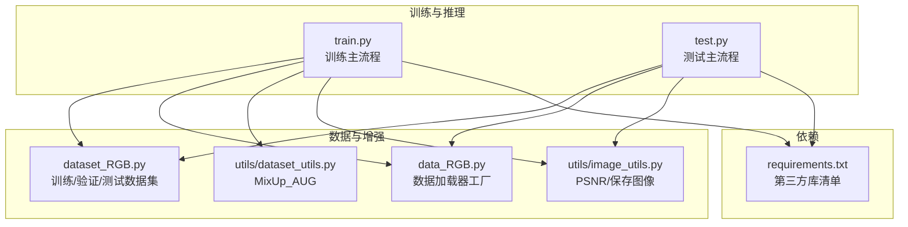
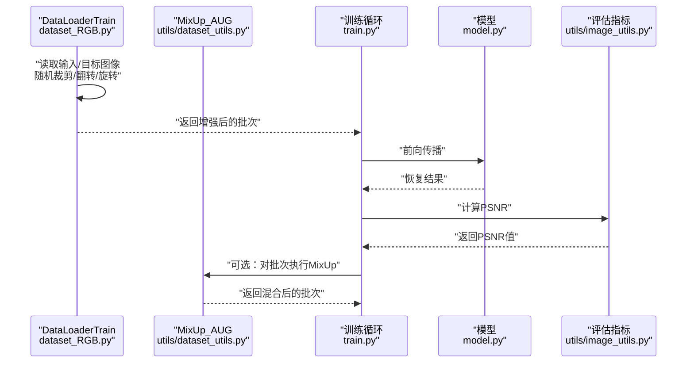
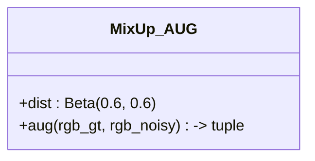
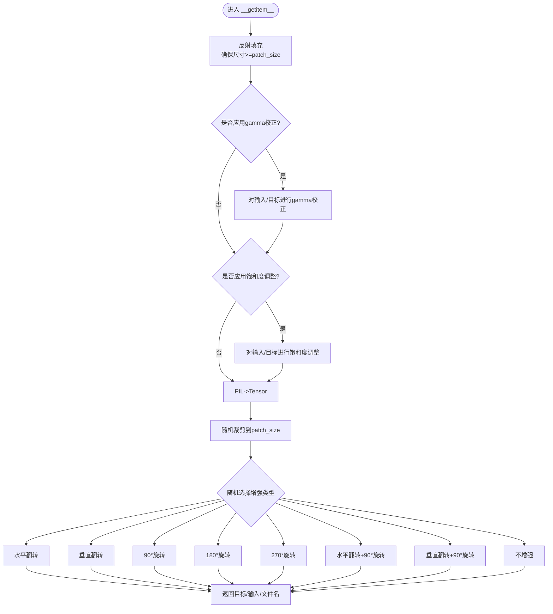
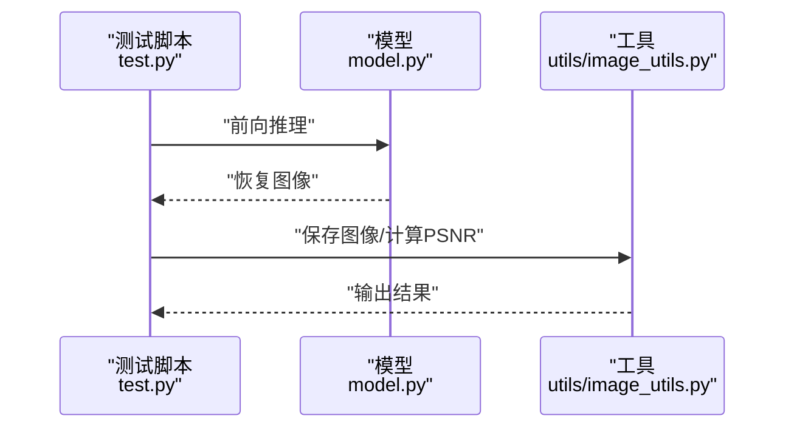
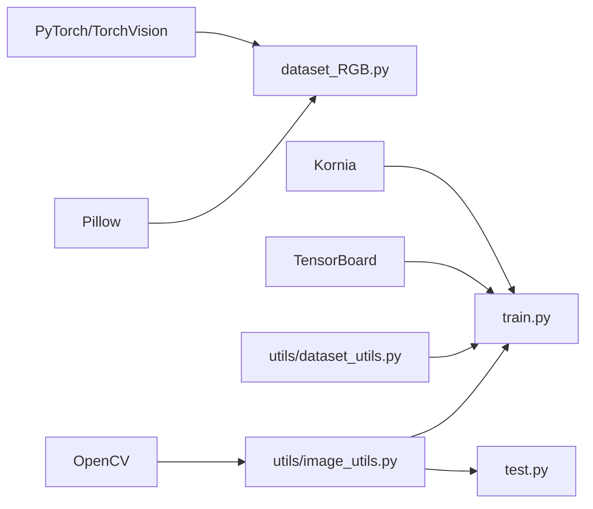

# 数据增强

<cite>
**本文引用的文件**
- [dataset_RGB.py](file://dataset_RGB.py)
- [data_RGB.py](file://data_RGB.py)
- [utils/dataset_utils.py](file://utils/dataset_utils.py)
- [utils/image_utils.py](file://utils/image_utils.py)
- [train.py](file://train.py)
- [test.py](file://test.py)
- [requirements.txt](file://requirements.txt)
</cite>

## 目录
1. [简介](#简介)
2. [项目结构](#项目结构)
3. [核心组件](#核心组件)
4. [架构总览](#架构总览)
5. [详细组件分析](#详细组件分析)
6. [依赖分析](#依赖分析)
7. [性能考量](#性能考量)
8. [故障排查指南](#故障排查指南)
9. [结论](#结论)
10. [附录](#附录)

## 简介
本文件围绕本仓库中的数据增强系统进行系统化说明，重点覆盖以下内容：
- MixUp_AUG 类的实现原理与参数配置
- 训练阶段的数据增强技术：gamma 校正、饱和度调整、随机翻转、旋转等
- 增强技术对模型性能的影响与适用场景
- 随机性与可重现性控制机制
- 增强策略选择指南与参数调优建议
- 增强效果的可视化展示与质量评估方法

## 项目结构
该仓库采用“功能模块化 + 工具函数”的组织方式，训练流程通过数据加载器与增强逻辑耦合到模型训练脚本中；工具模块提供 MixUp 增强与图像质量评估辅助函数。

图表来源
- [dataset_RGB.py:1-162](file://dataset_RGB.py#L1-L162)
- [data_RGB.py:1-15](file://data_RGB.py#L1-L15)
- [utils/dataset_utils.py:1-18](file://utils/dataset_utils.py#L1-L18)
- [utils/image_utils.py:1-19](file://utils/image_utils.py#L1-L19)
- [train.py:1-218](file://train.py#L1-L218)
- [test.py:1-69](file://test.py#L1-L69)
- [requirements.txt:1-67](file://requirements.txt#L1-L67)

章节来源
- [dataset_RGB.py:1-162](file://dataset_RGB.py#L1-L162)
- [data_RGB.py:1-15](file://data_RGB.py#L1-L15)
- [utils/dataset_utils.py:1-18](file://utils/dataset_utils.py#L1-L18)
- [utils/image_utils.py:1-19](file://utils/image_utils.py#L1-L19)
- [train.py:1-218](file://train.py#L1-L218)
- [test.py:1-69](file://test.py#L1-L69)
- [requirements.txt:1-67](file://requirements.txt#L1-L67)

## 核心组件
- 训练数据集与增强：在训练数据集 DataLoaderTrain 中实现多种增强（gamma 调整、饱和度调整、随机裁剪、随机翻转、旋转等），并在每个样本上以概率性方式应用。
- MixUp_AUG：在 utils/dataset_utils.py 中定义，使用 Beta 分布采样混合系数 λ，对批内样本进行特征空间混合，常用于提升泛化能力。
- 图像质量评估：utils/image_utils.py 提供 PSNR 计算与图像保存工具，便于评估增强前后质量与可视化输出。

章节来源
- [dataset_RGB.py:31-99](file://dataset_RGB.py#L31-L99)
- [utils/dataset_utils.py:3-18](file://utils/dataset_utils.py#L3-L18)
- [utils/image_utils.py:5-18](file://utils/image_utils.py#L5-L18)

## 架构总览
下图展示了训练流程中数据增强与 MixUp 的交互关系，以及评估指标的使用位置。

图表来源
- [dataset_RGB.py:31-99](file://dataset_RGB.py#L31-L99)
- [utils/dataset_utils.py:7-16](file://utils/dataset_utils.py#L7-L16)
- [train.py:142-173](file://train.py#L142-L173)
- [utils/image_utils.py:5-9](file://utils/image_utils.py#L5-L9)

## 详细组件分析

### MixUp_AUG 组件分析
- 实现原理
  - 使用 Beta(0.6, 0.6) 分布为每个样本生成混合系数 λ，并对批内样本与其随机打乱后的样本进行加权混合，同时对目标与噪声输入分别混合，保持对应关系。
  - 该策略有助于在特征空间引入平滑决策边界，缓解过拟合并提升鲁棒性。
- 参数配置
  - Beta 分布参数：形状参数 α=0.6, β=0.6，控制 λ 的分布偏向两端或中间，影响混合强度与多样性。
  - 批内索引打乱：通过 torch.randperm 对批次样本进行随机重排，确保混合对象不重复且具有多样性。
- 复杂度与性能
  - 时间复杂度：O(B)，其中 B 为批次大小；空间复杂度：O(B)（临时张量）。
  - 在 GPU 上直接进行张量运算，适合大规模训练。
- 适用场景
  - 小样本或类别不平衡数据；需要提升泛化能力的场景；对抗训练或鲁棒性优化。
- 注意事项
  - 若目标与输入存在严格一一对应关系，需确保混合时保持配对一致（当前实现已按索引打乱后成对混合）。

图表来源
- [utils/dataset_utils.py:3-18](file://utils/dataset_utils.py#L3-L18)

章节来源
- [utils/dataset_utils.py:3-18](file://utils/dataset_utils.py#L3-L18)

### 训练数据集增强流程分析
- 输入/目标图像读取与反射填充
  - 当图像尺寸小于 patch_size 时，使用反射填充保证后续随机裁剪不会越界。
- gamma 校正
  - 以一定概率对输入与目标图像进行 gamma 校正，调节亮度分布，提升模型对不同曝光条件的鲁棒性。
- 饱和度调整
  - 以一定概率对输入与目标图像进行饱和度调整，扰动颜色强度，增强色彩不变性。
- 随机裁剪
  - 在图像范围内随机选取起始点，裁剪出固定大小的 patch，增加尺度变化与局部多样性。
- 随机翻转与旋转
  - 以等概率对输入与目标图像进行水平翻转、垂直翻转、90°旋转及其组合，提升几何不变性与泛化能力。
- 输出格式
  - 将 PIL 图像转换为张量，返回目标图像、输入图像与文件名。

图表来源
- [dataset_RGB.py:41-99](file://dataset_RGB.py#L41-L99)

章节来源
- [dataset_RGB.py:31-99](file://dataset_RGB.py#L31-L99)

### 随机性与可重现性控制
- 种子设置
  - 训练脚本中设置了 Python、NumPy、PyTorch CPU/GPU 的随机种子，确保每次运行结果一致。
- 随机源
  - 增强过程使用 Python random、NumPy 随机数与 PyTorch 张量随机操作，受上述种子控制。
- 可重现性建议
  - 固定随机种子；避免多进程 DataLoader 的非确定性行为；在需要时禁用 CUDA 随机性或使用确定性算法。

章节来源
- [train.py:32-36](file://train.py#L32-L36)
- [dataset_RGB.py:50-95](file://dataset_RGB.py#L50-L95)

### 数据增强对模型性能的影响与适用场景
- 几何增强（翻转/旋转）
  - 提升模型对视角变化与几何形变的鲁棒性，适用于输入/目标对齐稳定的场景。
- 颜色增强（gamma/饱和度）
  - 提升对光照与色彩变化的适应能力，适用于户外或光照多变场景。
- 局部增强（随机裁剪）
  - 引入尺度变化与局部多样性，有助于提升模型对小尺度细节的感知能力。
- MixUp
  - 在特征空间引入平滑决策边界，提升泛化能力，尤其在小样本或类别不平衡时效果显著。

章节来源
- [dataset_RGB.py:50-95](file://dataset_RGB.py#L50-L95)
- [utils/dataset_utils.py:7-16](file://utils/dataset_utils.py#L7-L16)

### 增强策略选择指南与参数调优建议
- 基于任务特性选择
  - 几何增强：若输入/目标存在明显几何形变或视角差异，建议启用翻转与旋转。
  - 光照/色彩增强：若训练数据光照变化大或色彩偏差明显，建议启用 gamma 与饱和度调整。
  - 局部增强：建议保留随机裁剪，以引入尺度变化。
- 概率与幅度控制
  - gamma/饱和度：建议以 0.3~0.7 的概率启用，幅度不宜过大以免破坏真实分布。
  - 翻转/旋转：建议以等概率启用，避免偏向某一方向。
- MixUp
  - 初次实验可使用 Beta(0.6, 0.6)，观察验证集 PSNR/SSIM 改善后再微调分布参数。
- 数据加载器
  - DataLoader 的 shuffle、num_workers、pin_memory 等参数会影响吞吐与稳定性，建议根据硬件资源与数据规模调整。

章节来源
- [dataset_RGB.py:50-95](file://dataset_RGB.py#L50-L95)
- [utils/dataset_utils.py:4-5](file://utils/dataset_utils.py#L4-L5)
- [train.py:125-132](file://train.py#L125-L132)

### 增强效果的可视化展示与质量评估
- 可视化
  - 测试阶段可将恢复结果写入磁盘，结合原始输入/目标进行对比观察。
  - 使用 OpenCV 将张量转换为图像并保存，便于直观评估增强与去雨效果。
- 质量评估
  - PSNR：提供 torchPSNR 与 numpyPSNR 两种实现，可用于快速评估重建质量。
  - SSIM：可在评估脚本中扩展使用（仓库中提供了 MATLAB 评估脚本路径）。

图表来源
- [test.py:47-68](file://test.py#L47-L68)
- [utils/image_utils.py:11-18](file://utils/image_utils.py#L11-L18)

章节来源
- [test.py:47-68](file://test.py#L47-L68)
- [utils/image_utils.py:5-18](file://utils/image_utils.py#L5-L18)

## 依赖分析
- 第三方库
  - PyTorch/TorchVision：张量运算与图像变换（如 adjust_gamma、adjust_saturation、pad、to_tensor、center_crop）。
  - Kornia：构建金字塔等几何变换工具。
  - OpenCV：图像保存与格式转换。
  - Pillow：图像读取与基础变换。
  - TensorBoard：训练日志记录。
- 内部模块
  - dataset_RGB.py：训练/验证/测试数据集与增强逻辑。
  - data_RGB.py：数据加载器工厂。
  - utils/dataset_utils.py：MixUp 增强。
  - utils/image_utils.py：PSNR 与图像保存。

图表来源
- [requirements.txt:1-67](file://requirements.txt#L1-L67)
- [dataset_RGB.py:1-162](file://dataset_RGB.py#L1-L162)
- [utils/dataset_utils.py:1-18](file://utils/dataset_utils.py#L1-L18)
- [utils/image_utils.py:1-19](file://utils/image_utils.py#L1-L19)
- [train.py:26-27](file://train.py#L26-L27)
- [test.py:10-13](file://test.py#L10-L13)

章节来源
- [requirements.txt:1-67](file://requirements.txt#L1-L67)
- [dataset_RGB.py:1-162](file://dataset_RGB.py#L1-L162)
- [utils/dataset_utils.py:1-18](file://utils/dataset_utils.py#L1-L18)
- [utils/image_utils.py:1-19](file://utils/image_utils.py#L1-L19)
- [train.py:26-27](file://train.py#L26-L27)
- [test.py:10-13](file://test.py#L10-L13)

## 性能考量
- 随机增强的开销
  - 增强操作主要为张量运算与少量随机采样，对吞吐影响有限；建议在 GPU 上完成以减少主机端瓶颈。
- 数据加载器优化
  - 合理设置 num_workers、pin_memory、drop_last 等参数，避免 I/O 成为瓶颈。
- 混合策略
  - MixUp 会引入额外的张量运算与内存占用，建议在显存允许的情况下适度使用，并监控训练速度与显存占用。

## 故障排查指南
- 增强后图像异常
  - 检查 gamma/饱和度参数范围与概率设置；确认反射填充与随机裁剪未导致越界。
- 验证集性能下降
  - 降低增强强度或减少增强概率；检查 MixUp 的 λ 分布是否过于剧烈。
- 可重现性问题
  - 确认训练脚本中已设置随机种子；避免在增强过程中引入外部非确定性因素。
- 评估指标异常
  - 确保输入/目标张量归一化至 [0,1] 区间；检查 PSNR 计算前的 clamp 操作。

章节来源
- [dataset_RGB.py:41-99](file://dataset_RGB.py#L41-L99)
- [train.py:32-36](file://train.py#L32-L36)
- [utils/image_utils.py:5-9](file://utils/image_utils.py#L5-L9)

## 结论
本仓库的数据增强体系通过多样化的几何、颜色与局部增强，配合 MixUp 混合策略，在训练阶段有效提升了模型的泛化能力与鲁棒性。结合固定的随机种子与评估指标，能够稳定地衡量增强效果。建议在实际部署中根据任务特性与数据分布，动态调整增强策略与参数，以获得最佳性能。

## 附录
- 关键实现位置参考
  - MixUp_AUG：[utils/dataset_utils.py:3-18](file://utils/dataset_utils.py#L3-L18)
  - 训练数据集增强：[dataset_RGB.py:31-99](file://dataset_RGB.py#L31-L99)
  - 训练主流程与评估：[train.py:142-198](file://train.py#L142-L198)
  - 测试与可视化：[test.py:47-68](file://test.py#L47-L68)
  - PSNR/保存图像：[utils/image_utils.py:5-18](file://utils/image_utils.py#L5-L18)