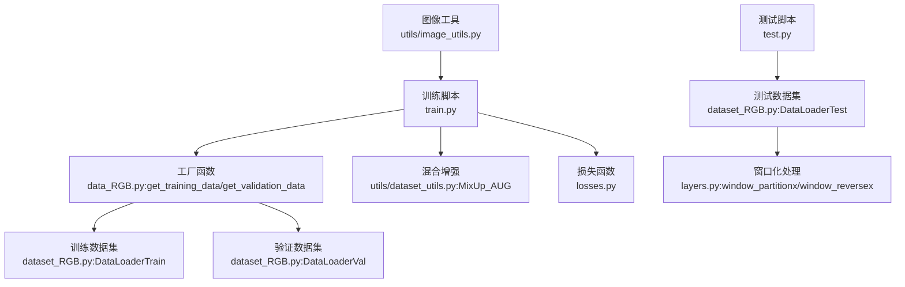
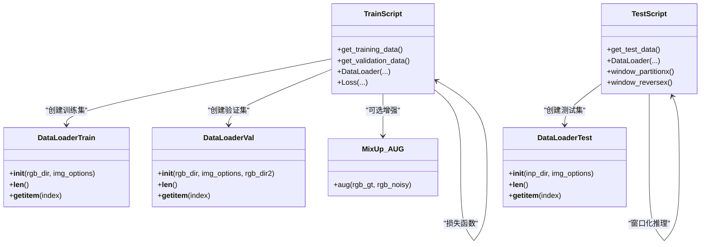
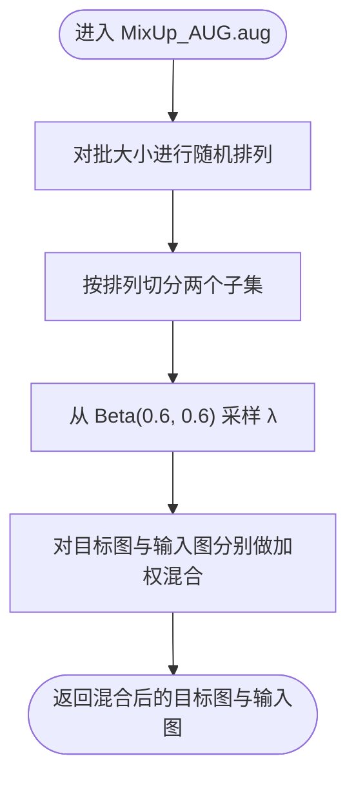
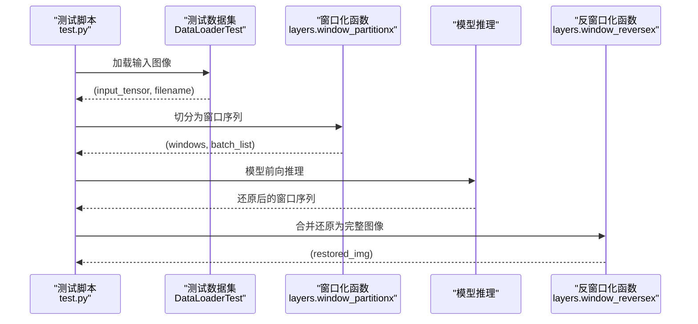
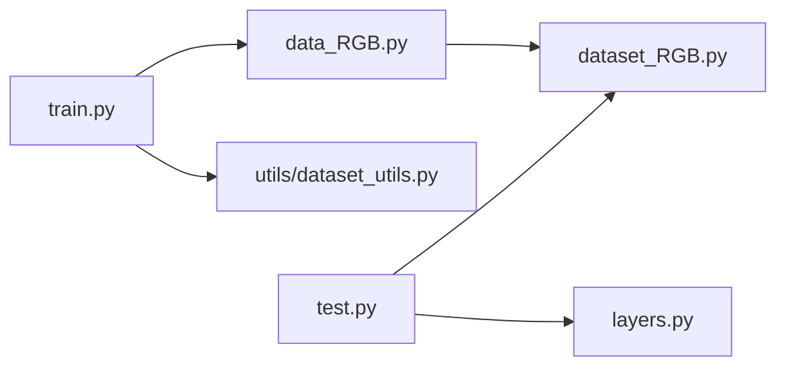

# 数据处理

<cite>
**本文引用的文件列表**
- [dataset_RGB.py](file://dataset_RGB.py)
- [data_RGB.py](file://data_RGB.py)
- [utils/dataset_utils.py](file://utils/dataset_utils.py)
- [utils/image_utils.py](file://utils/image_utils.py)
- [train.py](file://train.py)
- [test.py](file://test.py)
- [layers.py](file://layers.py)
- [losses.py](file://losses.py)
</cite>

## 目录
1. [简介](#简介)
2. [项目结构](#项目结构)
3. [核心组件](#核心组件)
4. [架构总览](#架构总览)
5. [详细组件分析](#详细组件分析)
6. [依赖关系分析](#依赖关系分析)
7. [性能考量](#性能考量)
8. [故障排查指南](#故障排查指南)
9. [结论](#结论)
10. [附录：数据格式与自定义扩展](#附录数据格式与自定义扩展)

## 简介
本文件面向数据处理系统，聚焦于 RGB 图像去雨任务中的数据加载与增强流程。重点解析以下内容：
- dataset_RGB.py 中的 DataLoaderTrain 与 DataLoaderVal 的功能差异与使用场景
- MixUp_AUG 数据增强策略的原理与参数配置
- 数据预处理流程（图像归一化、尺寸调整、批次生成）
- 不同数据集格式的处理方式与数据组织结构
- 数据质量检查与异常处理方法
- 数据可视化与调试建议
- 自定义数据集的添加接口与最佳实践

## 项目结构
该仓库围绕“数据加载—模型训练—评估”形成闭环。与数据处理直接相关的核心文件如下：
- dataset_RGB.py：定义训练/验证/测试数据集类与数据增强逻辑
- data_RGB.py：对外暴露 get_training_data/get_validation_data/get_test_data 工厂函数
- utils/dataset_utils.py：MixUp_AUG 增强策略
- utils/image_utils.py：PSNR 计算与图像保存辅助
- train.py/test.py：训练与测试脚本中对数据加载器的调用
- layers.py：窗口分块/反分块等推理阶段的窗口化处理
- losses.py：训练阶段使用的损失函数（与数据无关但影响训练流程）

图表来源
- [train.py:125-132](file://train.py#L125-L132)
- [data_RGB.py:4-14](file://data_RGB.py#L4-L14)
- [dataset_RGB.py:13-162](file://dataset_RGB.py#L13-L162)
- [utils/dataset_utils.py:3-18](file://utils/dataset_utils.py#L3-L18)
- [layers.py:249-304](file://layers.py#L249-L304)
- [utils/image_utils.py:5-18](file://utils/image_utils.py#L5-L18)

章节来源
- [train.py:125-132](file://train.py#L125-L132)
- [data_RGB.py:4-14](file://data_RGB.py#L4-L14)
- [dataset_RGB.py:13-162](file://dataset_RGB.py#L13-L162)
- [utils/dataset_utils.py:3-18](file://utils/dataset_utils.py#L3-L18)
- [layers.py:249-304](file://layers.py#L249-L304)
- [utils/image_utils.py:5-18](file://utils/image_utils.py#L5-L18)

## 核心组件
- DataLoaderTrain：训练阶段的数据集，负责随机裁剪、反射填充、亮度/饱和度扰动、随机翻转/旋转等增强，并返回目标图与输入图及文件名。
- DataLoaderVal：验证阶段的数据集，采用中心裁剪，不进行随机增强，保证评估稳定性。
- DataLoaderTest：测试阶段的数据集，仅加载输入图像，用于推理输出。
- MixUp_AUG：基于 Beta 分布的 MixUp 增强，对批内样本进行加权混合，提升泛化能力。
- 工具函数：torchPSNR、save_img 等，用于评估与结果保存。

章节来源
- [dataset_RGB.py:13-162](file://dataset_RGB.py#L13-L162)
- [utils/dataset_utils.py:3-18](file://utils/dataset_utils.py#L3-L18)
- [utils/image_utils.py:5-18](file://utils/image_utils.py#L5-L18)

## 架构总览
下图展示训练/验证/测试三类数据集在系统中的位置与交互关系，以及与增强策略和损失函数的关系。

图表来源
- [dataset_RGB.py:13-162](file://dataset_RGB.py#L13-L162)
- [utils/dataset_utils.py:3-18](file://utils/dataset_utils.py#L3-L18)
- [train.py:125-132](file://train.py#L125-L132)
- [test.py:41-42](file://test.py#L41-L42)
- [layers.py:249-304](file://layers.py#L249-L304)

## 详细组件分析

### DataLoaderTrain：训练数据集
- 输入输出
  - 输入：rgb_dir（包含 input 与 target 子目录）、img_options（含 patch_size）
  - 输出：(target_tensor, input_tensor, filename)，其中 target 为去雨目标，input 为带雨图像
- 关键流程
  - 文件发现：扫描 input 与 target 子目录，过滤图片后按名称排序
  - 反射填充：若图像小于 patch_size，则以反射方式补边
  - 随机亮度/饱和度扰动：概率性调整 gamma 与饱和度
  - 转张量：PIL 图像转为张量
  - 随机裁剪：从原图中随机裁出 patch_size×patch_size 的块
  - 随机增强：随机翻转/旋转（flip/rot90），覆盖水平翻转、垂直翻转、90°/180°/270°旋转及镜像旋转组合
- 使用场景
  - 训练阶段，需要多样化的增强以提升模型鲁棒性
  - 适合小批量、高增强强度的训练设置

章节来源
- [dataset_RGB.py:13-100](file://dataset_RGB.py#L13-L100)

### DataLoaderVal：验证数据集
- 输入输出
  - 输入：rgb_dir、img_options（含 patch_size）、可选 rgb_dir2
  - 输出：(target_tensor, input_tensor, filename)
- 关键流程
  - 文件发现与排序同上
  - 中心裁剪：若设置了 patch_size，则对输入与目标图做中心裁剪
  - 转张量：PIL 图像转为张量
- 使用场景
  - 验证阶段，避免随机增强带来的不确定性，确保评估稳定
  - 适合固定大小的整图评估

章节来源
- [dataset_RGB.py:101-139](file://dataset_RGB.py#L101-L139)

### DataLoaderTest：测试数据集
- 输入输出
  - 输入：inp_dir（仅包含待推理图像）
  - 输出：(input_tensor, filename)
- 关键流程
  - 扫描目录，过滤图片
  - 转张量：PIL 图像转为张量
- 使用场景
  - 推理阶段，通常配合窗口化处理（见下节）进行大图推理

章节来源
- [dataset_RGB.py:141-162](file://dataset_RGB.py#L141-L162)

### MixUp_AUG：混合增强策略
- 原理
  - 对批内样本按 Beta(0.6, 0.6) 分布采样权重 λ，对目标图与输入图分别与打乱后的样本进行线性混合
  - 通过引入“伪混合样本”，提升模型对边界区域与复杂纹理的鲁棒性
- 参数配置
  - Beta 分布参数：α=β=0.6，控制混合比例偏向中间值，兼顾真实与混合样本
  - 设备：增强过程会将权重张量移动到 GPU
- 使用建议
  - 在训练阶段启用，注意与 DataLoaderTrain 的随机增强共同作用时的总体扰动强度
  - 与 DataLoaderVal/Test 的对比评估需关闭该增强

图表来源
- [utils/dataset_utils.py:7-17](file://utils/dataset_utils.py#L7-L17)

章节来源
- [utils/dataset_utils.py:3-18](file://utils/dataset_utils.py#L3-L18)

### 数据预处理流程（训练/验证/测试）
- 图像归一化
  - 当前实现未对像素值进行显式归一化；PIL 转张量后默认范围为 [0,1]，后续由模型/损失函数决定是否进一步归一化
- 尺寸调整
  - 训练：反射填充至不小于 patch_size，再随机裁剪到指定尺寸
  - 验证：中心裁剪到指定尺寸
  - 测试：保持原尺寸（窗口化推理时按窗口大小分块）
- 批次生成
  - 训练：shuffle=True，batch_size 由外部传入
  - 验证：shuffle=False，batch_size=1
  - 测试：batch_size=1，便于逐图保存

章节来源
- [dataset_RGB.py:41-99](file://dataset_RGB.py#L41-L99)
- [dataset_RGB.py:129-139](file://dataset_RGB.py#L129-L139)
- [train.py:127-131](file://train.py#L127-L131)
- [test.py:42](file://test.py#L42)

### 数据集格式与组织结构
- 统一格式
  - 训练/验证：每个样本包含 input 与 target 两个子目录，二者文件名一一对应
  - 测试：仅 input 目录，无需 target
- 文件类型
  - 支持常见图片格式（如 jpg/png/gif 等），通过扩展名过滤
- 目录约定
  - 训练/验证：rgb_dir/input 与 rgb_dir/target
  - 测试：inp_dir（仅包含输入图像）

章节来源
- [dataset_RGB.py:17-21](file://dataset_RGB.py#L17-L21)
- [dataset_RGB.py:105-109](file://dataset_RGB.py#L105-L109)
- [dataset_RGB.py:145](file://dataset_RGB.py#L145)

### 推理阶段的窗口化处理
- 窗口分块与反分块
  - 将大图按窗口大小分块，送入模型推理后再拼接还原
  - 支持边界处理（不足窗口的部分单独处理并合并）
- 与测试数据集的配合
  - 测试数据集提供单通道张量与文件名，窗口化函数将其转换为窗口序列，模型输出后再还原

图表来源
- [test.py:58-60](file://test.py#L58-L60)
- [layers.py:249-304](file://layers.py#L249-L304)

章节来源
- [test.py:41-68](file://test.py#L41-L68)
- [layers.py:249-304](file://layers.py#L249-L304)

## 依赖关系分析
- 训练脚本依赖工厂函数创建数据集实例，再交由 DataLoader 组装批次
- MixUp_AUG 作为独立增强模块，可在训练循环中按需调用
- 测试脚本依赖 DataLoaderTest 与窗口化函数完成大图推理

图表来源
- [train.py:125-132](file://train.py#L125-L132)
- [data_RGB.py:4-14](file://data_RGB.py#L4-L14)
- [dataset_RGB.py:13-162](file://dataset_RGB.py#L13-L162)
- [utils/dataset_utils.py:3-18](file://utils/dataset_utils.py#L3-L18)
- [test.py:41-42](file://test.py#L41-L42)
- [layers.py:249-304](file://layers.py#L249-L304)

章节来源
- [train.py:125-132](file://train.py#L125-L132)
- [data_RGB.py:4-14](file://data_RGB.py#L4-L14)
- [dataset_RGB.py:13-162](file://dataset_RGB.py#L13-L162)
- [utils/dataset_utils.py:3-18](file://utils/dataset_utils.py#L3-L18)
- [test.py:41-42](file://test.py#L41-L42)
- [layers.py:249-304](file://layers.py#L249-L304)

## 性能考量
- 训练阶段
  - DataLoaderTrain 的随机增强与裁剪可能增加 CPU 时间，建议合理设置 num_workers 与 pin_memory
  - 若内存紧张，可适当降低 batch_size 或 patch_size
- 验证阶段
  - DataLoaderVal 采用中心裁剪，计算开销较低，适合高频评估
- 推理阶段
  - 窗口化处理可显著降低显存占用，但会增加分块/合并的计算成本
  - 建议根据 GPU 显存选择合适的窗口大小

[本节为通用性能建议，不直接分析具体文件]

## 故障排查指南
- 图像打开失败或路径错误
  - 确认 rgb_dir/input 与 rgb_dir/target 下存在匹配的文件名
  - 检查文件扩展名是否被支持（当前支持常见图片格式）
- 尺寸过小导致裁剪异常
  - DataLoaderTrain 会对小于 patch_size 的图像进行反射填充，若仍报错，请检查输入图像尺寸
- CUDA 张量设备不一致
  - MixUp_AUG.aug 会在增强过程中将权重移动到 GPU，确保模型与数据在同一设备
- 评估指标异常
  - utils/image_utils.torchPSNR 对输入做了 clamp(0,1)，请确认模型输出已归一化到 [0,1]
- 大图推理结果不完整
  - 检查窗口化函数的边界处理逻辑与 batch_list 的长度

章节来源
- [dataset_RGB.py:41-48](file://dataset_RGB.py#L41-L48)
- [utils/dataset_utils.py:13](file://utils/dataset_utils.py#L13)
- [utils/image_utils.py:5-9](file://utils/image_utils.py#L5-L9)
- [layers.py:249-304](file://layers.py#L249-L304)

## 结论
本数据处理系统围绕统一的 RGB 图像去雨数据集格式，提供了训练/验证/测试三类数据集与丰富的增强策略。DataLoaderTrain 侧重多样性增强，DataLoaderVal 保证评估稳定性，DataLoaderTest 配合窗口化处理完成大图推理。MixUp_AUG 通过 Beta 分布混合进一步提升泛化能力。结合合理的批大小、窗口大小与设备配置，可在保证性能的同时获得稳定的训练与评估效果。

[本节为总结性内容，不直接分析具体文件]

## 附录：数据格式与自定义扩展

### 数据格式与组织结构
- 训练/验证
  - input：带雨图像
  - target：干净图像
  - 文件名一一对应
- 测试
  - 仅 input 目录，无 target

章节来源
- [dataset_RGB.py:17-21](file://dataset_RGB.py#L17-L21)
- [dataset_RGB.py:105-109](file://dataset_RGB.py#L105-L109)
- [dataset_RGB.py:145](file://dataset_RGB.py#L145)

### 自定义数据集添加指南
- 新增数据集类
  - 继承 torch.utils.data.Dataset，实现 __init__、__len__、__getitem__
  - 在 data_RGB.py 中新增工厂函数，例如 get_custom_data(rgb_dir, img_options)
- 数据组织
  - 保持 input 与 target 子目录结构，或在新类中自行适配
  - 文件名匹配规则可沿用 is_image_file 过滤器
- 增强策略
  - 可复用 MixUp_AUG 或在新类中实现自定义增强
- 批次与评估
  - 训练：shuffle=True，batch_size 由外部传入
  - 验证：shuffle=False，batch_size=1
  - 测试：单图推理，配合窗口化处理

章节来源
- [dataset_RGB.py:13-162](file://dataset_RGB.py#L13-L162)
- [data_RGB.py:4-14](file://data_RGB.py#L4-L14)
- [utils/dataset_utils.py:3-18](file://utils/dataset_utils.py#L3-L18)

### 数据可视化与调试建议
- 保存中间结果
  - 使用 utils/save_img 将张量转换为图像并保存，便于检查预处理与增强效果
- 可视化增强
  - 在 DataLoaderTrain.__getitem__ 中临时打印或保存增强前后的图像，观察随机翻转/旋转/亮度/饱和度变化
- 指标监控
  - 使用 utils/torchPSNR 计算 PSNR，结合 TensorBoard 记录训练/验证指标

章节来源
- [utils/image_utils.py:11-18](file://utils/image_utils.py#L11-L18)
- [train.py:177-186](file://train.py#L177-L186)