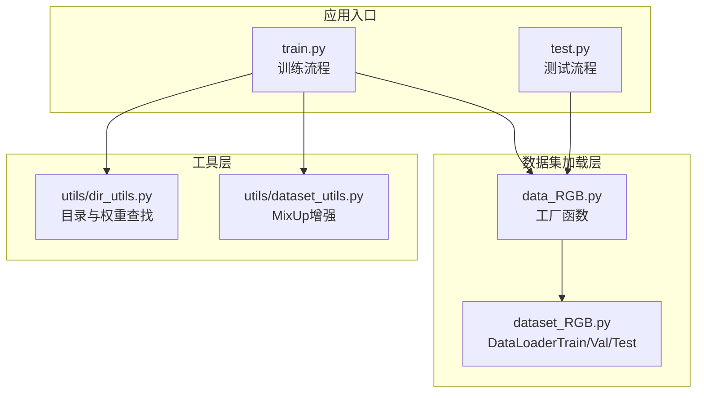
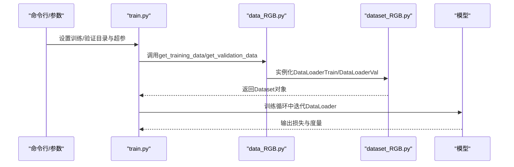
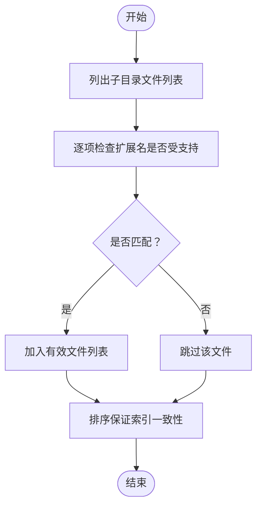
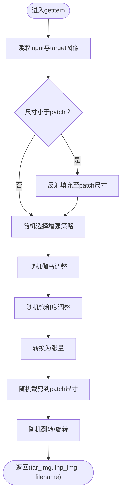
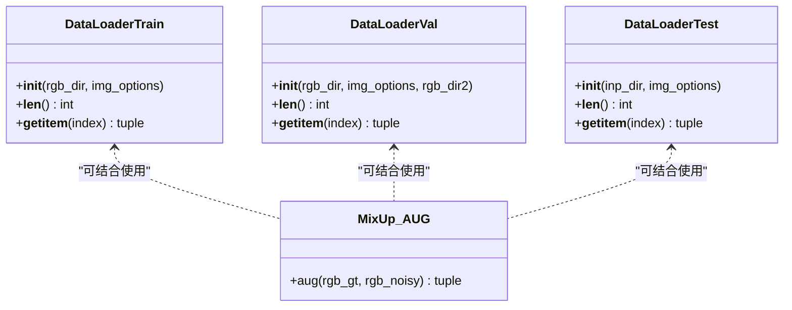
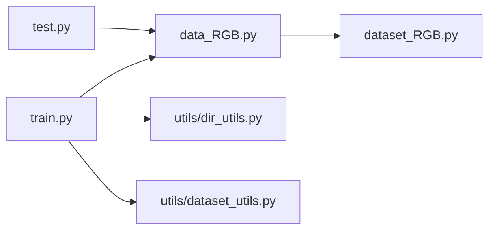

# 数据集组织

<cite>
**本文引用的文件**
- [dataset_RGB.py](file://dataset_RGB.py)
- [data_RGB.py](file://data_RGB.py)
- [train.py](file://train.py)
- [test.py](file://test.py)
- [utils/dataset_utils.py](file://utils/dataset_utils.py)
- [utils/dir_utils.py](file://utils/dir_utils.py)
- [README.md](file://README.md)
</cite>

## 目录
1. [引言](#引言)
2. [项目结构](#项目结构)
3. [核心组件](#核心组件)
4. [架构总览](#架构总览)
5. [详细组件分析](#详细组件分析)
6. [依赖分析](#依赖分析)
7. [性能考虑](#性能考虑)
8. [故障排查指南](#故障排查指南)
9. [结论](#结论)
10. [附录](#附录)

## 引言
本文件系统性阐述本仓库中RGB图像去雨任务的数据集组织与加载机制，重点覆盖以下方面：
- RGB数据集的标准组织格式：input与target子目录的命名规范与用途
- 文件扩展名检测与过滤机制
- 数据集路径解析与文件枚举的实现方式
- 不同数据集格式的支持情况与迁移方法
- 数据集验证与完整性检查工具的使用指南
- 大规模数据集的管理与优化策略

## 项目结构
围绕数据集组织与加载的关键文件与职责如下：
- dataset_RGB.py：定义训练、验证、测试三类数据加载器，负责路径解析、文件过滤、图像读取、增强与裁剪等
- data_RGB.py：对外暴露get_*_data工厂函数，封装对dataset_RGB.py的调用，并进行基础断言
- train.py：训练入口脚本，通过data_RGB.get_*_data加载训练与验证数据集
- test.py：测试入口脚本，通过data_RGB.get_test_data加载测试数据集
- utils/dataset_utils.py：提供MixUp增强工具（用于多尺度目标的混合）
- utils/dir_utils.py：提供目录创建与“最近一次”模型权重查找等辅助能力

**图表来源**
- [data_RGB.py:1-15](file://data_RGB.py#L1-L15)
- [dataset_RGB.py:13-162](file://dataset_RGB.py#L13-L162)
- [train.py:19-132](file://train.py#L19-L132)
- [test.py:7-42](file://test.py#L7-L42)
- [utils/dir_utils.py:1-18](file://utils/dir_utils.py#L1-L18)
- [utils/dataset_utils.py:1-18](file://utils/dataset_utils.py#L1-L18)

**章节来源**
- [dataset_RGB.py:1-162](file://dataset_RGB.py#L1-L162)
- [data_RGB.py:1-15](file://data_RGB.py#L1-L15)
- [train.py:19-132](file://train.py#L19-L132)
- [test.py:7-42](file://test.py#L7-L42)
- [utils/dataset_utils.py:1-18](file://utils/dataset_utils.py#L1-L18)
- [utils/dir_utils.py:1-18](file://utils/dir_utils.py#L1-L18)

## 核心组件
- 训练数据加载器：从指定rgb_dir下读取input与target两个子目录，仅保留符合支持扩展名的图像文件，按索引随机裁剪与增强后返回
- 验证数据加载器：与训练类似，但采用中心裁剪策略，便于稳定评估
- 测试数据加载器：直接从单个输入目录读取待推理图像，返回张量与文件名
- 工具增强：提供基于Beta分布的MixUp混合策略，用于多尺度目标的组合

**章节来源**
- [dataset_RGB.py:13-162](file://dataset_RGB.py#L13-L162)
- [utils/dataset_utils.py:3-18](file://utils/dataset_utils.py#L3-L18)

## 架构总览
数据从命令行参数或默认路径进入，经由工厂函数封装为Dataset实例，再由DataLoader批量喂入模型；训练与测试分别在train.py与test.py中完成。

**图表来源**
- [train.py:42-52](file://train.py#L42-L52)
- [train.py:125-132](file://train.py#L125-L132)
- [data_RGB.py:4-10](file://data_RGB.py#L4-L10)
- [dataset_RGB.py:13-118](file://dataset_RGB.py#L13-L118)

## 详细组件分析

### 数据集组织格式与命名规范
- 标准目录结构
  - 训练/验证/测试根目录：例如训练根目录为../data/Rain200L/train/，验证根目录为../data/Rain200L/test/
  - 子目录要求：
    - input：存放带雨图像（如Rain200L中的train/input与test/input）
    - target：存放对应的目标清晰图像（如Rain200L中的train/targets与test/targets）
- 文件命名一致性
  - 同一索引下的input与target文件名应保持一致（不含扩展名），以便在训练时按顺序配对
  - 测试模式下仅需input目录，文件名用于保存输出结果

**章节来源**
- [train.py:42-43](file://train.py#L42-L43)
- [dataset_RGB.py:17-21](file://dataset_RGB.py#L17-L21)
- [dataset_RGB.py:105-109](file://dataset_RGB.py#L105-L109)
- [dataset_RGB.py:145](file://dataset_RGB.py#L145)

### 文件扩展名检测与过滤机制
- 支持的图像扩展名：包含大小写不敏感的jpeg/JPEG、jpg、png、PNG、gif
- 过滤逻辑：
  - 列出input与target子目录中的所有条目
  - 使用is_image_file逐项判断是否为受支持扩展名
  - 仅保留满足条件的文件路径，确保后续读取与处理的安全性

**图表来源**
- [dataset_RGB.py:10-11](file://dataset_RGB.py#L10-L11)
- [dataset_RGB.py:17-21](file://dataset_RGB.py#L17-L21)
- [dataset_RGB.py:105-109](file://dataset_RGB.py#L105-L109)
- [dataset_RGB.py:145](file://dataset_RGB.py#L145)

**章节来源**
- [dataset_RGB.py:10-11](file://dataset_RGB.py#L10-L11)
- [dataset_RGB.py:17-21](file://dataset_RGB.py#L17-L21)
- [dataset_RGB.py:105-109](file://dataset_RGB.py#L105-L109)
- [dataset_RGB.py:145](file://dataset_RGB.py#L145)

### 数据集路径解析与文件枚举
- 路径解析
  - 训练/验证：从rgb_dir拼接input与target子目录，分别枚举并过滤
  - 测试：从inp_dir直接枚举input目录
- 文件枚举
  - 使用os.listdir获取目录内容
  - 通过is_image_file进行扩展名过滤
  - 对过滤后的文件列表进行排序，确保索引一致性与可重复性
- 索引与配对
  - 训练/验证：按相同索引读取同一序号的input与target文件
  - 测试：按顺序读取input目录中的文件，文件名用于保存输出

**章节来源**
- [dataset_RGB.py:17-21](file://dataset_RGB.py#L17-L21)
- [dataset_RGB.py:105-109](file://dataset_RGB.py#L105-L109)
- [dataset_RGB.py:145](file://dataset_RGB.py#L145)

### 数据增强与裁剪策略
- 训练阶段
  - 尺寸不足时使用反射填充至patch尺寸
  - 随机伽马调整、随机饱和度调整
  - 随机翻转、旋转（含90°倍数旋转与镜像组合）
  - 随机裁剪到指定patch尺寸
- 验证阶段
  - 中心裁剪到指定patch尺寸，避免边界效应
- 测试阶段
  - 直接转换为张量，不进行增强

**图表来源**
- [dataset_RGB.py:31-99](file://dataset_RGB.py#L31-L99)
- [dataset_RGB.py:119-139](file://dataset_RGB.py#L119-L139)

**章节来源**
- [dataset_RGB.py:31-99](file://dataset_RGB.py#L31-L99)
- [dataset_RGB.py:119-139](file://dataset_RGB.py#L119-L139)

### MixUp增强工具
- 功能概述
  - 基于Beta分布采样混合系数λ
  - 对多尺度目标与噪声图像进行线性混合
- 使用场景
  - 可与多尺度金字塔目标配合，提升模型对多尺度细节的恢复能力

**章节来源**
- [utils/dataset_utils.py:3-18](file://utils/dataset_utils.py#L3-L18)

### 类与关系图

**图表来源**
- [dataset_RGB.py:13-162](file://dataset_RGB.py#L13-L162)
- [utils/dataset_utils.py:3-18](file://utils/dataset_utils.py#L3-L18)

## 依赖分析
- 组件耦合
  - train.py与test.py通过data_RGB.py间接依赖dataset_RGB.py
  - utils/dataset_utils.py与utils/dir_utils.py为独立工具模块
- 外部依赖
  - Pillow用于图像读取
  - TorchVision.transforms.functional用于张量转换与增强
  - Kornia用于构建金字塔特征
- 潜在风险
  - 若input与target文件数量或命名不一致，可能导致索引错配
  - 扩展名大小写差异可能被忽略，但建议统一使用小写扩展名以减少歧义

**图表来源**
- [train.py:19](file://train.py#L19)
- [test.py:7](file://test.py#L7)
- [data_RGB.py:1](file://data_RGB.py#L1)
- [dataset_RGB.py:1-7](file://dataset_RGB.py#L1-L7)
- [utils/dir_utils.py:1](file://utils/dir_utils.py#L1)
- [utils/dataset_utils.py:1](file://utils/dataset_utils.py#L1)

**章节来源**
- [train.py:19-27](file://train.py#L19-L27)
- [test.py:7](file://test.py#L7)
- [data_RGB.py:1](file://data_RGB.py#L1)
- [dataset_RGB.py:1-7](file://dataset_RGB.py#L1-L7)

## 性能考虑
- I/O与内存
  - 使用pin_memory提高GPU端数据传输效率
  - 测试阶段采用窗口分割与反向合并，降低显存峰值
- 并发与批处理
  - 训练时num_workers设为0，避免多进程带来的复杂性；可根据硬件调整
  - 批大小batch_size根据显存容量合理设置
- 数据增强
  - 增强操作在CPU侧完成，建议尽量减少不必要的增强组合
- 大规模数据集
  - 排序与过滤在初始化阶段完成，避免在getitem中重复计算
  - 建议将数据集放置在本地SSD或高吞吐存储介质上

**章节来源**
- [train.py:127-132](file://train.py#L127-L132)
- [test.py:42](file://test.py#L42)

## 故障排查指南
- 路径不存在
  - data_RGB.py对传入的rgb_dir进行存在性断言，若报错请检查路径拼接与权限
- 文件扩展名不匹配
  - 确保input与target均只包含受支持扩展名；建议统一为小写
- 文件数量不一致
  - 训练/验证时需保证同一索引下input与target成对出现；可通过排序后的列表长度确认
- 验证/测试结果异常
  - 验证阶段采用中心裁剪，若尺寸过大可适当减小patch_size
  - 测试阶段注意输出目录存在性，确保写入权限

**章节来源**
- [data_RGB.py:5-14](file://data_RGB.py#L5-L14)
- [dataset_RGB.py:17-21](file://dataset_RGB.py#L17-L21)
- [dataset_RGB.py:105-109](file://dataset_RGB.py#L105-L109)
- [test.py:45](file://test.py#L45)

## 结论
本仓库采用简洁明确的RGB数据集组织方式：input与target子目录分离、严格的扩展名过滤、以及标准化的数据增强与裁剪流程。通过工厂函数与PyTorch Dataset接口，实现了训练、验证、测试的一致接入。对于大规模数据集，建议在文件命名、扩展名与存储介质层面做好规范化与性能优化，以获得更稳定的训练与推理体验。

## 附录

### 数据集准备与迁移方法
- 准备步骤
  - 下载所需数据集并放置于约定目录（参考README中的数据集说明）
  - 确保每个数据集根目录下存在input与target子目录
- 迁移方法
  - 若已有其他格式数据集，可先将其重命名为标准格式（input与target），再进行扩展名统一与排序
  - 对于测试集，仅需准备input目录，并在测试脚本中指定输入路径

**章节来源**
- [README.md:37-59](file://README.md#L37-L59)
- [train.py:42-43](file://train.py#L42-L43)
- [dataset_RGB.py:17-21](file://dataset_RGB.py#L17-L21)