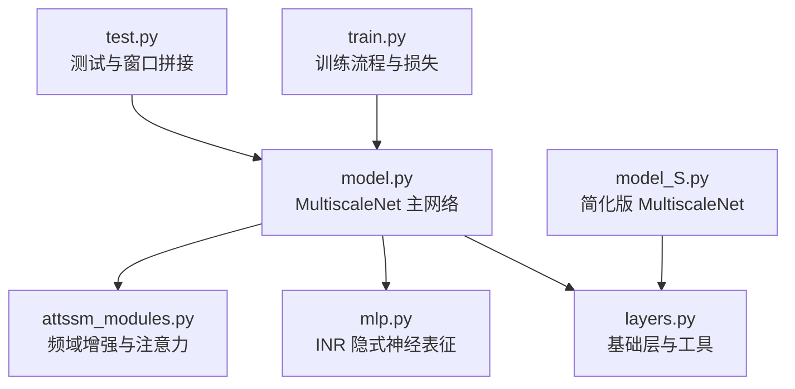
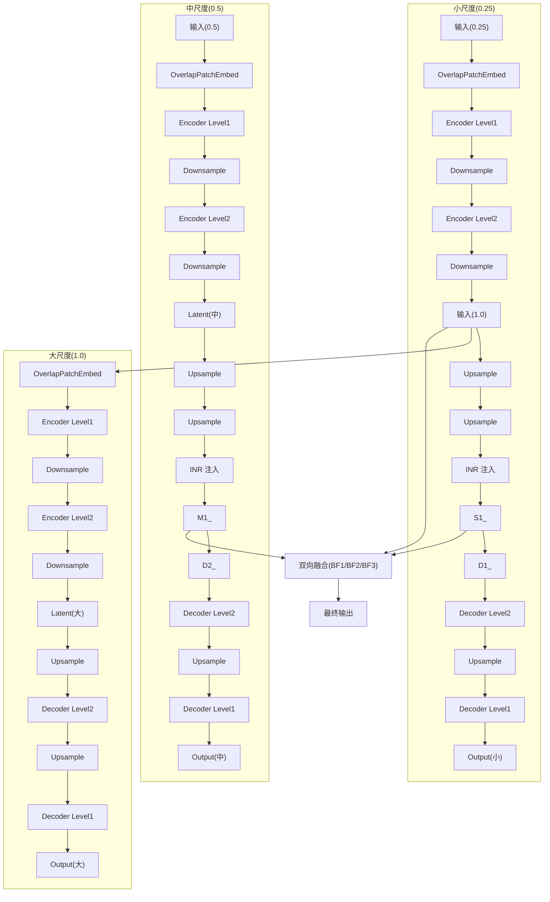
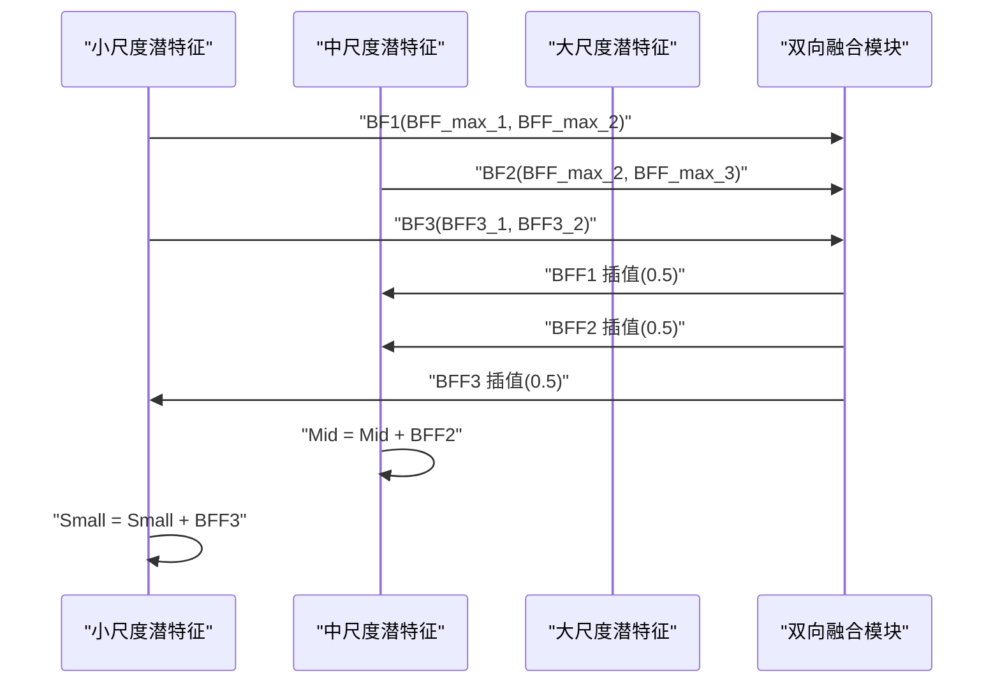
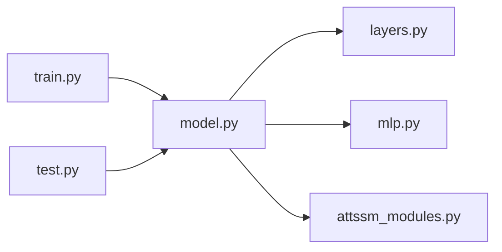

# 多尺度网络架构

<cite>
**本文引用的文件列表**
- [model.py](file://model.py)
- [layers.py](file://layers.py)
- [model_S.py](file://model_S.py)
- [attssm_modules.py](file://attssm_modules.py)
- [mlp.py](file://mlp.py)
- [train.py](file://train.py)
- [test.py](file://test.py)
- [README.md](file://README.md)
</cite>

## 目录
1. [引言](#引言)
2. [项目结构](#项目结构)
3. [核心组件](#核心组件)
4. [架构总览](#架构总览)
5. [详细组件分析](#详细组件分析)
6. [依赖关系分析](#依赖关系分析)
7. [性能考量](#性能考量)
8. [故障排查指南](#故障排查指南)
9. [结论](#结论)
10. [附录](#附录)

## 引言
本文件面向NeRD-Rain项目的多尺度网络架构，系统性解析MultiscaleNet主网络的设计理念与实现细节。重点覆盖三层多尺度特征提取机制（小尺度0.25、中尺度0.5、大尺度1.0），每尺度的编码器-解码器结构、OverlapPatchEmbed特征嵌入、Downsample/Upsample下采样与上采样、以及各层级的TransformerBlock序列。同时阐明多尺度特征生成与尺度间信息传递机制，并结合训练脚本说明损失函数与评估流程，帮助读者从原理到工程实践全面理解该架构如何提升去雨效果与处理不同尺度雨滴的能力。

## 项目结构
NeRD-Rain采用模块化组织，核心网络定义在model.py中，基础层与工具函数在layers.py中，另有简化版本model_S.py便于对比或调试；频域增强模块与多维注意力在attssm_modules.py中；隐式神经表征（INR）在mlp.py中；训练与测试脚本分别在train.py与test.py中；README.md提供整体介绍与使用说明。

图表来源
- [model.py:303-673](file://model.py#L303-L673)
- [layers.py:1-392](file://layers.py#L1-L392)
- [mlp.py:1-151](file://mlp.py#L1-L151)
- [attssm_modules.py:1-295](file://attssm_modules.py#L1-L295)
- [train.py:1-218](file://train.py#L1-L218)
- [test.py:1-69](file://test.py#L1-L69)
- [model_S.py:233-603](file://model_S.py#L233-L603)

章节来源
- [README.md:1-121](file://README.md#L1-L121)
- [model.py:303-673](file://model.py#L303-L673)
- [layers.py:1-392](file://layers.py#L1-L392)
- [mlp.py:1-151](file://mlp.py#L1-L151)
- [attssm_modules.py:1-295](file://attssm_modules.py#L1-L295)
- [train.py:1-218](file://train.py#L1-L218)
- [test.py:1-69](file://test.py#L1-L69)
- [model_S.py:233-603](file://model_S.py#L233-L603)

## 核心组件
- OverlapPatchEmbed：将输入图像映射到嵌入空间，作为各尺度编码器的起始层。
- TransformerBlock：基于注意力与前馈网络的特征变换单元，包含LayerNorm、Attention与FeedForward。
- RFM_TransformerBlock：在TransformerBlock基础上引入频域残差模块（RFM），增强高频细节恢复能力。
- Downsample/Upsample：通过PixelUnshuffle/PixelShuffle实现通道数减半/加倍与空间分辨率翻倍/减半。
- Fusion：通道注意力融合模块，用于跨尺度特征的自适应加权融合。
- INR：隐式神经表征，将深层潜特征映射回RGB图像，用于尺度间信息注入与增强。
- MultiscaleNet：三层多尺度主干，分别以0.25、0.5、1.0的输入比例构建编码-解码路径，并在高层进行双向信息融合。

章节来源
- [model.py:238-270](file://model.py#L238-L270)
- [model.py:195-236](file://model.py#L195-L236)
- [model.py:272-301](file://model.py#L272-L301)
- [model.py:303-673](file://model.py#L303-L673)
- [mlp.py:41-151](file://mlp.py#L41-L151)

## 架构总览
MultiscaleNet以三套并行的编码-解码子网络为核心：
- 小尺度（scale=0.25）：从最小分辨率开始，逐步下采样至潜特征，再经上采样回到中尺度，配合INR进行尺度间信息注入。
- 中尺度（scale=0.5）：在小尺度输出基础上叠加，继续编码-解码，高层同样接入INR与双向融合。
- 大尺度（scale=1.0）：直接以原图作为输入，进行完整的编码-解码路径，最终输出去雨结果。

图表来源
- [model.py:486-673](file://model.py#L486-L673)

章节来源
- [model.py:486-673](file://model.py#L486-L673)

## 详细组件分析

### OverlapPatchEmbed 特征嵌入
- 作用：将输入图像通过重叠卷积映射到嵌入空间，作为编码器的初始特征。
- 实现要点：使用3×3卷积，stride=1，padding=1，确保空间分辨率不变且通道数可配置。
- 尺寸变化：输入通道C→嵌入通道dim，空间分辨率H×W保持不变。

章节来源
- [model.py:238-247](file://model.py#L238-L247)

### TransformerBlock 与 RFM_TransformerBlock
- TransformerBlock：包含LayerNorm、Attention与FeedForward，形成标准的Transformer残差块。
- RFM_TransformerBlock：在FFN旁路加入频域残差模块（RFM），在瓶颈层增强高频细节恢复能力。
- 注意力：基于卷积的QKV映射与归一化点积注意力，输出经投影回原通道。
- 前馈：1×1升维→多尺度DWConv→GELU门控→1×1降维，兼顾空域细节与计算效率。

章节来源
- [model.py:195-208](file://model.py#L195-L208)
- [model.py:211-235](file://model.py#L211-L235)
- [model.py:161-193](file://model.py#L161-L193)
- [model.py:97-115](file://model.py#L97-L115)

### 下采样与上采样（Downsample/Upsample）
- Downsample：先用3×3卷积将通道数减半，再用PixelUnshuffle将空间分辨率减半。
- Upsample：先用3×3卷积将通道数加倍，再用PixelShuffle将空间分辨率加倍。
- 通道维度：按2的幂次变化，如dim→dim/2→dim/4→dim/8（对应小尺度路径）。

章节来源
- [model.py:250-270](file://model.py#L250-L270)

### 编码器-解码器结构（以小尺度为例）
- 编码阶段：OverlapPatchEmbed→TransformerBlock序列→Downsample→TransformerBlock序列→Downsample→TransformerBlock序列（潜特征）。
- 解码阶段：Upsample→跳跃连接→通道缩减（1×1卷积）→TransformerBlock序列→Upsample→跳跃连接→通道缩减（1×1卷积）→TransformerBlock序列→输出。
- 跳跃连接：将编码器同层特征与解码器对应层拼接，保留空间细节。

章节来源
- [model.py:317-343](file://model.py#L317-L343)
- [model.py:331-341](file://model.py#L331-L341)

### 尺度间信息传递与双向融合
- 小→中：小尺度潜特征经两次上采样后与中尺度输入相加，再经INR注入，得到中尺度增强特征。
- 中→大：中尺度潜特征经两次上采样后与大尺度输入相加，再经INR注入，得到大尺度增强特征。
- 双向融合（BF1/BF2/BF3）：对不同尺度潜特征进行通道注意力融合，并按比例插值，实现跨尺度信息互补。

图表来源
- [model.py:583-620](file://model.py#L583-L620)

章节来源
- [model.py:486-673](file://model.py#L486-L673)

### 隐式神经表征（INR）注入
- INR将深层潜特征映射回RGB图像，作为尺度间信息注入的桥梁。
- 支持特征展开、局部集成与位置编码，提升空间一致性与细节恢复能力。
- 在小尺度与中尺度分别注入，增强高频细节与跨尺度一致性。

章节来源
- [mlp.py:41-151](file://mlp.py#L41-L151)
- [model.py:345-400](file://model.py#L345-L400)

### 频域残差模块（RFM）与频域门控FFN（FreqFFN）
- RFM：在瓶颈层引入频域残差分支，通过FFT/IFFT与相位保持，增强高频细节恢复。
- FreqFFN：空域多尺度DWConv+GeLU门控与频域patch-wise滤波相结合，频率门控（FGM）自适应调节频域贡献。
- MDCA：在Transposed Attention基础上叠加宽度、高度、通道三维注意力，增强特征表达。

章节来源
- [model.py:118-159](file://model.py#L118-L159)
- [attssm_modules.py:79-220](file://attssm_modules.py#L79-L220)
- [attssm_modules.py:248-295](file://attssm_modules.py#L248-L295)

### 多尺度特征生成与通道维度变化
- 小尺度：输入通道C→dim，下采样至dim/8，潜特征维度为dim×4；解码时逐级还原至dim。
- 中尺度：输入通道C→dim，下采样至dim/8，潜特征维度为dim×4；解码时逐级还原至dim。
- 大尺度：输入通道C→dim，下采样至dim/8，潜特征维度为dim×4；解码时逐级还原至dim。
- 跳跃连接处常使用1×1卷积进行通道对齐，保证拼接维度一致。

章节来源
- [model.py:303-673](file://model.py#L303-L673)

## 依赖关系分析
MultiscaleNet依赖以下模块：
- model.py：定义网络主体、各子模块与前向流程。
- layers.py：提供基础卷积、残差块、窗口分块与反向等工具。
- mlp.py：提供INR隐式神经表征实现。
- attssm_modules.py：提供频域增强与多维注意力模块。
- train.py/test.py：提供训练与测试流程，包含损失函数与评估逻辑。

图表来源
- [model.py:1-673](file://model.py#L1-L673)
- [layers.py:1-392](file://layers.py#L1-L392)
- [mlp.py:1-151](file://mlp.py#L1-L151)
- [attssm_modules.py:1-295](file://attssm_modules.py#L1-L295)
- [train.py:1-218](file://train.py#L1-L218)
- [test.py:1-69](file://test.py#L1-L69)

章节来源
- [model.py:1-673](file://model.py#L1-L673)
- [layers.py:1-392](file://layers.py#L1-L392)
- [mlp.py:1-151](file://mlp.py#L1-L151)
- [attssm_modules.py:1-295](file://attssm_modules.py#L1-L295)
- [train.py:1-218](file://train.py#L1-L218)
- [test.py:1-69](file://test.py#L1-L69)

## 性能考量
- 计算复杂度：TransformerBlock的注意力复杂度与空间分辨率平方成正比，多尺度并行会放大计算开销。建议在资源受限场景下调小num_blocks或heads，或降低dim。
- 内存占用：INR与多尺度融合会增加中间特征存储需求，建议在测试时使用窗口分割策略（见test.py中的window_partitionx/window_reversex）。
- 训练稳定性：使用渐进式学习率调度与多任务损失（Charbonnier、Edge、FFT、L1）有助于稳定收敛。
- 高频细节：RFM与FreqFFN显著提升高频细节恢复能力，但需注意频域滤波参数初始化与门控权重的平衡。

[本节为通用指导，不直接分析具体文件]

## 故障排查指南
- 训练不收敛或震荡：检查学习率设置、损失权重比例与数据预处理；确认GradualWarmupScheduler与CosineAnnealingLR配置正确。
- 显存不足：降低batch_size、patch_size或dim；在test.py中启用窗口分割；减少num_blocks或heads。
- 输出质量不佳：验证INR是否正常加载权重；检查RFM与FreqFFN参数初始化；确认双向融合模块的插值与加权策略。
- 多尺度融合异常：核对BF1/BF2/BF3的输入维度与插值比例，确保通道对齐与拼接顺序正确。

章节来源
- [train.py:83-173](file://train.py#L83-L173)
- [test.py:58-68](file://test.py#L58-L68)

## 结论
NeRD-Rain的MultiscaleNet通过三层多尺度并行编码-解码路径与双向融合机制，实现了从细粒度到粗粒度的多层次特征建模。OverlapPatchEmbed负责特征嵌入，TransformerBlock/RFM_TransformerBlock承担特征变换，Downsample/Upsample维持分辨率与通道的对称变化，INR则在尺度间注入隐式表征以增强高频细节。频域残差模块（RFM）与频域门控FFN（FreqFFN）进一步提升了对雨线等高频结构的恢复能力。该设计在多个数据集上取得优异性能，体现了多尺度与频域增强的有效性。

[本节为总结性内容，不直接分析具体文件]

## 附录
- 训练与测试命令：参考README中的安装与运行说明。
- 数据准备：将数据集放置在指定目录，遵循train.py/test.py中的路径约定。
- 模型保存与加载：训练脚本自动保存最佳模型与最新模型，测试脚本支持从checkpoint加载权重。

章节来源
- [README.md:25-59](file://README.md#L25-L59)
- [train.py:54-218](file://train.py#L54-L218)
- [test.py:15-69](file://test.py#L15-L69)