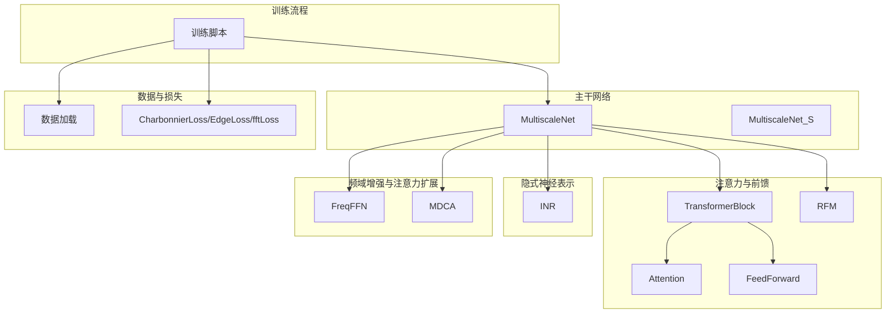
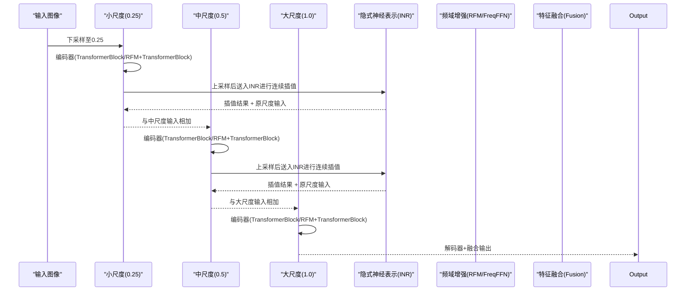
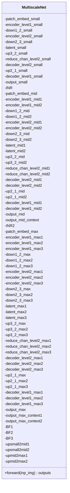
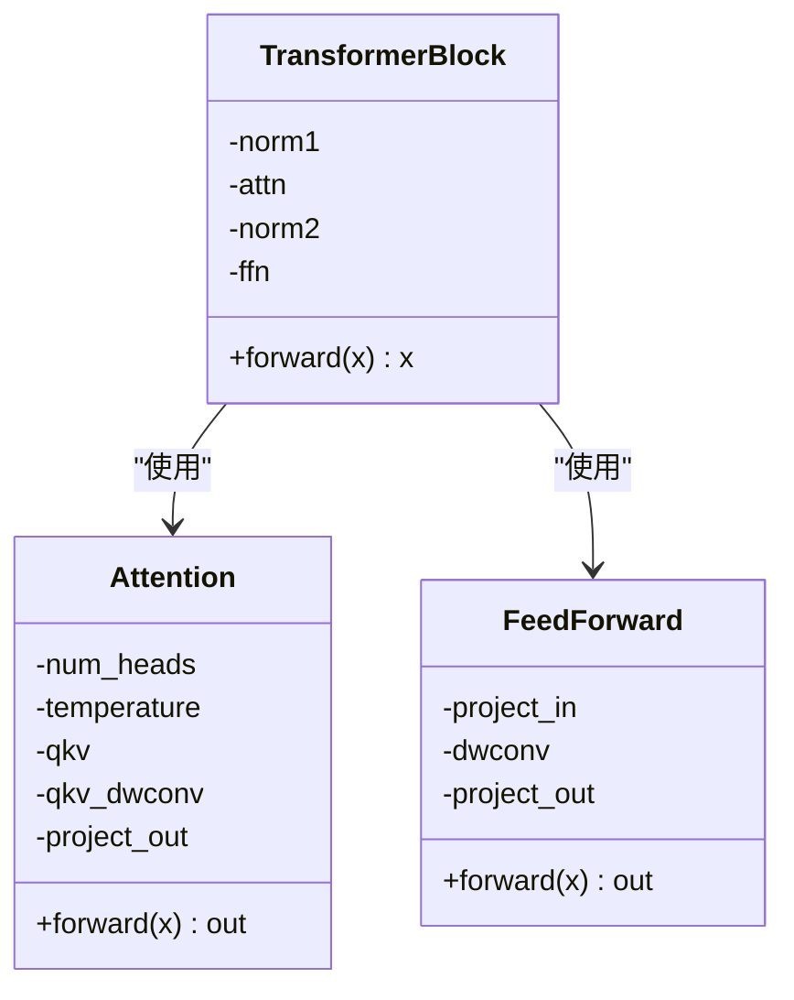
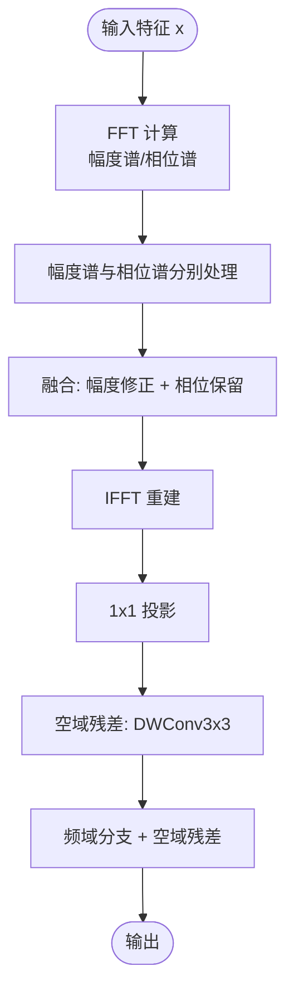
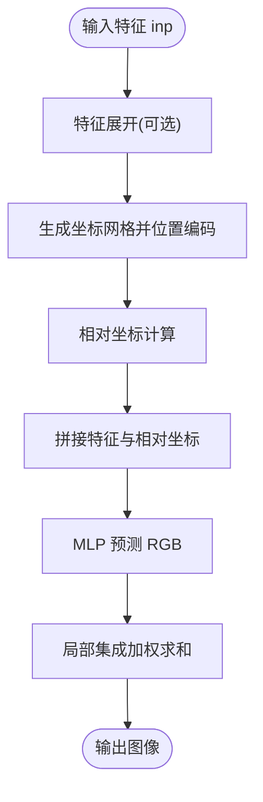
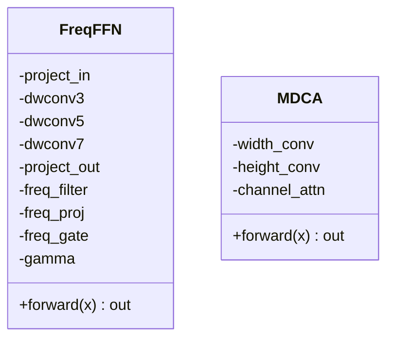
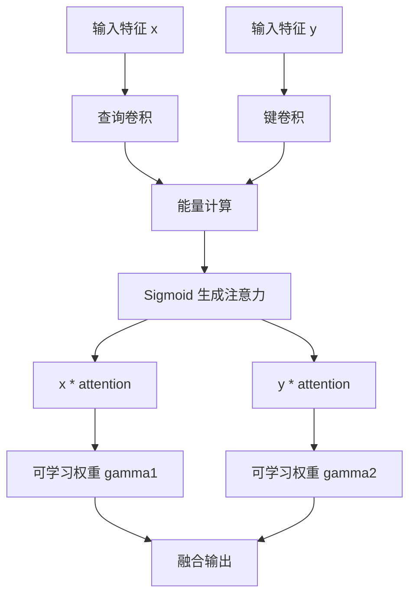
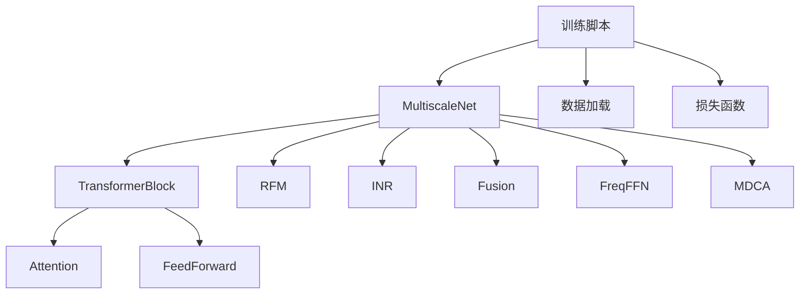

# 核心架构设计

<cite>
**本文档引用的文件**
- [model.py](file://model.py)
- [model_S.py](file://model_S.py)
- [layers.py](file://layers.py)
- [attssm_modules.py](file://attssm_modules.py)
- [mlp.py](file://mlp.py)
- [losses.py](file://losses.py)
- [train.py](file://train.py)
- [README.md](file://README.md)
- [Ablations/model_M222.py](file://Ablations/model_M222.py)
- [Ablations/model_M321.py](file://Ablations/model_M321.py)
- [Ablations/model_M023.py](file://Ablations/model_M023.py)
</cite>

## 目录
1. [简介](#简介)
2. [项目结构](#项目结构)
3. [核心组件](#核心组件)
4. [架构总览](#架构总览)
5. [详细组件分析](#详细组件分析)
6. [依赖关系分析](#依赖关系分析)
7. [性能考虑](#性能考虑)
8. [故障排除指南](#故障排除指南)
9. [结论](#结论)

## 简介
NeRD-Rain 是一个基于双向多尺度隐式神经表示的图像去雨网络，其核心设计理念是将Transformer与隐式神经表示（INR）相结合，在多尺度空间中进行特征提取与融合，并引入频域增强模块（RFM）以提升去雨效果。该架构通过三层多尺度特征提取（小尺度0.25、中尺度0.5、大尺度1.0），结合TransformerBlock注意力模块、频域门控双域前馈网络（FreqFFN）以及多维通道注意力（MDCA），实现了从低分辨率到高分辨率的渐进式去雨过程，并在不同尺度之间进行信息融合与位置编码增强。

## 项目结构
NeRD-Rain 项目的代码组织围绕以下关键模块展开：
- 主干网络：MultiscaleNet（含标准版本与简化版本）
- 注意力与前馈模块：TransformerBlock、Attention、FeedForward
- 频域增强模块：RFM（Residual Fourier Module）
- 隐式神经表示：INR（Implicit Neural Representation）
- 模块扩展：FreqFFN（频域门控双域FFN）、MDCA（多维通道注意力）
- 数据与损失：数据加载、损失函数（CharbonnierLoss、EdgeLoss、fftLoss）
- 训练流程：训练脚本、参数统计工具

图表来源
- [model.py:303-673](file://model.py#L303-L673)
- [model_S.py:233-603](file://model_S.py#L233-L603)
- [attssm_modules.py:79-295](file://attssm_modules.py#L79-L295)
- [mlp.py:41-151](file://mlp.py#L41-L151)
- [losses.py:5-52](file://losses.py#L5-L52)
- [train.py:10-218](file://train.py#L10-L218)

章节来源
- [README.md:1-121](file://README.md#L1-L121)
- [model.py:1-673](file://model.py#L1-L673)
- [model_S.py:1-603](file://model_S.py#L1-L603)

## 核心组件
本节概述NeRD-Rain中的关键组件及其职责：
- MultiscaleNet：主干网络，包含三层多尺度编码器-解码器结构，负责从0.25到1.0的多尺度特征提取与融合。
- TransformerBlock：基于注意力与前馈网络的残差模块，提供跨通道的长程依赖建模。
- Attention：多头自注意力，采用归一化查询键并带温度缩放。
- FeedForward：双分支前馈网络，包含深度可分离卷积与门控机制。
- RFM：频域残差增强模块，利用FFT/IFFT与幅度-相位谱处理，融合空域残差。
- INR：隐式神经表示，通过位置编码与局部集成实现连续空间插值。
- FreqFFN：频域门控双域前馈网络，空域+频域并行，频率门控自适应融合。
- MDCA：多维通道注意力，叠加宽度、高度、通道维度注意力，增强特征表达。
- Fusion：交叉特征融合模块，基于注意力权重的加权融合。
- 数据与损失：提供图像金字塔构建、多任务损失组合与训练流程。

章节来源
- [model.py:195-236](file://model.py#L195-L236)
- [model.py:161-193](file://model.py#L161-L193)
- [model.py:97-116](file://model.py#L97-L116)
- [model.py:118-159](file://model.py#L118-L159)
- [mlp.py:41-151](file://mlp.py#L41-L151)
- [attssm_modules.py:79-295](file://attssm_modules.py#L79-L295)
- [layers.py:201-231](file://layers.py#L201-L231)
- [losses.py:5-52](file://losses.py#L5-L52)

## 架构总览
NeRD-Rain 的整体架构遵循“双向多尺度”的设计原则，即同时在多个尺度上进行特征提取与融合，并通过隐式神经表示实现连续空间插值与位置编码增强。具体流程如下：
- 输入图像经多尺度下采样（0.25、0.5、1.0）得到三组尺度的特征。
- 每个尺度分别经过编码器（多层TransformerBlock或RFM+TransformerBlock）提取高层语义特征。
- 通过上采样与跳跃连接进行解码重构，并在中尺度与大尺度之间进行跨尺度融合。
- 在每个尺度的潜在特征上应用INR进行连续空间插值，增强细节恢复能力。
- 使用频域增强模块（如RFM或FreqFFN）与多维通道注意力（MDCA）进一步提升去雨效果。

图表来源
- [model.py:486-673](file://model.py#L486-L673)
- [mlp.py:129-141](file://mlp.py#L129-L141)
- [attssm_modules.py:165-220](file://attssm_modules.py#L165-L220)

章节来源
- [model.py:303-673](file://model.py#L303-L673)

## 详细组件分析

### MultiscaleNet 主网络设计
MultiscaleNet 采用三层多尺度特征提取机制，分别对应小尺度（0.25）、中尺度（0.5）与大尺度（1.0）。每层均包含编码器（Encoder）、潜在特征（Latent）、解码器（Decoder）与上采样/下采样模块。在每个尺度的潜在特征上，通过INR进行连续空间插值，并与原尺度输入进行残差融合，从而增强细节恢复能力。此外，网络在大尺度瓶颈处引入了频域增强模块（RFM 或 FreqFFN）与多维通道注意力（MDCA），以提升去雨性能。

图表来源
- [model.py:303-485](file://model.py#L303-L485)

章节来源
- [model.py:303-673](file://model.py#L303-L673)

### TransformerBlock 注意力模块
TransformerBlock 由注意力模块（Attention）与前馈网络（FeedForward）组成，均采用残差连接形式。注意力模块通过多头自注意力计算注意力权重，并在残差连接中与输入特征相加；前馈网络采用双分支结构，包含深度可分离卷积与门控机制，进一步增强非线性表达能力。

图表来源
- [model.py:195-209](file://model.py#L195-L209)
- [model.py:161-193](file://model.py#L161-L193)
- [model.py:97-116](file://model.py#L97-L116)

章节来源
- [model.py:195-236](file://model.py#L195-L236)

### RFM 频域增强模块
RFM（Residual Fourier Module）通过FFT/IFFT对输入特征进行频域处理，分别对幅度谱与相位谱进行卷积处理，然后以修正后的幅度与原始相位重建复数频谱，再进行IFFT得到频域增强特征。随后与空域残差（深度可分离卷积）相加，形成最终输出。该模块能够有效捕捉高频细节并增强去雨效果。

图表来源
- [model.py:118-159](file://model.py#L118-L159)

章节来源
- [model.py:118-159](file://model.py#L118-L159)

### INR 隐式神经表示与位置编码
INR 通过位置编码与局部集成实现连续空间插值。位置编码采用正弦余弦编码，将坐标映射到高维空间，增强模型对空间位置的感知能力。局部集成通过对相邻坐标的加权平均实现平滑插值，提高细节恢复质量。

图表来源
- [mlp.py:129-141](file://mlp.py#L129-L141)
- [mlp.py:57-127](file://mlp.py#L57-L127)

章节来源
- [mlp.py:41-151](file://mlp.py#L41-L151)

### FreqFFN 与 MDCA 模块
FreqFFN 将空域与频域分支并行处理，并通过频率门控（FGM）自适应融合。空域分支采用多尺度深度可分离卷积与GeLU门控；频域分支对输入进行补零到patch大小，执行rfft2，通过可学习滤波器处理后irfft2还原；最后通过门控图控制频域分支的贡献。MDCA 在Transposed Attention基础上叠加宽度、高度、通道维度注意力，以几乎零开销增强特征表达。

图表来源
- [attssm_modules.py:79-220](file://attssm_modules.py#L79-L220)
- [attssm_modules.py:248-295](file://attssm_modules.py#L248-L295)

章节来源
- [attssm_modules.py:79-295](file://attssm_modules.py#L79-L295)

### 特征融合模块 Fusion
Fusion 模块通过查询-键注意力计算能量，生成注意力权重并对特征进行加权融合，随后通过可学习权重向量控制融合比例，实现跨尺度特征的有效融合。

图表来源
- [layers.py:201-231](file://layers.py#L201-L231)

章节来源
- [layers.py:201-231](file://layers.py#L201-L231)

## 依赖关系分析
NeRD-Rain 的模块间依赖关系清晰且层次分明：
- MultiscaleNet 依赖于 TransformerBlock、Attention、FeedForward、RFM、INR、Fusion 等基础模块。
- FreqFFN 与 MDCA 作为可选增强模块，可在特定层替换或并行加入。
- 数据与损失模块为训练提供支撑，包括数据加载、损失函数与优化器调度。

图表来源
- [model.py:303-673](file://model.py#L303-L673)
- [attssm_modules.py:79-295](file://attssm_modules.py#L79-L295)
- [train.py:10-218](file://train.py#L10-L218)

章节来源
- [model.py:303-673](file://model.py#L303-L673)
- [attssm_modules.py:79-295](file://attssm_modules.py#L79-L295)
- [train.py:10-218](file://train.py#L10-L218)

## 性能考虑
- 计算复杂度：MultiscaleNet 采用多尺度编码器-解码器结构，层数与通道数随尺度递增，导致计算量呈指数增长。建议在资源受限环境下适当减少层数或通道数。
- 内存占用：INR 与频域处理（FFT/IFFT）会显著增加内存占用，特别是在高分辨率输入时。可通过降低输入分辨率或减少频域滤波器数量缓解。
- 训练稳定性：使用Warmup学习率调度与多任务损失（CharbonnierLoss、EdgeLoss、fftLoss）有助于稳定训练过程，避免梯度爆炸或收敛缓慢。
- 模型规模：标准版本（model.py）与简化版本（model_S.py）在参数数量与计算复杂度上存在差异，可根据实际需求选择合适版本。

## 故障排除指南
- 训练不收敛或性能不佳：检查损失函数权重设置与学习率调度是否合理；确认数据预处理与图像金字塔构建正确。
- 显存不足：降低批大小、输入分辨率或减少网络层数；确保GPU驱动与CUDA版本兼容。
- 频域处理异常：确认FFT/IFFT维度与补零策略一致；检查频域滤波器初始化与归一化设置。
- INR 插值异常：验证位置编码维度与局部集成权重计算；确保坐标网格与特征尺寸匹配。

章节来源
- [losses.py:5-52](file://losses.py#L5-L52)
- [train.py:10-218](file://train.py#L10-L218)

## 结论
NeRD-Rain 通过双向多尺度隐式神经表示与Transformer注意力机制的结合，实现了从低分辨率到高分辨率的渐进式去雨过程。RFM 与 FreqFFN 提供了强大的频域增强能力，MDCA 则在通道维度上进一步提升了特征表达。INR 的位置编码与局部集成使得模型能够在连续空间中进行高质量插值，显著改善去雨细节。该架构在多个数据集上取得了优异的性能表现，为图像去雨任务提供了新的技术路径。