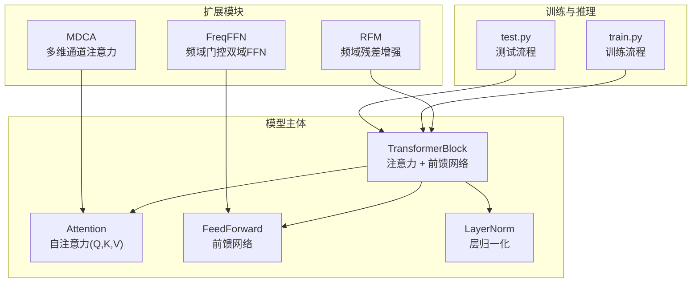
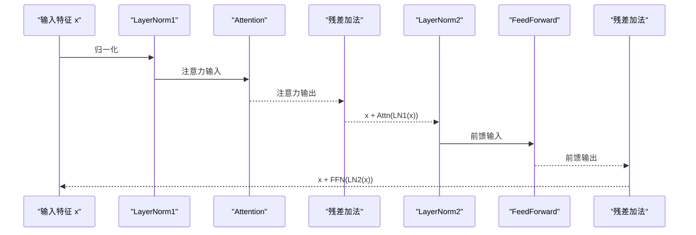
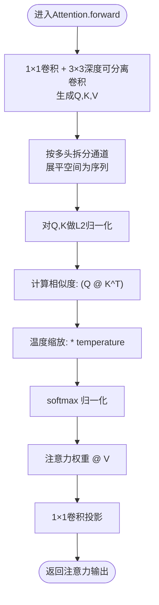
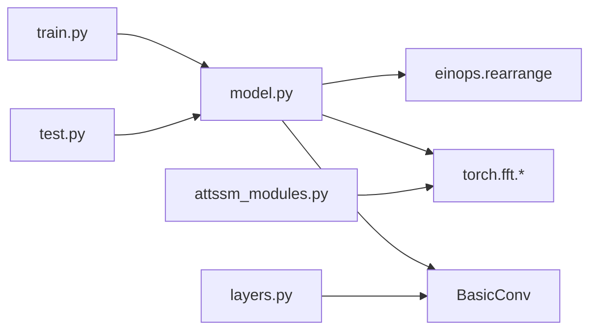

# 注意力机制模块

<cite>
**本文档引用的文件**
- [model.py](file://model.py)
- [attssm_modules.py](file://attssm_modules.py)
- [layers.py](file://layers.py)
- [mlp.py](file://mlp.py)
- [train.py](file://train.py)
- [test.py](file://test.py)
- [README.md](file://README.md)
</cite>

## 目录
1. [简介](#简介)
2. [项目结构](#项目结构)
3. [核心组件](#核心组件)
4. [架构总览](#架构总览)
5. [详细组件分析](#详细组件分析)
6. [依赖关系分析](#依赖关系分析)
7. [性能考量](#性能考量)
8. [故障排查指南](#故障排查指南)
9. [结论](#结论)
10. [附录](#附录)

## 简介
本文件聚焦于NeRD-Rain项目中的注意力机制模块，系统梳理TransformerBlock的设计原理与实现细节，深入解析Attention类的自注意力机制（QKV分解、温度缩放、归一化）、多头注意力设计、残差连接与前馈网络的结合方式。同时，结合项目中频域门控FFN与多维通道注意力等扩展模块，说明注意力如何帮助网络关注图像中的重要特征区域，从而提升去雨性能，并给出注意力权重计算的数学公式与代码实现映射、可视化与特征重要性分析方法。

## 项目结构
NeRD-Rain采用多尺度编码器-解码器架构，注意力机制嵌入在TransformerBlock中，配合频域增强模块与隐式神经表示（INR）进行端到端训练与推理。训练脚本负责数据加载、损失函数组合与优化调度；测试脚本负责窗口化推理与结果保存。

图表来源
- [model.py:195-208](file://model.py#L195-L208)
- [model.py:161-192](file://model.py#L161-L192)
- [model.py:97-115](file://model.py#L97-L115)
- [attssm_modules.py:79-220](file://attssm_modules.py#L79-L220)
- [attssm_modules.py:248-294](file://attssm_modules.py#L248-L294)
- [train.py:72-163](file://train.py#L72-L163)
- [test.py:31-68](file://test.py#L31-L68)

章节来源
- [model.py:195-208](file://model.py#L195-L208)
- [train.py:72-163](file://train.py#L72-L163)
- [test.py:31-68](file://test.py#L31-L68)

## 核心组件
- TransformerBlock：将注意力与前馈网络按残差形式串联，分别在LN后进行，保证稳定性与表达能力。
- Attention：实现自注意力，包含QKV分解、温度缩放、归一化与输出投影。
- FeedForward：基于深度可分离卷积的前馈网络，增强通道非线性与上下文建模。
- LayerNorm：支持带偏置与无偏置两种类型，配合einops进行时空重排。
- RFM：频域残差增强模块，与TransformerBlock并行于瓶颈处，提升高频细节恢复。
- FreqFFN：频域门控双域FFN，空域+频域并行，频率门控自适应融合。
- MDCA：多维通道注意力，在Transposed Attention基础上叠加宽/高/通道三维注意力。

章节来源
- [model.py:195-208](file://model.py#L195-L208)
- [model.py:161-192](file://model.py#L161-L192)
- [model.py:97-115](file://model.py#L97-L115)
- [model.py:48-95](file://model.py#L48-L95)
- [model.py:118-159](file://model.py#L118-L159)
- [attssm_modules.py:79-220](file://attssm_modules.py#L79-L220)
- [attssm_modules.py:248-294](file://attssm_modules.py#L248-L294)

## 架构总览
下图展示注意力机制在TransformerBlock中的位置与数据流，以及与前馈网络、残差连接的关系。

图表来源
- [model.py:195-208](file://model.py#L195-L208)

## 详细组件分析

### TransformerBlock设计原理
- 结构组成：LN1 → Attention → 残差加法 → LN2 → FeedForward → 残差加法。
- 作用机制：先通过注意力捕获通道与空间间的长程依赖，再通过前馈网络进行通道维度的非线性变换与上下文聚合；残差连接有助于梯度稳定与深层网络训练。
- 与RFM结合：在瓶颈层引入并行的RFM分支，进一步增强高频细节恢复。

章节来源
- [model.py:195-208](file://model.py#L195-L208)
- [model.py:211-235](file://model.py#L211-L235)

### Attention类实现细节
- QKV分解：
  - 使用1×1卷积生成Q、K、V，随后通过3×3深度可分离卷积增强感受野。
  - 将通道维按多头数拆分，将空间展平为序列，便于矩阵运算。
- 温度缩放：
  - 引入可学习的温度参数，对点积相似度进行缩放，缓解softmax饱和问题。
- 归一化：
  - 对Q、K在最后一个维度进行归一化，提升数值稳定性与注意力分布的合理性。
- 注意力权重与输出：
  - 计算相似度矩阵并softmax归一化得到注意力权重。
  - 使用注意力权重对V加权求和，再经1×1卷积投影回原通道数。

图表来源
- [model.py:161-192](file://model.py#L161-L192)

章节来源
- [model.py:161-192](file://model.py#L161-L192)

### 多头注意力与温度缩放
- 多头设计：将通道维划分为多个头，每头独立计算注意力，最后拼接并投影，提升并行建模能力与表达多样性。
- 温度缩放：通过可学习的temperature参数控制softmax的集中程度，避免点积过大导致梯度消失或过小导致软化。

章节来源
- [model.py:161-192](file://model.py#L161-L192)

### 前馈网络与残差连接
- 前馈网络：使用1×1升维、3×3深度可分离卷积、GELU门控与1×1降维，形成空洞卷积风格的高效通道混合。
- 残差连接：注意力与前馈网络均以残差形式接入，有利于深层网络训练与特征累积。

章节来源
- [model.py:97-115](file://model.py#L97-L115)
- [model.py:195-208](file://model.py#L195-L208)

### 频域增强与注意力扩展
- RFM（频域残差增强）：在瓶颈层并行加入频域分支，修正幅度谱并保留相位重建，再与空域残差相加，提升高频细节恢复。
- FreqFFN（频域门控双域FFN）：空域多尺度DWConv+GeLU门控，频域patch-wise FFT+可学习滤波+irfft2，频率门控自适应融合，参数高效且效果显著。
- MDCA（多维通道注意力）：在Transposed Attention输出上叠加宽/高/通道三维注意力，几乎零开销增强特征表达。

章节来源
- [model.py:118-159](file://model.py#L118-L159)
- [attssm_modules.py:79-220](file://attssm_modules.py#L79-L220)
- [attssm_modules.py:248-294](file://attssm_modules.py#L248-L294)

## 依赖关系分析
- 模块内聚与耦合：
  - TransformerBlock内部通过残差连接耦合注意力与前馈网络，降低跨模块依赖。
  - Attention与FeedForward各自职责清晰，便于替换与扩展。
- 外部依赖：
  - einops用于张量重排（to_3d/to_4d），简化注意力计算中的形状操作。
  - torch.fft用于频域模块（如RFM与FreqFFN），实现快速频域变换。
  - BasicConv提供深度可分离卷积与归一化选项，统一卷积构建模式。

图表来源
- [model.py:5](file://model.py#L5)
- [model.py:145](file://model.py#L145)
- [layers.py:12-38](file://layers.py#L12-L38)
- [train.py:20](file://train.py#L20)
- [test.py:8](file://test.py#L8)

章节来源
- [model.py:5](file://model.py#L5)
- [model.py:145](file://model.py#L145)
- [layers.py:12-38](file://layers.py#L12-L38)
- [train.py:20](file://train.py#L20)
- [test.py:8](file://test.py#L8)

## 性能考量
- 计算复杂度：
  - 注意力复杂度与序列长度成平方关系，空间展平后为O((H×W)^2)，可通过多头并行与温度缩放缓解。
  - FreqFFN的patch-wise FFT在大分辨率下需注意内存与时间开销，建议合理设置patch大小。
- 内存与显存：
  - 多尺度网络与INR在推理时可能占用较多显存，测试脚本提供窗口化分割策略以降低显存峰值。
- 训练稳定性：
  - LayerNorm与残差连接有助于深层网络收敛；温度缩放与Q/K归一化提升数值稳定性。

[本节为通用性能讨论，不直接分析具体文件]

## 故障排查指南
- 训练不收敛或发散：
  - 检查学习率调度与warmup配置，确认损失函数组合是否合理。
  - 关注温度参数初始化与LayerNorm类型选择。
- 显存不足：
  - 使用测试脚本的窗口化推理策略，或减小批大小与分辨率。
- 频域模块异常：
  - 确认输入尺寸与频域patch大小的对齐关系，必要时进行padding处理。

章节来源
- [train.py:83-88](file://train.py#L83-L88)
- [train.py:156-163](file://train.py#L156-L163)
- [test.py:58-60](file://test.py#L58-L60)
- [attssm_modules.py:155-163](file://attssm_modules.py#L155-L163)

## 结论
NeRD-Rain的注意力机制通过TransformerBlock将自注意力与前馈网络有机结合，辅以残差连接与层归一化，形成稳定的特征提取单元。在此基础上，频域增强模块（RFM、FreqFFN）与多维通道注意力（MDCA）进一步提升了对高频细节与多维特征的关注能力，使网络能够更有效地聚焦图像中的重要特征区域，从而显著提升去雨性能。该模块设计兼顾效率与表达力，适合在多尺度图像恢复任务中推广使用。

[本节为总结性内容，不直接分析具体文件]

## 附录

### 数学公式与代码映射
- QKV分解与多头展开：
  - 输入x经1×1卷积与3×3深度可分离卷积得到Q、K、V，随后按多头数拆分通道并展平空间为序列。
  - 代码路径：[model.py:167-179](file://model.py#L167-L179)
- 归一化与相似度计算：
  - 对Q、K进行L2归一化，计算相似度矩阵QK^T。
  - 代码路径：[model.py:181-184](file://model.py#L181-L184)
- 温度缩放与softmax：
  - 将相似度乘以温度参数，再进行softmax归一化。
  - 代码路径：[model.py:184-185](file://model.py#L184-L185)
- 注意力加权与投影：
  - 使用注意力权重对V加权求和，再经1×1卷积投影。
  - 代码路径：[model.py:187-191](file://model.py#L187-L191)

章节来源
- [model.py:161-192](file://model.py#L161-L192)

### 注意力可视化与特征重要性分析方法
- 注意力权重可视化：
  - 在推理阶段保存注意力权重张量（例如在Attention.forward中临时记录attn），将其归一化并热力图显示。
  - 可视化目标：关注雨线区域与干净区域的注意力差异，验证网络对重要特征的关注程度。
- 特征重要性分析：
  - 通过扰动不同通道或空间位置，观察输出变化评估特征重要性。
  - 结合MDCA输出，分析宽/高/通道注意力对最终特征表达的贡献。

[本节为通用方法指导，不直接分析具体文件]