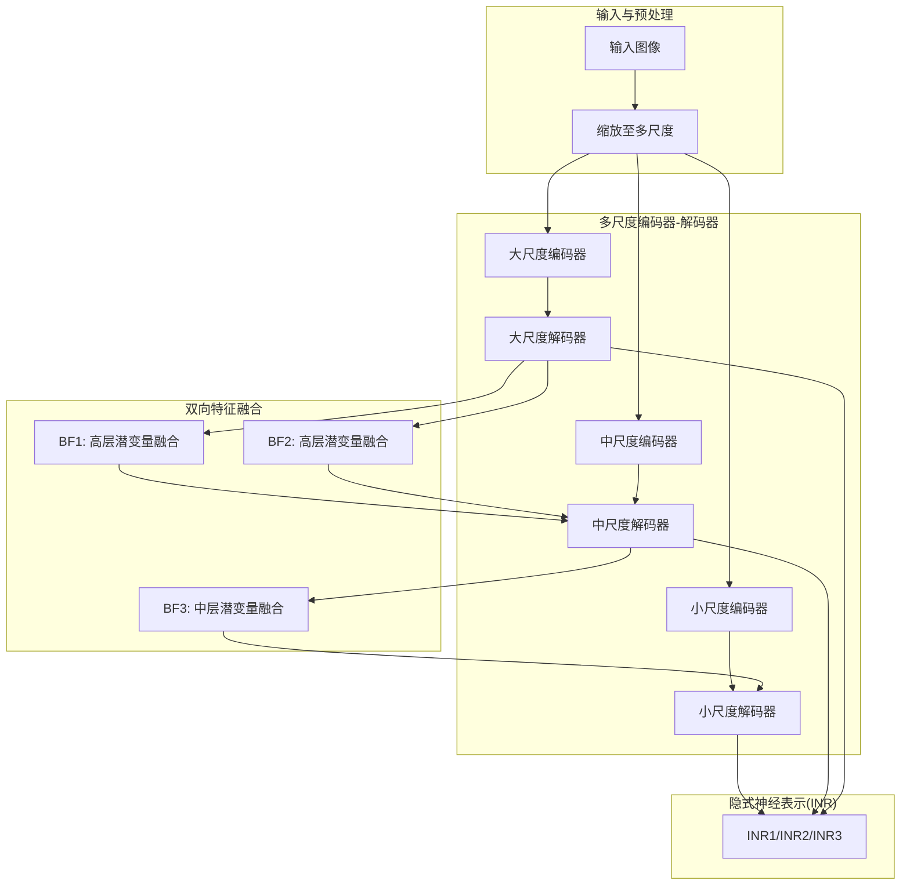
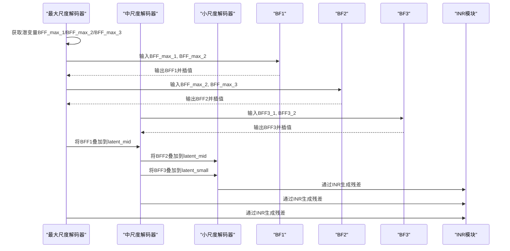
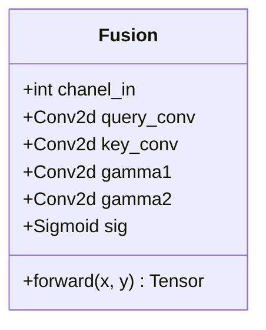
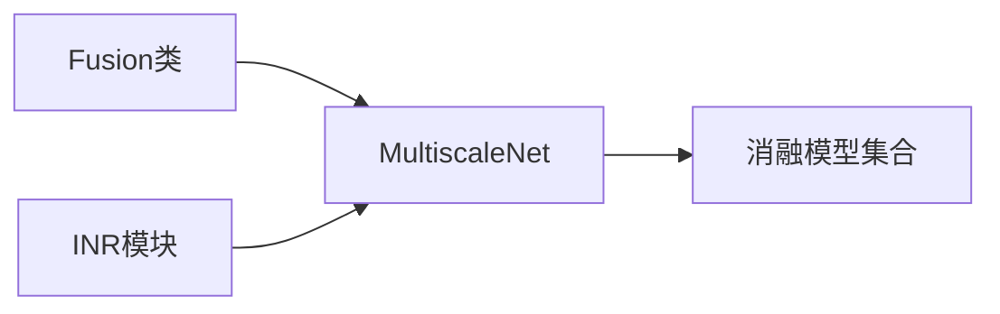

# 特征融合模块

<cite>
**本文引用的文件**
- [model.py](file://model.py)
- [mlp.py](file://mlp.py)
- [Ablations/model_M023.py](file://Ablations/model_M023.py)
- [Ablations/model_MPRNet.py](file://Ablations/model_MPRNet.py)
- [Ablations/model_a.py](file://Ablations/model_a.py)
- [Ablations/model_b.py](file://Ablations/model_b.py)
- [Ablations/model_woBFPU.py](file://Ablations/model_woBFPU.py)
- [Ablations/model_wConcat.py](file://Ablations/model_wConcat.py)
- [README.md](file://README.md)
</cite>

## 目录
1. [简介](#简介)
2. [项目结构](#项目结构)
3. [核心组件](#核心组件)
4. [架构总览](#架构总览)
5. [详细组件分析](#详细组件分析)
6. [依赖关系分析](#依赖关系分析)
7. [性能考量](#性能考量)
8. [故障排查指南](#故障排查指南)
9. [结论](#结论)
10. [附录](#附录)

## 简介
本文件聚焦于NeRD-Rain项目中“双向特征融合（BF）”模块的设计与实现，系统阐述BF1、BF2、BF3三个融合模块在多尺度金字塔中的作用与交互机制；深入解析Fusion类的实现原理，包括查询-键-能量计算、注意力权重生成与特征调制过程；说明融合权重gamma的计算方式与sigmoid激活函数的作用；阐释双向特征传播如何从低级到高级再到低级的特征传递，以提升去雨的全局一致性；最后给出融合过程的可视化与效果分析方法，并总结与其他模块的协同工作机制。

## 项目结构
NeRD-Rain采用多尺度隐式神经表示（Implicit Neural Representation, INR）与双向特征融合相结合的架构。主干网络MultiscaleNet在不同分辨率下构建编码器-解码器路径，并在高层潜变量上引入双向特征融合模块BF1/BF2/BF3，以实现跨尺度信息互补与增强。INR模块负责将深层特征映射回像素空间，参与残差学习，进一步提升去雨质量。

图示来源
- [model.py:303-673](file://model.py#L303-L673)
- [Ablations/model_MPRNet.py:293-634](file://Ablations/model_MPRNet.py#L293-L634)
- [Ablations/model_M023.py:228-585](file://Ablations/model_M023.py#L228-L585)
- [mlp.py:41-151](file://mlp.py#L41-L151)

章节来源
- [model.py:303-673](file://model.py#L303-L673)
- [Ablations/model_MPRNet.py:293-634](file://Ablations/model_MPRNet.py#L293-L634)
- [Ablations/model_M023.py:228-585](file://Ablations/model_M023.py#L228-L585)
- [mlp.py:41-151](file://mlp.py#L41-L151)

## 核心组件
- Fusion类：实现双向特征融合的核心模块，包含查询卷积、键卷积、注意力生成与gamma调制等步骤。
- 多尺度网络MultiscaleNet：在小、中、大三尺度分别构建编码器-解码器路径，并在高层潜变量处引入BF1/BF2，在中层潜变量处引入BF3。
- INR模块：将深层特征映射回像素空间，参与残差学习，提升去雨质量。

章节来源
- [model.py:272-301](file://model.py#L272-L301)
- [model.py:303-673](file://model.py#L303-L673)
- [mlp.py:41-151](file://mlp.py#L41-L151)

## 架构总览
双向特征融合在多尺度金字塔中的传递机制如下：
- 高层潜变量BFF_max_1、BFF_max_2、BFF_max_3分别来自最大尺度解码器的潜变量；
- BF1对BFF_max_1与BFF_max_2进行融合，并经插值后与中层潜变量latent_mid相加；
- BF2对BFF_max_2与BFF_max_3进行融合，并经插值后与中层潜变量latent_mid相加；
- BF3对BFF3_1与BFF3_2进行融合，并经插值后与小层潜变量latent_small相加；
- 通过双向传播，低级特征逐步增强高级特征，高级特征再反馈到低级特征，形成全局一致的去雨结果。

图示来源
- [model.py:486-673](file://model.py#L486-L673)
- [Ablations/model_MPRNet.py:446-634](file://Ablations/model_MPRNet.py#L446-L634)
- [Ablations/model_M023.py:406-585](file://Ablations/model_M023.py#L406-L585)
- [mlp.py:129-141](file://mlp.py#L129-L141)

## 详细组件分析

### Fusion类实现机制
Fusion类实现了双向特征融合的关键步骤：
- 查询-键-能量计算：对两个输入特征分别通过卷积得到查询与键，计算能量项；
- 注意力权重生成：使用sigmoid激活函数将能量项归一化为注意力权重；
- 特征调制：将注意力权重应用于原特征，得到调制后的特征；
- gamma调制：对拼接后的特征与注意力特征进行卷积，得到gamma权重，用于线性组合两个特征；
- 最终输出：将两个调制后的特征相加，实现双向融合。

图示来源
- [model.py:272-301](file://model.py#L272-L301)

章节来源
- [model.py:272-301](file://model.py#L272-L301)

### BF1、BF2、BF3的作用与应用场景
- BF1：在最大尺度解码器阶段，融合相邻层级的潜变量，增强高层语义信息的互补性，为中尺度提供更强的上下文先验。
- BF2：在最大尺度解码器阶段，融合中间层级的潜变量，进一步加强高层特征的稳定性与一致性，便于后续中尺度融合。
- BF3：在中尺度解码器阶段，融合同一层级的两个潜变量，实现跨尺度信息的互补与增强，提升小尺度细节恢复能力。

章节来源
- [model.py:476-478](file://model.py#L476-L478)
- [Ablations/model_MPRNet.py:436-438](file://Ablations/model_MPRNet.py#L436-L438)
- [Ablations/model_M023.py:395-397](file://Ablations/model_M023.py#L395-L397)

### 融合权重gamma的计算方式与sigmoid激活函数的作用
- gamma计算：对拼接后的特征与注意力特征进行卷积，得到gamma权重，用于线性组合两个特征，实现自适应的特征融合比例。
- sigmoid激活：将能量项映射到(0,1)区间，作为注意力权重，确保融合过程的稳定性和可解释性。

章节来源
- [model.py:280-282](file://model.py#L280-L282)
- [model.py:287-288](file://model.py#L287-L288)

### 双向特征传播与全局一致性
- 从低级到高级：小尺度特征经INR生成残差并与输入相加，形成中级特征；中级特征再经INR生成残差并与输入相加，形成高级特征。
- 从高级到低级：BF1/BF2将高层潜变量融合后的特征插值并叠加到中层潜变量，BF3将中层潜变量融合后的特征插值并叠加到小层潜变量。
- 全局一致性：通过双向传播，低级细节与高级语义相互增强，减少去雨过程中的伪影与不连续现象。

章节来源
- [model.py:505-506](file://model.py#L505-L506)
- [model.py:525-526](file://model.py#L525-L526)
- [model.py:586-587](file://model.py#L586-L587)
- [model.py:613-614](file://model.py#L613-L614)
- [model.py:620-621](file://model.py#L620-L621)

### 融合过程的可视化与效果分析方法
- 可视化建议：对BFF1、BFF2、BFF3的插值结果与叠加前后的潜变量进行对比显示，观察跨尺度信息互补效果。
- 效果评估：结合PSNR/SSIM指标与主观视觉效果，评估融合模块对去雨质量的提升程度。

章节来源
- [README.md:72-81](file://README.md#L72-L81)

## 依赖关系分析
- Fusion类依赖于PyTorch的卷积与激活函数模块；
- MultiscaleNet依赖于Fusion类与INR模块；
- 不同消融模型（如model_M023、model_MPRNet、model_a、model_b、model_woBFPU、model_wConcat）展示了BF模块在不同架构中的应用与影响。

图示来源
- [model.py:272-301](file://model.py#L272-L301)
- [model.py:303-673](file://model.py#L303-L673)
- [mlp.py:41-151](file://mlp.py#L41-L151)
- [Ablations/model_M023.py:228-585](file://Ablations/model_M023.py#L228-L585)
- [Ablations/model_MPRNet.py:293-634](file://Ablations/model_MPRNet.py#L293-L634)
- [Ablations/model_a.py:500-603](file://Ablations/model_a.py#L500-L603)
- [Ablations/model_b.py:400-599](file://Ablations/model_b.py#L400-L599)
- [Ablations/model_woBFPU.py:198-230](file://Ablations/model_woBFPU.py#L198-L230)
- [Ablations/model_wConcat.py:198-230](file://Ablations/model_wConcat.py#L198-L230)

章节来源
- [model.py:272-301](file://model.py#L272-L301)
- [model.py:303-673](file://model.py#L303-L673)
- [mlp.py:41-151](file://mlp.py#L41-L151)
- [Ablations/model_M023.py:228-585](file://Ablations/model_M023.py#L228-L585)
- [Ablations/model_MPRNet.py:293-634](file://Ablations/model_MPRNet.py#L293-L634)
- [Ablations/model_a.py:500-603](file://Ablations/model_a.py#L500-L603)
- [Ablations/model_b.py:400-599](file://Ablations/model_b.py#L400-L599)
- [Ablations/model_woBFPU.py:198-230](file://Ablations/model_woBFPU.py#L198-L230)
- [Ablations/model_wConcat.py:198-230](file://Ablations/model_wConcat.py#L198-L230)

## 性能考量
- 计算复杂度：Fusion类的卷积与注意力计算在特征维度较高时会增加计算开销，需根据硬件条件调整通道数与核大小。
- 内存占用：多尺度解码器与INR模块的组合可能带来显存压力，可通过降低分辨率或减小通道数缓解。
- 收敛速度：双向特征融合有助于提升训练稳定性，加速收敛；但需注意gamma调制参数的初始化与学习率设置。

## 故障排查指南
- 融合无效：若发现BF模块未生效，检查BF1/BF2/BF3是否正确连接到对应潜变量，并确认插值与叠加操作的顺序。
- 数值不稳定：若出现NaN或梯度爆炸，检查sigmoid与gamma卷积的数值范围，适当调整学习率与正则化策略。
- 显存不足：降低通道数或使用混合精度训练；必要时减少多尺度层数。

章节来源
- [Ablations/model_woBFPU.py:519-550](file://Ablations/model_woBFPU.py#L519-L550)
- [Ablations/model_wConcat.py:202-230](file://Ablations/model_wConcat.py#L202-L230)

## 结论
双向特征融合（BF1/BF2/BF3）通过查询-键-能量计算与注意力调制，实现了跨尺度信息的互补与增强；借助gamma调制与sigmoid激活，融合过程具备良好的稳定性与可解释性；双向特征传播从低级到高级再到低级，有效提升了去雨的全局一致性与细节恢复能力。与其他模块（如INR与多尺度解码器）协同工作，显著改善了去雨效果。

## 附录
- 参考文献与模型链接见项目README。
- 更多消融实验与可视化结果可在Ablations目录与README中查阅。

章节来源
- [README.md:105-121](file://README.md#L105-L121)