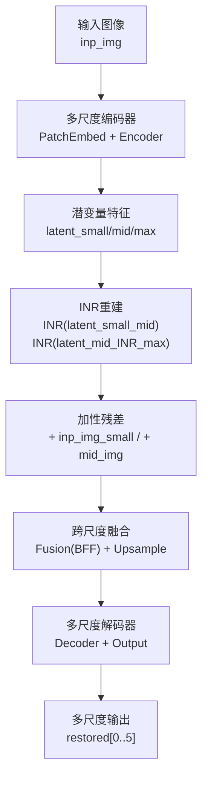
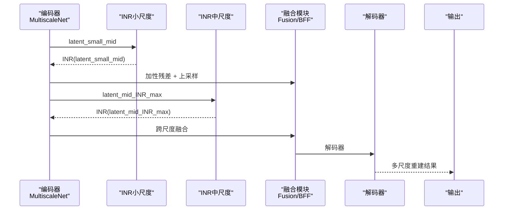
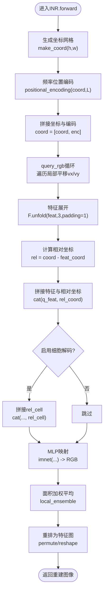
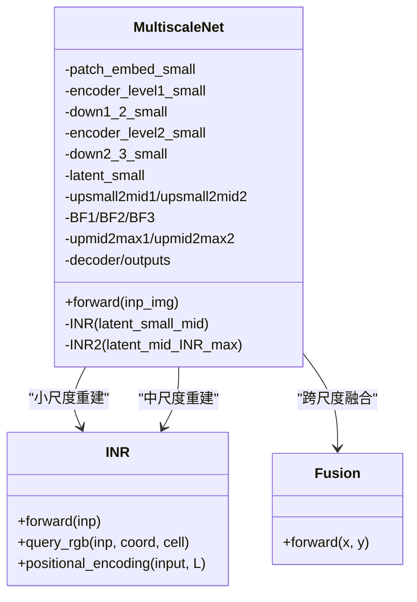
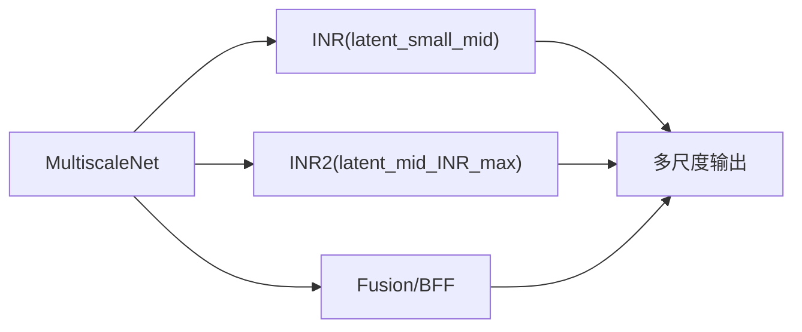

# 神经隐式表示模块

<cite>
**本文引用的文件列表**
- [model.py](file://model.py)
- [mlp.py](file://mlp.py)
- [layers.py](file://layers.py)
- [attssm_modules.py](file://attssm_modules.py)
- [losses.py](file://losses.py)
- [train.py](file://train.py)
- [test.py](file://test.py)
- [README.md](file://README.md)
</cite>

## 目录
1. [引言](#引言)
2. [项目结构](#项目结构)
3. [核心组件](#核心组件)
4. [架构总览](#架构总览)
5. [详细组件分析](#详细组件分析)
6. [依赖关系分析](#依赖关系分析)
7. [性能考量](#性能考量)
8. [故障排查指南](#故障排查指南)
9. [结论](#结论)
10. [附录](#附录)

## 引言
本文件面向NeRD-Rain项目的神经隐式表示（Implicit Neural Representation, INR）模块，系统性阐述其在图像去雨任务中的核心思想与实现方式。INR通过将图像表示为一个可微分的隐式函数，结合位置编码、局部积分与细胞解码，在多尺度特征流上实现连续空间的高质量重建。本文从INR的坐标网格生成、频率位置编码、局部集成、细胞解码、MLP架构设计等方面进行深入解析，并对比其与传统卷积网络的差异，给出可视化与质量评估建议。

## 项目结构
NeRD-Rain采用多尺度双向融合架构：在不同分辨率下分别提取特征，利用INR在每个尺度上进行隐式重建，再通过跨尺度融合模块（如Fusion）与上采样/下采样路径进行双向信息交互，最终在多尺度输出上进行联合优化与评估。

图表来源
- [model.py:486-672](file://model.py#L486-L672)

章节来源
- [model.py:303-672](file://model.py#L303-L672)
- [README.md:22-24](file://README.md#L22-L24)

## 核心组件
- INR模块：基于MLP的隐式神经表示，负责在给定特征图上按连续坐标查询RGB值，实现亚像素级插值与重建。
- MLP基础模块：通用前馈网络，作为INR内部的隐式映射函数。
- 位置编码：对坐标进行频率域编码，增强模型对高频细节与连续空间的拟合能力。
- 局部集成与细胞解码：通过邻域平移与面积加权实现局部一致性与边界平滑。
- 多尺度融合：在不同分辨率下进行特征融合与重建，形成双向多尺度重建链路。

章节来源
- [mlp.py:41-151](file://mlp.py#L41-L151)
- [model.py:345-400](file://model.py#L345-L400)

## 架构总览
NeRD-Rain的INR模块嵌入在多尺度网络中，每个尺度的潜变量特征都会经过一次INR重建，随后与对应尺度的输入图像进行加性残差，从而在连续空间上进行细节增强与去雨重建。训练时对多尺度输出施加多种损失（感知、边缘、频域、L1），测试时采用窗口化推理以处理大图。

图表来源
- [model.py:486-672](file://model.py#L486-L672)

章节来源
- [model.py:486-672](file://model.py#L486-L672)
- [train.py:142-210](file://train.py#L142-L210)
- [test.py:47-69](file://test.py#L47-L69)

## 详细组件分析

### INR模块：坐标网格、位置编码与查询流程
INR的核心在于将特征图上的每个像素坐标视为查询点，通过位置编码与相对坐标拼接，送入MLP得到RGB值。该过程在连续空间上进行，天然具备亚像素插值能力。

图表来源
- [mlp.py:129-141](file://mlp.py#L129-L141)
- [mlp.py:57-127](file://mlp.py#L57-L127)
- [mlp.py:143-151](file://mlp.py#L143-L151)

章节来源
- [mlp.py:9-22](file://mlp.py#L9-L22)
- [mlp.py:143-151](file://mlp.py#L143-L151)
- [mlp.py:57-127](file://mlp.py#L57-L127)
- [mlp.py:129-141](file://mlp.py#L129-L141)

### MLP架构设计
INR内部使用标准MLP作为隐式映射函数，输入维度由以下因素决定：
- 特征展开维度：若启用特征展开，则通道数扩大9倍。
- 位置编码维度：L=4时，每个坐标维度引入2*L维编码（sin/cos各占一维）。
- 细胞解码维度：若启用，额外加入2维相对细胞大小。
- 相对坐标维度：2维（x,y）。

输出层为线性映射至3维RGB。

章节来源
- [mlp.py:41-56](file://mlp.py#L41-L56)
- [mlp.py:24-39](file://mlp.py#L24-L39)

### 局部积分与细胞解码
- 局部集成：通过在查询坐标上引入±rx、±ry的小扰动，形成四个邻域样本，计算各自预测与面积权重，最后做加权平均，提升边界与角点的稳定性。
- 细胞解码：将当前像素所属网格单元的相对尺寸（cell）作为条件输入，有助于在不同分辨率下保持一致的重建尺度感。

章节来源
- [mlp.py:63-68](file://mlp.py#L63-L68)
- [mlp.py:70-71](file://mlp.py#L70-L71)
- [mlp.py:113-123](file://mlp.py#L113-L123)
- [mlp.py:100-104](file://mlp.py#L100-L104)

### 频率位置编码
INR采用频率域位置编码，对每个坐标的每个维度乘以不同频率的π，再取正弦与余弦，形成高维非线性特征，增强对高频细节与连续空间的拟合能力。

章节来源
- [mlp.py:143-151](file://mlp.py#L143-L151)

### 多尺度融合与双向重建
在多尺度网络中，INR在小尺度与中尺度分别进行重建，并通过上采样与融合模块（如Fusion、BFF）进行跨尺度信息交互，形成双向重建链路，最终在多尺度输出上进行联合优化。

图表来源
- [model.py:303-484](file://model.py#L303-L484)
- [model.py:486-672](file://model.py#L486-L672)
- [mlp.py:41-151](file://mlp.py#L41-L151)

章节来源
- [model.py:345-400](file://model.py#L345-L400)
- [model.py:486-672](file://model.py#L486-L672)

### 与传统卷积网络的对比与优势
- 表示方式：卷积网络以离散网格特征表示图像；INR以连续隐式函数表示，天然具备亚像素插值能力。
- 频域建模：INR通过位置编码与MLP组合，能更好地拟合高频细节；而卷积通常依赖堆叠与多尺度卷积核来逼近高频响应。
- 多尺度融合：NeRD-Rain在多个尺度上使用INR重建，结合频域门控与多维通道注意力，实现更精细的细节恢复与边缘保持。

章节来源
- [attssm_modules.py:79-220](file://attssm_modules.py#L79-L220)
- [attssm_modules.py:248-295](file://attssm_modules.py#L248-L295)

### 训练与评估流程
- 训练：对多尺度输出施加Charbonnier、边缘、频域与L1损失，采用余弦退火与预热策略，支持多GPU训练与TensorBoard记录。
- 测试：采用窗口化推理（window_partitionx/window_reversex）处理大图，避免显存不足。

章节来源
- [train.py:119-173](file://train.py#L119-L173)
- [train.py:142-210](file://train.py#L142-L210)
- [test.py:47-69](file://test.py#L47-L69)

## 依赖关系分析
INR模块与主干网络的耦合点主要在MultiscaleNet中，INR实例在不同尺度上被调用，且与上采样、融合模块共同构成端到端的重建链路。

图表来源
- [model.py:486-672](file://model.py#L486-L672)
- [model.py:345-400](file://model.py#L345-L400)

章节来源
- [model.py:303-484](file://model.py#L303-L484)
- [model.py:486-672](file://model.py#L486-L672)

## 性能考量
- 计算复杂度：INR在每个尺度上对所有像素坐标进行查询，时间复杂度与像素数量线性相关；通过局部集成与位置编码提升拟合质量的同时，也增加了计算负担。
- 显存占用：窗口化推理与多尺度输出会放大显存需求；可通过减小批大小或窗口尺寸缓解。
- 收敛策略：使用余弦退火与预热调度，配合多尺度损失，有助于稳定训练与提升泛化。

章节来源
- [train.py:85-88](file://train.py#L85-L88)
- [train.py:119-173](file://train.py#L119-L173)

## 故障排查指南
- 训练不稳定：检查损失权重与学习率调度是否合理；确认多尺度输出与目标金字塔对齐。
- 推理内存不足：降低批大小或窗口尺寸；确保使用窗口化推理函数。
- 结果模糊：检查INR是否启用cell_decode与feat_unfold；适当增大MLP隐藏层规模或L值（需谨慎以避免过拟合）。

章节来源
- [train.py:142-210](file://train.py#L142-L210)
- [test.py:47-69](file://test.py#L47-L69)
- [mlp.py:42-56](file://mlp.py#L42-L56)

## 结论
NeRD-Rain的INR模块通过连续空间的隐式表示、频率位置编码与局部集成，在多尺度特征流上实现了高质量的图像去雨重建。相比传统卷积网络，INR在亚像素插值与高频细节恢复方面具有显著优势，并通过频域门控与多维通道注意力进一步增强了细节保持能力。结合多尺度双向融合与多损失训练，INR在去雨任务中展现出良好的性能潜力。

## 附录
- 可视化建议：对INR重建的中间层特征与坐标编码进行热力图可视化，观察高频响应与边界平滑效果。
- 质量评估：使用PSNR/SSIM指标对去雨结果进行定量评估；结合频域误差（fftLoss）与边缘误差（EdgeLoss）辅助分析。

章节来源
- [losses.py:5-52](file://losses.py#L5-L52)
- [README.md:72-81](file://README.md#L72-L81)