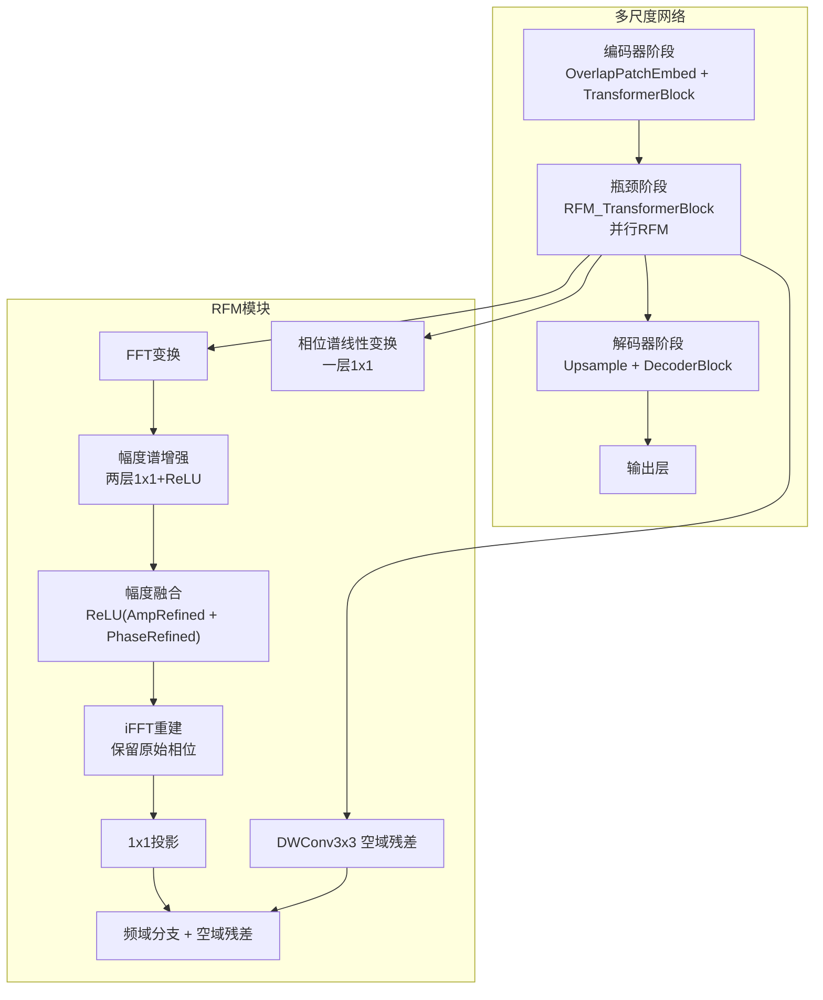
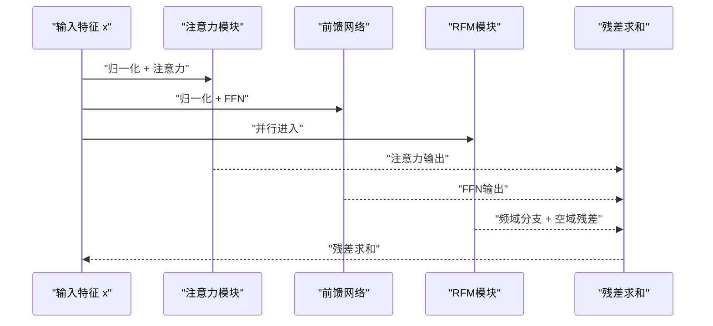
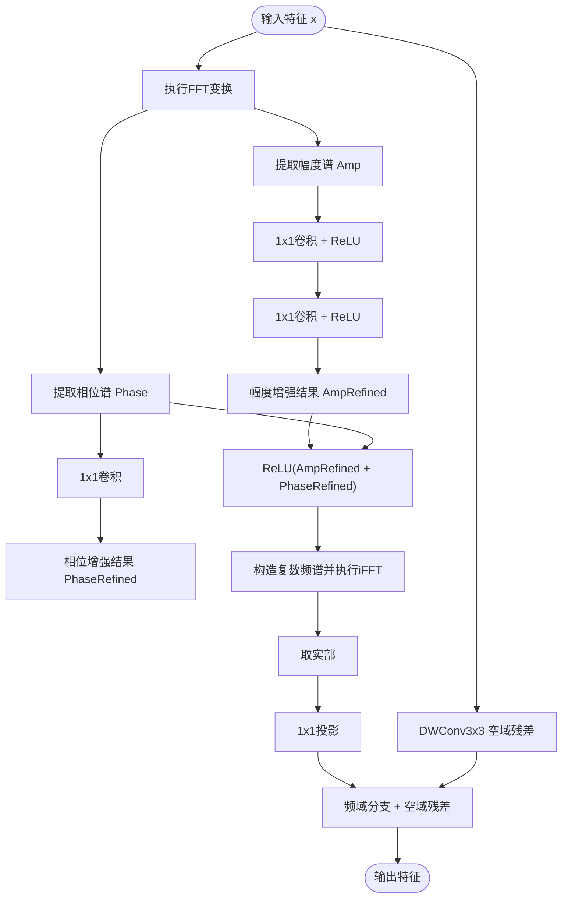
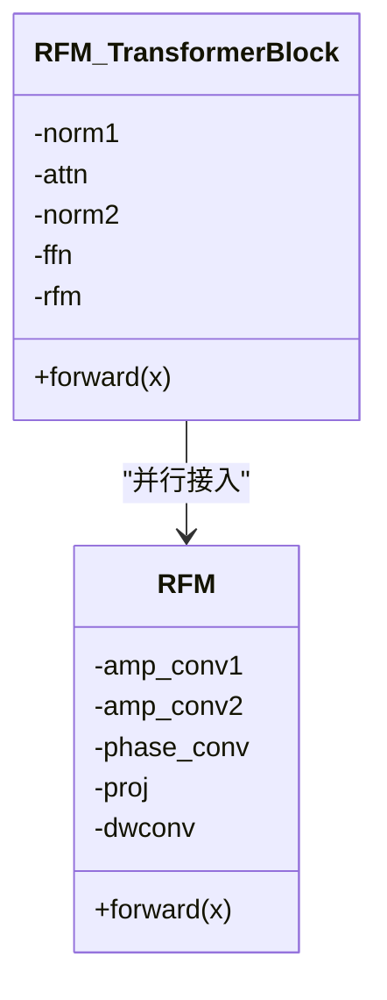
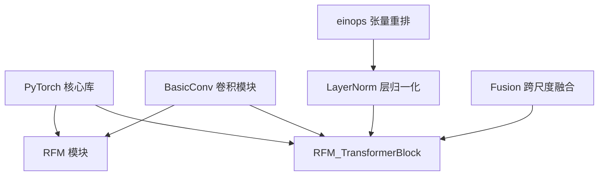

# 频域增强模块

<cite>
**本文档引用的文件**
- [model.py](file://model.py)
- [layers.py](file://layers.py)
- [README.md](file://README.md)
- [requirements.txt](file://requirements.txt)
- [Ablations/model_MPRNet.py](file://Ablations/model_MPRNet.py)
- [Ablations/model_M023.py](file://Ablations/model_M023.py)
</cite>

## 目录
1. [简介](#简介)
2. [项目结构](#项目结构)
3. [核心组件](#核心组件)
4. [架构总览](#架构总览)
5. [详细组件分析](#详细组件分析)
6. [依赖关系分析](#依赖关系分析)
7. [性能考量](#性能考量)
8. [故障排查指南](#故障排查指南)
9. [结论](#结论)
10. [附录](#附录)

## 简介
本文件面向NeRD-Rain项目的RFM（Residual Fourier Module，残差傅里叶模块）频域增强模块，系统化阐述其设计理念、数学原理与实现细节。RFM通过在频域对输入图像进行幅度谱与相位谱的分离处理，分别对幅度谱进行两层1×1卷积增强、对相位谱进行线性变换，再以修正后的幅度与原始相位重建，最后叠加空域残差分支（DWConv3×3），从而在不破坏相位信息的前提下，利用频域先验增强高频细节与去雨性能。该模块可并行接入Transformer瓶颈层，与FFN路径并行，形成“频域增强 + 空域残差”的复合特征增强策略。

## 项目结构
NeRD-Rain采用多尺度隐式神经表示（INR）与多尺度编码器-解码器结构，RFM模块嵌入在TransformerBlock的瓶颈处，作为并行分支参与特征融合。下图展示RFM在整体网络中的位置与数据流。

图表来源
- [model.py:118-158](file://model.py#L118-L158)
- [model.py:211-235](file://model.py#L211-L235)

章节来源
- [model.py:118-158](file://model.py#L118-L158)
- [model.py:211-235](file://model.py#L211-L235)

## 核心组件
- RFM（Residual Fourier Module）
  - 功能：在频域对幅度谱进行增强，对相位谱进行线性变换，重建后与空域残差分支相加。
  - 关键子模块：
    - 幅度谱增强：两层1×1卷积 + ReLU
    - 相位谱增强：一层1×1卷积
    - 重建：以修正幅度 + 原始相位构造复数频谱，执行iFFT并取实部，随后1×1投影
    - 空域残差：深度可分离卷积DWConv3×3，增强高频细节
- RFM_TransformerBlock
  - 将RFM并行接入Transformer瓶颈，与注意力与前馈网络（FFN）并行，形成三路特征增强

章节来源
- [model.py:118-158](file://model.py#L118-L158)
- [model.py:211-235](file://model.py#L211-L235)

## 架构总览
下图展示RFM在TransformerBlock中的并行接入方式，体现“频域增强 + 空域残差”的融合策略。

图表来源
- [model.py:211-235](file://model.py#L211-L235)

章节来源
- [model.py:211-235](file://model.py#L211-L235)

## 详细组件分析

### RFM模块设计与实现
- 数学与信号处理基础
  - 傅里叶变换：将空域图像映射到频域，得到复数频谱，可分解为幅度谱与相位谱。
  - 幅度谱：反映图像强度分布与频率能量；相位谱：携带空间结构与边缘信息。
  - 重建：以修正后的幅度谱与原始相位谱合成复数频谱，再进行逆变换恢复空域。
- 频域分支流程
  - FFT变换：对输入特征执行二维快速傅里叶变换，得到复数频谱。
  - 幅度谱增强：对幅度谱进行两层1×1卷积并激活，学习频率域的非线性增强。
  - 相位谱线性变换：对相位谱进行一层1×1卷积，保持相位信息不变形。
  - 幅度融合：将增强后的幅度与相位变换结果相加，并经ReLU稳定数值范围。
  - iFFT重建：以融合后的幅度与原始相位构造复数频谱，执行逆变换并取实部。
  - 1×1投影：对重建结果进行通道投影，匹配后续网络维度。
- 空域残差分支
  - 使用深度可分离卷积（DWConv3×3）增强高频细节，避免引入额外相位信息。
- 输出融合
  - 将频域重建分支与空域残差分支逐元素相加，形成最终特征。

图表来源
- [model.py:143-158](file://model.py#L143-L158)

章节来源
- [model.py:118-158](file://model.py#L118-L158)

### RFM_TransformerBlock并行接入
- 设计要点
  - 在TransformerBlock的瓶颈层并行接入RFM，与注意力与FFN并行，形成三路增强。
  - 保持各分支独立性，仅在残差求和阶段融合，降低耦合度。
- 实现位置
  - 多尺度网络中，多个层级使用RFM_TransformerBlock替换普通TransformerBlock，以在不同尺度上引入频域增强。

图表来源
- [model.py:211-235](file://model.py#L211-L235)
- [model.py:118-158](file://model.py#L118-L158)

章节来源
- [model.py:211-235](file://model.py#L211-L235)

### 与其他模块的融合方式
- 与注意力模块融合
  - 注意力模块输出与RFM输出在残差求和阶段融合，保持通道维度一致。
- 与前馈网络（FFN）融合
  - FFN输出与RFM输出在残差求和阶段融合，形成三路增强。
- 与多尺度结构融合
  - 在不同分辨率层级（小、中、大）均引入RFM，结合INR与跨尺度融合模块（如Fusion）实现多尺度频域增强。

章节来源
- [model.py:211-235](file://model.py#L211-L235)
- [model.py:303-301](file://model.py#L303-L301)

### 频域信息保持与重建的数学原理
- 幅度谱与相位谱的分离
  - 幅度谱捕获频率能量分布，适合进行非线性增强；相位谱承载空间结构，需保持原始相位以维持重建稳定性。
- 重建策略
  - 使用修正后的幅度与原始相位合成复数频谱，确保重建图像的空间一致性。
- 数值稳定性
  - 对融合后的幅度进行ReLU操作，抑制负值带来的不稳定重建。

章节来源
- [model.py:143-158](file://model.py#L143-L158)

### 高频细节增强效果与空域残差设计
- DWConv3×3的作用
  - 深度可分离卷积在保持计算效率的同时，增强高频细节与边缘信息，与频域重建互补。
- 与频域增强的协同
  - 频域分支负责全局频率先验与结构信息的修正，空域残差负责局部高频细节的强化，二者结合提升去雨性能。

章节来源
- [model.py:140-141](file://model.py#L140-L141)

### 可视化与效果对比建议
- 可视化内容
  - 幅度谱直方图变化：对比增强前后频率能量分布。
  - 相位谱分布：验证相位谱保持情况。
  - 重建图像对比：原图、频域重建、空域残差、最终输出。
- 效果评估
  - PSNR/SSIM指标对比：在Rain200L等数据集上的消融实验显示加入RFM可带来性能增益。

章节来源
- [README.md:72-81](file://README.md#L72-L81)

## 依赖关系分析
- PyTorch与相关库
  - torch.fft：用于二维快速傅里叶变换与逆变换。
  - einops：用于张量重排（如将特征展平与还原）。
- 自定义模块
  - BasicConv：通用卷积模块，支持归一化、激活、分组等。
  - LayerNorm：自定义层归一化，配合einops进行3D/4D转换。
  - Fusion：跨尺度特征融合模块，用于多尺度网络的跨尺度信息整合。

图表来源
- [model.py:1-15](file://model.py#L1-L15)
- [model.py:17-45](file://model.py#L17-L45)
- [model.py:84-94](file://model.py#L84-L94)
- [model.py:118-158](file://model.py#L118-L158)
- [model.py:211-235](file://model.py#L211-L235)
- [model.py:272-301](file://model.py#L272-L301)

章节来源
- [requirements.txt](file://requirements.txt#L7)
- [model.py:1-15](file://model.py#L1-L15)
- [model.py:17-45](file://model.py#L17-L45)
- [model.py:84-94](file://model.py#L84-L94)
- [model.py:118-158](file://model.py#L118-L158)
- [model.py:211-235](file://model.py#L211-L235)
- [model.py:272-301](file://model.py#L272-L301)

## 性能考量
- 计算复杂度
  - FFT/iFFT的复杂度约为O(N log N)，其中N为像素数；卷积层为O(K^2·C_in·C_out·H·W)，K为卷积核大小。
  - RFM包含少量1×1卷积与一次DWConv3×3，参数量较小，对整体性能影响有限。
- 内存占用
  - 需要保存中间频域特征与复数频谱，显存开销略高于纯空域方法。
- 速度优化建议
  - 使用torch.fft.fft2/irfft2时指定合适的归一化参数，减少重复计算。
  - 在高分辨率场景下，可考虑分块处理或混合精度训练以平衡速度与精度。

## 故障排查指南
- 常见问题
  - 相位谱异常导致重建失真：检查相位谱是否被错误地进行了非线性变换。
  - 幅度融合后出现负值或不稳定：确认ReLU融合步骤与数值范围控制。
  - 维度不匹配：确保1×1投影与后续模块通道数一致。
- 定位方法
  - 打印中间特征形状与统计信息（均值、方差、最大最小值）。
  - 对比频域幅度与相位的分布，确认相位未被修改。
- 解决方案
  - 固定相位谱，仅对幅度谱进行增强。
  - 在融合前进行裁剪或归一化，保证数值稳定。

章节来源
- [model.py:143-158](file://model.py#L143-L158)

## 结论
RFM模块通过在频域对幅度谱进行非线性增强、对相位谱进行线性变换并保持原始相位信息，实现了对图像频率先验的有效利用。与空域残差分支并行融合，既增强了高频细节，又保持了空间结构的稳定性。在多尺度网络中，RFM可广泛应用于不同分辨率层级，显著提升去雨性能。该模块设计简洁、参数量少、易于集成，是NeRD-Rain中实现频域增强的关键组件。

## 附录
- 数据集与评估
  - 支持Rain200L、Rain200H、DID-Data、DDN-Data、SPA-Data等数据集，提供PSNR/SSIM评估脚本与可视化结果链接。
- 相关消融实验
  - 在Ablations目录中提供了多种变体模型，便于对比不同模块的贡献。

章节来源
- [README.md:37-81](file://README.md#L37-L81)
- [Ablations/model_MPRNet.py:1-634](file://Ablations/model_MPRNet.py#L1-L634)
- [Ablations/model_M023.py:1-598](file://Ablations/model_M023.py#L1-L598)