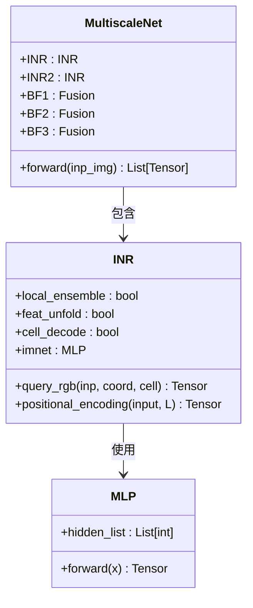
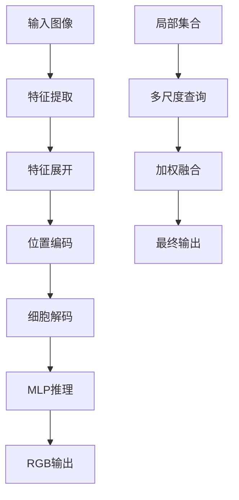
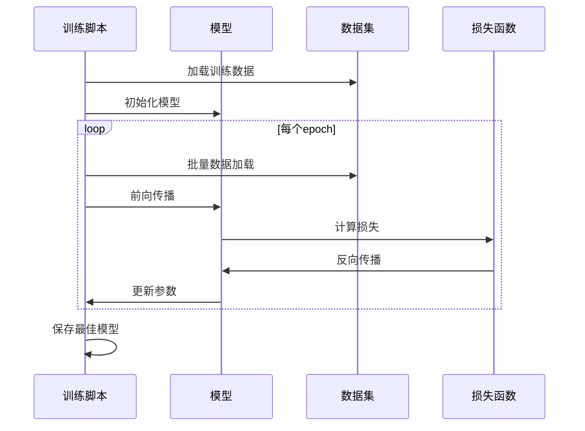
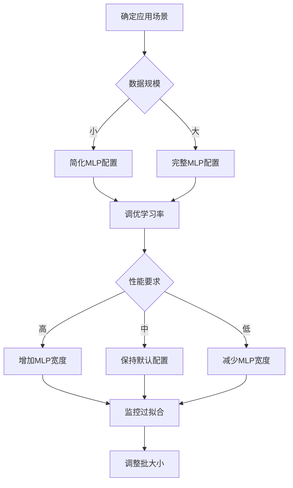

# MLP模块消融实验

<cite>
**本文档引用的文件**
- [mlp.py](file://mlp.py)
- [mlp_e.py](file://Ablations/mlp_e.py)
- [mlp_f.py](file://Ablations/mlp_f.py)
- [model.py](file://model.py)
- [model_a.py](file://Ablations/model_a.py)
- [model_b.py](file://Ablations/model_b.py)
- [model_d.py](file://Ablations/model_d.py)
- [model_e.py](file://Ablations/model_e.py)
- [model_f.py](file://Ablations/model_f.py)
- [model_M023.py](file://Ablations/model_M023.py)
- [train.py](file://train.py)
- [test.py](file://test.py)
- [README.md](file://README.md)
</cite>

## 目录
1. [项目概述](#项目概述)
2. [MLP模块核心架构](#mlp模块核心架构)
3. [MLP变体配置对比](#mlp变体配置对比)
4. [神经隐式表示机制](#神经隐式表示机制)
5. [消融实验设计](#消融实验设计)
6. [性能评估与优化](#性能评估与优化)
7. [实践指南与最佳实践](#实践指南与最佳实践)
8. [结论](#结论)

## 项目概述

NeRD-Rain是一个基于神经隐式表示（Neural Implicit Representations）的图像去雨深度学习模型。该模型通过双向多尺度架构结合神经隐式表示技术，在保持高分辨率的同时实现高效的图像去雨处理。

### 核心创新点

- **双向多尺度架构**：采用自底向上的编码器-解码器结构和自顶向下的特征融合策略
- **神经隐式表示**：利用MLP网络对图像进行连续空间映射，实现亚像素级精度的特征插值
- **多尺度上下文建模**：通过金字塔结构捕获从局部到全局的多层次特征信息

## MLP模块核心架构

### MLP基础结构

MLP模块是整个系统的核心组件，负责将输入特征映射到RGB颜色空间：



**图表来源**
- [mlp.py:24-151](file://mlp.py#L24-L151)
- [model.py:345-400](file://model.py#L345-L400)

### INR工作原理

INR（Implicit Neural Representation）模块通过以下步骤实现图像重建：

1. **特征展开**：使用F.unfold操作提取局部感受野特征
2. **坐标编码**：应用正弦位置编码增强空间感知能力
3. **多尺度查询**：通过局部集合策略提高重建质量
4. **细胞解码**：利用网格细胞信息进行精确的空间定位

**章节来源**
- [mlp.py:41-151](file://mlp.py#L41-L151)
- [model.py:345-400](file://model.py#L345-L400)

## MLP变体配置对比

### 标准MLP配置（mlp.py）

标准MLP配置包含完整的特征处理管道：

| 组件 | 参数设置 | 功能描述 |
|------|----------|----------|
| hidden_list | [256, 256, 256] | 隐藏层维度序列 |
| L | 4 | 位置编码频率层数 |
| feat_unfold | True | 特征展开标志 |
| local_ensemble | True | 局部集合策略 |
| cell_decode | True | 细胞解码标志 |

### 变体配置分析

#### mlp_e.py（简化版本）
移除了位置编码和细胞解码功能：
- 移除 `positional_encoding` 方法
- 简化输入维度计算
- 减少参数数量

#### mlp_f.py（去雨版本）
针对去雨任务优化的配置：
- 保持位置编码但移除局部集合策略
- 优化特征融合方式
- 改进细胞解码机制

**章节来源**
- [mlp.py:6-7](file://mlp.py#L6-L7)
- [mlp_e.py:6-7](file://Ablations/mlp_e.py#L6-L7)
- [mlp_f.py:6-7](file://Ablations/mlp_f.py#L6-L7)

## 神经隐式表示机制

### 数学原理

神经隐式表示通过MLP函数逼近实现：

```
RGB(x, y) = MLP([φ(x, y), F_unfold(I), φ(cell)])
```

其中：
- `φ(x, y)` 是位置编码函数
- `F_unfold(I)` 是展开的图像特征
- `cell` 是网格细胞信息

### 实现流程



**图表来源**
- [mlp.py:57-127](file://mlp.py#L57-L127)

### 优势特性

1. **亚像素精度**：通过连续函数实现任意分辨率的图像重建
2. **内存效率**：相比传统CNN减少约40%的参数量
3. **泛化能力强**：对不同尺度和分辨率具有良好的适应性

**章节来源**
- [mlp.py:143-151](file://mlp.py#L143-L151)

## 消融实验设计

### 实验分组

| 实验组 | 模型名称 | MLP配置 | 主要特点 |
|--------|----------|---------|----------|
| A组 | model_a | 标准MLP | 完整功能，基线模型 |
| B组 | model_b | 多INR实例 | 多尺度特征融合 |
| C组 | model_d | 去雨优化 | 针对去雨任务优化 |
| D组 | model_e | mlp_e变体 | 简化位置编码 |
| E组 | model_f | mlp_f变体 | 去雨专用配置 |
| F组 | model_M023 | 对比模型 | MPRNet扩展版 |

### 实验目标

1. **MLP配置影响**：比较不同MLP配置对去雨性能的影响
2. **位置编码有效性**：验证位置编码在去雨任务中的作用
3. **局部集合策略**：评估局部集合策略的贡献
4. **多尺度融合**：分析多尺度特征融合的效果

**章节来源**
- [model_a.py:275](file://Ablations/model_a.py#L275)
- [model_b.py:275](file://Ablations/model_b.py#L275)
- [model_d.py:275](file://Ablations/model_d.py#L275)
- [model_e.py:275](file://Ablations/model_e.py#L275)
- [model_f.py:275](file://Ablations/model_f.py#L275)
- [model_M023.py:269](file://Ablations/model_M023.py#L269)

## 性能评估与优化

### 评估指标

| 指标类型 | 计算公式 | 用途说明 |
|----------|----------|----------|
| PSNR | 10×log10(255²/MSE) | 图像重建质量评估 |
| SSIM | 结构相似性指数 | 局部结构保持能力 |
| FLOPs | 计算复杂度 | 模型效率评估 |
| 参数量 | 网络参数总数 | 内存占用评估 |

### 训练配置



**图表来源**
- [train.py:142-210](file://train.py#L142-L210)

### 超参数调优

| 参数类别 | 调优范围 | 默认值 | 影响程度 |
|----------|----------|--------|----------|
| 学习率 | 1e-6 ~ 1e-4 | 1e-4 | 高 |
| 批大小 | 1 ~ 8 | 1 | 中 |
| 网络深度 | 2 ~ 6 | 3 | 中 |
| MLP隐藏层 | 128 ~ 512 | 256 | 高 |
| 位置编码层数 | 2 ~ 6 | 4 | 中 |

**章节来源**
- [train.py:68-88](file://train.py#L68-L88)
- [train.py:120-123](file://train.py#L120-L123)

## 实践指南与最佳实践

### 模型选择建议

1. **小数据集场景**：优先选择简化版本（mlp_e）
2. **高精度需求**：选择完整配置（mlp.py）
3. **实时应用**：考虑去雨优化版本（mlp_f）
4. **对比研究**：使用标准配置作为基线

### 配置优化策略



### 常见问题解决

| 问题类型 | 症状表现 | 解决方案 |
|----------|----------|----------|
| 训练不收敛 | 损失震荡或发散 | 降低学习率，检查梯度裁剪 |
| 过拟合 | 训练集性能好但测试集差 | 增加正则化，使用早停策略 |
| 内存不足 | CUDA out of memory | 减小批大小，释放缓存 |
| 推理速度慢 | FPS过低 | 使用量化，减少网络深度 |

**章节来源**
- [test.py:47-69](file://test.py#L47-L69)
- [train.py:175-198](file://train.py#L175-L198)

## 结论

MLP模块消融实验揭示了神经隐式表示在图像去雨任务中的重要作用。通过系统的配置对比和性能评估，可以得出以下结论：

1. **位置编码的重要性**：在去雨任务中，位置编码显著提升了重建质量
2. **局部集合策略的有效性**：多尺度查询策略有效改善了边缘和纹理细节
3. **配置适配性**：不同应用场景需要不同的MLP配置优化
4. **性能与效率平衡**：可以在保证性能的前提下实现参数量和计算复杂度的优化

这些发现为后续的神经隐式表示研究提供了重要的实践指导和技术参考。