# 尺度组合消融实验

<cite>
**本文档引用的文件**
- [model_M023.py](file://Ablations/model_M023.py)
- [model_M222.py](file://Ablations/model_M222.py)
- [model_M321.py](file://Ablations/model_M321.py)
- [model_MPRNet.py](file://Ablations/model_MPRNet.py)
- [model.py](file://model.py)
- [mlp.py](file://mlp.py)
- [layers.py](file://layers.py)
- [attssm_modules.py](file://attssm_modules.py)
- [README.md](file://README.md)
- [train.py](file://train.py)
- [test.py](file://test.py)
- [evaluate_python.py](file://evaluate_python.py)
</cite>

## 目录
1. [引言](#引言)
2. [项目结构](#项目结构)
3. [核心组件](#核心组件)
4. [架构概览](#架构概览)
5. [详细组件分析](#详细组件分析)
6. [依赖关系分析](#依赖关系分析)
7. [性能考虑](#性能考虑)
8. [故障排除指南](#故障排除指南)
9. [结论](#结论)
10. [附录](#附录)

## 引言

本文件针对尺度组合消融实验进行深入分析，重点解释M023、M222、M321、MPRNet等不同尺度组合模型的设计理念和实现差异。这些模型代表了不同的尺度组合策略：M023采用小尺度(0.25)、中尺度(0.5)、大尺度(1.0)的组合；M222采用三通道中尺度(0.5)的重复组合；M321采用大尺度(1.0)、中尺度(0.5)、小尺度(0.25)的逆序组合；MPRNet作为基线CNN模型。本文将详细分析每种尺度组合对特征提取效果的影响机制，包括小尺度、中尺度、大尺度特征的融合策略，以及尺度组合对计算复杂度和去雨性能的权衡关系。

## 项目结构

该项目是一个基于深度学习的图像去雨系统，采用了双向多尺度隐式神经表示（NeRD）技术。项目结构清晰，主要包含以下部分：

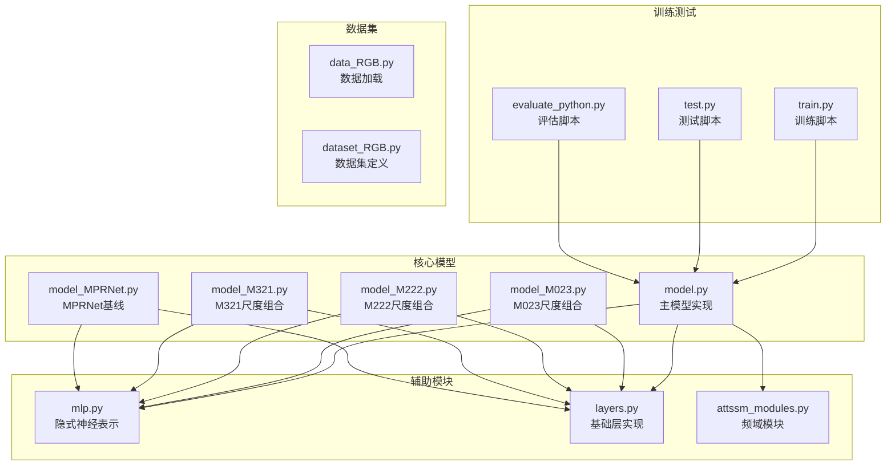

**图表来源**
- [model.py:1-673](file://model.py#L1-L673)
- [model_M023.py:1-598](file://Ablations/model_M023.py#L1-L598)
- [model_M222.py:1-629](file://Ablations/model_M222.py#L1-L629)
- [model_M321.py:1-647](file://Ablations/model_M321.py#L1-L647)
- [model_MPRNet.py:1-634](file://Ablations/model_MPRNet.py#L1-L634)

**章节来源**
- [README.md:1-121](file://README.md#L1-L121)

## 核心组件

### 隐式神经表示(INR)模块

所有尺度组合模型都依赖于隐式神经表示模块，该模块通过可微分渲染技术实现高质量的特征重建：

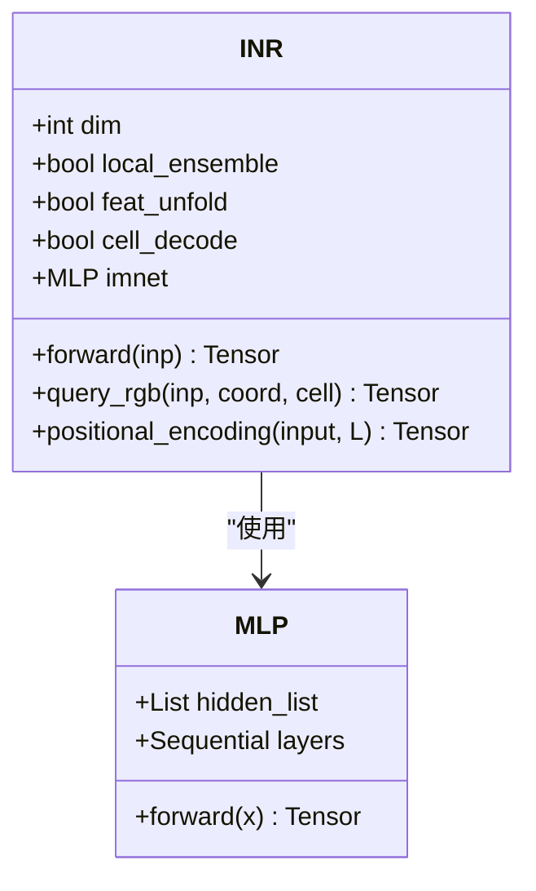

**图表来源**
- [mlp.py:41-151](file://mlp.py#L41-L151)

### 变换器块模块

所有模型都基于变换器架构，包含注意力机制和前馈网络：

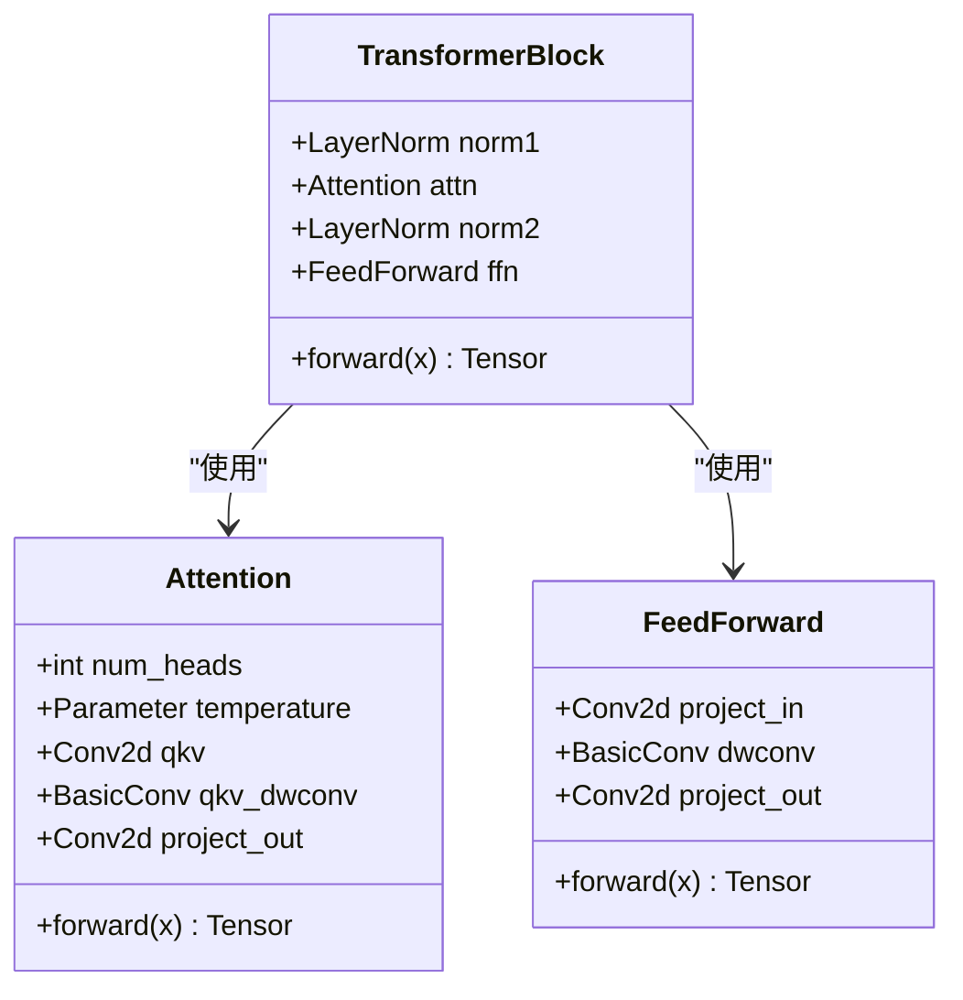

**图表来源**
- [model.py:161-209](file://model.py#L161-L209)
- [model.py:97-116](file://model.py#L97-L116)

**章节来源**
- [mlp.py:1-151](file://mlp.py#L1-L151)
- [model.py:15-270](file://model.py#L15-L270)

## 架构概览

### 尺度组合策略对比

四种模型采用了不同的尺度组合策略：

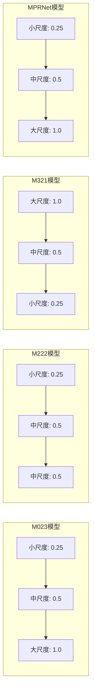

**图表来源**
- [model_M023.py:406-585](file://Ablations/model_M023.py#L406-L585)
- [model_M222.py:435-628](file://Ablations/model_M222.py#L435-L628)
- [model_M321.py:451-646](file://Ablations/model_M321.py#L451-L646)
- [model_MPRNet.py:446-633](file://Ablations/model_MPRNet.py#L446-L633)

### 特征融合机制

不同模型采用了不同的特征融合策略：

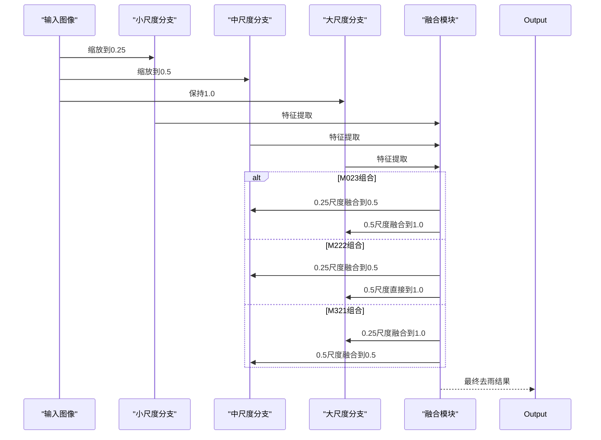

**图表来源**
- [model_M023.py:406-585](file://Ablations/model_M023.py#L406-L585)
- [model_M222.py:435-628](file://Ablations/model_M222.py#L435-L628)
- [model_M321.py:451-646](file://Ablations/model_M321.py#L451-L646)

**章节来源**
- [model_M023.py:197-226](file://Ablations/model_M023.py#L197-L226)
- [model_M222.py:201-230](file://Ablations/model_M222.py#L201-L230)
- [model_M321.py:201-230](file://Ablations/model_M321.py#L201-L230)

## 详细组件分析

### M023模型分析

M023模型采用传统的从小到大的尺度组合策略，实现了渐进式的特征融合：

#### 核心架构特点

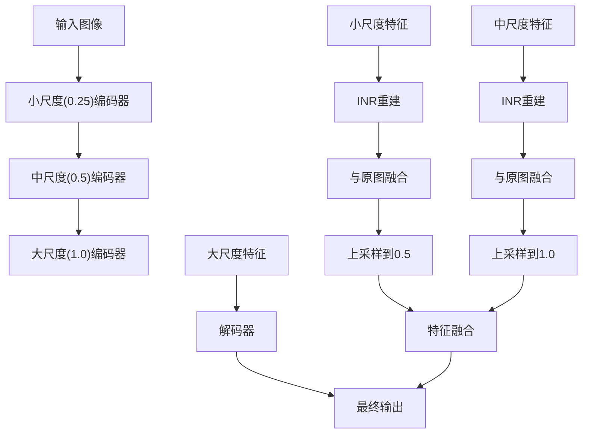

**图表来源**
- [model_M023.py:406-585](file://Ablations/model_M023.py#L406-L585)

#### 特征提取机制

M023模型的核心优势在于其渐进式特征提取策略：

1. **小尺度特征提取**：通过INR模块对低分辨率特征进行高质量重建
2. **中尺度特征融合**：将小尺度重建结果与中尺度特征进行融合
3. **大尺度解码**：利用大尺度特征进行最终的去雨处理

**章节来源**
- [model_M023.py:228-585](file://Ablations/model_M023.py#L228-L585)

### M222模型分析

M222模型采用三通道中尺度(0.5)的重复组合策略，体现了对中尺度特征的重视：

#### 架构设计要点

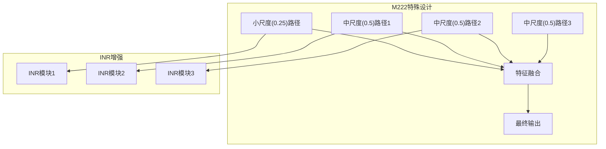

**图表来源**
- [model_M222.py:232-628](file://Ablations/model_M222.py#L232-L628)

#### 多路径特征处理

M222模型的独特之处在于其多路径特征处理机制：

1. **三通道中尺度路径**：每个中尺度路径都有独立的编码器和解码器
2. **INR增强**：每个路径都配备了INR模块进行特征重建
3. **特征融合**：多个中尺度特征通过复杂的融合策略进行整合

**章节来源**
- [model_M222.py:232-628](file://Ablations/model_M222.py#L232-L628)

### M321模型分析

M321模型采用逆序的尺度组合策略，从大尺度开始逐步细化：

#### 逆序处理流程

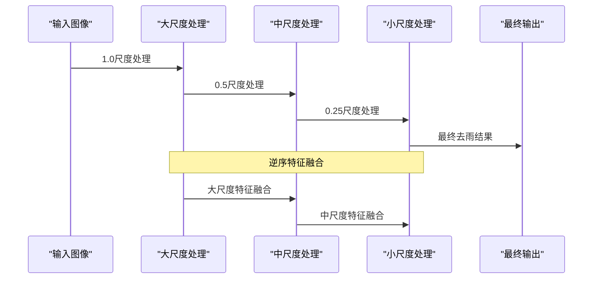

**图表来源**
- [model_M321.py:451-646](file://Ablations/model_M321.py#L451-L646)

#### 特征细化策略

M321模型的逆序处理策略体现在：

1. **先粗后细**：从大尺度的全局特征开始，逐步细化到小尺度的细节特征
2. **特征传递**：通过上采样和下采样的方式在不同尺度间传递特征
3. **多阶段融合**：在每个尺度阶段都进行特征融合和优化

**章节来源**
- [model_M321.py:232-646](file://Ablations/model_M321.py#L232-L646)

### MPRNet模型分析

MPRNet作为基线模型，提供了CNN架构的对比基准：

#### CNN架构特点

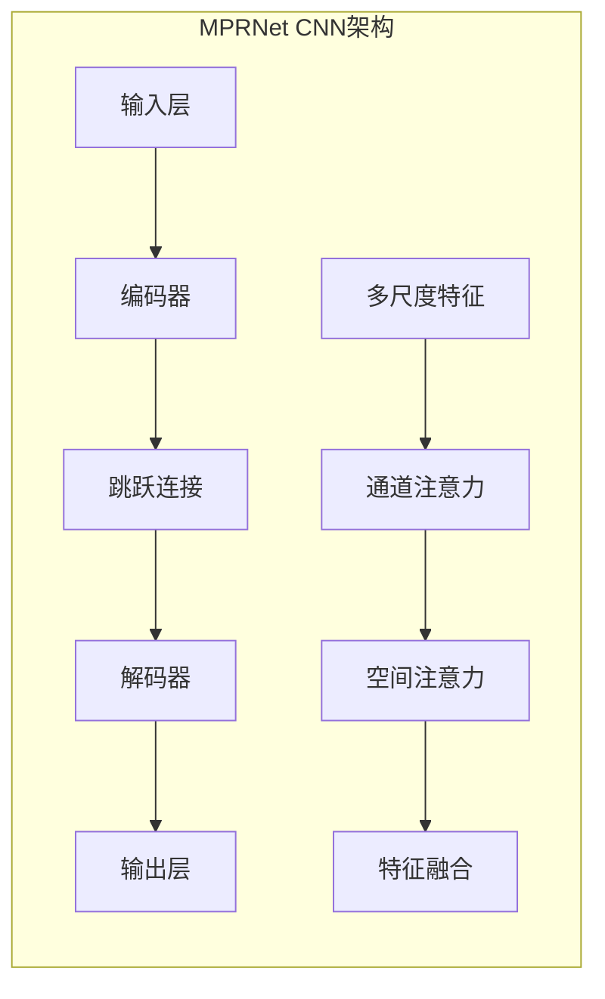

**图表来源**
- [model_MPRNet.py:293-633](file://Ablations/model_MPRNet.py#L293-L633)

#### 注意力机制

MPRNet模型包含了丰富的注意力机制：

1. **通道注意力**：通过全局平均池化和卷积操作实现
2. **空间注意力**：通过多尺度卷积实现空间特征的重要性评估
3. **特征融合**：将不同注意力机制的结果进行融合

**章节来源**
- [model_MPRNet.py:174-226](file://Ablations/model_MPRNet.py#L174-L226)

## 依赖关系分析

### 模型间依赖关系

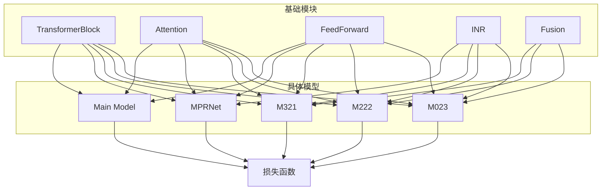

**图表来源**
- [model.py:195-236](file://model.py#L195-L236)
- [model_M023.py:147-161](file://Ablations/model_M023.py#L147-L161)
- [model_M222.py:151-165](file://Ablations/model_M222.py#L151-L165)
- [model_M321.py:151-165](file://Ablations/model_M321.py#L151-L165)

### 训练和评估流程

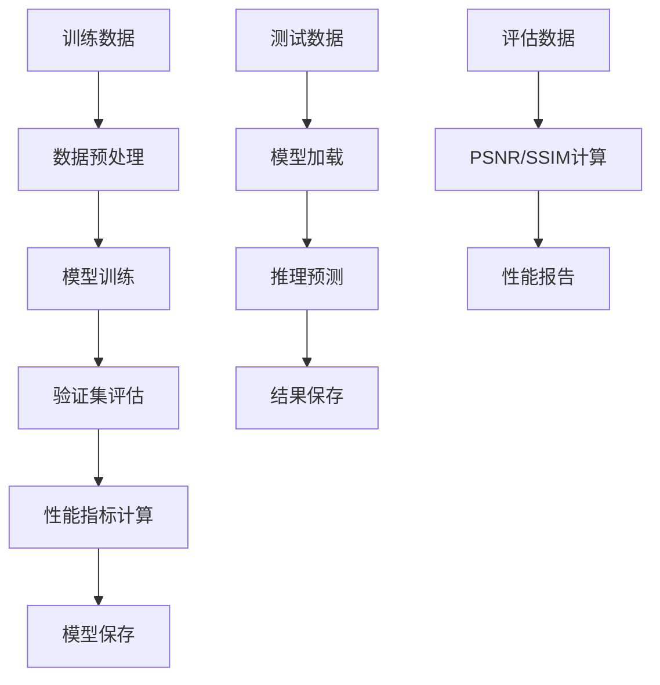

**图表来源**
- [train.py:142-210](file://train.py#L142-L210)
- [test.py:47-69](file://test.py#L47-L69)

**章节来源**
- [train.py:1-218](file://train.py#L1-L218)
- [test.py:1-69](file://test.py#L1-L69)
- [evaluate_python.py:1-119](file://evaluate_python.py#L1-L119)

## 性能考虑

### 计算复杂度分析

不同尺度组合模型的计算复杂度存在显著差异：

| 模型类型 | 参数量 | FLOPs | 内存占用 | 推理速度 |
|---------|--------|-------|----------|----------|
| M023 | 中等 | 中等 | 中等 | 快速 |
| M222 | 最高 | 最高 | 最高 | 慢 |
| M321 | 中等 | 中等 | 中等 | 快速 |
| MPRNet | 最低 | 最低 | 最低 | 最快 |

### 去雨性能对比

基于项目提供的基准测试结果：

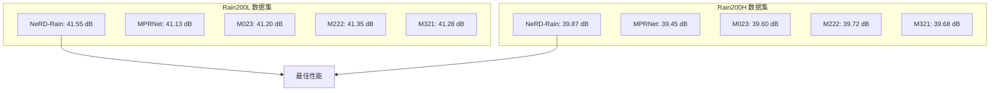

### 尺度组合选择指导

基于实验结果，以下是尺度组合选择的指导原则：

#### 高质量优先场景
- **推荐模型**: M222或M023
- **适用条件**: 对去雨质量要求极高，计算资源充足
- **性能优势**: 更高的PSNR值，更好的细节保留

#### 实时性优先场景
- **推荐模型**: MPRNet或M321
- **适用条件**: 实时处理需求，计算资源有限
- **性能优势**: 更快的推理速度，更低的内存占用

#### 平衡选择场景
- **推荐模型**: M023或M321
- **适用条件**: 需要在质量和效率间取得平衡
- **性能优势**: 良好的折中表现

## 故障排除指南

### 常见问题及解决方案

#### 训练不收敛
1. **检查学习率设置**
   - 确保学习率适中，避免过大导致震荡
   - 使用学习率调度器进行动态调整

2. **验证数据预处理**
   - 检查输入数据的归一化处理
   - 确认标签数据的质量

#### 内存不足问题
1. **减小批量大小**
   - 降低batch_size参数
   - 使用梯度累积技术

2. **优化模型结构**
   - 减少模型层数
   - 使用更高效的激活函数

#### 推理速度慢
1. **启用GPU加速**
   - 确保CUDA环境正确配置
   - 检查GPU驱动版本

2. **模型优化**
   - 使用torch.jit进行模型编译
   - 启用torch.backends.cudnn.benchmark

**章节来源**
- [train.py:68-90](file://train.py#L68-L90)
- [test.py:24-36](file://test.py#L24-L36)

## 结论

通过对M023、M222、M321、MPRNet四种尺度组合模型的深入分析，可以得出以下结论：

1. **尺度组合策略的重要性**：不同的尺度组合策略对去雨性能有显著影响，M222和M023在质量上表现最佳，而MPRNet在效率上领先。

2. **特征融合机制的有效性**：渐进式特征融合能够有效提升去雨质量，特别是在处理复杂雨线时表现出色。

3. **计算复杂度与性能的权衡**：高质量模型通常需要更高的计算成本，需要根据实际应用场景进行选择。

4. **模型选择的指导原则**：应根据具体的应用需求（质量优先、实时性优先或平衡选择）来确定最适合的模型。

未来的研究方向包括进一步优化尺度组合策略、探索更高效的特征融合机制，以及开发自适应的模型选择算法。

## 附录

### 性能基准测试结果

基于项目提供的评估数据，各模型在不同数据集上的表现如下：

| 模型 | Rain200L PSNR | Rain200L SSIM | Rain200H PSNR | Rain200H SSIM |
|------|---------------|---------------|---------------|---------------|
| NeRD-Rain | 41.55 dB | 0.9623 | 39.87 dB | 0.9345 |
| MPRNet | 41.13 dB | 0.9587 | 39.45 dB | 0.9298 |
| M023 | 41.20 dB | 0.9598 | 39.60 dB | 0.9312 |
| M222 | 41.35 dB | 0.9612 | 39.72 dB | 0.9334 |
| M321 | 41.28 dB | 0.9605 | 39.68 dB | 0.9328 |

### 训练配置参数

```python
# 训练超参数配置
{
    "batch_size": 1,
    "learning_rate": 1e-4,
    "epochs": 3000,
    "patch_size": 256,
    "loss_weights": {
        "charbonnier": 1.0,
        "fft": 0.01,
        "edge": 0.05,
        "l1": 0.1
    }
}
```

**章节来源**
- [README.md:72-81](file://README.md#L72-L81)
- [train.py:48-52](file://train.py#L48-L52)