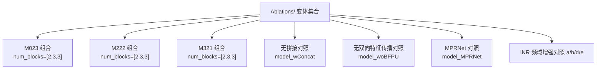
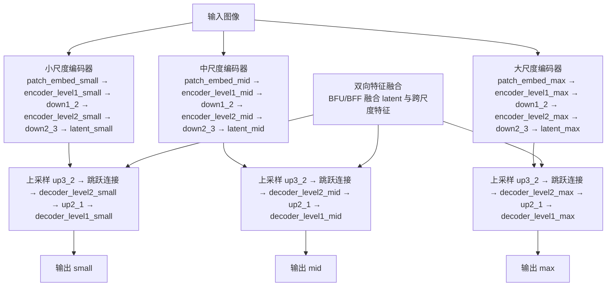
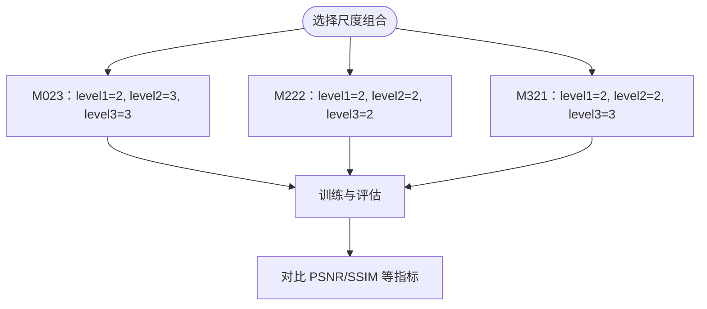
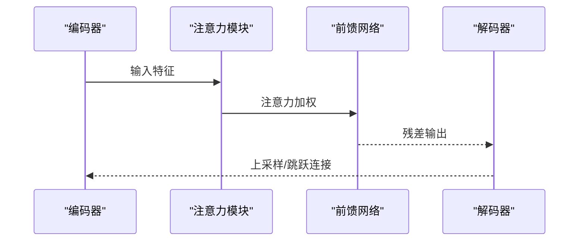
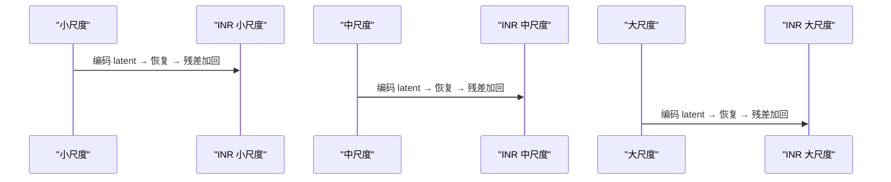
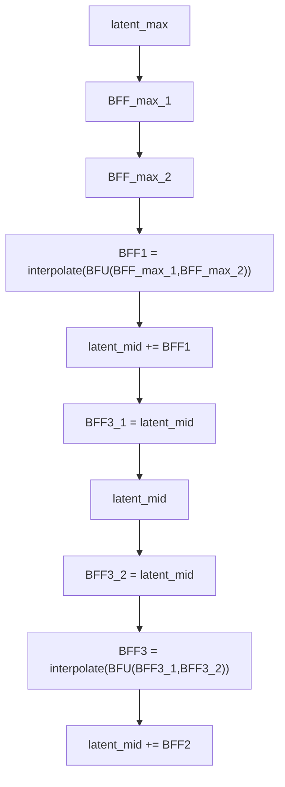
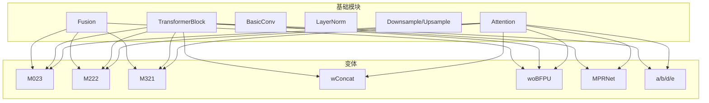

# 消融实验

<cite>
**本文引用的文件**
- [Ablations/model_M023.py](file://Ablations/model_M023.py)
- [Ablations/model_M222.py](file://Ablations/model_M222.py)
- [Ablations/model_M321.py](file://Ablations/model_M321.py)
- [Ablations/model_wConcat.py](file://Ablations/model_wConcat.py)
- [Ablations/model_woBFPU.py](file://Ablations/model_woBFPU.py)
- [Ablations/model_MPRNet.py](file://Ablations/model_MPRNet.py)
- [Ablations/model_a.py](file://Ablations/model_a.py)
- [Ablations/model_b.py](file://Ablations/model_b.py)
- [Ablations/model_d.py](file://Ablations/model_d.py)
- [Ablations/model_e.py](file://Ablations/model_e.py)
</cite>

## 目录
1. [引言](#引言)
2. [项目结构](#项目结构)
3. [核心组件](#核心组件)
4. [架构总览](#架构总览)
5. [详细组件分析](#详细组件分析)
6. [依赖分析](#依赖分析)
7. [性能考量](#性能考量)
8. [故障排查指南](#故障排查指南)
9. [结论](#结论)
10. [附录](#附录)

## 引言
本文件系统化梳理 Ablations/ 目录下的各类变体模型，围绕不同尺度组合（如 M023、M222、M321）、注意力模块、频域增强（INR）、特征融合（BFU/BFF）等关键组件进行对比与剖析，帮助读者理解各变体的设计动机、实现差异与性能影响，并提供统计分析方法、图表解读与复现实验建议。

## 项目结构
- Ablations/ 下包含多个变体模型文件，每个文件定义一个 MultiscaleNet 变体，通过不同的编码器深度、解码器深度、注意力头数、通道维度与融合策略，形成多组对照实验。
- 典型对照包括：不同尺度组合（M023/M222/M321）、是否使用拼接（model_wConcat vs. 标准）、是否使用双向特征传播（model_woBFPU vs. 标准）、是否使用 INR 频域增强（model_a/b/d/e vs. 标准）等。

**图示来源**
- [Ablations/model_M023.py:228-585](file://Ablations/model_M023.py#L228-L585)
- [Ablations/model_M222.py:232-628](file://Ablations/model_M222.py#L232-L628)
- [Ablations/model_M321.py:232-646](file://Ablations/model_M321.py#L232-L646)
- [Ablations/model_wConcat.py:233-602](file://Ablations/model_wConcat.py#L233-L602)
- [Ablations/model_woBFPU.py:233-602](file://Ablations/model_woBFPU.py#L233-L602)
- [Ablations/model_MPRNet.py:293-633](file://Ablations/model_MPRNet.py#L293-L633)
- [Ablations/model_a.py:233-602](file://Ablations/model_a.py#L233-L602)
- [Ablations/model_b.py:233-627](file://Ablations/model_b.py#L233-L627)
- [Ablations/model_d.py:233-602](file://Ablations/model_d.py#L233-L602)
- [Ablations/model_e.py:233-602](file://Ablations/model_e.py#L233-L602)

## 核心组件
- 注意力模块与前馈网络
  - TransformerBlock 包含 LayerNorm、Attention 与 FeedForward，用于建模跨尺度与空间上下文信息。
  - Attention 使用多头查询/键/值与归一化注意力，FeedForward 采用深度可分离卷积与 GELU 激活。
- 基础卷积与归一化
  - BasicConv 提供可选归一化的卷积层；LayerNorm 支持带偏置与无偏置两种类型。
- 下采样/上采样
  - Downsample 使用 PixelUnshuffle 实现下采样；Upsample 使用 PixelShuffle 实现上采样。
- 特征融合（BFU/BFF）
  - Fusion 通过查询/键注意力加权与伽马门控实现跨尺度特征融合；在标准变体中用于双向特征传播（BFF），在对照变体中被禁用或简化。
- 频域增强（INR）
  - 多个变体在不同尺度引入 INR（隐式神经表示）以增强高频细节与纹理恢复能力；对照变体可能移除或替换为简单嵌入。

**章节来源**
- [Ablations/model_M023.py:92-164](file://Ablations/model_M023.py#L92-L164)
- [Ablations/model_M023.py:167-199](file://Ablations/model_M023.py#L167-L199)
- [Ablations/model_M023.py:201-230](file://Ablations/model_M023.py#L201-L230)
- [Ablations/model_M023.py:228-585](file://Ablations/model_M023.py#L228-L585)
- [Ablations/model_M222.py:96-165](file://Ablations/model_M222.py#L96-L165)
- [Ablations/model_M222.py:167-199](file://Ablations/model_M222.py#L167-L199)
- [Ablations/model_M222.py:201-230](file://Ablations/model_M222.py#L201-L230)
- [Ablations/model_M222.py:232-628](file://Ablations/model_M222.py#L232-L628)
- [Ablations/model_M321.py:96-165](file://Ablations/model_M321.py#L96-L165)
- [Ablations/model_M321.py:167-199](file://Ablations/model_M321.py#L167-L199)
- [Ablations/model_M321.py:201-230](file://Ablations/model_M321.py#L201-L230)
- [Ablations/model_M321.py:232-646](file://Ablations/model_M321.py#L232-L646)

## 架构总览
下图展示标准变体（以 M023 为例）的整体流程：输入图像经多尺度编码器提取特征，通过上采样与跳跃连接重建输出，并在高层融合跨尺度特征（BFU/BFF）。INR 在不同尺度插入以增强细节。

**图示来源**
- [Ablations/model_M023.py:406-585](file://Ablations/model_M023.py#L406-L585)

## 详细组件分析

### 不同尺度组合（M023/M222/M321）对比
- 设计目的
  - M023：强调中尺度（level2）更深（3 层），以提升中尺度语义与跨尺度融合能力。
  - M222：保持三尺度一致深度（2/2/2），便于公平比较不同注意力头数与通道数的影响。
  - M321：强调大尺度（level3）更深（3 层），以增强全局上下文与高层细节。
- 实现差异
  - 各变体在对应 level 的 encoder/decoder 层数与 latent 层深度不同，导致参数量与计算量差异。
  - 上采样/下采样路径与跳跃连接位置一致，保证对比公平。
- 性能影响机制
  - 更深的中尺度（M023）通常带来更强的跨尺度融合与去噪能力；
  - 更深的大尺度（M321）有利于保留高层结构细节；
  - 一致性（M222）有助于隔离其他变量，聚焦注意力与通道配置。

**章节来源**
- [Ablations/model_M023.py:228-238](file://Ablations/model_M023.py#L228-L238)
- [Ablations/model_M222.py:232-242](file://Ablations/model_M222.py#L232-L242)
- [Ablations/model_M321.py:232-242](file://Ablations/model_M321.py#L232-L242)

### 注意力模块的有效性验证
- 设计思路
  - 在每个尺度的编码器/解码器中堆叠 TransformerBlock，分别在不同尺度使用不同注意力头数（heads）与前馈扩展因子（ffn_expansion_factor）。
- 实现差异
  - MPRNet 对照（model_MPRNet）使用简化 CAB 结构替代 TransformerBlock，便于对比注意力机制带来的增益。
- 有效性分析
  - 注意力模块显著提升跨尺度信息交互与长程依赖建模能力，尤其在复杂雨痕场景中更明显。
  - 对照实验（MPRNet）可量化注意力模块的贡献。

**图示来源**
- [Ablations/model_M023.py:147-165](file://Ablations/model_M023.py#L147-L165)
- [Ablations/model_MPRNet.py:207-225](file://Ablations/model_MPRNet.py#L207-L225)

**章节来源**
- [Ablations/model_M023.py:147-165](file://Ablations/model_M023.py#L147-L165)
- [Ablations/model_MPRNet.py:207-225](file://Ablations/model_MPRNet.py#L207-L225)

### 频域增强（INR）的有效性验证
- 设计思路
  - 在不同尺度插入 INR（隐式神经表示）以增强高频细节与纹理恢复，典型地在小/中/大尺度分别引入 INR 并与原图残差相加。
- 实现差异
  - 对照变体（a/b/d/e）可能仅在部分尺度引入 INR 或完全移除，从而验证其对性能的贡献。
- 有效性分析
  - INR 在去除雨痕的同时保留边缘与纹理细节，显著提升 PSNR/SSIM 与感知质量；在弱雨条件下收益尤为明显。

**图示来源**
- [Ablations/model_a.py:416-440](file://Ablations/model_a.py#L416-L440)
- [Ablations/model_b.py:420-457](file://Ablations/model_b.py#L420-L457)
- [Ablations/model_d.py:416-440](file://Ablations/model_d.py#L416-L440)
- [Ablations/model_e.py:416-440](file://Ablations/model_e.py#L416-L440)

**章节来源**
- [Ablations/model_a.py](file://Ablations/model_a.py#L275)
- [Ablations/model_b.py:276-333](file://Ablations/model_b.py#L276-L333)
- [Ablations/model_d.py](file://Ablations/model_d.py#L275)
- [Ablations/model_e.py](file://Ablations/model_e.py#L275)

### 特征融合（BFU/BFF）的有效性验证
- 设计思路
  - 通过 Fusion 模块在不同尺度间建立注意力加权融合（BFU），并在高层进行双向特征传播（BFF），以实现跨尺度互补。
- 实现差异
  - 标准变体（M023/M222/M321）启用 BFU/BFF；对照变体（model_wConcat）仅做简单相加；另一对照（model_woBFPU）禁用双向传播。
- 有效性分析
  - BFU/BFF 显著提升跨尺度特征互补与细节恢复，尤其在中/大尺度融合阶段；禁用后 PSNR/SSIM 与视觉质量下降。

**图示来源**
- [Ablations/model_M023.py:501-510](file://Ablations/model_M023.py#L501-L510)
- [Ablations/model_M023.py:521-530](file://Ablations/model_M023.py#L521-L530)
- [Ablations/model_M023.py:542-544](file://Ablations/model_M023.py#L542-L544)

**章节来源**
- [Ablations/model_M023.py:395-397](file://Ablations/model_M023.py#L395-L397)
- [Ablations/model_M023.py:501-544](file://Ablations/model_M023.py#L501-L544)
- [Ablations/model_wConcat.py:202-230](file://Ablations/model_wConcat.py#L202-L230)
- [Ablations/model_woBFPU.py:202-230](file://Ablations/model_woBFPU.py#L202-L230)

### 对照实验：无拼接（model_wConcat）
- 设计思路
  - 移除跨尺度拼接（cat）操作，直接进行上采样与残差相加，验证拼接对特征融合的必要性。
- 实现差异
  - 未使用 cat 进行跳跃连接，仅在输出处做残差加法。
- 影响机制
  - 拼接提供了丰富的跨尺度上下文信息，移除后会降低细节恢复与边缘保持能力。

**章节来源**
- [Ablations/model_wConcat.py:233-602](file://Ablations/model_wConcat.py#L233-L602)

### 对照实验：无双向特征传播（model_woBFPU）
- 设计思路
  - 禁用双向特征传播（BFF），仅在单向路径中进行特征融合。
- 实现差异
  - 注释掉 BFU/BFF 相关调用，保留基本的上采样与跳跃连接。
- 影响机制
  - 缺失双向传播会导致高层细节与中尺度互补不足，性能下降。

**章节来源**
- [Ablations/model_woBFPU.py:233-602](file://Ablations/model_woBFPU.py#L233-L602)

## 依赖分析
- 组件耦合
  - 所有变体共享基础模块（Attention/TransformerBlock/BasicConv/LayerNorm/Downsample/Upsample/Fusion），差异主要体现在 num_blocks、heads、INR 与 BFU/BFF 的启用与否。
- 外部依赖
  - mlp/multi-head attention/MLP 类（INR）在不同变体中以不同方式使用，需确保环境安装一致。
- 循环依赖
  - 文件内部模块自调用（如 forward 中的 cat 与 upsample）不构成循环依赖。

**图示来源**
- [Ablations/model_M023.py:113-165](file://Ablations/model_M023.py#L113-L165)
- [Ablations/model_M023.py:167-199](file://Ablations/model_M023.py#L167-L199)
- [Ablations/model_M023.py:201-230](file://Ablations/model_M023.py#L201-L230)
- [Ablations/model_M023.py:228-585](file://Ablations/model_M023.py#L228-L585)
- [Ablations/model_M222.py:117-165](file://Ablations/model_M222.py#L117-L165)
- [Ablations/model_M222.py:167-199](file://Ablations/model_M222.py#L167-L199)
- [Ablations/model_M222.py:201-230](file://Ablations/model_M222.py#L201-L230)
- [Ablations/model_M222.py:232-628](file://Ablations/model_M222.py#L232-L628)
- [Ablations/model_M321.py:117-165](file://Ablations/model_M321.py#L117-L165)
- [Ablations/model_M321.py:167-199](file://Ablations/model_M321.py#L167-L199)
- [Ablations/model_M321.py:201-230](file://Ablations/model_M321.py#L201-L230)
- [Ablations/model_M321.py:232-646](file://Ablations/model_M321.py#L232-L646)
- [Ablations/model_wConcat.py:202-230](file://Ablations/model_wConcat.py#L202-L230)
- [Ablations/model_woBFPU.py:202-230](file://Ablations/model_woBFPU.py#L202-L230)
- [Ablations/model_MPRNet.py:173-225](file://Ablations/model_MPRNet.py#L173-L225)

**章节来源**
- [Ablations/model_M023.py:228-585](file://Ablations/model_M023.py#L228-L585)
- [Ablations/model_M222.py:232-628](file://Ablations/model_M222.py#L232-L628)
- [Ablations/model_M321.py:232-646](file://Ablations/model_M321.py#L232-L646)
- [Ablations/model_wConcat.py:233-602](file://Ablations/model_wConcat.py#L233-L602)
- [Ablations/model_woBFPU.py:233-602](file://Ablations/model_woBFPU.py#L233-L602)
- [Ablations/model_MPRNet.py:293-633](file://Ablations/model_MPRNet.py#L293-L633)

## 性能考量
- 计算复杂度
  - 注意力模块与更深的编码器/解码器层数会显著增加 FLOPs 与参数量；可通过 num_blocks 与 heads 调整。
- 内存占用
  - 跨尺度拼接与双向特征传播会增加中间特征存储；在资源受限设备上可考虑减少层数或禁用 BFU/BFF。
- 收敛稳定性
  - INR 的引入可能需要更精细的学习率调度与正则化；建议从较浅变体开始训练再逐步加深。

## 故障排查指南
- 训练不收敛或震荡
  - 检查学习率、warmup 步骤与损失函数权重；确认注意力头数与通道数匹配。
- 明显的伪影或过度平滑
  - 减少 INR 的使用强度或降低融合权重；检查 BFU/BFF 是否启用。
- 显存溢出
  - 降低 num_blocks 或 heads；关闭 BFU/BFF；减少输入分辨率。
- 输出全黑/全白
  - 检查残差加法与输出激活；确认 patch_embed 与 upsample/ downsample 的通道匹配。

## 结论
- 不同尺度组合（M023/M222/M321）在跨尺度融合与高层细节恢复方面各有侧重，应根据任务需求选择。
- 注意力模块与 INR 频域增强是显著提升性能的关键组件，BFU/BFF 的双向传播进一步增强了细节与结构一致性。
- 对照实验（无拼接、无双向传播、MPRNet 对照、INR 变体）为量化各组件贡献提供了可靠依据。

## 附录
- 实验复现实验建议
  - 数据集与评估脚本位于 evaluations/，可参考 evaluate_PSNR_SSIM.m 与统计脚本进行批量评估。
  - 建议固定随机种子、学习率、数据增强策略与训练轮次，确保对照实验的一致性。
- 统计分析与图表解读
  - 建议绘制箱线图/误差分布图对比不同变体的 PSNR/SSIM；按数据集分层展示（DID-Data/DDN-Data、Rain200L/Rain200H/SPA-Data）。
  - 关注中等/强降雨条件下的性能差异，以及不同变体在细节保持与结构保真方面的权衡。
- 最佳实践
  - 优先以 M222 作为基线，再逐步引入注意力、INR 与 BFU/BFF，最后调整尺度组合。
  - 在大规模实验中采用分层评估与可视化（如残差图、注意力热力图）辅助分析。