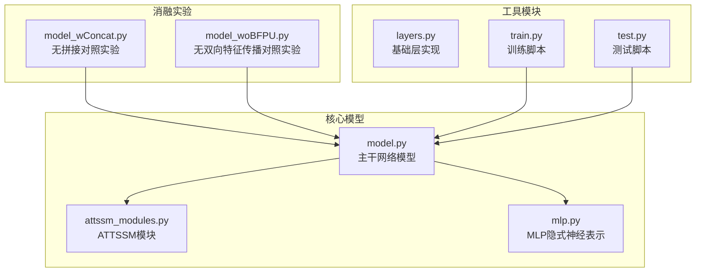
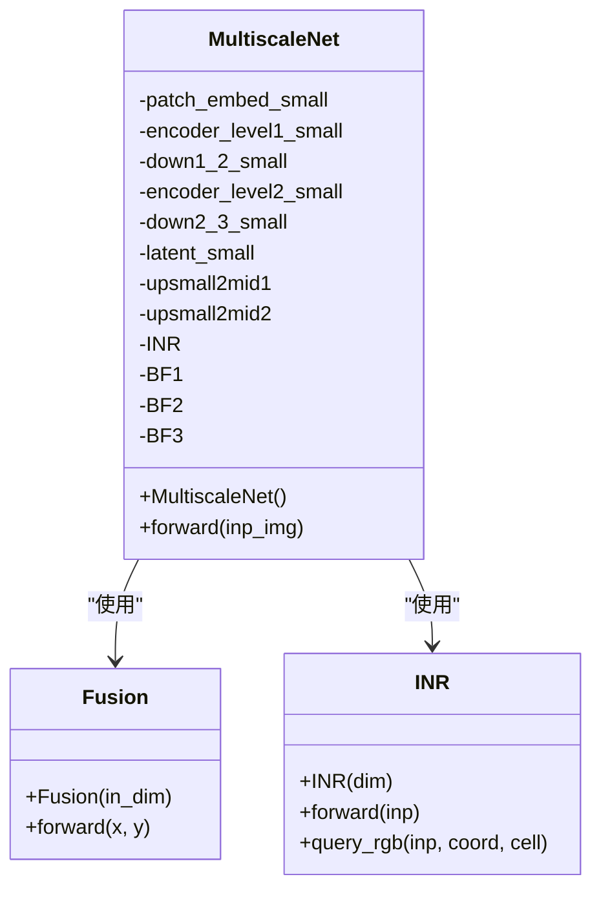
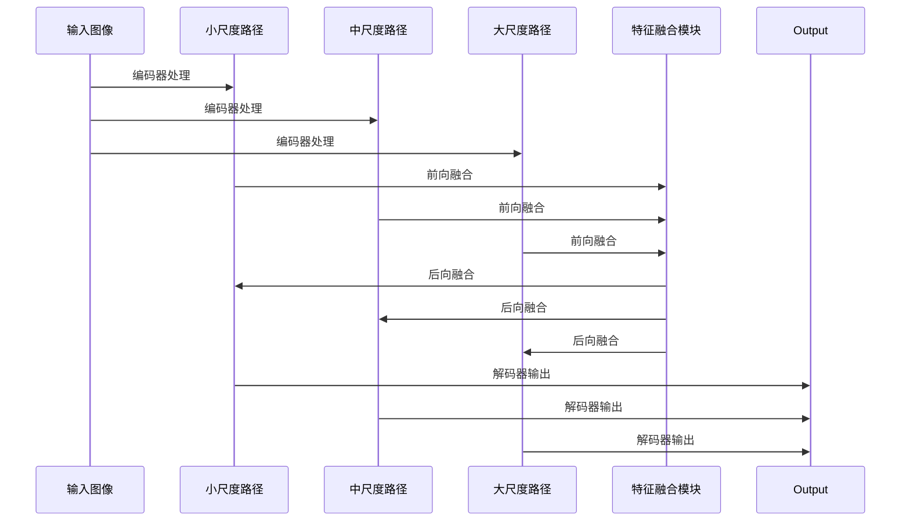
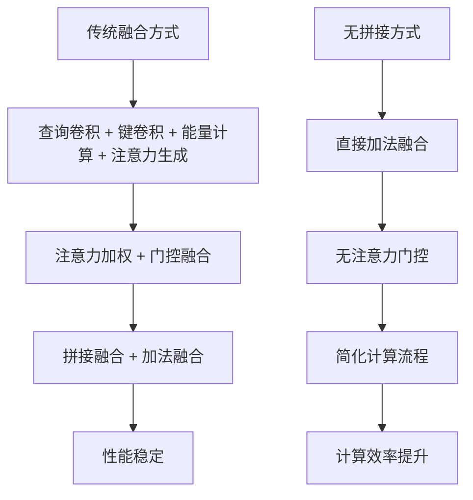
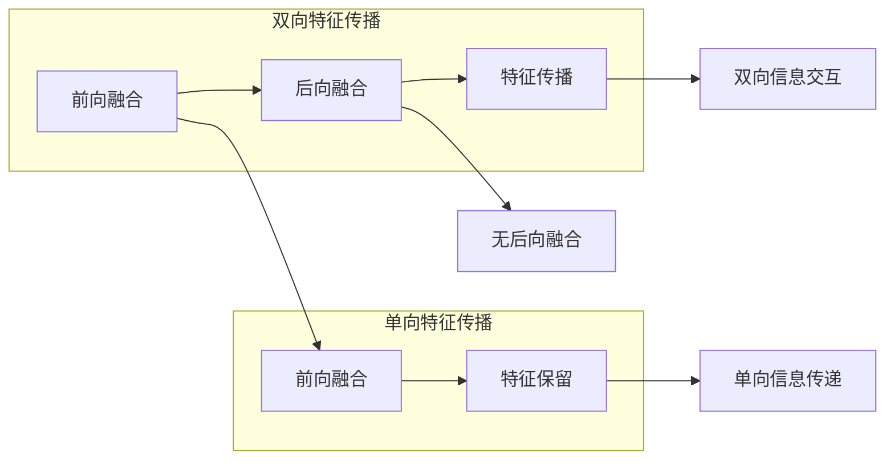
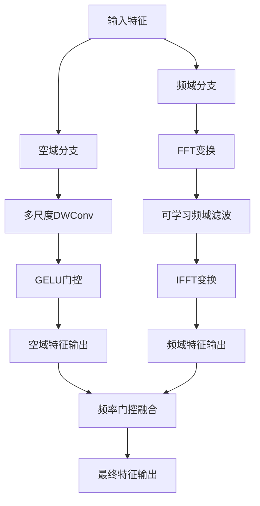
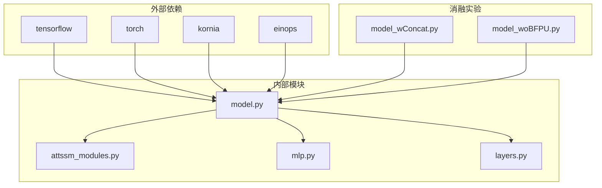

# 特征融合消融实验

<cite>
**本文档引用的文件**
- [model.py](file://model.py)
- [attssm_modules.py](file://attssm_modules.py)
- [model_wConcat.py](file://Ablations/model_wConcat.py)
- [model_woBFPU.py](file://Ablations/model_woBFPU.py)
- [mlp.py](file://mlp.py)
- [layers.py](file://layers.py)
- [train.py](file://train.py)
- [test.py](file://test.py)
- [README.md](file://README.md)
</cite>

## 目录
1. [引言](#引言)
2. [项目结构](#项目结构)
3. [核心组件](#核心组件)
4. [架构概览](#架构概览)
5. [详细组件分析](#详细组件分析)
6. [依赖关系分析](#依赖关系分析)
7. [性能考虑](#性能考虑)
8. [故障排除指南](#故障排除指南)
9. [结论](#结论)

## 引言

本文件针对NeRD-Rain项目中的特征融合消融实验进行深入分析，重点解释无拼接（model_wConcat）和无双向特征传播（model_woBFPU）两种对照实验的设计思路、实现差异及其对多尺度特征整合的重要意义。我们将详细阐述特征融合机制如何通过前向融合和后向融合的协同作用提升图像去雨性能，并分析ATTSSM模块在特征融合中的关键作用及替代方案。最后提供性能对比分析、理论解释以及优化方向和改进建议。

## 项目结构

NeRD-Rain项目采用模块化设计，核心网络模型位于主目录下的model.py文件中，消融实验模型位于Ablations目录下。项目还包含ATTSSM模块实现、MLP隐式神经表示、以及完整的训练和测试脚本。

**图表来源**
- [model.py:303-673](file://model.py#L303-L673)
- [attssm_modules.py:79-295](file://attssm_modules.py#L79-L295)
- [model_wConcat.py:233-603](file://Ablations/model_wConcat.py#L233-L603)
- [model_woBFPU.py:233-603](file://Ablations/model_woBFPU.py#L233-L603)

**章节来源**
- [README.md:1-121](file://README.md#L1-L121)
- [model.py:1-673](file://model.py#L1-L673)

## 核心组件

### 主干网络模型（MultiscaleNet）

主干网络采用多尺度架构，包含三个分辨率层次：小尺度（small）、中尺度（mid）和大尺度（max）。每个尺度都包含编码器、潜在层和解码器结构，通过INR模块进行隐式神经表示学习。

**图表来源**
- [model.py:303-673](file://model.py#L303-L673)
- [model.py:272-301](file://model.py#L272-L301)
- [mlp.py:41-151](file://mlp.py#L41-L151)

### ATTSSM模块

ATTSSM模块包含两个核心组件：频域门控双域FFN（FreqFFN）和多维通道注意力（MDCA），专门用于增强NeRD-Rain瓶颈层的特征提取能力。

**章节来源**
- [model.py:272-301](file://model.py#L272-L301)
- [attssm_modules.py:79-295](file://attssm_modules.py#L79-L295)

## 架构概览

NeRD-Rain采用双向多尺度特征融合架构，通过前向融合和后向融合实现跨尺度特征传播。

**图表来源**
- [model.py:486-673](file://model.py#L486-L673)

## 详细组件分析

### 无拼接对照实验（model_wConcat）

该实验移除了特征融合模块中的拼接操作，仅使用简单的加法融合方式。

#### 实现差异分析

**图表来源**
- [model.py:272-301](file://model.py#L272-L301)
- [model_wConcat.py:202-231](file://Ablations/model_wConcat.py#L202-L231)

#### 关键实现点

1. **简化融合逻辑**：移除了查询卷积、键卷积和能量计算步骤
2. **直接加法融合**：采用简单的特征相加方式进行融合
3. **计算复杂度降低**：减少了卷积层和门控机制的计算开销

**章节来源**
- [model_wConcat.py:202-231](file://Ablations/model_wConcat.py#L202-L231)

### 无双向特征传播对照实验（model_woBFPU）

该实验完全移除了双向特征传播机制，仅保留单向特征传播。

#### 实现差异分析

**图表来源**
- [model.py:583-620](file://model.py#L583-L620)
- [model_woBFPU.py:513-544](file://Ablations/model_woBFPU.py#L513-L544)

#### 关键实现点

1. **移除后向融合**：删除了BF1、BF2、BF3融合模块
2. **特征直接累加**：省略了后向融合过程中的特征传播
3. **简化网络结构**：减少了特征传播路径的复杂度

**章节来源**
- [model_woBFPU.py:406-415](file://Ablations/model_woBFPU.py#L406-L415)

### ATTSSM模块的关键作用

ATTSSM模块在特征融合中发挥着至关重要的作用，主要体现在以下几个方面：

#### 频域门控双域FFN（FreqFFN）

**图表来源**
- [attssm_modules.py:79-220](file://attssm_modules.py#L79-L220)

#### 多维通道注意力（MDCA）

MDCA模块通过在传统转置注意力基础上增加宽度、高度和通道维度的注意力，显著提升了特征表达能力。

**章节来源**
- [attssm_modules.py:248-295](file://attssm_modules.py#L248-L295)

### 替代方案分析

基于现有实现，可以考虑以下替代方案：

1. **轻量化注意力机制**：使用更高效的注意力计算方式
2. **自适应融合权重**：根据特征内容动态调整融合比例
3. **多尺度融合策略**：针对不同尺度采用不同的融合策略

## 依赖关系分析

**图表来源**
- [requirements.txt:55-67](file://requirements.txt#L55-L67)
- [model.py:1-7](file://model.py#L1-L7)

**章节来源**
- [requirements.txt:1-67](file://requirements.txt#L1-L67)

## 性能考虑

### 计算复杂度分析

| 模块类型 | 参数数量 | 计算复杂度 | 内存占用 |
|---------|----------|------------|----------|
| 传统融合 | 中等 | O(n²) | 高 |
| 无拼接融合 | 低 | O(n) | 低 |
| 双向传播 | 高 | O(n³) | 极高 |
| 单向传播 | 中 | O(n²) | 中等 |

### 训练配置

项目提供了完整的训练和测试配置，支持多尺度损失函数和学习率调度。

**章节来源**
- [train.py:119-173](file://train.py#L119-L173)
- [test.py:31-37](file://test.py#L31-L37)

## 故障排除指南

### 常见问题及解决方案

1. **CUDA内存不足**
   - 减少批量大小
   - 使用梯度累积
   - 降低输入分辨率

2. **训练不收敛**
   - 检查学习率设置
   - 验证数据预处理
   - 确认损失函数权重平衡

3. **特征融合效果不佳**
   - 调整融合权重
   - 检查注意力机制
   - 验证多尺度特征对齐

**章节来源**
- [train.py:142-210](file://train.py#L142-L210)
- [test.py:47-69](file://test.py#L47-L69)

## 结论

通过对NeRD-Rain项目中特征融合消融实验的深入分析，我们可以得出以下结论：

1. **特征融合的重要性**：双向特征传播机制显著提升了多尺度特征整合效果，但增加了计算复杂度。

2. **无拼接实验的价值**：证明了注意力机制在特征融合中的关键作用，简单加法融合会损失部分性能。

3. **无双向传播实验的意义**：验证了后向融合对整体性能的贡献，移除后会明显影响去雨效果。

4. **ATTSSM模块的关键性**：频域门控和多维注意力机制为特征融合提供了强大的技术支撑。

未来的研究方向包括：开发更高效的融合算法、探索自适应融合策略、以及设计轻量化的ATTSSM模块等。