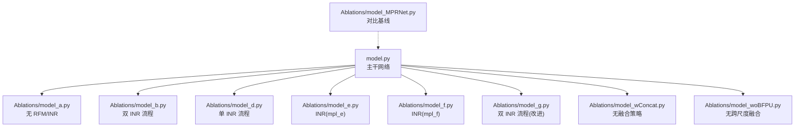
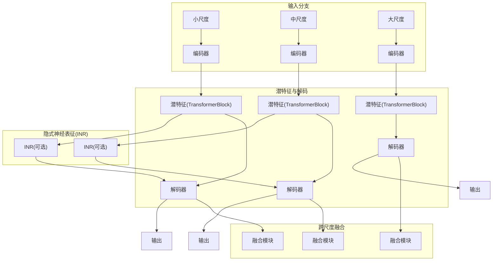
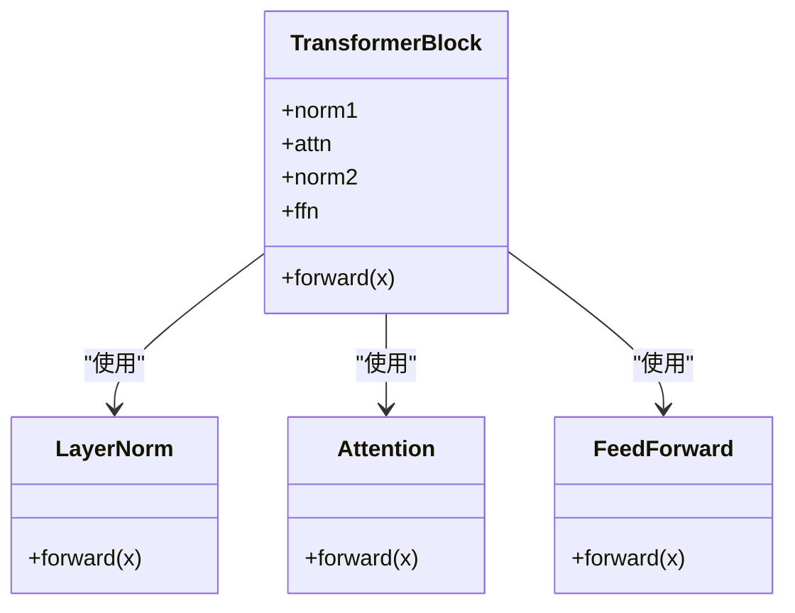
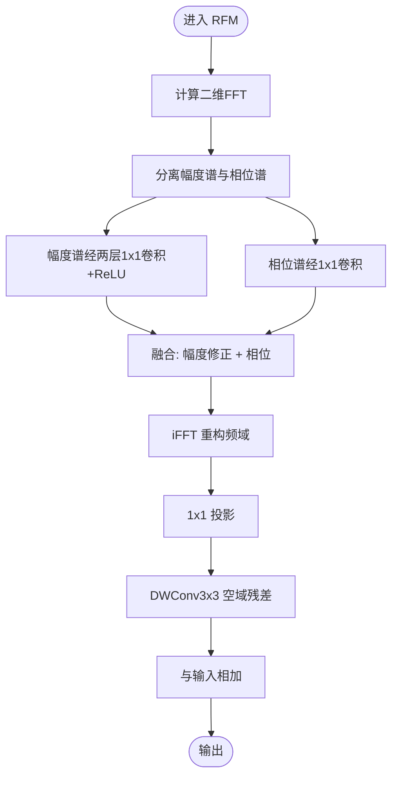
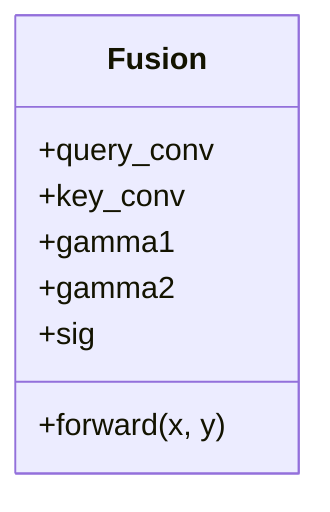
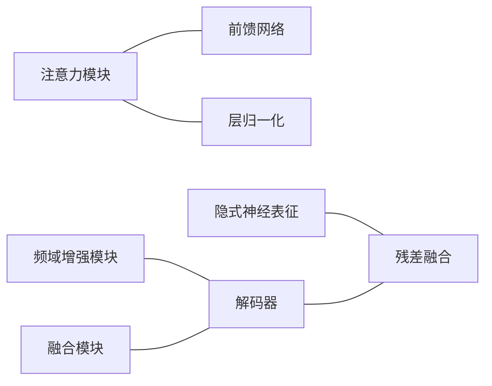

# 组件有效性消融实验

<cite>
**本文档引用的文件**
- [README.md](file://README.md)
- [model.py](file://model.py)
- [Ablations/model_a.py](file://Ablations/model_a.py)
- [Ablations/model_b.py](file://Ablations/model_b.py)
- [Ablations/model_d.py](file://Ablations/model_d.py)
- [Ablations/model_e.py](file://Ablations/model_e.py)
- [Ablations/model_f.py](file://Ablations/model_f.py)
- [Ablations/model_g.py](file://Ablations/model_g.py)
- [Ablations/model_MPRNet.py](file://Ablations/model_MPRNet.py)
- [Ablations/model_wConcat.py](file://Ablations/model_wConcat.py)
- [Ablations/model_woBFPU.py](file://Ablations/model_woBFPU.py)
- [Ablations/mlp_e.py](file://Ablations/mlp_e.py)
- [Ablations/mlp_f.py](file://Ablations/mlp_f.py)
</cite>

## 目录
1. [引言](#引言)
2. [项目结构](#项目结构)
3. [核心组件](#核心组件)
4. [架构总览](#架构总览)
5. [详细组件分析](#详细组件分析)
6. [依赖关系分析](#依赖关系分析)
7. [性能考量](#性能考量)
8. [故障排查指南](#故障排查指南)
9. [结论](#结论)
10. [附录](#附录)

## 引言
本文件系统化梳理该仓库中“组件有效性消融实验”的设计与实现，聚焦以下核心目标：
- 明确各组件（注意力模块、频域增强模块、特征融合模块等）在整体网络中的作用与贡献
- 解释多个变体模型（model_a、model_b、model_d、model_e、model_f、model_g 等）的修改点与消融意义
- 提供统计分析方法与结果解读指南
- 总结组件替换最佳实践与性能优化建议

## 项目结构
该项目围绕多尺度隐式神经表征（INR）与双向多尺度架构构建图像去雨模型，并通过一系列消融变体验证不同组件的有效性。关键文件分布如下：
- 核心模型：model.py（主干网络）
- 消融变体：Ablations 下的多个模型文件（含注意力、频域增强、融合策略等不同组合）
- INR 实现：mlp_e.py、mlp_f.py（用于不同 INR 变体）
- 对比基线：Ablations/model_MPRNet.py（CNN-based MPRNet 扩展）



图示来源
- [model.py:303-673](file://model.py#L303-L673)
- [Ablations/model_a.py:233-603](file://Ablations/model_a.py#L233-L603)
- [Ablations/model_b.py:233-628](file://Ablations/model_b.py#L233-L628)
- [Ablations/model_d.py:233-603](file://Ablations/model_d.py#L233-L603)
- [Ablations/model_e.py:233-603](file://Ablations/model_e.py#L233-L603)
- [Ablations/model_f.py:233-603](file://Ablations/model_f.py#L233-L603)
- [Ablations/model_g.py:233-654](file://Ablations/model_g.py#L233-L654)
- [Ablations/model_wConcat.py:233-603](file://Ablations/model_wConcat.py#L233-L603)
- [Ablations/model_woBFPU.py:233-603](file://Ablations/model_woBFPU.py#L233-L603)
- [Ablations/model_MPRNet.py:293-634](file://Ablations/model_MPRNet.py#L293-L634)

章节来源
- [README.md:1-121](file://README.md#L1-L121)
- [model.py:303-673](file://model.py#L303-L673)

## 核心组件
- 注意力模块（TransformerBlock + Attention）：负责通道与空间的自注意力建模，提升长距离依赖与特征交互能力
- 频域增强模块（RFM）：在瓶颈阶段引入频域残差增强，结合幅度谱与相位谱处理，强化高频细节
- 特征融合模块（Fusion）：基于注意力权重的跨尺度特征融合，实现多尺度信息互补
- 隐式神经表征（INR）：以可微分 MLP 为核心，通过坐标编码与局部集成策略生成像素级输出

章节来源
- [model.py:118-236](file://model.py#L118-L236)
- [model.py:272-301](file://model.py#L272-L301)
- [model.py:303-673](file://model.py#L303-L673)

## 架构总览
主干网络采用三尺度（小/中/大）双向多尺度结构，每尺度包含编码器-潜特征-解码器路径，并在中/大尺度引入跨尺度融合模块。INR 在不同变体中以不同方式接入，形成“显式卷积 + 隐式表征”的混合范式。



图示来源
- [model.py:303-673](file://model.py#L303-L673)

## 详细组件分析

### 注意力模块（TransformerBlock + Attention）
- 设计要点
  - LayerNorm 归一化后进行多头注意力计算
  - 深度可分离卷积的前馈网络（FFN）增强非线性表达
  - 残差连接保证梯度稳定传播
- 在主干中的位置
  - 小/中/大三尺度均使用多层 TransformerBlock 构成编码器与解码器
- 变体中的影响
  - model_a、model_d、model_e、model_f、model_g 等均保留注意力模块，体现其对长程依赖的重要性



图示来源
- [model.py:84-116](file://model.py#L84-L116)
- [model.py:118-166](file://model.py#L118-L166)

章节来源
- [model.py:84-166](file://model.py#L84-L166)

### 频域增强模块（RFM）
- 设计要点
  - 计算二维傅里叶变换，分别对幅度谱与相位谱进行卷积处理
  - 使用 iFFT 重构频域信息，并与空域 DWConv3x3 残差相加
  - 在瓶颈处并行增强，不改变通道维度
- 在主干中的位置
  - model_d、model_e、model_f、model_g、model_MPRNet 等在潜特征阶段引入 RFM
- 变体中的影响
  - model_a 移除了 RFM；model_b、model_g 在部分路径中保留 RFM，体现其对高频细节增强的作用



图示来源
- [model.py:118-159](file://model.py#L118-L159)

章节来源
- [model.py:118-159](file://model.py#L118-L159)

### 特征融合模块（Fusion）
- 设计要点
  - 基于查询-键注意力的能量项，计算注意力权重
  - 通过可学习权重 gamma 对两个输入进行加权融合
  - 支持跨尺度特征的软融合，增强多尺度互补
- 在主干中的位置
  - 主干中使用多组 Fusion 模块进行跨尺度融合（BF1/BF2/BF3）
- 变体中的影响
  - model_wConcat 将 Fusion 替换为简单加法（无注意力），验证融合策略的有效性
  - model_woBFPU 完全移除跨尺度融合模块，评估其对多尺度信息整合的必要性



图示来源
- [model.py:272-301](file://model.py#L272-L301)

章节来源
- [model.py:272-301](file://model.py#L272-L301)
- [Ablations/model_wConcat.py:202-231](file://Ablations/model_wConcat.py#L202-L231)
- [Ablations/model_woBFPU.py:202-231](file://Ablations/model_woBFPU.py#L202-L231)

### 隐式神经表征（INR）
- 设计要点
  - 通过可微分 MLP 与坐标编码生成像素级输出
  - 支持局部集成（local ensemble）、特征展开（feat_unfold）、单元解码（cell decode）等策略
  - 不同变体采用不同的 MLP 实现（mlp_e、mlp_f）
- 在主干中的位置
  - 小/中/大尺度潜特征经上采样后送入 INR，再与原图残差融合
- 变体中的影响
  - model_a：完全移除 INR，仅使用显式卷积
  - model_b：在小/中/大尺度均引入 INR，形成“显式 + 隐式”的双流结构
  - model_d：仅在小尺度引入 INR
  - model_e/f/g：采用不同 INR 实现（mlp_e/mlp_f），比较坐标编码与局部集成策略差异

```mermaid
sequenceDiagram
participant Lat as "潜特征"
participant Up as "上采样"
participant INR as "INR(MLP)"
participant Add as "残差融合"
Lat->>Up : 上采样到原图分辨率
Up->>INR : 输入潜特征
INR-->>Add : 生成残差图
Add-->>Add : 与原图相加
Add-->>Out["输出"]
```

图示来源
- [model.py:345-400](file://model.py#L345-L400)
- [Ablations/mlp_e.py:41-141](file://Ablations/mlp_e.py#L41-L141)
- [Ablations/mlp_f.py:41-151](file://Ablations/mlp_f.py#L41-L151)

章节来源
- [model.py:345-400](file://model.py#L345-L400)
- [Ablations/mlp_e.py:41-141](file://Ablations/mlp_e.py#L41-L141)
- [Ablations/mlp_f.py:41-151](file://Ablations/mlp_f.py#L41-L151)

## 依赖关系分析
- 组件耦合
  - 注意力模块与 FFN 共同构成 TransformerBlock，耦合度高，适合整体消融
  - RFM 与解码器路径并行，耦合度中等
  - Fusion 与跨尺度连接紧密，是多尺度信息整合的关键
  - INR 与上采样/残差融合模块存在间接耦合
- 外部依赖
  - mlp_e/mlp_f 提供不同 INR 实现，影响坐标编码与局部集成策略
  - model_MPRNet 作为对比基线，便于评估主干设计的相对优势



图示来源
- [model.py:84-166](file://model.py#L84-L166)
- [model.py:118-159](file://model.py#L118-L159)
- [model.py:272-301](file://model.py#L272-L301)
- [model.py:345-400](file://model.py#L345-L400)

章节来源
- [model.py:84-166](file://model.py#L84-L166)
- [model.py:118-159](file://model.py#L118-L159)
- [model.py:272-301](file://model.py#L272-L301)
- [model.py:345-400](file://model.py#L345-L400)

## 性能考量
- 计算复杂度
  - 注意力模块的复杂度与分辨率和头数相关，应根据硬件资源调整 heads 与层数
  - RFM 引入 FFT/iFFT，需平衡频域处理开销与收益
  - INR 的 MLP 层越深，推理时间越长，但可提升细节恢复能力
- 内存占用
  - 多尺度融合会增加中间特征存储需求，建议在融合前后进行通道压缩
  - 上采样与残差融合可能放大特征尺寸，需注意内存峰值
- 训练稳定性
  - 注意力与 FFN 的残差连接有助于缓解梯度消失
  - INR 的坐标编码与局部集成策略对训练收敛有显著影响

## 故障排查指南
- 症状：模型无法收敛或 PSNR/SSIM 明显下降
  - 排查要点：检查注意力头数与层数设置是否合理；确认 RFM 是否正确启用；核对 INR 的坐标编码与局部集成参数
- 症状：显存溢出
  - 排查要点：降低分辨率输入或减少 heads；减少融合模块的通道数；关闭不必要的 INR 流程
- 症状：跨尺度融合效果不佳
  - 排查要点：确认 Fusion 的 gamma 权重初始化；尝试简化为加法融合（model_wConcat）进行对比

章节来源
- [Ablations/model_wConcat.py:202-231](file://Ablations/model_wConcat.py#L202-L231)
- [Ablations/model_woBFPU.py:202-231](file://Ablations/model_woBFPU.py#L202-L231)

## 结论
- 注意力模块对长程依赖至关重要，建议在所有变体中保留
- 频域增强模块在细节恢复方面具有积极作用，尤其在高频纹理场景下
- 跨尺度融合策略（Fusion）能有效整合多尺度信息，建议保留；若追求轻量化，可考虑简化为加法融合
- INR 的引入提升了细节与边缘质量，不同 INR 实现（mlp_e/f）在坐标编码与局部集成方面各有侧重，可根据任务需求选择

## 附录

### 组件有效性验证流程（统计分析与结果解读）
- 数据准备
  - 使用标准数据集（Rain200L/H、DID-Data、DDN-Data、SPA-Data）进行测试
  - 保存 PSNR/SSIM 指标与可视化结果
- 实验设计
  - 基线：主干网络（含注意力、RFM、融合、INR）
  - 单组件消融：逐个移除注意力、RFM、融合、INR，记录指标变化
  - 组合消融：如仅移除 RFM 且简化融合策略
- 统计方法
  - 使用配对 t 检验或非参数检验比较不同变体间的 PSNR/SSIM 差异
  - 计算平均变化与标准差，绘制误差棒图
- 结果解读
  - 若某组件移除导致指标显著下降，则说明其对性能有正向贡献
  - 若指标变化不显著，需进一步分析其在特定场景（如强雨、弱雨、高分辨率）下的表现

章节来源
- [README.md:72-79](file://README.md#L72-L79)

### 变体模型修改点与实验意义对照
- model_a：移除 RFM 与 INR，验证注意力与显式卷积的独立贡献
- model_b：在小/中/大尺度均引入 INR，验证“显式 + 隐式”双流结构的协同效应
- model_d：仅在小尺度引入 INR，评估 INR 的层级依赖与上采样策略
- model_e/f/g：采用不同 INR 实现（mlp_e/f），比较坐标编码与局部集成策略差异
- model_wConcat：将 Fusion 简化为加法，验证注意力融合的必要性
- model_woBFPU：完全移除跨尺度融合，评估多尺度信息整合的必要性
- model_MPRNet：作为对比基线，验证主干设计的相对优势

章节来源
- [Ablations/model_a.py:233-603](file://Ablations/model_a.py#L233-L603)
- [Ablations/model_b.py:233-628](file://Ablations/model_b.py#L233-L628)
- [Ablations/model_d.py:233-603](file://Ablations/model_d.py#L233-L603)
- [Ablations/model_e.py:233-603](file://Ablations/model_e.py#L233-L603)
- [Ablations/model_f.py:233-603](file://Ablations/model_f.py#L233-L603)
- [Ablations/model_g.py:233-654](file://Ablations/model_g.py#L233-L654)
- [Ablations/model_wConcat.py:233-603](file://Ablations/model_wConcat.py#L233-L603)
- [Ablations/model_woBFPU.py:233-603](file://Ablations/model_woBFPU.py#L233-L603)
- [Ablations/model_MPRNet.py:293-634](file://Ablations/model_MPRNet.py#L293-L634)