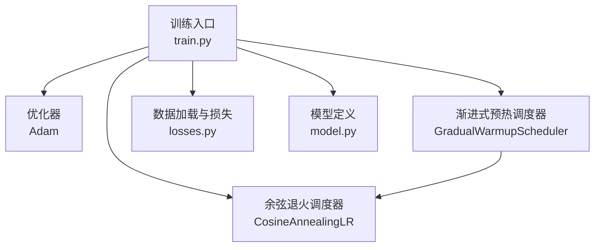
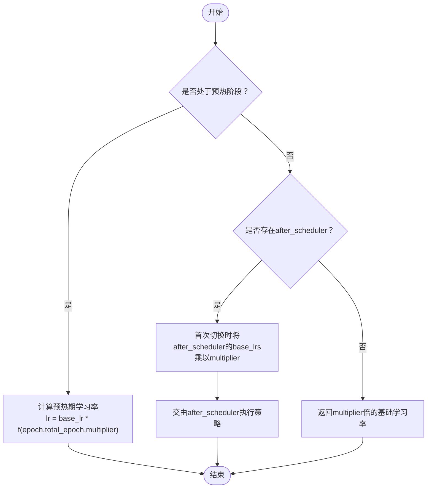
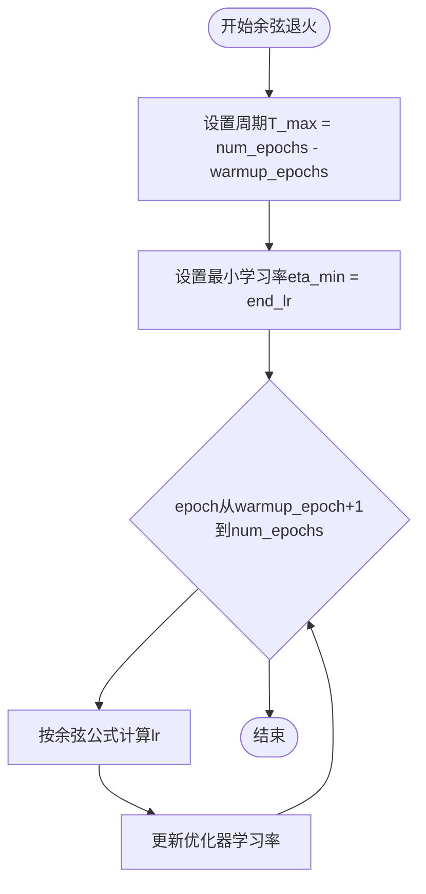
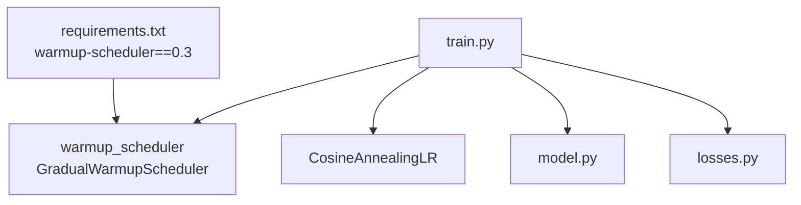

# 学习率调度策略

<cite>
**本文引用的文件**
- [train.py](file://train.py)
- [scheduler.py](file://pytorch-gradual-warmup-lr/warmup_scheduler/scheduler.py)
- [run.py](file://pytorch-gradual-warmup-lr/warmup_scheduler/run.py)
- [requirements.txt](file://requirements.txt)
- [README.md](file://README.md)
- [model.py](file://model.py)
- [losses.py](file://losses.py)
- [model_utils.py](file://utils/model_utils.py)
</cite>

## 目录
1. [引言](#引言)
2. [项目结构](#项目结构)
3. [核心组件](#核心组件)
4. [架构总览](#架构总览)
5. [详细组件分析](#详细组件分析)
6. [依赖分析](#依赖分析)
7. [性能考虑](#性能考虑)
8. [故障排查指南](#故障排查指南)
9. [结论](#结论)
10. [附录：学习率策略对比与调优指南](#附录学习率策略对比与调优指南)

## 引言
本文件围绕本仓库中的学习率调度策略展开，重点解释渐进式warmup学习率预热机制（GradualWarmupScheduler）与余弦退火学习率调度器（CosineAnnealingLR）的原理、实现与组合使用方式，并结合训练脚本展示其在实际训练过程中的作用与效果。同时提供不同学习率策略的对比分析与调优建议，帮助读者在图像去雨任务中合理选择与配置学习率策略。

## 项目结构
本项目采用“模型-损失-训练”分层组织，学习率调度位于训练脚本中，通过第三方warmup包提供渐进式预热能力，并与PyTorch自带的余弦退火调度器组合使用。



图表来源
- [train.py:83-88](file://train.py#L83-L88)
- [scheduler.py:5-37](file://pytorch-gradual-warmup-lr/warmup_scheduler/scheduler.py#L5-L37)

章节来源
- [train.py:1-218](file://train.py#L1-L218)
- [requirements.txt:62](file://requirements.txt#L62)

## 核心组件
- 渐进式预热调度器（GradualWarmupScheduler）
  - 作用：在训练初期以线性或比例方式缓慢提升学习率，避免刚初始化时的不稳定梯度导致发散。
  - 关键参数：
    - multiplier：目标倍率，multiplier=1时从0线性上升到基础学习率；multiplier>1时从基础学习率按比例放大。
    - total_epoch：完成预热所需的epoch数。
    - after_scheduler：预热结束后使用的调度器（如余弦退火）。
- 余弦退火调度器（CosineAnnealingLR）
  - 作用：在预热后以余弦曲线形式周期性降低学习率至eta_min，有助于跳出局部最优并稳定收敛。
  - 关键参数：
    - T_max：余弦退火周期（总epoch数减去warmup_epoch）。
    - eta_min：最小学习率下界。

章节来源
- [train.py:85-88](file://train.py#L85-L88)
- [scheduler.py:16-37](file://pytorch-gradual-warmup-lr/warmup_scheduler/scheduler.py#L16-L37)

## 架构总览
训练循环中，学习率调度器与优化器紧密配合：每轮epoch结束时调用scheduler.step()更新学习率，训练日志中打印当前学习率，TensorBoard记录损失与学习率变化。

```mermaid
sequenceDiagram
participant Trainer as "训练循环<br/>train.py"
participant Opt as "优化器<br/>Adam"
participant Warm as "预热调度器<br/>GradualWarmupScheduler"
participant Cos as "余弦退火调度器<br/>CosineAnnealingLR"
Trainer->>Opt : 初始化优化器(lr=start_lr)
Trainer->>Warm : 创建预热调度器(total_epoch=warmup_epochs, multiplier=1)
Trainer->>Cos : 创建余弦退火(T_max=num_epochs-warmup_epochs, eta_min=end_lr)
Warm->>Cos : 组合为after_scheduler
loop 每个epoch
Trainer->>Trainer : 训练前向/反向/优化
Trainer->>Warm : step()
alt 预热阶段
Warm-->>Opt : 线性/比例提升学习率
else 预热结束
Warm->>Cos : 将after_scheduler的base_lrs按multiplier缩放
Cos-->>Opt : 余弦退火下降学习率
end
Trainer->>Trainer : 打印/记录学习率
end
```

图表来源
- [train.py:142-205](file://train.py#L142-L205)
- [train.py:85-88](file://train.py#L85-L88)
- [scheduler.py:25-37](file://pytorch-gradual-warmup-lr/warmup_scheduler/scheduler.py#L25-L37)

## 详细组件分析

### 渐进式warmup学习率预热机制
- 工作流程
  - 初始化：设置multiplier、total_epoch与after_scheduler。
  - 预热阶段（last_epoch ≤ total_epoch）：
    - 当multiplier=1时，学习率按线性从0增长到基础学习率。
    - 当multiplier>1时，学习率按比例从基础学习率逐步上升至multiplier倍的基础学习率。
  - 预热结束（last_epoch > total_epoch）：
    - 若存在after_scheduler，则在首次切换时将after_scheduler的base_lrs乘以multiplier，然后交由after_scheduler继续管理。
    - 若不存在after_scheduler，则直接返回multiplier倍的基础学习率。
  - 特殊处理：当after_scheduler为ReduceLROnPlateau时，step_ReduceLROnPlateau单独处理，确保在预热期内正确更新学习率并在plateau触发后继续工作。
- 数学公式
  - 预热期（multiplier=1）：lr(epoch) ∝ epoch / total_epoch
  - 预热期（multiplier>1）：lr(epoch) = base_lr × [1 + (multiplier-1) × epoch / total_epoch]
  - 预热后：若after_scheduler存在，先将after_scheduler的base_lrs按multiplier缩放，再由after_scheduler执行后续策略。
- 实现要点
  - finished标志用于避免重复缩放after_scheduler的base_lrs。
  - last_epoch控制是否进入预热期或预热后阶段。
  - 对ReduceLROnPlateau的特殊处理保证了在预热期内也能根据指标动态调整学习率。



图表来源
- [scheduler.py:25-37](file://pytorch-gradual-warmup-lr/warmup_scheduler/scheduler.py#L25-L37)
- [scheduler.py:53-63](file://pytorch-gradual-warmup-lr/warmup_scheduler/scheduler.py#L53-L63)

章节来源
- [scheduler.py:5-63](file://pytorch-gradual-warmup-lr/warmup_scheduler/scheduler.py#L5-L63)

### 余弦退火学习率调度器
- 数学原理
  - 余弦退火在每个周期内将学习率按余弦曲线单调递减至eta_min，周期长度为T_max。
  - 公式：lr(t) = eta_min + 0.5×(base_lr - eta_min)×(1 + cos(π×t/T_max))，其中t为当前epoch。
- 参数配置
  - T_max：余弦退火周期，通常取为总训练epoch减去warmup_epoch。
  - eta_min：最小学习率，用于在后期稳定收敛。
- 在本项目中的应用
  - 与GradualWarmupScheduler组合：warmup_epochs=3，T_max=num_epochs - warmup_epochs，eta_min=end_lr。
  - 预热结束后，after_scheduler接收base_lrs并按multiplier缩放，再进入余弦退火。



图表来源
- [train.py:87](file://train.py#L87)
- [scheduler.py:25-37](file://pytorch-gradual-warmup-lr/warmup_scheduler/scheduler.py#L25-L37)

章节来源
- [train.py:87](file://train.py#L87)

### 训练脚本中的调度器使用
- 初始化与组合
  - 定义start_lr、end_lr、num_epochs、warmup_epochs。
  - 创建Adam优化器与CosineAnnealingLR，随后用GradualWarmupScheduler包裹，形成“warmup → 余弦退火”的链式调度。
- 恢复与继续训练
  - 支持断点续训：加载最新检查点后，对已走过的epoch调用scheduler.step()以保持学习率状态一致。
- 训练循环中的调度
  - 每轮epoch结束调用scheduler.step()，并在日志中打印当前学习率，便于监控。

```mermaid
sequenceDiagram
participant Train as "train.py"
participant Opt as "Adam优化器"
participant Warm as "GradualWarmupScheduler"
participant Cos as "CosineAnnealingLR"
Train->>Opt : 初始化lr=start_lr
Train->>Cos : 创建T_max=num_epochs-warmup_epochs, eta_min=end_lr
Train->>Warm : 包装Cos为after_scheduler
Train->>Train : 断点恢复：对已过epoch调用scheduler.step()
loop 每个epoch
Train->>Train : 前向/反向/优化
Train->>Warm : step()
Warm-->>Opt : 更新学习率
Train->>Train : 记录/打印学习率
end
```

图表来源
- [train.py:68-88](file://train.py#L68-L88)
- [train.py:103-114](file://train.py#L103-L114)
- [train.py:205](file://train.py#L205)

章节来源
- [train.py:68-114](file://train.py#L68-L114)
- [train.py:205](file://train.py#L205)

## 依赖分析
- 第三方包
  - warmup-scheduler==0.3：提供GradualWarmupScheduler类，用于渐进式预热。
  - torch/torchaudio/torchvision：PyTorch生态，提供优化器与调度器基类。
- 项目内部依赖
  - train.py导入warmup_scheduler并组合CosineAnnealingLR。
  - model.py定义网络结构，losses.py定义损失函数，二者共同决定训练稳定性与收敛速度，间接影响学习率策略的选择。



图表来源
- [requirements.txt:62](file://requirements.txt#L62)
- [train.py:23](file://train.py#L23)
- [train.py:87](file://train.py#L87)

章节来源
- [requirements.txt:62](file://requirements.txt#L62)
- [train.py:23](file://train.py#L23)
- [train.py:87](file://train.py#L87)

## 性能考虑
- 预热时间（warmup_epochs）
  - 过短可能导致初始阶段不稳定；过长会延迟学习率充分下降，影响收敛速度。建议根据batch_size与模型规模进行试调。
- 余弦退火周期（T_max）
  - T_max越大，学习率下降越平缓，有利于稳定但可能延长收敛时间；T_max过小则易早衰，需结合验证集表现调整。
- 最小学习率（eta_min）
  - 太大可能使后期难以精细收敛；太小会增加训练时间。可与CosineAnnealingLR的终止条件结合使用。
- 断点续训一致性
  - 恢复时对已过epoch调用scheduler.step()，确保学习率序列连续，避免因状态不一致导致的震荡。

[本节为通用指导，无需列出具体文件来源]

## 故障排查指南
- 预热后学习率未生效
  - 检查是否正确传入after_scheduler，以及finished标志是否导致base_lrs仅在首次切换时被缩放。
- ReduceLROnPlateau与warmup混用
  - 使用step_ReduceLROnPlateau路径，确保在预热期内仍能根据指标动态调整学习率。
- 断点恢复学习率异常
  - 确认恢复逻辑中对已过epoch调用了scheduler.step()，避免学习率跳变。
- 训练初期波动大
  - 适当增大warmup_epochs或减小multiplier，使学习率更平滑地过渡。

章节来源
- [scheduler.py:39-63](file://pytorch-gradual-warmup-lr/warmup_scheduler/scheduler.py#L39-L63)
- [train.py:109-114](file://train.py#L109-L114)

## 结论
本项目采用“渐进式warmup + 余弦退火”的学习率策略，在训练初期通过线性/比例提升学习率稳定模型，随后以余弦曲线平滑下降至低值，兼顾快速收敛与后期精细优化。GradualWarmupScheduler与CosineAnnealingLR的组合在实践中具有良好的鲁棒性与可控性，适合大规模图像去雨任务的训练。

[本节为总结性内容，无需列出具体文件来源]

## 附录：学习率策略对比与调优指南

### 不同学习率策略的适用场景
- 固定学习率
  - 适用：简单任务、快速原型验证、对收敛稳定性要求不高。
  - 注意：可能在训练后期陷入局部最优，需要额外技巧（如梯度裁剪）维持稳定。
- 阶梯式衰减（StepLR/ExponentialLR）
  - 适用：需要阶段性大幅降速以跳出局部最优，或对收敛节奏有明确阶段性需求。
  - 注意：跳跃式降速可能造成训练不稳定，需谨慎选择衰减时机与幅度。
- 余弦退火（CosineAnnealingLR）
  - 适用：追求稳定收敛与良好泛化，尤其在大批量训练中表现优异。
  - 注意：需合理设置T_max与eta_min，避免过早或过晚衰减。
- 渐进式warmup + 余弦退火
  - 适用：大规模训练、复杂模型、多GPU分布式训练，既保证初期稳定又能在后期精细收敛。
  - 注意：warmup_epochs与multiplier需与模型规模、batch_size匹配。

### 参数调优建议
- warmup_epochs
  - 初始尝试：总epoch的1/10~1/5；若显存较小或模型较大，可适当增加。
- multiplier
  - 建议从1.0开始，若希望更快进入高学习率阶段可适度增大（>1），但需观察训练初期稳定性。
- T_max
  - 建议设置为总epoch减去warmup_epoch，若训练时间充裕可适当增大以获得更平滑的衰减。
- eta_min
  - 建议从1e-6~1e-7起步，结合验证集PSNR/SSIM表现微调。
- 断点续训
  - 恢复时对已过epoch调用scheduler.step()，确保学习率序列连续。

[本节为通用指导，无需列出具体文件来源]