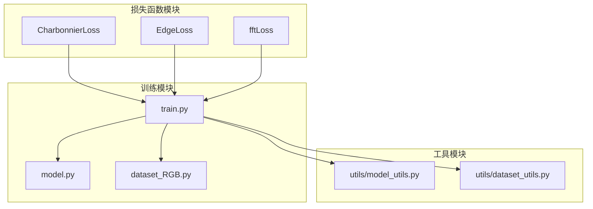
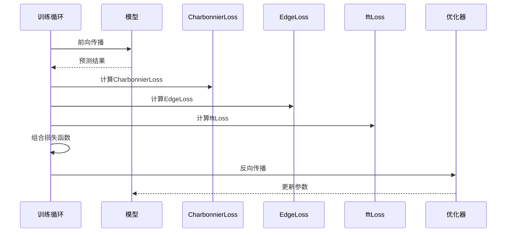
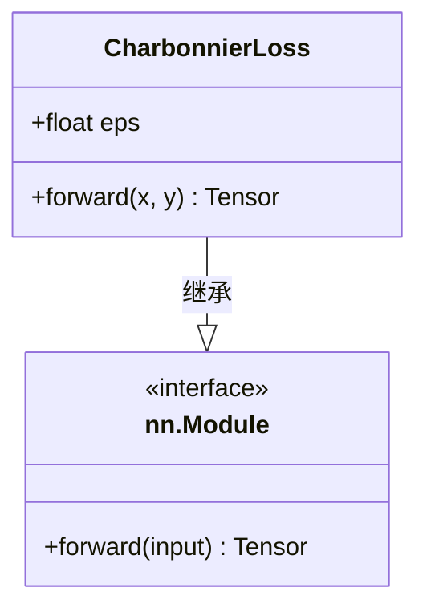
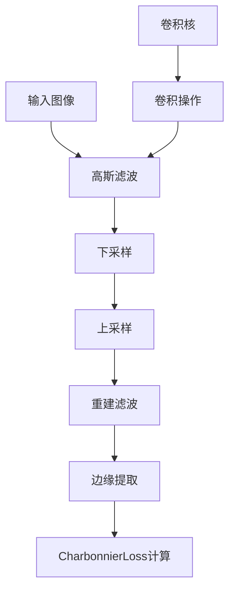
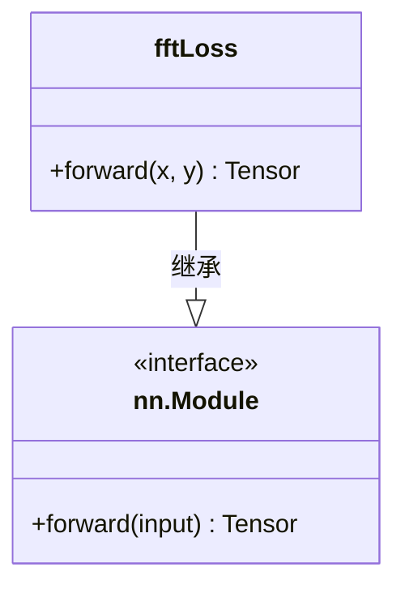
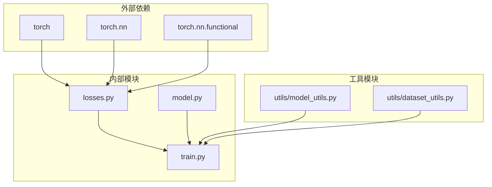

# 损失函数设计

<cite>
**本文档引用的文件**
- [losses.py](file://losses.py)
- [train.py](file://train.py)
- [model.py](file://model.py)
- [README.md](file://README.md)
- [dataset_RGB.py](file://dataset_RGB.py)
- [data_RGB.py](file://data_RGB.py)
- [utils/model_utils.py](file://utils/model_utils.py)
- [utils/dataset_utils.py](file://utils/dataset_utils.py)
</cite>

## 目录
1. [简介](#简介)
2. [项目结构](#项目结构)
3. [核心组件](#核心组件)
4. [架构概览](#架构概览)
5. [详细组件分析](#详细组件分析)
6. [依赖关系分析](#依赖关系分析)
7. [性能考虑](#性能考虑)
8. [故障排除指南](#故障排除指南)
9. [结论](#结论)

## 简介

本文件档专注于图像去雨任务中损失函数模块的设计与实现。该系统实现了三种主要的损失函数：CharbonnierLoss（平滑L1范数）、EdgeLoss（边缘保持机制）和fftLoss（频域约束）。这些损失函数通过组合使用，在训练过程中提供多尺度、多特征的监督信号，以提高图像去雨的质量和鲁棒性。

该损失函数模块是基于深度学习框架构建的，专门针对图像去雨任务进行了优化设计。每个损失函数都有其独特的数学基础和应用场景，通过合理的权重分配和梯度平衡策略，实现了最佳的训练效果。

## 项目结构

该项目采用模块化设计，损失函数模块独立于其他组件，便于维护和扩展。整体项目结构如下：

**图表来源**
- [losses.py:1-52](file://losses.py#L1-L52)
- [train.py:1-218](file://train.py#L1-L218)
- [model.py:303-673](file://model.py#L303-L673)

**章节来源**
- [README.md:1-121](file://README.md#L1-L121)
- [losses.py:1-52](file://losses.py#L1-L52)
- [train.py:1-218](file://train.py#L1-L218)

## 核心组件

损失函数模块包含三个核心组件，每个都实现了特定的功能和数学原理：

### CharbonnierLoss（查博尼尔损失）
- **数学基础**: 使用平滑的L1范数，避免传统L1范数在零点处不可导的问题
- **正则化参数**: 通过eps参数控制平滑程度，防止梯度爆炸
- **应用场景**: 提供稳定的梯度信号，特别适用于图像重建任务

### EdgeLoss（边缘损失）
- **数学基础**: 基于拉普拉斯算子的边缘检测机制
- **实现原理**: 通过高斯滤波和金字塔结构提取边缘特征
- **应用场景**: 强化模型对边缘和纹理细节的恢复能力

### fftLoss（傅里叶变换损失）
- **数学基础**: 在频域空间进行图像比较
- **实现原理**: 利用快速傅里叶变换进行频域约束
- **应用场景**: 提供全局频率信息，改善图像的整体质量

**章节来源**
- [losses.py:5-52](file://losses.py#L5-L52)

## 架构概览

损失函数模块在整个训练系统中的位置和交互关系如下：

**图表来源**
- [train.py:142-167](file://train.py#L142-L167)
- [losses.py:5-52](file://losses.py#L5-L52)

## 详细组件分析

### CharbonnierLoss 实现分析

CharbonnierLoss 是一个平滑化的L1范数损失函数，具有以下特点：

**图表来源**
- [losses.py:5-15](file://losses.py#L5-L15)

#### 数学原理
CharbonnierLoss 使用平滑的L1范数公式：
- 公式: L = Σ√(Δ² + ε²)
- 其中 Δ = x - y，ε为平滑参数
- 当ε→0时，退化为标准L1范数

#### 实现特点
- **数值稳定性**: 通过eps参数避免梯度在零点处的不连续性
- **GPU加速**: 直接在CUDA设备上执行计算
- **内存效率**: 使用in-place操作减少内存占用

**章节来源**
- [losses.py:5-15](file://losses.py#L5-L15)

### EdgeLoss 实现分析

EdgeLoss 基于边缘检测的损失函数，通过拉普拉斯算子提取图像的边缘特征：

**图表来源**
- [losses.py:17-42](file://losses.py#L17-L42)

#### 边缘检测机制
EdgeLoss 实现了多尺度边缘检测：
1. **高斯滤波**: 使用5×5高斯核进行平滑处理
2. **金字塔结构**: 通过下采样-上采样的方式实现多尺度分析
3. **拉普拉斯算子**: 通过差分操作提取边缘信息

#### 卷积核设计
- 使用可分离的高斯核: k = [0.05, 0.25, 0.4, 0.25, 0.05]
- 核矩阵: K = k^T × k
- 重复3个通道以适应RGB图像

**章节来源**
- [losses.py:17-42](file://losses.py#L17-L42)

### fftLoss 实现分析

fftLoss 是基于频域分析的损失函数，利用傅里叶变换提供全局频率信息：

**图表来源**
- [losses.py:44-52](file://losses.py#L44-L52)

#### 频域约束机制
fftLoss 的工作流程：
1. **傅里叶变换**: 对输入和目标图像进行FFT
2. **频域差分**: 计算频域差值
3. **幅度计算**: 取绝对值得到频域幅度
4. **平均损失**: 对所有频率成分求平均

#### 数学基础
- 频域损失函数: L = E[|FFT(x) - FFT(y)|]
- 提供全局频率信息，改善图像的整体质量
- 特别适用于去除周期性噪声和改善图像清晰度

**章节来源**
- [losses.py:44-52](file://losses.py#L44-L52)

## 依赖关系分析

损失函数模块与其他组件的依赖关系：

**图表来源**
- [losses.py:1-3](file://losses.py#L1-L3)
- [train.py:22-26](file://train.py#L22-L26)

### 关键依赖关系

1. **PyTorch框架依赖**: 所有损失函数都基于PyTorch张量操作
2. **CUDA支持**: 自动检测GPU可用性并使用GPU加速
3. **数据类型兼容**: 支持多种数据类型的自动转换

**章节来源**
- [losses.py:1-52](file://losses.py#L1-L52)
- [train.py:1-218](file://train.py#L1-L218)

## 性能考虑

### 计算效率优化

1. **GPU加速**: 所有计算都在CUDA设备上执行
2. **内存管理**: 使用in-place操作减少内存占用
3. **批处理优化**: 支持批量数据处理

### 训练稳定性

1. **梯度控制**: CharbonnierLoss提供更稳定的梯度信号
2. **数值精度**: 使用适当的数值精度避免计算误差
3. **收敛性**: 合理的权重分配确保训练稳定

## 故障排除指南

### 常见问题及解决方案

#### GPU内存不足
- **症状**: CUDA内存溢出错误
- **解决方案**: 减少batch size或使用更小的图像尺寸

#### 梯度消失/爆炸
- **症状**: 训练损失不下降或出现NaN
- **解决方案**: 调整学习率或检查数据预处理

#### 训练不稳定
- **症状**: 损失波动大
- **解决方案**: 调整损失函数权重或使用学习率调度器

### 监控和调试方法

1. **TensorBoard可视化**: 记录各损失函数的损失值
2. **验证集评估**: 定期评估PSNR指标
3. **梯度检查**: 监控梯度范数防止梯度爆炸

**章节来源**
- [train.py:168-173](file://train.py#L168-L173)
- [train.py:188-198](file://train.py#L188-L198)

## 结论

该损失函数模块为图像去雨任务提供了全面而高效的解决方案。通过结合CharbonnierLoss的稳定性、EdgeLoss的边缘保持能力和fftLoss的频域约束，实现了多尺度、多层次的监督信号。

### 主要优势

1. **数学严谨性**: 每个损失函数都有坚实的数学基础
2. **实现高效**: 充分利用GPU加速和内存优化
3. **易于扩展**: 模块化设计便于添加新的损失函数
4. **训练稳定**: 合理的权重分配确保训练过程稳定

### 应用前景

该损失函数设计原则可以推广到其他图像处理任务，如图像去雾、超分辨率等，为深度学习图像处理提供了通用的损失函数设计思路。