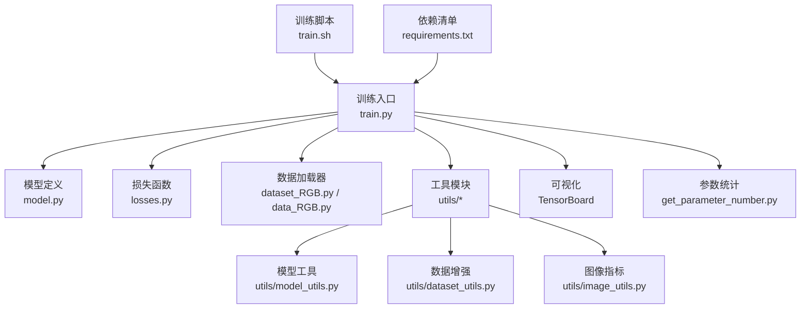
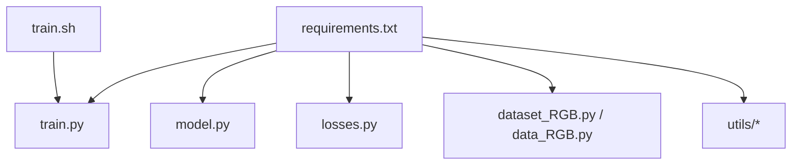

# 训练优化技巧

<cite>
**本文引用的文件**
- [train.py](file://train.py)
- [model.py](file://model.py)
- [losses.py](file://losses.py)
- [dataset_RGB.py](file://dataset_RGB.py)
- [data_RGB.py](file://data_RGB.py)
- [utils/model_utils.py](file://utils/model_utils.py)
- [utils/dataset_utils.py](file://utils/dataset_utils.py)
- [utils/image_utils.py](file://utils/image_utils.py)
- [get_parameter_number.py](file://get_parameter_number.py)
- [train.sh](file://train.sh)
- [requirements.txt](file://requirements.txt)
- [README.md](file://README.md)
</cite>

## 目录
1. [简介](#简介)
2. [项目结构](#项目结构)
3. [核心组件](#核心组件)
4. [架构总览](#架构总览)
5. [详细组件分析](#详细组件分析)
6. [依赖分析](#依赖分析)
7. [性能考量](#性能考量)
8. [故障排查指南](#故障排查指南)
9. [结论](#结论)
10. [附录](#附录)

## 简介
本指南围绕图像去雨任务的训练流程与优化实践展开，结合仓库中现有的训练脚本、模型定义、损失函数与数据加载器，系统梳理GPU内存优化（批大小、混合精度、梯度累积）、多GPU数据并行、训练监控与可视化（TensorBoard）、检查点管理与断点续训、常见问题与对策，以及不同规模数据集的训练策略与资源配置建议。内容以仓库现有实现为依据，避免臆测，确保可操作性与可验证性。

## 项目结构
该仓库采用“功能分层”的组织方式：
- 训练入口：train.py
- 模型定义：model.py
- 损失函数：losses.py
- 数据加载：dataset_RGB.py、data_RGB.py
- 工具模块：utils/*（模型工具、数据增强、图像指标）
- 资源与脚本：requirements.txt、train.sh、README.md、get_parameter_number.py



图表来源
- [train.py:1-218](file://train.py#L1-L218)
- [model.py:1-673](file://model.py#L1-L673)
- [losses.py:1-52](file://losses.py#L1-L52)
- [dataset_RGB.py:1-162](file://dataset_RGB.py#L1-L162)
- [data_RGB.py:1-15](file://data_RGB.py#L1-L15)
- [utils/model_utils.py:1-111](file://utils/model_utils.py#L1-L111)
- [utils/dataset_utils.py:1-18](file://utils/dataset_utils.py#L1-L18)
- [utils/image_utils.py:1-19](file://utils/image_utils.py#L1-L19)
- [get_parameter_number.py:1-20](file://get_parameter_number.py#L1-L20)
- [train.sh:1-7](file://train.sh#L1-L7)
- [requirements.txt:1-67](file://requirements.txt#L1-L67)

章节来源
- [train.py:1-218](file://train.py#L1-L218)
- [README.md:1-121](file://README.md#L1-L121)

## 核心组件
- 训练主循环与调度器：在训练入口中完成设备设置、模型初始化、优化器与学习率调度器、数据加载器、断点续训、多GPU并行包装、损失计算与反向传播、TensorBoard写入、周期性评估与保存。
- 模型结构：多尺度双向特征融合网络，包含多分辨率编码器-解码器路径、隐式神经表示（INR）模块、残差傅里叶模块（RFM）与并行注意力-前馈网络块。
- 损失函数：组合了Charbonnier、边缘检测、频域差异与L1损失，用于提升去雨质量与细节保持。
- 数据加载与增强：支持随机裁剪、翻转旋转、伽马与饱和度扰动、中心裁剪验证。
- 工具模块：检查点加载/保存、冻结/解冻参数、MixUp增强、PSNR计算等。

章节来源
- [train.py:70-218](file://train.py#L70-L218)
- [model.py:303-673](file://model.py#L303-L673)
- [losses.py:5-52](file://losses.py#L5-L52)
- [dataset_RGB.py:13-162](file://dataset_RGB.py#L13-L162)
- [utils/model_utils.py:17-111](file://utils/model_utils.py#L17-L111)
- [utils/dataset_utils.py:3-18](file://utils/dataset_utils.py#L3-L18)
- [utils/image_utils.py:5-19](file://utils/image_utils.py#L5-L19)

## 架构总览
下图展示训练主循环的关键调用序列与数据流。

```mermaid
sequenceDiagram
participant Trainer as "训练器<br/>train.py"
participant Loader as "数据加载器<br/>DataLoader"
participant Model as "模型<br/>MultiscaleNet"
participant Loss as "损失函数<br/>组合损失"
participant Opt as "优化器<br/>Adam"
participant Sched as "调度器<br/>Cosine+Warmup"
participant TB as "TensorBoard<br/>SummaryWriter"
Trainer->>Trainer : 设置设备/种子/基准加速
Trainer->>Model : 初始化模型并移动到GPU
Trainer->>Opt : 创建优化器
Trainer->>Sched : 创建余弦退火+预热调度器
Trainer->>Loader : 构建训练/验证DataLoader
loop 每个epoch
Trainer->>Model : 设置为训练模式
loop 每个batch
Trainer->>Loader : 获取输入/目标
Trainer->>Model : 前向推理
Trainer->>Loss : 计算多路损失
Trainer->>Loss : 反向传播
Trainer->>Opt : 更新参数
Trainer->>TB : 写入迭代级指标
end
Trainer->>Model : 切换为评估模式
loop 验证集
Trainer->>Model : 前向推理
Trainer->>Trainer : 计算PSNR并记录
end
Trainer->>Sched : 学习率步进
Trainer->>TB : 写入epoch级指标
Trainer->>Trainer : 保存最佳/最新检查点
end
```

图表来源
- [train.py:142-218](file://train.py#L142-L218)
- [model.py:303-673](file://model.py#L303-L673)
- [losses.py:5-52](file://losses.py#L5-L52)
- [dataset_RGB.py:13-162](file://dataset_RGB.py#L13-L162)

## 详细组件分析

### GPU内存优化策略
- 批大小调整
  - 当前默认批大小为1，适合显存较小的环境；可通过命令行参数调整批大小。
  - 若显存不足，建议逐步降低批大小，并相应调整学习率与总步数以维持有效样本量。
  - 参考位置：[train.py:50](file://train.py#L50)、[train.py:127](file://train.py#L127)、[train.py:131](file://train.py#L131)
- 混合精度训练
  - 仓库未启用AMP（自动混合精度）。可在反向传播前后插入AMP上下文以减少显存占用并提升吞吐。
  - 参考位置：[train.py:164](file://train.py#L164)（当前使用loss.backward()）
- 梯度累积
  - 通过增大总步数、减小批大小并在多个小批量上累积梯度，可模拟更大批的效果。
  - 参考位置：[train.py:148-167](file://train.py#L148-L167)（单步优化）
- 显存基准加速
  - 已开启CUDNN基准加速，有助于卷积内核选择优化。
  - 参考位置：[train.py:8](file://train.py#L8)
- 数据加载器参数
  - 使用pin_memory提升CPU到GPU传输效率；num_workers可根据机器核数与I/O瓶颈调整。
  - 参考位置：[train.py:127](file://train.py#L127)、[train.py:131](file://train.py#L131)

章节来源
- [train.py:8](file://train.py#L8)
- [train.py:50](file://train.py#L50)
- [train.py:127](file://train.py#L127)
- [train.py:131](file://train.py#L131)
- [train.py:148-167](file://train.py#L148-L167)

### 多GPU训练与数据并行
- 设备与并行
  - 自动检测可用GPU数量并进行DataParallel包装；当前仅使用单卡示例环境变量。
  - 参考位置：[train.py:79-81](file://train.py#L79-L81)、[train.py:116-117](file://train.py#L116-L117)
- 数据并行策略
  - 使用nn.DataParallel进行简单数据并行；若需更精细控制（如DDP），可替换为分布式策略。
  - 参考位置：[train.py:116-117](file://train.py#L116-L117)

章节来源
- [train.py:79-81](file://train.py#L79-L81)
- [train.py:116-117](file://train.py#L116-L117)

### 训练过程监控与可视化（TensorBoard）
- 写入指标
  - 迭代级：fft_loss、char_loss、edge_loss、l1_loss、iter_loss
  - epoch级：epoch_loss、PSNR
  - 参考位置：[train.py:168-173](file://train.py#L168-L173)、[train.py:189](file://train.py#L189)
- 可视化建议
  - 在TensorBoard中观察损失曲线与PSNR趋势，识别过拟合或欠拟合迹象。
  - 参考位置：[train.py:139](file://train.py#L139)

章节来源
- [train.py:139](file://train.py#L139)
- [train.py:168-173](file://train.py#L168-L173)
- [train.py:189](file://train.py#L189)

### 模型检查点管理与断点续训
- 断点续训
  - 自动查找最近检查点并恢复模型权重、优化器状态与起始epoch；随后推进学习率调度器。
  - 参考位置：[train.py:103-114](file://train.py#L103-L114)、[utils/model_utils.py:101-111](file://utils/model_utils.py#L101-L111)
- 最佳模型与最新模型
  - 基于验证PSNR保存最佳模型；每个epoch保存最新模型。
  - 参考位置：[train.py:193-203](file://train.py#L193-L203)、[train.py:212-215](file://train.py#L212-L215)
- 检查点加载兼容性
  - 提供多GPU加载时去除module.前缀的适配逻辑。
  - 参考位置：[utils/model_utils.py:92-99](file://utils/model_utils.py#L92-L99)

章节来源
- [train.py:103-114](file://train.py#L103-L114)
- [train.py:193-203](file://train.py#L193-L203)
- [train.py:212-215](file://train.py#L212-L215)
- [utils/model_utils.py:92-99](file://utils/model_utils.py#L92-L99)
- [utils/model_utils.py:101-111](file://utils/model_utils.py#L101-L111)

### 损失函数与训练稳定性
- 组合损失
  - 包含Charbonnier、边缘、频域与L1损失，加权求和；有利于细节与频率成分的重建。
  - 参考位置：[train.py:159-163](file://train.py#L159-L163)、[losses.py:5-52](file://losses.py#L5-L52)
- 梯度爆炸与数值稳定
  - 可在反向传播后加入梯度裁剪（torch.nn.utils.clip_grad_norm_或clip_grad_value_）以抑制异常梯度。
  - 参考位置：[train.py:164](file://train.py#L164)

章节来源
- [train.py:159-163](file://train.py#L159-L163)
- [losses.py:5-52](file://losses.py#L5-L52)
- [train.py:164](file://train.py#L164)

### 数据加载与增强
- 训练集增强
  - 随机翻转、旋转、中心裁剪、伽马与饱和度扰动；支持反射填充至满足patch尺寸。
  - 参考位置：[dataset_RGB.py:31-99](file://dataset_RGB.py#L31-L99)
- 验证集
  - 中心裁剪，固定尺寸；便于快速评估。
  - 参考位置：[dataset_RGB.py:119-139](file://dataset_RGB.py#L119-L139)
- MixUp增强
  - 提供Beta分布的MixUp实现，可用于进一步正则化。
  - 参考位置：[utils/dataset_utils.py:3-18](file://utils/dataset_utils.py#L3-L18)

章节来源
- [dataset_RGB.py:31-99](file://dataset_RGB.py#L31-L99)
- [dataset_RGB.py:119-139](file://dataset_RGB.py#L119-L139)
- [utils/dataset_utils.py:3-18](file://utils/dataset_utils.py#L3-L18)

### 模型结构与参数规模
- 模型主体
  - 多尺度编码器-解码器、双向融合、隐式神经表示（INR）、残差傅里叶模块（RFM）与并行注意力-前馈块。
  - 参考位置：[model.py:303-673](file://model.py#L303-L673)
- 参数统计
  - 提供总参数与可训练参数统计打印，便于资源规划。
  - 参考位置：[get_parameter_number.py:3-8](file://get_parameter_number.py#L3-L8)、[train.py:75](file://train.py#L75)

章节来源
- [model.py:303-673](file://model.py#L303-L673)
- [get_parameter_number.py:3-8](file://get_parameter_number.py#L3-L8)
- [train.py:75](file://train.py#L75)

## 依赖分析
- 训练依赖
  - PyTorch生态、TensorBoard、tqdm、warmup-scheduler、kornia等。
  - 参考位置：[requirements.txt:1-67](file://requirements.txt#L1-L67)
- 训练脚本
  - train.sh用于提交训练作业并重定向日志输出。
  - 参考位置：[train.sh:1-7](file://train.sh#L1-L7)



图表来源
- [requirements.txt:1-67](file://requirements.txt#L1-L67)
- [train.py:1-218](file://train.py#L1-L218)
- [model.py:1-673](file://model.py#L1-L673)
- [losses.py:1-52](file://losses.py#L1-L52)
- [dataset_RGB.py:1-162](file://dataset_RGB.py#L1-L162)
- [data_RGB.py:1-15](file://data_RGB.py#L1-L15)
- [train.sh:1-7](file://train.sh#L1-L7)

章节来源
- [requirements.txt:1-67](file://requirements.txt#L1-L67)
- [train.sh:1-7](file://train.sh#L1-L7)

## 性能考量
- 显存与吞吐
  - 降低批大小、关闭num_workers或减少num_workers以缓解CPU-GPU带宽压力。
  - 使用pin_memory提升数据搬运效率。
  - 参考位置：[train.py:127](file://train.py#L127)、[train.py:131](file://train.py#L131)
- 训练速度
  - 开启CUDNN基准加速；合理设置学习率与调度策略以减少无效迭代。
  - 参考位置：[train.py:8](file://train.py#L8)、[train.py:86-88](file://train.py#L86-L88)
- 混合精度与梯度累积
  - AMP可显著节省显存并提升吞吐；梯度累积可扩大有效批大小。
  - 参考位置：[train.py:164](file://train.py#L164)

章节来源
- [train.py:8](file://train.py#L8)
- [train.py:86-88](file://train.py#L86-L88)
- [train.py:127](file://train.py#L127)
- [train.py:131](file://train.py#L131)
- [train.py:164](file://train.py#L164)

## 故障排查指南
- 梯度爆炸
  - 症状：损失发散、NaN。
  - 对策：添加梯度裁剪；检查学习率是否过大；确认损失归一化。
  - 参考位置：[train.py:164](file://train.py#L164)
- 收敛缓慢
  - 症状：PSNR提升停滞。
  - 对策：检查学习率调度是否合适；增加数据增强多样性；尝试WarmUp+余弦退火组合。
  - 参考位置：[train.py:86-88](file://train.py#L86-L88)
- 过拟合
  - 症状：训练集PSNR持续上升，验证集PSNR下降。
  - 对策：增加数据增强强度；引入正则化（Dropout/L2）；早停策略；检查BatchNorm/LayerNorm使用。
  - 参考位置：[train.py:175-199](file://train.py#L175-L199)
- 显存不足
  - 症状：OOM错误。
  - 对策：降低批大小；关闭num_workers或减少其值；考虑AMP；检查数据加载器pin_memory。
  - 参考位置：[train.py:127](file://train.py#L127)、[train.py:131](file://train.py#L131)
- 多GPU不一致
  - 症状：不同GPU显存占用不均。
  - 对策：确保所有子模块在GPU上；检查DataParallel包装范围；必要时切换为DDP。
  - 参考位置：[train.py:116-117](file://train.py#L116-L117)

章节来源
- [train.py:86-88](file://train.py#L86-L88)
- [train.py:127](file://train.py#L127)
- [train.py:131](file://train.py#L131)
- [train.py:164](file://train.py#L164)
- [train.py:175-199](file://train.py#L175-L199)
- [train.py:116-117](file://train.py#L116-L117)

## 结论
本指南基于仓库现有实现，总结了训练优化的关键要点：通过批大小、混合精度与梯度累积控制显存与吞吐；利用TensorBoard进行训练监控；借助断点续训与检查点策略保障实验连续性；结合数据增强与损失设计提升训练稳定性。针对不同规模数据集与硬件条件，建议从低批大小起步，逐步调参，配合AMP与合理的调度策略获得最佳效果。

## 附录
- 不同规模数据集的训练策略建议
  - 小数据集：提高数据增强强度，使用MixUp；适当降低学习率，延长训练轮次。
  - 中等数据集：标准批大小与调度策略；关注验证集PSNR，防止过拟合。
  - 大数据集：可适度增大批大小；启用AMP；使用DDP进行多GPU高效并行。
- 资源配置指南
  - 单卡：批大小1~2，AMP可选；pin_memory=True；num_workers=0。
  - 多卡：DataParallel或DDP；批大小按卡数线性增长；注意梯度同步与通信开销。
- 可视化与评估
  - TensorBoard记录迭代与epoch级指标；PSNR作为主要评估指标；定期保存最佳模型与最新模型。