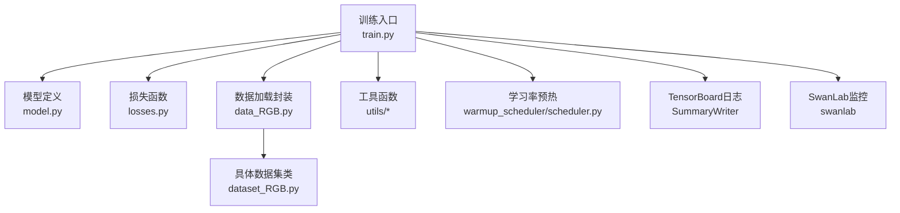
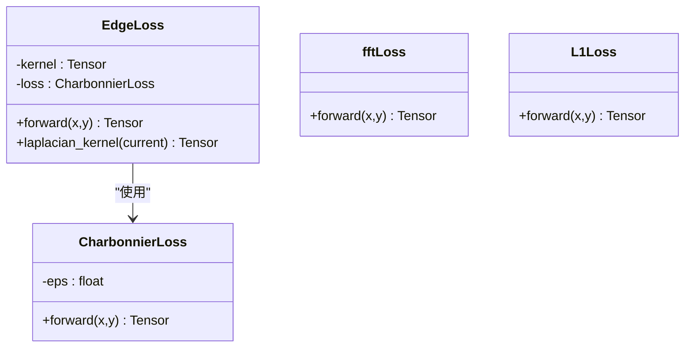
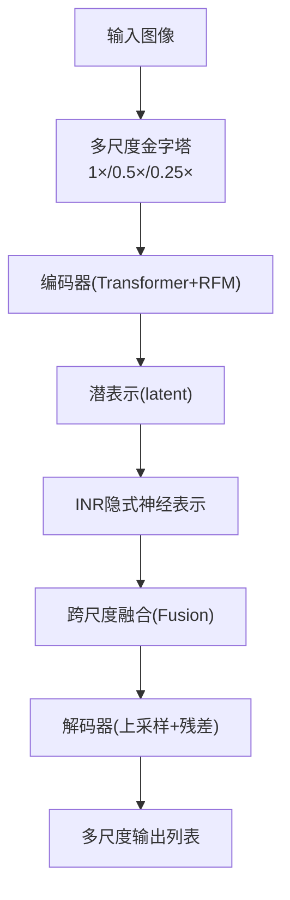
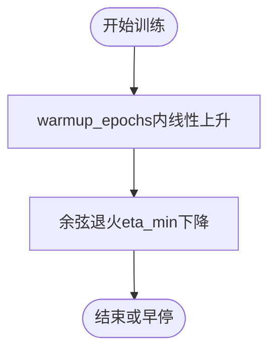
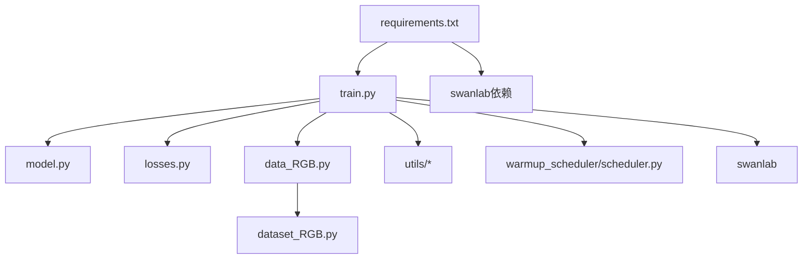

# 训练框架

<cite>
**本文引用的文件**
- [train.py](file://train.py)
- [losses.py](file://losses.py)
- [model.py](file://model.py)
- [dataset_RGB.py](file://dataset_RGB.py)
- [data_RGB.py](file://data_RGB.py)
- [utils/model_utils.py](file://utils/model_utils.py)
- [utils/dir_utils.py](file://utils/dir_utils.py)
- [utils/image_utils.py](file://utils/image_utils.py)
- [pytorch-gradual-warmup-lr/warmup_scheduler/scheduler.py](file://pytorch-gradual-warmup-lr/warmup_scheduler/scheduler.py)
- [requirements.txt](file://requirements.txt)
- [README.md](file://README.md)
- [get_parameter_number.py](file://get_parameter_number.py)
</cite>

## 更新摘要
**所做更改**
- 新增SwanLab训练监控集成章节，详细介绍实时训练监控功能
- 更新训练过程监控部分，包含SwanLab与TensorBoard双轨监控
- 添加SwanLab配置参数说明和使用指南
- 更新依赖分析，包含SwanLab依赖项

## 目录
1. [简介](#简介)
2. [项目结构](#项目结构)
3. [核心组件](#核心组件)
4. [架构总览](#架构总览)
5. [详细组件分析](#详细组件分析)
6. [依赖分析](#依赖分析)
7. [性能考虑](#性能考虑)
8. [故障排查指南](#故障排查指南)
9. [结论](#结论)
10. [附录](#附录)

## 简介
本文件面向NeRD-Rain训练框架，系统化梳理train.py训练脚本的全流程：从数据加载、模型初始化、损失函数组合、优化器与学习率调度配置，到训练过程监控、模型保存与恢复、以及GPU内存优化与不同规模数据集的训练策略建议。同时深入解析三种损失函数的设计动机与实现要点：CharbonnierLoss的平滑性、EdgeLoss的边缘保持能力、fftLoss的频域约束作用，并给出可操作的超参数配置建议。**新增**SwanLab训练监控集成，提供实时训练可视化与实验管理功能。

## 项目结构
仓库采用按功能分层组织：训练入口在根目录，模型定义位于model.py，损失函数位于losses.py，数据加载封装在dataset_RGB.py与data_RGB.py中；工具函数集中在utils目录；学习率预热通过pytorch-gradual-warmup-lr扩展实现；requirements.txt声明了依赖。**新增**SwanLab训练监控集成，提供云端实验跟踪与可视化。



**图表来源**
- [train.py:1-248](file://train.py#L1-L248)
- [model.py:303-673](file://model.py#L303-L673)
- [losses.py:1-52](file://losses.py#L1-L52)
- [data_RGB.py:1-15](file://data_RGB.py#L1-L15)
- [dataset_RGB.py:13-162](file://dataset_RGB.py#L13-L162)
- [utils/model_utils.py:17-111](file://utils/model_utils.py#L17-L111)
- [pytorch-gradual-warmup-lr/warmup_scheduler/scheduler.py:5-64](file://pytorch-gradual-warmup-lr/warmup_scheduler/scheduler.py#L5-L64)

**章节来源**
- [README.md:25-59](file://README.md#L25-L59)
- [requirements.txt:1-68](file://requirements.txt#L1-L68)

## 核心组件
- 训练入口与控制流：负责参数解析、模型构建、数据加载、损失组合、优化器与学习率调度、训练循环、评估与保存。
- 模型：MultiscaleNet多尺度双向神经表示网络，包含Transformer块、RFM频域增强模块、多尺度融合与INR隐式神经表示。
- 损失函数：CharbonnierLoss（平滑）、EdgeLoss（边缘保持）、fftLoss（频域约束）与L1Loss（金字塔一致性）。
- 数据加载：DataLoaderTrain/DataLoaderVal支持随机裁剪、翻转旋转、饱和度与伽马调整等增强。
- 工具函数：模型检查点加载/保存、目录管理、PSNR计算、冻结/解冻参数等。
- 学习率调度：余弦退火+渐进式warmup，确保训练初期稳定收敛。
- **新增**训练监控：SwanLab实时监控与TensorBoard双轨日志记录，提供实验管理和可视化功能。

**章节来源**
- [train.py:40-248](file://train.py#L40-L248)
- [model.py:303-673](file://model.py#L303-L673)
- [losses.py:5-52](file://losses.py#L5-L52)
- [dataset_RGB.py:13-162](file://dataset_RGB.py#L13-L162)
- [utils/model_utils.py:17-111](file://utils/model_utils.py#L17-L111)
- [pytorch-gradual-warmup-lr/warmup_scheduler/scheduler.py:5-64](file://pytorch-gradual-warmup-lr/warmup_scheduler/scheduler.py#L5-L64)

## 架构总览
下图展示训练主流程的关键节点与交互：参数解析、模型与优化器初始化、数据加载、前向与反向传播、损失聚合、学习率调度、验证与日志记录、模型保存。**更新**包含SwanLab训练监控集成。

```mermaid
sequenceDiagram
participant CLI as "命令行参数"
participant Train as "训练脚本(train.py)"
participant Model as "模型(MultiscaleNet)"
participant Loss as "损失函数集合"
participant Data as "数据加载器"
participant Opt as "优化器/调度器"
participant Log1 as "TensorBoard"
participant Log2 as "SwanLab"
CLI->>Train : 解析参数(--train_dir/--val_dir/--batch_size/...)
Train->>Model : 初始化模型并移动至GPU
Train->>Opt : 创建Adam优化器与warmup+cosine调度器
Train->>Log2 : SwanLab登录与实验初始化
loop 训练轮次
Train->>Data : 加载批次数据(target,input)
Data-->>Train : 返回张量
Train->>Model : 前向推理(返回多尺度输出)
Train->>Loss : 计算Charbonnier/Edge/fft/L1损失
Loss-->>Train : 多项损失值
Train->>Opt : loss.backward() + step() + scheduler.step()
Train->>Log1 : 写入迭代/epoch损失与PSNR
Train->>Log2 : 记录损失、学习率、时间等指标
alt 到达评估周期
Train->>Model : eval模式
Train->>Data : 验证集加载
Train->>Model : 推理并累积PSNR
Train->>Log1 : 写入验证PSNR
Train->>Log2 : 记录验证PSNR与最佳PSNR
Train->>Train : 保存最佳/最新模型
end
end
Train->>Log2 : 完成实验记录
```

**图表来源**
- [train.py:71-248](file://train.py#L71-L248)
- [model.py:486-673](file://model.py#L486-L673)
- [losses.py:5-52](file://losses.py#L5-L52)
- [dataset_RGB.py:13-162](file://dataset_RGB.py#L13-L162)

## 详细组件分析

### 训练脚本(train.py)工作流
- 设备与随机种子：固定CUDA设备顺序与可见设备，设置Python/NumPy/Torch全局随机种子，保证可复现性。
- 参数解析：支持训练/验证路径、会话名、图像块尺寸、训练轮数、批大小、保存路径等。
- 模型与并行：实例化MultiscaleNet，打印参数量，启用CUDA，多GPU时使用DataParallel。
- 优化器与学习率：Adam优化器，初始学习率与末尾学习率设定，余弦退火+渐进式warmup组合调度。
- 恢复与预训练：支持从上次断点恢复（加载权重、优化器状态、起始轮次），或加载指定预训练权重。
- 损失函数：组合CharbonnierLoss、EdgeLoss、fftLoss与L1Loss，按金字塔多尺度输出加权求和。
- 数据加载：训练集随机裁剪与增强，验证集中心裁剪；DataLoader配置pin_memory与单进程避免内存问题。
- 训练循环：逐批次清零梯度、前向、损失反传、优化步进、记录迭代与epoch损失；周期性评估PSNR并保存最佳/最新模型。
- **新增**训练监控：使用SwanLab实时记录损失、学习率、训练时间等指标，与TensorBoard双轨日志记录。

**章节来源**
- [train.py:32-248](file://train.py#L32-L248)

### SwanLab训练监控集成
**新增** NeRD-Rain框架现已集成SwanLab训练监控系统，提供云端实验跟踪与可视化功能：

- **初始化配置**：
  - API密钥认证：`swanlab.login(api_key="o4MGQAOSX8rGztH69Jj5P")`
  - 实验项目：`project="NeRD-Rain"`
  - 实验名称：使用`args.session`参数
  - 配置参数：自动记录训练参数、学习率范围、优化器配置等

- **实时监控指标**：
  - 迭代损失：fft_loss、char_loss、edge_loss、l1_loss、iter_loss
  - 验证指标：验证PSNR、最佳PSNR
  - 训练状态：学习率、epoch时间、当前epoch
  - 模型参数：项目配置、优化器状态

- **使用优势**：
  - 实时可视化训练过程
  - 实验对比与版本管理
  - 云端访问与分享
  - 自动化的指标记录与图表生成

**章节来源**
- [train.py:55-69](file://train.py#L55-L69)
- [train.py:185-192](file://train.py#L185-L192)
- [train.py:224](file://train.py#L224)
- [train.py:239](file://train.py#L239)
- [train.py:247](file://train.py#L247)

### 损失函数设计与实现
- CharbonnierLoss：引入小常数平方项，使梯度在接近零时仍保持良好数值稳定性，适合像素级回归任务。
- EdgeLoss：基于拉普拉斯金字塔的边缘保持损失，先对输入输出做高斯卷积与二次采样，再计算二阶导差异，强调边缘结构的一致性。
- fftLoss：在频域计算复数傅里叶变换差的模长均值，约束模型输出的频率分布一致性，抑制高频噪声与振铃效应。
- L1Loss：用于金字塔中间层与高层的重建一致性，提升多尺度融合的稳定性。



**图表来源**
- [losses.py:5-52](file://losses.py#L5-L52)

**章节来源**
- [losses.py:5-52](file://losses.py#L5-L52)

### 模型结构与多尺度融合
- 多尺度编码器-解码器：分别对原图的1×、0.5×、0.25×尺度进行特征提取与重建，结合INR隐式神经表示进行跨尺度融合。
- Transformer块与FFN：注意力与前馈网络堆叠，配合LayerNorm与残差连接。
- RFM频域增强：对幅度谱与相位谱分别处理后重构，叠加空域DWConv3x3残差，强化高频细节。
- 融合模块：基于注意力的通道融合，动态调节不同尺度贡献。
- 输出：多尺度输出拼接与上采样，最终与输入残差相加得到去雨结果。



**图表来源**
- [model.py:486-673](file://model.py#L486-L673)

**章节来源**
- [model.py:303-673](file://model.py#L303-L673)

### 数据加载与增强
- 训练集：支持反射填充、随机伽马调整、饱和度扰动、随机翻转/旋转/旋转变换，统一转为张量并随机裁剪为指定patch大小。
- 验证集：中心裁剪，便于稳定评估。
- 测试集：仅输入图像，便于推理生成。

**章节来源**
- [dataset_RGB.py:13-162](file://dataset_RGB.py#L13-L162)
- [data_RGB.py:4-15](file://data_RGB.py#L4-L15)

### 学习率调度策略
- 渐进式warmup：在前若干轮线性提升学习率，缓解初始化不稳定导致的梯度爆炸。
- 余弦退火：warmup结束后进入余弦退火，逐步降低学习率至目标最小值，维持训练稳定性。
- 组合调度：warmup结束后将after_scheduler的基线学习率乘以倍数，确保平滑过渡。



**图表来源**
- [train.py:85-88](file://train.py#L85-L88)
- [pytorch-gradual-warmup-lr/warmup_scheduler/scheduler.py:25-37](file://pytorch-gradual-warmup-lr/warmup_scheduler/scheduler.py#L25-L37)

**章节来源**
- [train.py:85-88](file://train.py#L85-L88)
- [pytorch-gradual-warmup-lr/warmup_scheduler/scheduler.py:5-64](file://pytorch-gradual-warmup-lr/warmup_scheduler/scheduler.py#L5-L64)

### 训练参数配置指南
- 批大小(batch_size)：默认1，显存紧张时建议减小；若GPU显存充足且数据多样，可适度增大以提升稳定性。
- 图像块尺寸(patch_size)：默认256，大尺寸更利于细节但增加显存占用；需与分辨率匹配。
- 训练轮数(num_epochs)：默认3000，结合验证集PSNR趋势与过拟合迹象调整；warmup轮数(warmup_epochs)默认3。
- 学习率：起始学习率start_lr=1e-4，末尾学习率end_lr=1e-6；可根据收敛速度微调。
- 损失权重：当前脚本对各项损失赋予固定系数，建议根据任务难度与数据质量进行加权调优。
- **新增**SwanLab配置：API密钥、项目名称、实验名称等监控参数。

**章节来源**
- [train.py:42-51](file://train.py#L42-L51)
- [train.py:68-69](file://train.py#L68-L69)
- [train.py:86](file://train.py#L86)
- [train.py:163](file://train.py#L163)
- [train.py:55-69](file://train.py#L55-L69)

### 训练过程监控、模型保存与恢复
- **更新**双轨监控系统：同时使用SwanLab与TensorBoard记录训练指标，提供本地与云端双重可视化。
- **新增**SwanLab监控内容：迭代损失、验证PSNR、最佳PSNR、学习率、训练时间等关键指标。
- 最佳模型：当验证PSNR超过历史最佳时，保存"model_best.pth"。
- 断点续训：保存"model_latest.pth"，并加载权重、优化器状态与起始轮次，恢复学习率调度器状态。
- 目录管理：自动创建模型保存目录，按会话与模式分类存储。

**章节来源**
- [train.py:139-248](file://train.py#L139-L248)
- [utils/model_utils.py:17-111](file://utils/model_utils.py#L17-L111)
- [utils/dir_utils.py:12-18](file://utils/dir_utils.py#L12-L18)
- [utils/image_utils.py:5-9](file://utils/image_utils.py#L5-L9)

### GPU内存优化与实用技巧
- 固定CUDA设备顺序与可见设备，避免多进程竞争显存。
- 关闭cudnn自动搜索算法，启用benchmark以加速卷积选择。
- 单进程DataLoader与pin_memory，平衡内存与吞吐；必要时关闭num_workers。
- 小批量训练与混合精度（如需）可进一步降低显存占用。
- 使用DataParallel时注意梯度同步与内存峰值；多卡场景建议合理分配批大小。

**章节来源**
- [train.py:3-8](file://train.py#L3-L8)
- [train.py:127-132](file://train.py#L127-L132)
- [requirements.txt:22](file://requirements.txt#L22)

### 不同规模数据集的训练策略建议
- 小数据集（如Rain200L）：适当增大warmup轮数，降低学习率，启用更多数据增强；减少每尺度输出的损失权重，避免过拟合。
- 中等数据集：标准配置即可；关注验证PSNR是否饱和，适时降低学习率或提前停止。
- 大数据集：可提高批大小与patch尺寸，延长训练轮数；保持warmup与余弦退火的组合，观察频域与边缘损失对PSNR的促进作用。

**章节来源**
- [train.py:42-51](file://train.py#L42-L51)
- [train.py:163](file://train.py#L163)

## 依赖分析
- 外部库：torch、torchvision、torchaudio、kornia、tqdm、tensorboard、natsort、einops、**swanlab**等。
- 自研模块：losses.py、model.py、dataset_RGB.py、data_RGB.py、utils/*。
- 学习率调度：warmup_scheduler扩展包，提供GradualWarmupScheduler。
- **新增**SwanLab依赖：`swanlab`（第51行），提供训练监控与实验管理功能。



**图表来源**
- [requirements.txt:1-68](file://requirements.txt#L1-L68)
- [train.py:18-29](file://train.py#L18-L29)

**章节来源**
- [requirements.txt:1-68](file://requirements.txt#L1-L68)
- [train.py:18-29](file://train.py#L18-L29)

## 性能考虑
- 训练效率：启用cudnn benchmark，合理设置批大小与patch尺寸；使用DataParallel提升吞吐。
- 收敛稳定性：warmup+余弦退火组合有效抑制早期震荡；多尺度损失有助于鲁棒重建。
- 显存占用：小批量、较小patch、关闭num_workers或使用pin_memory策略；必要时降低模型深度或通道数。
- 评估开销：验证周期可按需求调整，避免频繁全量评估影响训练速度。
- **新增**监控开销：SwanLab实时记录带来轻微额外开销，但提供重要训练洞察。

## 故障排查指南
- CUDA设备不可见或冲突：检查CUDA_DEVICE_ORDER与CUDA_VISIBLE_DEVICES设置。
- 验证PSNR异常：确认验证集中心裁剪逻辑与数据归一化一致；检查PSNR计算函数边界clamp。
- 恢复失败：检查checkpoint文件命名与路径；utils.load_checkpoint兼容DataParallel前缀。
- 显存不足：减小批大小、patch尺寸或关闭num_workers；确认未重复加载相同数据。
- 学习率不变化：确认scheduler.step()在优化器step之后调用；warmup结束后after_scheduler生效。
- **新增**SwanLab问题：检查API密钥有效性、网络连接、实验项目权限；确认初始化顺序正确。

**章节来源**
- [train.py:3-8](file://train.py#L3-L8)
- [train.py:103-114](file://train.py#L103-L114)
- [utils/model_utils.py:22-36](file://utils/model_utils.py#L22-L36)
- [utils/image_utils.py:5-9](file://utils/image_utils.py#L5-L9)

## 结论
NeRD-Rain训练框架通过多尺度Transformer与RFM频域增强、多损失组合与渐进式warmup+余弦退火调度，在去雨任务上实现了稳健的收敛与高质量重建。**新增**的SwanLab训练监控集成进一步提升了训练过程的可观测性与可管理性，为研究者提供了云端实验跟踪与可视化能力。遵循本文的参数配置建议与优化策略，可在不同规模数据集上高效训练并获得稳定的结果。

## 附录
- 模型参数统计：训练前可打印总参数量与可训练参数量，辅助显存与速度评估。
- 依赖安装：按requirements.txt安装基础库与warmup调度器扩展，**新增**swanlab依赖项。
- **新增**SwanLab使用指南：API密钥配置、实验项目设置、监控指标解读。

**章节来源**
- [get_parameter_number.py:3-8](file://get_parameter_number.py#L3-L8)
- [requirements.txt:31-35](file://requirements.txt#L31-L35)
- [train.py:55-69](file://train.py#L55-L69)