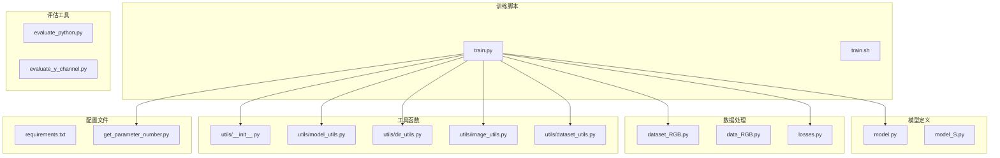
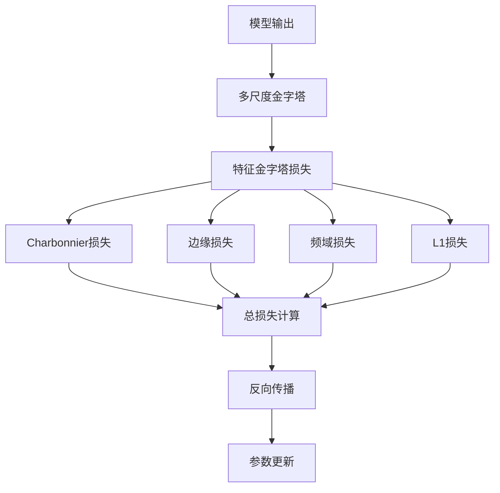
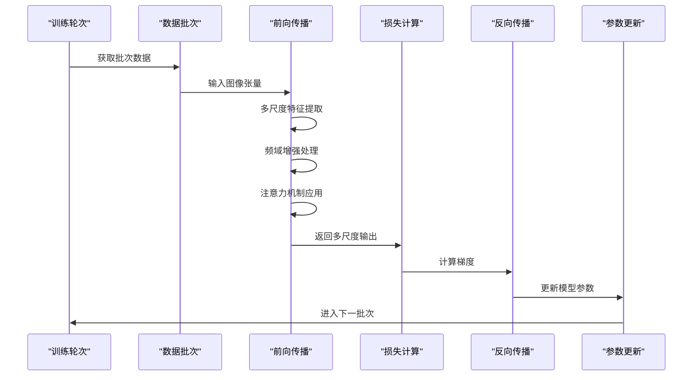
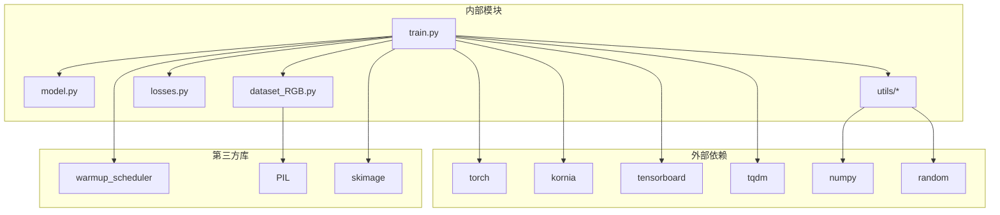

# 训练脚本详解

<cite>
**本文档引用的文件**
- [train.py](file://train.py)
- [model.py](file://model.py)
- [dataset_RGB.py](file://dataset_RGB.py)
- [data_RGB.py](file://data_RGB.py)
- [losses.py](file://losses.py)
- [utils/model_utils.py](file://utils/model_utils.py)
- [utils/dir_utils.py](file://utils/dir_utils.py)
- [utils/image_utils.py](file://utils/image_utils.py)
- [get_parameter_number.py](file://get_parameter_number.py)
- [utils/__init__.py](file://utils/__init__.py)
- [train.sh](file://train.sh)
- [requirements.txt](file://requirements.txt)
</cite>

## 目录
1. [简介](#简介)
2. [项目结构](#项目结构)
3. [核心组件](#核心组件)
4. [架构概览](#架构概览)
5. [详细组件分析](#详细组件分析)
6. [依赖关系分析](#依赖关系分析)
7. [性能考虑](#性能考虑)
8. [故障排除指南](#故障排除指南)
9. [结论](#结论)
10. [附录](#附录)

## 简介

本文档深入解析NeRD-Rain项目的训练脚本（train.py），这是一个基于深度学习的图像去雨系统。该训练脚本实现了完整的训练流程，包括命令行参数解析、GPU设备配置、随机种子设置、模型初始化、数据加载器配置、训练循环实现以及模型保存和恢复机制。

NeRD-Rain采用多尺度网络架构，结合频域增强模块和注意力机制，在Rain200L等基准数据集上实现了优秀的去雨效果。训练脚本提供了灵活的超参数配置选项和完善的训练监控功能。

## 项目结构

该项目采用模块化的文件组织方式，主要包含以下关键目录和文件：



**图表来源**
- [train.py:1-218](file://train.py#L1-L218)
- [model.py:1-673](file://model.py#L1-L673)
- [dataset_RGB.py:1-162](file://dataset_RGB.py#L1-L162)

**章节来源**
- [train.py:1-218](file://train.py#L1-L218)
- [requirements.txt:1-67](file://requirements.txt#L1-L67)

## 核心组件

### 初始化配置

训练脚本在启动时执行以下初始化步骤：

1. **GPU设备配置**
   - 设置CUDA设备顺序为PCI_BUS_ID
   - 指定可见GPU设备为0
   - 启用CUDNN基准模式以优化卷积性能

2. **随机种子设置**
   - 设置Python随机种子为1234
   - 设置NumPy随机种子为1234
   - 设置PyTorch CPU随机种子为1234
   - 设置PyTorch GPU随机种子为1234

3. **命令行参数解析**
   - 训练数据目录：`--train_dir`
   - 验证数据目录：`--val_dir`
   - 模型保存目录：`--model_save_dir`
   - 预训练权重路径：`--pretrain_weights`
   - 模式选择：`--mode`
   - 会话名称：`--session`
   - 图像补丁大小：`--patch_size`
   - 训练轮数：`--num_epochs`
   - 批次大小：`--batch_size`
   - 验证间隔：`--val_epochs`

**章节来源**
- [train.py:32-52](file://train.py#L32-L52)
- [train.py:40-52](file://train.py#L40-L52)

### 模型初始化

MultiscaleNet模型是整个训练系统的核心组件，具有以下特点：

1. **多尺度架构设计**
   - 小尺度：输入分辨率为原图的1/4
   - 中尺度：输入分辨率为原图的1/2  
   - 大尺度：输入分辨率为原图
   - 三个尺度并行处理，最后融合输出

2. **核心模块组成**
   - OverlapPatchEmbed：重叠补丁嵌入
   - TransformerBlock：基于注意力的特征提取
   - Downsample/Upsample：特征图下采样和上采样
   - RFM_TransformerBlock：频域增强的Transformer块
   - Fusion模块：跨尺度特征融合

3. **参数统计**
   - 总参数量统计
   - 可训练参数量统计
   - 模型复杂度分析

**章节来源**
- [train.py:71-76](file://train.py#L71-L76)
- [model.py:303-673](file://model.py#L303-L673)
- [get_parameter_number.py:3-8](file://get_parameter_number.py#L3-L8)

## 架构概览

训练系统的整体架构采用分层设计，各组件职责明确：

```mermaid
sequenceDiagram
participant CLI as "命令行接口"
participant Train as "训练脚本"
participant Model as "MultiscaleNet模型"
participant Data as "数据加载器"
participant Loss as "损失函数"
participant Opt as "优化器"
participant TB as "TensorBoard"
CLI->>Train : 解析命令行参数
Train->>Train : 设置随机种子和GPU配置
Train->>Model : 创建MultiscaleNet实例
Train->>Model : 统计模型参数
Train->>Data : 初始化训练数据集
Train->>Data : 初始化验证数据集
Train->>Opt : 创建Adam优化器
Train->>TB : 初始化TensorBoard记录器
loop 训练循环
Train->>Data : 加载批次数据
Data-->>Train : 返回输入和目标图像
Train->>Model : 前向传播
Model-->>Train : 返回多尺度输出
Train->>Loss : 计算多任务损失
Loss-->>Train : 返回总损失
Train->>Opt : 反向传播和参数更新
Train->>TB : 记录训练指标
alt 达到验证间隔
Train->>Model : 切换为评估模式
Train->>Data : 加载验证数据
Train->>Model : 计算PSNR指标
Train->>TB : 记录验证指标
Train->>Train : 保存最佳模型
end
end
```

**图表来源**
- [train.py:142-218](file://train.py#L142-L218)
- [model.py:486-673](file://model.py#L486-L673)

## 详细组件分析

### 数据加载器配置

数据加载器负责处理训练和验证数据，采用不同的策略以满足不同阶段的需求：

#### 训练数据加载器
- **数据集类型**：DataLoaderTrain
- **数据增强**：随机翻转、旋转、伽马校正、饱和度调整
- **补丁裁剪**：随机选择指定大小的图像补丁
- **批处理**：按批次大小组织数据
- **并行处理**：使用单进程（num_workers=0）避免内存问题

#### 验证数据加载器  
- **数据集类型**：DataLoaderVal
- **数据增强**：禁用随机变换，使用中心裁剪
- **批处理**：单样本批处理（batch_size=1）
- **精度要求**：确保验证结果的可重复性

**章节来源**
- [dataset_RGB.py:13-100](file://dataset_RGB.py#L13-L100)
- [dataset_RGB.py:101-139](file://dataset_RGB.py#L101-L139)
- [data_RGB.py:4-14](file://data_RGB.py#L4-L14)

### 损失函数设计

训练系统采用多任务损失函数，结合多种损失以提升去雨效果：



**图表来源**
- [train.py:159-163](file://train.py#L159-L163)
- [losses.py:5-52](file://losses.py#L5-L52)

#### 损失函数详解

1. **Charbonnier损失**
   - 平滑的L1范数，对异常值不敏感
   - 参数eps控制数值稳定性
   
2. **边缘损失**
   - 基于拉普拉斯算子的边缘检测
   - 通过高斯卷积和下采样构建多尺度边缘特征
   
3. **频域损失**
   - 基于FFT的频域差异计算
   - 捕捉图像的频率信息一致性
   
4. **L1损失**
   - 直接像素级差异
   - 用于特定尺度的特征匹配

**章节来源**
- [train.py:119-124](file://train.py#L119-L124)
- [losses.py:5-52](file://losses.py#L5-L52)

### 训练循环实现

训练循环采用标准的监督学习范式，包含完整的前向传播、损失计算和反向传播过程：



**图表来源**
- [train.py:147-166](file://train.py#L147-L166)

#### 关键实现细节

1. **梯度清零**
   - 显式设置所有参数梯度为None
   - 避免梯度累积问题

2. **多尺度损失聚合**
   - 对每个尺度分别计算损失
   - 加权组合形成总损失
   - 权重系数：Charbonnier(1.0) + 频域(0.01) + 边缘(0.05) + L1(0.1)

3. **学习率调度**
   - 渐进式热身：前3轮线性增加学习率
   - 余弦退火：后续轮次采用余弦衰减
   - 最终学习率：1e-6

**章节来源**
- [train.py:147-166](file://train.py#L147-L166)
- [train.py:85-88](file://train.py#L85-L88)

### 模型保存和恢复机制

系统提供了完整的模型持久化和恢复功能：

#### 模型保存策略
1. **最佳模型保存**
   - 基于验证集PSNR指标选择最佳模型
   - 保存完整状态字典（模型权重+优化器状态）

2. **定期模型保存**
   - 每个训练轮次保存一次
   - 包含epoch编号、权重和优化器状态

3. **最新模型保存**
   - 每个轮次覆盖保存最新模型
   - 用于断点续训

#### 模型恢复机制
- **断点续训**：自动加载上次训练的epoch、权重和优化器状态
- **预训练加载**：支持从预训练权重继续训练
- **多GPU兼容**：处理DataParallel包装的模型权重

**章节来源**
- [train.py:90-115](file://train.py#L90-L115)
- [utils/model_utils.py:17-111](file://utils/model_utils.py#L17-L111)

## 依赖关系分析

训练脚本的依赖关系体现了清晰的模块化设计：



**图表来源**
- [train.py:6-28](file://train.py#L6-L28)
- [requirements.txt:55-67](file://requirements.txt#L55-L67)

**章节来源**
- [requirements.txt:1-67](file://requirements.txt#L1-L67)
- [train.py:18-27](file://train.py#L18-L27)

## 性能考虑

### 计算资源优化

1. **GPU利用优化**
   - 自动检测可用GPU数量并启用DataParallel
   - 启用CUDNN基准模式提升卷积运算速度
   - 使用CUDA张量进行加速计算

2. **内存管理**
   - 单进程数据加载避免内存碎片
   - 及时释放中间变量减少内存占用
   - 使用with torch.no_grad()进行验证阶段推理

3. **训练效率**
   - 渐进式热身避免初期不稳定
   - 余弦退火学习率保持训练稳定性
   - TensorBoard实时监控训练进度

### 超参数调优建议

基于模型特性和数据集规模，推荐以下超参数配置：

1. **基础配置**
   - 批次大小：1-4（根据显存调整）
   - 学习率：1e-4（热身期）→ 1e-6（最终）
   - 训练轮数：3000-5000（根据收敛情况调整）
   - 补丁大小：256×256（平衡质量和速度）

2. **高级配置**
   - 多尺度权重：Charbonnier(1.0) + 频域(0.01) + 边缘(0.05) + L1(0.1)
   - 验证间隔：每5-10轮验证一次
   - 早停策略：连续100轮无改进时停止训练

## 故障排除指南

### 常见问题及解决方案

1. **GPU内存不足**
   - 降低批次大小或调整图像分辨率
   - 减少num_workers参数
   - 使用更小的模型变体

2. **训练不收敛**
   - 检查学习率设置是否合适
   - 验证数据预处理是否正确
   - 确认损失函数权重配置

3. **模型保存失败**
   - 检查模型保存目录权限
   - 确认磁盘空间充足
   - 验证文件路径格式

4. **数据加载错误**
   - 确认数据目录结构正确
   - 检查图像文件格式支持
   - 验证数据集完整性

**章节来源**
- [train.py:90-115](file://train.py#L90-L115)
- [utils/dir_utils.py:16-18](file://utils/dir_utils.py#L16-L18)

## 结论

NeRD-Rain训练脚本展现了现代深度学习项目的最佳实践，具有以下突出特点：

1. **架构设计合理**：多尺度网络结合频域增强，有效提升了去雨性能
2. **代码组织规范**：模块化设计便于维护和扩展
3. **训练监控完善**：TensorBoard集成提供全面的训练可视化
4. **模型管理专业**：完整的保存和恢复机制支持长期训练
5. **性能优化到位**：GPU利用和内存管理考虑周全

该训练脚本为图像去雨任务提供了一个高效、稳定且易于使用的解决方案，适合学术研究和工业应用。

## 附录

### 训练参数配置指南

| 参数类别 | 推荐值 | 说明 |
|---------|--------|------|
| 批次大小 | 1-4 | 根据GPU显存调整，建议从1开始尝试 |
| 学习率 | 1e-4 | 热身期初始值，最终降至1e-6 |
| 训练轮数 | 3000-5000 | 根据数据集大小和收敛情况调整 |
| 补丁大小 | 256×256 | 平衡计算效率和质量的关键参数 |
| 验证间隔 | 5-10轮 | 控制验证频率和计算开销 |
| 多尺度权重 | Charbonnier:1.0, 频域:0.01, 边缘:0.05, L1:0.1 | 经验权重组合 |

### 系统要求

- Python 3.7+
- PyTorch 1.8+
- CUDA 11.0+ (可选)
- 至少8GB GPU显存 (建议16GB以上)
- 16GB RAM (建议32GB以上)

### 训练启动示例

```bash
# 基础训练
python train.py --train_dir ../data/Rain200L/train/ --val_dir ../data/Rain200L/test/

# 自定义参数
python train.py --batch_size 2 --num_epochs 2000 --patch_size 512

# 断点续训
python train.py --resume True
```