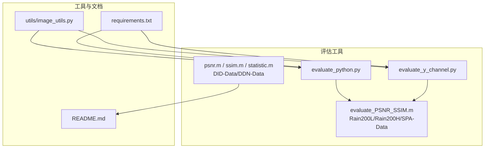
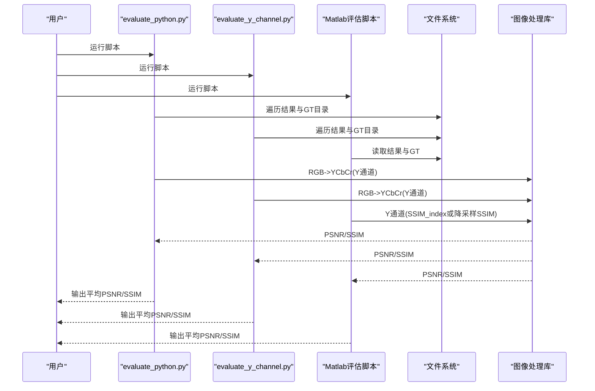
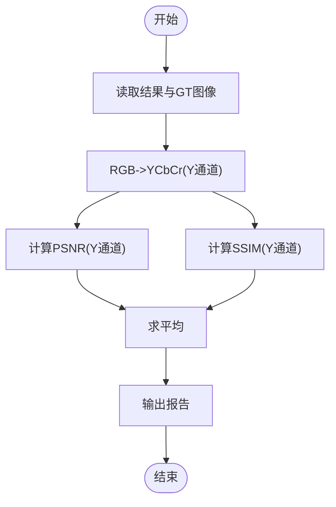
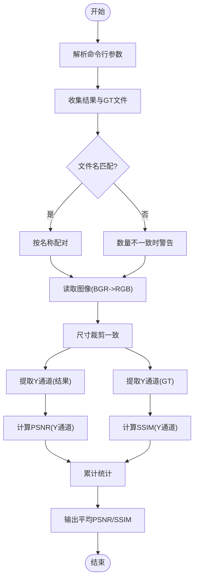
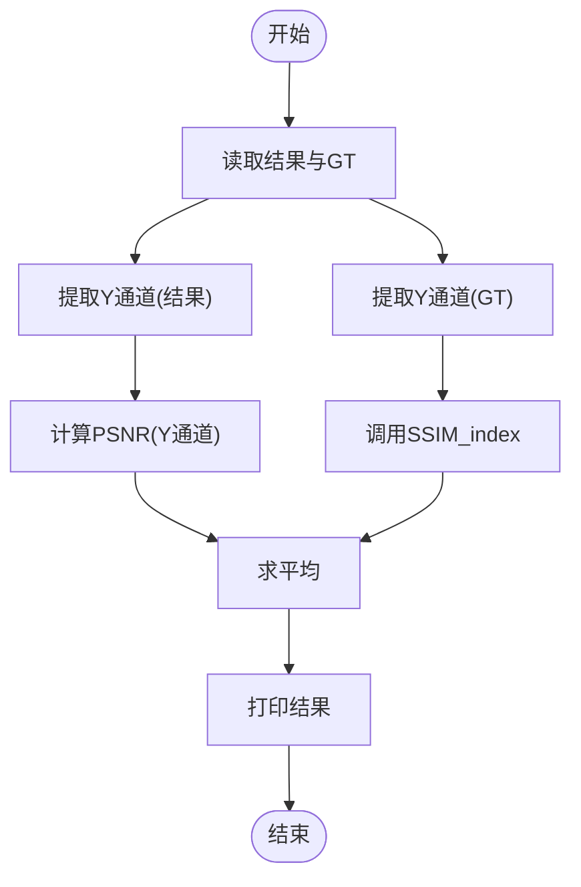
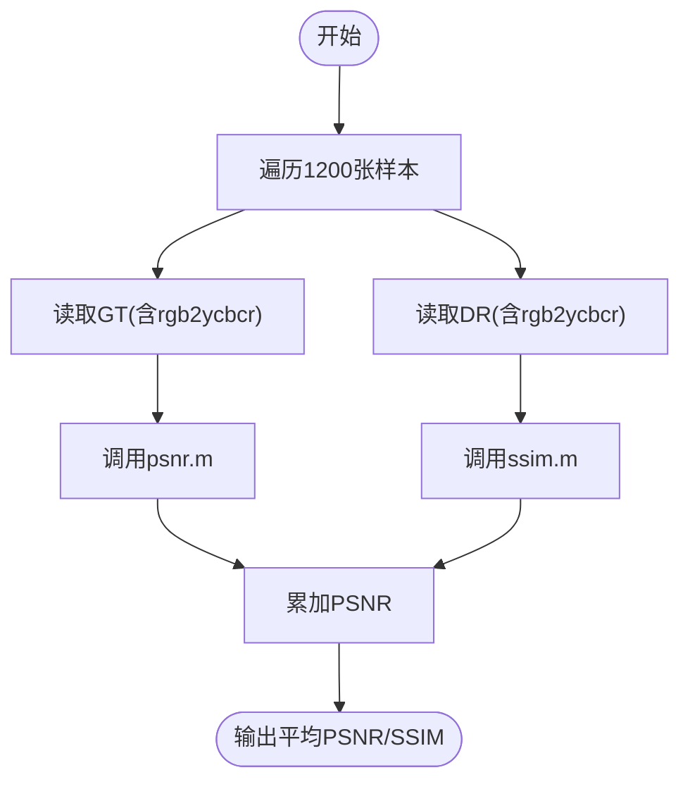
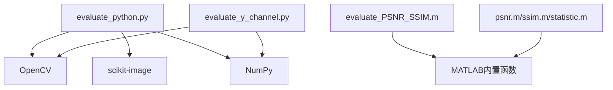

# 性能评估

<cite>
**本文引用的文件**
- [evaluate_python.py](file://evaluate_python.py)
- [evaluate_y_channel.py](file://evaluate_y_channel.py)
- [evaluate_PSNR_SSIM.m](file://evaluations/Evalution_Rain200L_Rain200H_SPA-Data/evaluate_PSNR_SSIM.m)
- [psnr.m](file://evaluations/Evaluation_DID-Data_DDN-Data/psnr.m)
- [ssim.m](file://evaluations/Evaluation_DID-Data_DDN-Data/ssim.m)
- [statistic.m](file://evaluations/Evaluation_DID-Data_DDN-Data/statistic.m)
- [image_utils.py](file://utils/image_utils.py)
- [README.md](file://README.md)
- [requirements.txt](file://requirements.txt)
</cite>

## 目录
1. [简介](#简介)
2. [项目结构](#项目结构)
3. [核心组件](#核心组件)
4. [架构总览](#架构总览)
5. [详细组件分析](#详细组件分析)
6. [依赖分析](#依赖分析)
7. [性能考量](#性能考量)
8. [故障排查指南](#故障排查指南)
9. [结论](#结论)
10. [附录](#附录)

## 简介
本文件面向性能评估系统，聚焦于PSNR与SSIM两种主流图像质量评价指标在RGB通道与Y通道上的计算原理、实现细节与差异。文档覆盖以下内容：
- evaluate_python.py与evaluate_y_channel.py中PSNR与SSIM的实现方式与差异
- 基于YCbCr色彩空间的Y通道评估策略及其与RGB通道评估的适用场景
- evaluations目录下不同数据集评估工具的使用方法（DID-Data/DDN-Data与Rain200L/Rain200H/SPA-Data）
- 指标解读、基准线对比、统计显著性检验与结果可靠性分析
- 评估报告生成与性能对比图表绘制建议

## 项目结构
该仓库围绕“去雨”任务构建了多套评估工具链，分别针对不同数据集采用不同的评估脚本与数据组织方式：
- Python侧：evaluate_python.py与evaluate_y_channel.py，均以Y通道为主，确保与论文报告一致
- MATLAB侧：evaluations目录下的Rain200L/Rain200H/SPA-Data与DID-Data/DDN-Data两套评估脚本
- 工具函数：utils/image_utils.py提供训练/测试阶段常用的PSNR等工具
- 依赖：requirements.txt列出Python环境所需包

**图表来源**
- [evaluate_python.py:1-119](file://evaluate_python.py#L1-L119)
- [evaluate_y_channel.py:1-219](file://evaluate_y_channel.py#L1-L219)
- [evaluate_PSNR_SSIM.m:1-268](file://evaluations/Evalution_Rain200L_Rain200H_SPA-Data/evaluate_PSNR_SSIM.m#L1-L268)
- [psnr.m:1-27](file://evaluations/Evaluation_DID-Data_DDN-Data/psnr.m#L1-L27)
- [ssim.m:1-213](file://evaluations/Evaluation_DID-Data_DDN-Data/ssim.m#L1-L213)
- [statistic.m:1-20](file://evaluations/Evaluation_DID-Data_DDN-Data/statistic.m#L1-L20)
- [image_utils.py:1-19](file://utils/image_utils.py#L1-L19)
- [README.md:72-82](file://README.md#L72-L82)
- [requirements.txt:1-67](file://requirements.txt#L1-L67)

**章节来源**
- [README.md:72-82](file://README.md#L72-L82)
- [requirements.txt:1-67](file://requirements.txt#L1-L67)

## 核心组件
本节从算法原理、实现细节与适用场景三个维度，系统梳理PSNR与SSIM在RGB通道与Y通道上的差异与选择。

- PSNR（峰值信噪比）
  - 定义：基于MSE的对数变换，衡量重建图像与参考图像之间的误差强度
  - 公式要点：PSNR = 20·log10(MAX/IQMSE)，其中MAX为像素最大值（通常为255），IQMSE为均方误差
  - 实现差异：
    - evaluate_python.py：先将RGB转YCbCr，再取Y通道；PSNR在Y通道上计算
    - evaluate_y_channel.py：同样在Y通道上计算，但复现了Matlab rgb2ycbcr与SSIM_index默认参数
    - MATLAB脚本：Rain200L/Rain200H/SPA-Data与DID-Data/DDN-Data均在Y通道上计算PSNR

- SSIM（结构相似性指数）
  - 定义：综合亮度、对比度与结构相似性的局部窗口统计量，输出范围[0,1]，越接近1越好
  - 公式要点：SSIM = [(2μxμy + C1)(2σxy + C2)]/[(μx^2 + μy^2 + C1)(σx^2 + σy^2 + C2)]
  - 实现差异：
    - evaluate_python.py：使用skimage.metrics.structural_similarity，参数与Matlab相近
    - evaluate_y_channel.py：自实现SSIM，复现Matlab SSIM_index默认参数（高斯窗口11×11，sigma=1.5，K=[0.01,0.03]，L=255）
    - MATLAB脚本：Rain200L/Rain200H/SPA-Data采用SSIM_index；DID-Data/DDN-Data采用带自动降采样的ssim函数

- 通道选择：Y通道 vs RGB通道
  - Y通道评估更贴近人类视觉感知（亮度主导），适合去雨等强调亮度恢复的任务
  - RGB通道评估会引入色度信息，可能放大颜色偏差对指标的影响
  - 论文报告指标统一采用Y通道，因此推荐优先使用evaluate_y_channel.py或对应的Matlab脚本

**章节来源**
- [evaluate_python.py:20-58](file://evaluate_python.py#L20-L58)
- [evaluate_y_channel.py:54-106](file://evaluate_y_channel.py#L54-L106)
- [evaluate_PSNR_SSIM.m:42-71](file://evaluations/Evalution_Rain200L_Rain200H_SPA-Data/evaluate_PSNR_SSIM.m#L42-L71)
- [psnr.m:1-27](file://evaluations/Evaluation_DID-Data_DDN-Data/psnr.m#L1-L27)
- [ssim.m:1-213](file://evaluations/Evaluation_DID-Data_DDN-Data/ssim.m#L1-L213)

## 架构总览
下图展示了评估流程的总体架构：输入为去雨结果与真实标注，经由通道选择与指标计算模块，得到平均PSNR与SSIM，最终形成评估报告。

**图表来源**
- [evaluate_python.py:60-117](file://evaluate_python.py#L60-L117)
- [evaluate_y_channel.py:117-215](file://evaluate_y_channel.py#L117-L215)
- [evaluate_PSNR_SSIM.m:1-41](file://evaluations/Evalution_Rain200L_Rain200H_SPA-Data/evaluate_PSNR_SSIM.m#L1-L41)
- [psnr.m:1-27](file://evaluations/Evaluation_DID-Data_DDN-Data/psnr.m#L1-L27)
- [ssim.m:1-213](file://evaluations/Evaluation_DID-Data_DDN-Data/ssim.m#L1-L213)

## 详细组件分析

### 组件A：evaluate_python.py（Y通道PSNR/SSIM）
- 功能概述
  - 读取去雨结果与GT图像，统一为RGB格式
  - 将RGB转换至YCbCr色彩空间，提取Y通道
  - 分别计算PSNR与SSIM，输出各数据集与整体平均值
- 关键实现点
  - Y通道提取：rgb2ycbcr函数将RGB归一化后映射至Y通道
  - PSNR：基于Y通道的MSE，再按公式计算PSNR
  - SSIM：调用skimage.metrics.structural_similarity，参数设置与Matlab相近
  - 数据集遍历：支持Rain200L/Rain200H/SPA-Data中的部分数据集
- 适用场景
  - 快速评估与对比，便于与论文Y通道指标保持一致
  - 与Matlab脚本结果进行交叉验证

**图表来源**
- [evaluate_python.py:20-58](file://evaluate_python.py#L20-L58)
- [evaluate_python.py:60-117](file://evaluate_python.py#L60-L117)

**章节来源**
- [evaluate_python.py:1-119](file://evaluate_python.py#L1-L119)

### 组件B：evaluate_y_channel.py（严格复现Matlab）
- 功能概述
  - 严格复现Matlab evaluate_PSNR_SSIM.m中的rgb2ycbcr与SSIM_index默认参数
  - 在Y通道上计算PSNR与SSIM，确保与论文报告一致
- 关键实现点
  - rgb2ycbcr_y：精确复现Matlab rgb2ycbcr（uint8）行为，仅返回Y通道
  - compute_psnr_y：基于Y通道RMSE计算PSNR
  - compute_ssim_y：复现SSIM_index默认参数（11×11高斯窗口，sigma=1.5，K=[0.01,0.03]，L=255）
  - 文件匹配：支持按文件名匹配GT，增强鲁棒性
- 适用场景
  - 与论文指标完全一致的复现实验
  - 需要与Matlab结果严格对齐的对比实验

**图表来源**
- [evaluate_y_channel.py:117-215](file://evaluate_y_channel.py#L117-L215)
- [evaluate_y_channel.py:36-106](file://evaluate_y_channel.py#L36-L106)

**章节来源**
- [evaluate_y_channel.py:1-219](file://evaluate_y_channel.py#L1-L219)

### 组件C：Matlab评估脚本（Rain200L/Rain200H/SPA-Data）
- 功能概述
  - 与evaluate_y_channel.py目标一致：在Y通道上计算PSNR与SSIM
  - evaluate_PSNR_SSIM.m：封装compute_psnr与compute_ssim，后者进一步调用SSIM_index
  - SSIM_index：实现标准SSIM公式，默认参数与evaluate_y_channel.py一致
- 关键实现点
  - compute_psnr：将RGB转YCbCr后取Y通道，计算PSNR
  - compute_ssim：将RGB转YCbCr后取Y通道，调用SSIM_index
  - SSIM_index：默认窗口大小11×11，sigma=1.5，K=[0.01,0.03]，L=255
- 适用场景
  - 论文指标复现与发布
  - 与开源工具链保持一致

**图表来源**
- [evaluate_PSNR_SSIM.m:42-71](file://evaluations/Evalution_Rain200L_Rain200H_SPA-Data/evaluate_PSNR_SSIM.m#L42-L71)
- [evaluate_PSNR_SSIM.m:73-266](file://evaluations/Evalution_Rain200L_Rain200H_SPA-Data/evaluate_PSNR_SSIM.m#L73-L266)

**章节来源**
- [evaluate_PSNR_SSIM.m:1-268](file://evaluations/Evalution_Rain200L_Rain200H_SPA-Data/evaluate_PSNR_SSIM.m#L1-L268)

### 组件D：Matlab评估脚本（DID-Data/DDN-Data）
- 功能概述
  - psnr.m：通用PSNR计算，自动识别位深并计算PSNR
  - ssim.m：带自动降采样的SSIM，减少大图计算开销
  - statistic.m：批量统计1200张样本的PSNR与SSIM
- 关键实现点
  - psnr.m：根据输入动态确定最大值（如8bit或更高位深），计算PSNR
  - ssim.m：当图像尺寸较大时，按比例降采样后再计算SSIM，提升效率
  - statistic.m：循环读取GT与DR图像，累加PSNR与SSIM
- 适用场景
  - 大规模数据集评估（如DID-Data）
  - 需要降采样加速的场景

**图表来源**
- [psnr.m:1-27](file://evaluations/Evaluation_DID-Data_DDN-Data/psnr.m#L1-L27)
- [ssim.m:1-213](file://evaluations/Evaluation_DID-Data_DDN-Data/ssim.m#L1-L213)
- [statistic.m:1-20](file://evaluations/Evaluation_DID-Data_DDN-Data/statistic.m#L1-L20)

**章节来源**
- [psnr.m:1-27](file://evaluations/Evaluation_DID-Data_DDN-Data/psnr.m#L1-L27)
- [ssim.m:1-213](file://evaluations/Evaluation_DID-Data_DDN-Data/ssim.m#L1-L213)
- [statistic.m:1-20](file://evaluations/Evaluation_DID-Data_DDN-Data/statistic.m#L1-L20)

### 组件E：utils/image_utils.py（训练/测试阶段PSNR）
- 功能概述
  - 提供torchPSNR与numpyPSNR，用于训练/测试阶段快速评估
- 关键实现点
  - torchPSNR：在张量层面计算RMSE并转为PSNR
  - numpyPSNR：在NumPy数组层面计算PSNR
- 适用场景
  - 训练过程中的中间指标监控
  - 与评估脚本互补

**章节来源**
- [image_utils.py:1-19](file://utils/image_utils.py#L1-L19)

## 依赖分析
- Python依赖
  - OpenCV：图像读写与颜色空间转换
  - scikit-image：SSIM计算（evaluate_python.py）
  - NumPy：数值计算
  - glob：文件通配符匹配
- MATLAB依赖
  - 内置函数：filter2、fspecial、imfilter、mean2等
  - 自定义函数：rgb2ycbcr、SSIM_index、psnr、ssim

**图表来源**
- [evaluate_python.py:1-6](file://evaluate_python.py#L1-L6)
- [evaluate_y_channel.py:16-20](file://evaluate_y_channel.py#L16-L20)
- [evaluate_PSNR_SSIM.m:1-1](file://evaluations/Evalution_Rain200L_Rain200H_SPA-Data/evaluate_PSNR_SSIM.m#L1-L1)
- [psnr.m:1-1](file://evaluations/Evaluation_DID-Data_DDN-Data/psnr.m#L1-L1)
- [ssim.m:1-1](file://evaluations/Evaluation_DID-Data_DDN-Data/ssim.m#L1-L1)

**章节来源**
- [requirements.txt:32-47](file://requirements.txt#L32-L47)
- [README.md:72-82](file://README.md#L72-L82)

## 性能考量
- 计算复杂度
  - PSNR：O(HW)单通道计算，开销较低
  - SSIM：局部窗口滑动，复杂度近似O(K^2·HW)，其中K为窗口半径
- 降采样策略
  - MATLAB ssim.m通过降采样减少计算量，适合大规模数据集
- 颜色空间转换
  - Y通道提取避免色度干扰，提高指标稳定性
- I/O与内存
  - 大批量图像评估时注意磁盘I/O与内存占用，可分批处理或使用流式读取

## 故障排查指南
- 图像读取失败
  - 检查路径是否正确，确认文件存在且可读
  - evaluate_y_channel.py支持多种GT目录名（如targets、target等），可自动探测
- 文件数量不一致
  - evaluate_y_channel.py会提示并尝试按文件名匹配，若仍不一致需手动校正
- 尺寸不一致
  - 自动裁剪至较小尺寸，避免形状不匹配报错
- 结果异常
  - 若PSNR为无穷大或SSIM为NaN，检查输入图像是否完全相同或全零
  - 确认颜色空间转换顺序（BGR->RGB）与通道提取一致性

**章节来源**
- [evaluate_y_channel.py:133-175](file://evaluate_y_channel.py#L133-L175)
- [evaluate_y_channel.py:190-196](file://evaluate_y_channel.py#L190-L196)

## 结论
- Y通道评估更适合去雨任务，能更好地反映亮度恢复质量
- evaluate_y_channel.py与Matlab脚本在参数与实现上高度一致，可作为论文指标复现的权威参考
- DID-Data/DDN-Data数据集建议使用降采样版ssim.m以提升效率
- 建议在报告中明确通道选择与参数设置，确保可复现性

## 附录

### A. 不同数据集评估流程
- Rain200L/Rain200H/SPA-Data
  - 使用evaluate_PSNR_SSIM.m或evaluate_y_channel.py
  - 结果与GT目录结构：results/<dataset>/ 与 Datasets/<dataset>/targets/
- DID-Data/DDN-Data
  - 使用psnr.m/ssim.m/statistic.m
  - 批量统计1200/1400张样本，自动降采样加速

**章节来源**
- [README.md:72-82](file://README.md#L72-L82)
- [evaluate_PSNR_SSIM.m:1-41](file://evaluations/Evalution_Rain200L_Rain200H_SPA-Data/evaluate_PSNR_SSIM.m#L1-L41)
- [statistic.m:1-20](file://evaluations/Evaluation_DID-Data_DDN-Data/statistic.m#L1-L20)

### B. 指标解读与基准线对比
- PSNR（dB）
  - 越高越好；通常去雨任务PSNR在30–40 dB之间有明显改善
  - 可与论文中同类方法进行横向对比
- SSIM（0~1）
  - 越接近1越好；关注结构相似性恢复情况
- 基准线建议
  - 同一数据集上与SOTA方法对比
  - 同一方法在不同数据集上的稳定性

### C. 统计显著性检验与结果可靠性分析
- 方法建议
  - 多次独立运行（如5次）记录PSNR/SSIM，计算均值与标准差
  - 使用配对t检验比较两个模型在同一数据集上的差异
  - 绘制箱线图或误差分布图，观察离群值与分布形态
- 结果可靠性
  - 报告均值±标准差，并说明样本数量
  - 明确评估参数（通道、窗口、降采样策略）

### D. 评估报告与性能对比图表
- 报告要素
  - 数据集名称、评估方法（Y通道/RGB通道）、参数设置
  - 各指标均值与标准差、显著性检验结果
- 图表建议
  - 横向柱状图：不同方法在各数据集上的PSNR/SSIM对比
  - 热力图：多方法多数据集的综合对比
  - 散点图：两模型在同数据集上的PSNR与SSIM联合分布