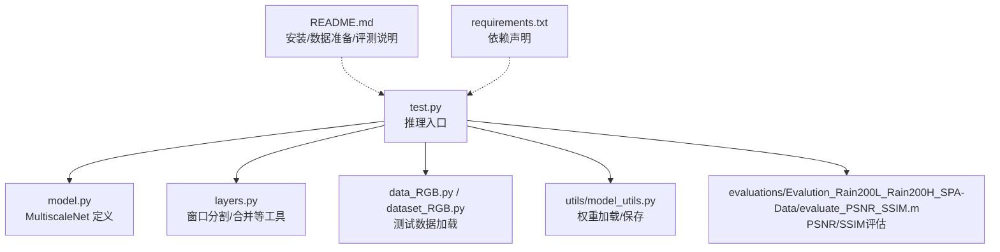
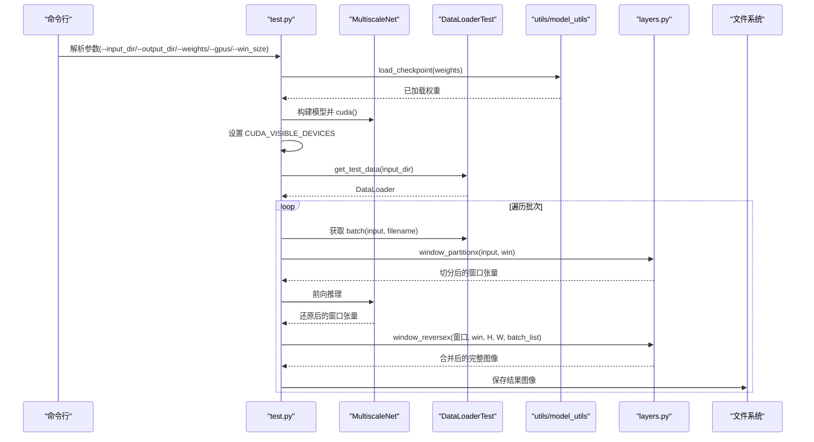
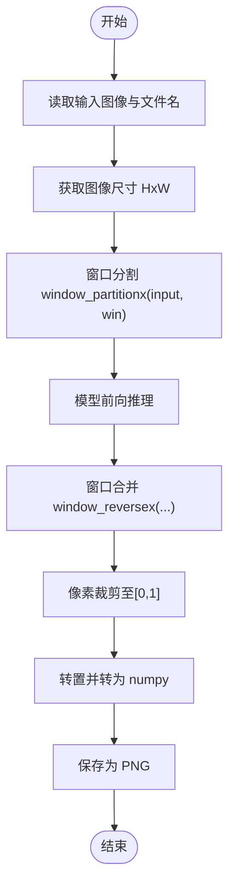
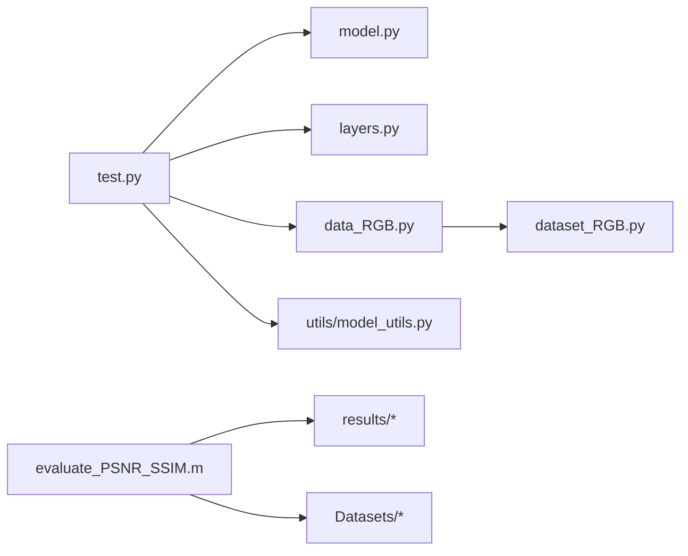

# 推理测试

<cite>
**本文引用的文件列表**
- [test.py](file://test.py)
- [model.py](file://model.py)
- [layers.py](file://layers.py)
- [data_RGB.py](file://data_RGB.py)
- [dataset_RGB.py](file://dataset_RGB.py)
- [utils/model_utils.py](file://utils/model_utils.py)
- [evaluations/Evalution_Rain200L_Rain200H_SPA-Data/evaluate_PSNR_SSIM.m](file://evaluations/Evalution_Rain200L_Rain200H_SPA-Data/evaluate_PSNR_SSIM.m)
- [README.md](file://README.md)
- [requirements.txt](file://requirements.txt)
</cite>

## 目录
1. [简介](#简介)
2. [项目结构](#项目结构)
3. [核心组件](#核心组件)
4. [架构总览](#架构总览)
5. [详细组件分析](#详细组件分析)
6. [依赖关系分析](#依赖关系分析)
7. [性能考量](#性能考量)
8. [故障排查指南](#故障排查指南)
9. [结论](#结论)
10. [附录：数据集测试操作指南](#附录数据集测试操作指南)

## 简介
本文件面向“推理测试”场景，系统性阐述 test.py 的完整使用流程与实现机制，覆盖命令行参数、模型加载与初始化、推理执行流程（数据加载、模型前向、窗口分割与合并、结果后处理）、模型并行与 GPU 加速、以及针对 Rain200L、Rain200H、SPA-Data 等数据集的测试操作与评估流程。同时提供常见问题排查与性能优化建议，帮助用户在不同硬件环境下稳定高效地完成推理任务。

## 项目结构
仓库采用按功能分层组织：推理入口脚本位于根目录；模型定义与网络模块位于 model.py、layers.py；数据加载与预处理位于 dataset_RGB.py、data_RGB.py；工具函数位于 utils/；评估脚本位于 evaluations/；环境依赖在 requirements.txt；整体说明见 README.md。

图表来源
- [test.py:1-69](file://test.py#L1-L69)
- [model.py:303-673](file://model.py#L303-L673)
- [layers.py:212-304](file://layers.py#L212-L304)
- [data_RGB.py:12-15](file://data_RGB.py#L12-L15)
- [dataset_RGB.py:141-162](file://dataset_RGB.py#L141-L162)
- [utils/model_utils.py:22-36](file://utils/model_utils.py#L22-L36)
- [evaluations/Evalution_Rain200L_Rain200H_SPA-Data/evaluate_PSNR_SSIM.m:1-268](file://evaluations/Evalution_Rain200L_Rain200H_SPA-Data/evaluate_PSNR_SSIM.m#L1-L268)

章节来源
- [README.md:25-59](file://README.md#L25-L59)
- [requirements.txt:1-67](file://requirements.txt#L1-L67)

## 核心组件
- 推理入口 test.py：负责解析命令行参数、加载权重、构建模型、设置 GPU、构造 DataLoader、执行推理、窗口分割与合并、保存结果。
- 模型 MultiscaleNet：多尺度双向隐式神经表示网络，包含多分辨率编码器-解码器与跨尺度融合模块。
- 数据加载 dataset_RGB.py：提供测试集 DataLoaderTest，支持任意尺寸输入图像的张量转换。
- 窗口工具 layers.py：提供 window_partitionx/window_reversex 实现大图分块推理与拼接。
- 权重工具 utils/model_utils.py：提供 load_checkpoint 等接口，兼容 DataParallel 包装后的权重加载。
- 评估脚本 evaluate_PSNR_SSIM.m：对指定数据集计算 PSNR/SSIM，并输出均值。

章节来源
- [test.py:15-69](file://test.py#L15-L69)
- [model.py:303-673](file://model.py#L303-L673)
- [dataset_RGB.py:141-162](file://dataset_RGB.py#L141-L162)
- [layers.py:212-304](file://layers.py#L212-L304)
- [utils/model_utils.py:22-36](file://utils/model_utils.py#L22-L36)
- [evaluations/Evalution_Rain200L_Rain200H_SPA-Data/evaluate_PSNR_SSIM.m:1-268](file://evaluations/Evalution_Rain200L_Rain200H_SPA-Data/evaluate_PSNR_SSIM.m#L1-L268)

## 架构总览
下图展示从命令行到推理输出的整体流程，包括参数解析、模型初始化、数据加载、窗口切分、模型前向、窗口合并与结果保存。

图表来源
- [test.py:15-69](file://test.py#L15-L69)
- [utils/model_utils.py:22-36](file://utils/model_utils.py#L22-L36)
- [layers.py:249-304](file://layers.py#L249-L304)
- [dataset_RGB.py:141-162](file://dataset_RGB.py#L141-L162)

## 详细组件分析

### 命令行参数与运行时配置
- 输入目录 --input_dir：测试图像所在目录，默认指向 Rain200L 测试集输入路径。
- 输出目录 --output_dir：推理结果保存路径，默认指向 Rain200L 的 results 子目录。
- 权重路径 --weights：预训练权重文件路径，默认指向 Multiscale 模型的最佳权重。
- GPU 设置 --gpus：通过 CUDA_VISIBLE_DEVICES 指定可见 GPU。
- 窗口大小 --win_size：用于大图分块推理的窗口尺寸，默认 256。

章节来源
- [test.py:15-21](file://test.py#L15-L21)

### 模型加载与初始化
- 构建模型实例：使用 MultiscaleNet。
- 打印参数量：调用 get_parameter_number。
- 加载权重：通过 utils.load_checkpoint 支持 DataParallel 包装后的权重加载。
- 设备与并行：模型迁移到 GPU，并使用 nn.DataParallel 包装以启用多卡并行推理。
- 模型切换为 eval 模式，禁用梯度计算。

章节来源
- [test.py:31-37](file://test.py#L31-L37)
- [utils/model_utils.py:22-36](file://utils/model_utils.py#L22-L36)

### 数据加载与批处理
- 使用 data_RGB.get_test_data 返回 DataLoaderTest。
- DataLoaderTest 读取单个输入目录中的所有图像，返回张量与文件名。
- 批大小固定为 1，避免不同图像尺寸带来的内存不一致问题。
- 使用 pin_memory、num_workers 提升数据传输效率。

章节来源
- [data_RGB.py:12-15](file://data_RGB.py#L12-L15)
- [dataset_RGB.py:141-162](file://dataset_RGB.py#L141-L162)
- [test.py:40-42](file://test.py#L40-L42)

### 推理执行流程
- 图像维度与文件名：从 DataLoader 获取输入张量与文件名。
- 窗口分割：调用 window_partitionx 将输入按 win_size 切分为多个窗口，并记录 batch_list。
- 模型前向：在 GPU 上进行前向推理，得到还原后的窗口张量。
- 窗口合并：调用 window_reversex 将窗口按 batch_list 拼接回原图尺寸。
- 结果裁剪与格式转换：限制像素范围、转置与转 numpy。
- 保存结果：逐张写入输出目录，文件名与输入一致。

图表来源
- [test.py:47-69](file://test.py#L47-L69)
- [layers.py:249-304](file://layers.py#L249-L304)

章节来源
- [test.py:47-69](file://test.py#L47-L69)
- [layers.py:249-304](file://layers.py#L249-L304)

### 窗口分割与合并策略
- 分割函数 window_partitionx：将图像按整数倍窗口大小切分，若边缘不足则单独处理右边界与下边界，返回窗口张量与 batch_list。
- 合并函数 window_reversex：根据 batch_list 将窗口按顺序还原为原图尺寸，处理边缘补丁的拼接。
- 该策略确保大图推理时不会越界，且能正确处理非整除尺寸的图像。

章节来源
- [layers.py:249-304](file://layers.py#L249-L304)

### 模型并行化与 GPU 加速
- 多 GPU 并行：使用 nn.DataParallel 对模型进行包装，自动在多卡上分发输入并聚合输出。
- 设备选择：通过 CUDA_VISIBLE_DEVICES 控制可见 GPU；默认使用第 3 张卡。
- 显存管理：在循环中主动清理缓存，减少显存碎片与峰值占用。

章节来源
- [test.py:24-37](file://test.py#L24-L37)

### 结果后处理与保存
- 数值裁剪：使用 clamp 将输出限制在有效范围内。
- 格式转换：将通道维从 CHW 转换为 HWC，并转为 uint8。
- 文件保存：以原文件名保存为 PNG，便于后续评估。

章节来源
- [test.py:62-69](file://test.py#L62-L69)

## 依赖关系分析
- test.py 依赖 model.py（模型定义）、layers.py（窗口工具）、data_RGB.py（数据工厂）、dataset_RGB.py（数据集）、utils/model_utils.py（权重加载）。
- 评估脚本 evaluate_PSNR_SSIM.m 依赖 MATLAB 环境，读取 results 与 targets 目录下的图像，计算 PSNR/SSIM。

图表来源
- [test.py:1-14](file://test.py#L1-L14)
- [model.py:1-10](file://model.py#L1-L10)
- [layers.py:1-11](file://layers.py#L1-L11)
- [data_RGB.py:1-2](file://data_RGB.py#L1-L2)
- [dataset_RGB.py:1-8](file://dataset_RGB.py#L1-L8)
- [utils/model_utils.py:1-5](file://utils/model_utils.py#L1-L5)
- [evaluations/Evalution_Rain200L_Rain200H_SPA-Data/evaluate_PSNR_SSIM.m:1-12](file://evaluations/Evalution_Rain200L_Rain200H_SPA-Data/evaluate_PSNR_SSIM.m#L1-L12)

章节来源
- [test.py:1-14](file://test.py#L1-L14)
- [model.py:1-10](file://model.py#L1-L10)
- [layers.py:1-11](file://layers.py#L1-L11)
- [data_RGB.py:1-2](file://data_RGB.py#L1-L2)
- [dataset_RGB.py:1-8](file://dataset_RGB.py#L1-L8)
- [utils/model_utils.py:1-5](file://utils/model_utils.py#L1-L5)
- [evaluations/Evalution_Rain200L_Rain200H_SPA-Data/evaluate_PSNR_SSIM.m:1-12](file://evaluations/Evalution_Rain200L_Rain200H_SPA-Data/evaluate_PSNR_SSIM.m#L1-L12)

## 性能考量
- 窗口大小 --win_size：窗口越大，单次前向计算吞吐越高，但显存占用与边缘拼接复杂度上升；窗口过小会增加分块数量，带来额外开销。建议根据 GPU 显存与图像尺寸权衡选择。
- 批大小 batch_size=1：避免不同图像尺寸导致的 pad 与堆叠问题，适合大图推理；如需提升吞吐可考虑同尺寸批量或动态批处理。
- 数据加载：num_workers、pin_memory 可提升 CPU→GPU 的传输效率；注意与多进程的兼容性。
- 显存管理：在循环中清理缓存有助于降低峰值显存；必要时可减小窗口或关闭不必要的中间变量。
- 多 GPU：使用 DataParallel 可扩展到多卡；若显存仍紧张，可尝试更小窗口或半精度推理（需适配模型）。

## 故障排查指南
- 权重文件不存在
  - 现象：启动即报错退出。
  - 处理：确认 --weights 指向正确的权重文件路径。
  - 参考
    - [test.py:27-29](file://test.py#L27-L29)
- CUDA 设备不可用
  - 现象：无法迁移模型到 GPU 或找不到指定 GPU。
  - 处理：检查 CUDA_VISIBLE_DEVICES 是否与实际 GPU 编号一致；确认驱动与 PyTorch CUDA 版本匹配。
  - 参考
    - [test.py:24-25](file://test.py#L24-L25)
- 窗口尺寸过大导致显存溢出
  - 现象：OOM 错误。
  - 处理：减小 --win_size；或降低输入图像分辨率；或使用更少 GPU。
  - 参考
    - [test.py:20](file://test.py#L20)
    - [layers.py:249-304](file://layers.py#L249-L304)
- 输出图像尺寸与输入不一致
  - 现象：保存的图像尺寸异常。
  - 处理：确认输入图像尺寸与窗口大小的整除关系；检查 window_reversex 的 batch_list 计算逻辑是否被正确传入。
  - 参考
    - [test.py:56-60](file://test.py#L56-L60)
    - [layers.py:274-304](file://layers.py#L274-L304)
- 评估指标异常
  - 现象：PSNR/SSIM 与预期差距较大。
  - 处理：确保 results 与 targets 目录结构一致；确认评估脚本读取的是同一数据集；检查图像格式与通道顺序。
  - 参考
    - [evaluations/Evalution_Rain200L_Rain200H_SPA-Data/evaluate_PSNR_SSIM.m:10-13](file://evaluations/Evalution_Rain200L_Rain200H_SPA-Data/evaluate_PSNR_SSIM.m#L10-L13)

章节来源
- [test.py:24-29](file://test.py#L24-L29)
- [layers.py:249-304](file://layers.py#L249-L304)
- [evaluations/Evalution_Rain200L_Rain200H_SPA-Data/evaluate_PSNR_SSIM.m:10-13](file://evaluations/Evalution_Rain200L_Rain200H_SPA-Data/evaluate_PSNR_SSIM.m#L10-L13)

## 结论
test.py 提供了完整的推理测试流程：从参数解析、模型加载、数据准备、窗口分块推理到结果保存。通过窗口分割与合并策略，可在有限显存条件下稳定处理大尺寸图像；结合 DataParallel 可实现多 GPU 并行推理。配合 MATLAB 评估脚本，可快速获得 PSNR/SSIM 指标。建议根据硬件条件合理设置窗口大小与 GPU 数量，并在推理前后做好显存与数据一致性管理。

## 附录：数据集测试操作指南

### Rain200L
- 准备数据
  - 下载 Rain200L 数据集并放置在 evaluations/Evalution_Rain200L_Rain200H_SPA-Data/Datasets/Rain200L/ 下，确保包含 input 与 targets 子目录。
- 运行推理
  - 默认输入目录对应 Rain200L 输入，输出目录对应 Rain200L 的 results 子目录。
  - 如需自定义，可通过 --input_dir 与 --output_dir 指定。
- 评估指标
  - 使用 evaluate_PSNR_SSIM.m 计算 PSNR/SSIM，脚本会自动扫描 results 与 targets 目录下的图像并输出均值。

章节来源
- [README.md:37-45](file://README.md#L37-L45)
- [evaluations/Evalution_Rain200L_Rain200H_SPA-Data/evaluate_PSNR_SSIM.m:3-13](file://evaluations/Evalution_Rain200L_Rain200H_SPA-Data/evaluate_PSNR_SSIM.m#L3-L13)

### Rain200H
- 准备数据
  - 将 Rain200H 的 input 与 targets 放置于 evaluations/Evalution_Rain200L_Rain200H_SPA-Data/Datasets/Rain200H/。
- 运行推理
  - 修改 --input_dir 指向 Rain200H 输入目录，--output_dir 指向 Rain200H 的 results 子目录。
- 评估指标
  - 同样使用 evaluate_PSNR_SSIM.m，脚本支持多数据集枚举（当前示例仅对 Rain200L），可自行修改 datasets 列表以包含 Rain200H。

章节来源
- [README.md:37-45](file://README.md#L37-L45)
- [evaluations/Evalution_Rain200L_Rain200H_SPA-Data/evaluate_PSNR_SSIM.m:3-4](file://evaluations/Evalution_Rain200L_Rain200H_SPA-Data/evaluate_PSNR_SSIM.m#L3-L4)

### SPA-Data
- 准备数据
  - 将 SPA-Data 的 input 与 targets 放置于 evaluations/Evalution_Rain200L_Rain200H_SPA-Data/Datasets/SPA-Data/。
- 运行推理
  - 修改 --input_dir 与 --output_dir 指向 SPA-Data 的对应目录。
- 评估指标
  - 使用 evaluate_PSNR_SSIM.m，同样可将 SPA-Data 添加到 datasets 列表进行批量评估。

章节来源
- [README.md:37-45](file://README.md#L37-L45)
- [evaluations/Evalution_Rain200L_Rain200H_SPA-Data/evaluate_PSNR_SSIM.m:3-4](file://evaluations/Evalution_Rain200L_Rain200H_SPA-Data/evaluate_PSNR_SSIM.m#L3-L4)