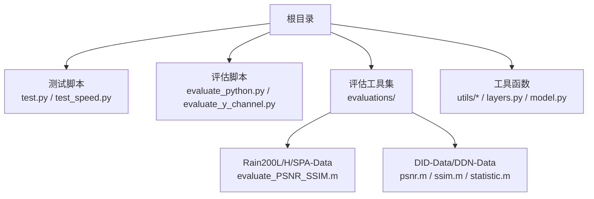
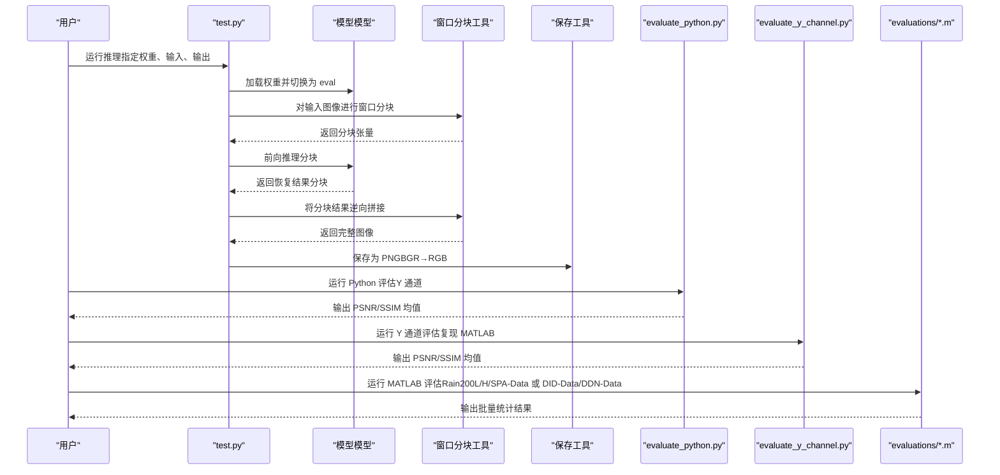
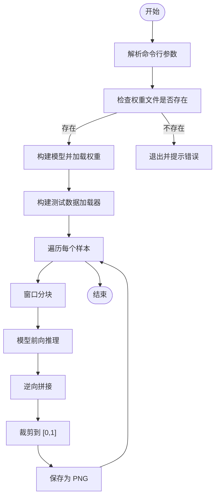
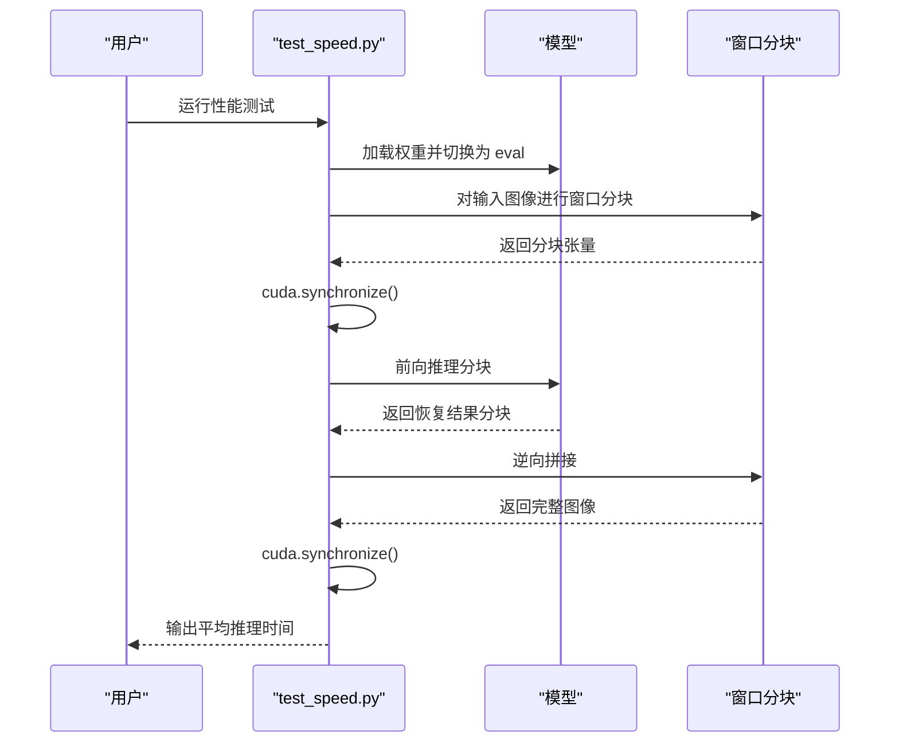
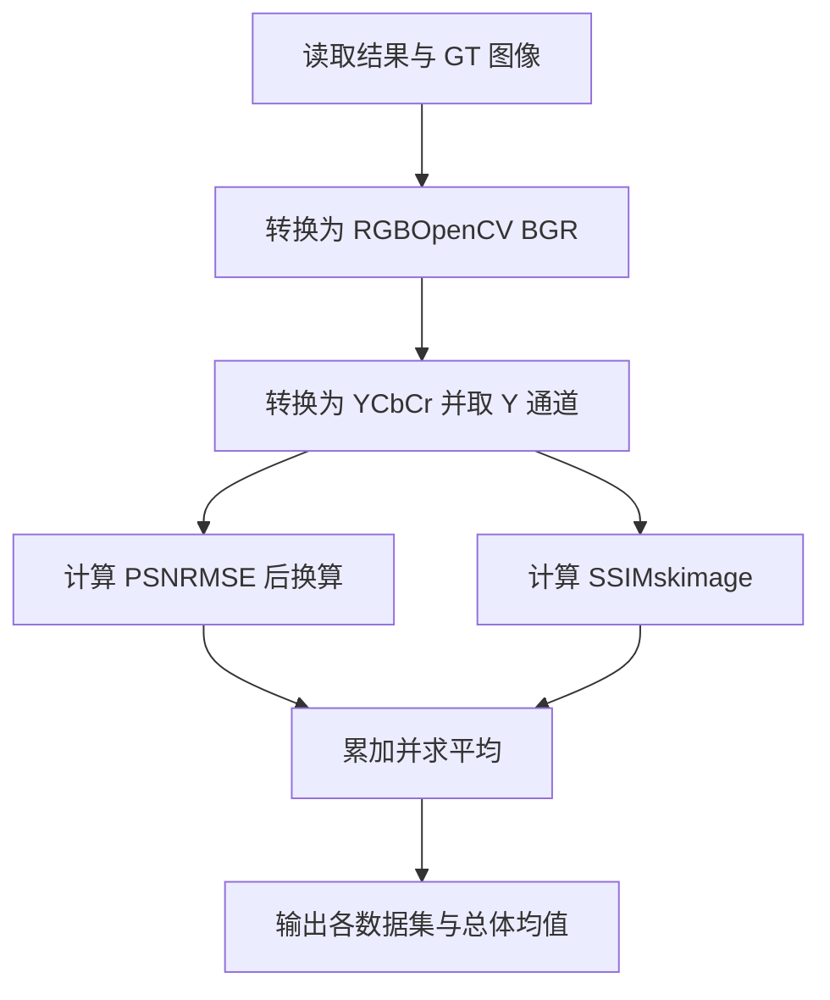
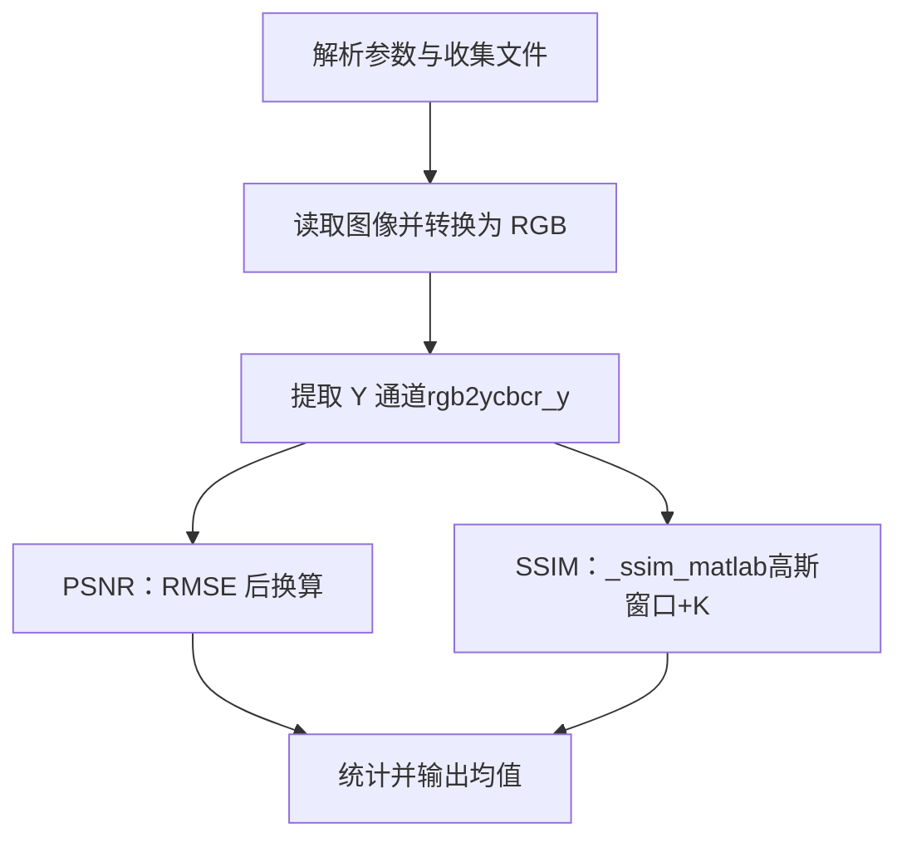
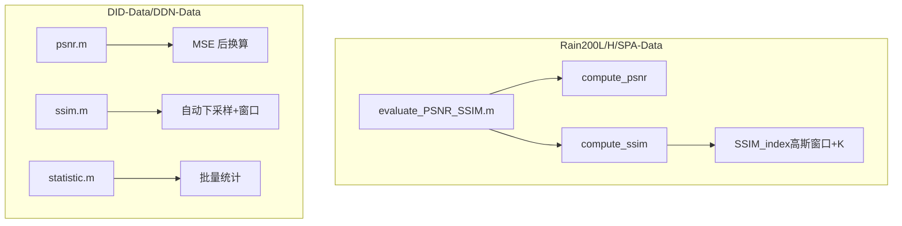
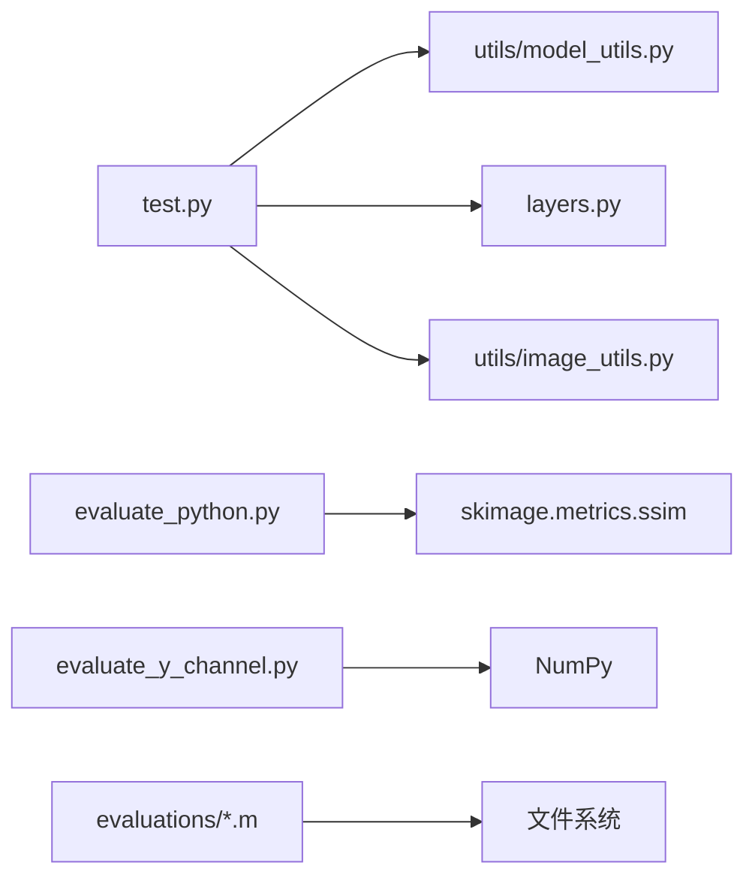

# 评估与测试

<cite>
**本文引用的文件列表**
- [README.md](file://README.md)
- [test.py](file://test.py)
- [test_speed.py](file://test_speed.py)
- [evaluate_python.py](file://evaluate_python.py)
- [evaluate_y_channel.py](file://evaluate_y_channel.py)
- [evaluations/Evalution_Rain200L_Rain200H_SPA-Data/evaluate_PSNR_SSIM.m](file://evaluations/Evalution_Rain200L_Rain200H_SPA-Data/evaluate_PSNR_SSIM.m)
- [evaluations/Evaluation_DID-Data_DDN-Data/psnr.m](file://evaluations/Evaluation_DID-Data_DDN-Data/psnr.m)
- [evaluations/Evaluation_DID-Data_DDN-Data/ssim.m](file://evaluations/Evaluation_DID-Data_DDN-Data/ssim.m)
- [evaluations/Evaluation_DID-Data_DDN-Data/statistic.m](file://evaluations/Evaluation_DID-Data_DDN-Data/statistic.m)
- [utils/model_utils.py](file://utils/model_utils.py)
- [utils/image_utils.py](file://utils/image_utils.py)
- [layers.py](file://layers.py)
- [model.py](file://model.py)
</cite>

## 目录
1. [简介](#简介)
2. [项目结构](#项目结构)
3. [核心组件](#核心组件)
4. [架构总览](#架构总览)
5. [详细组件分析](#详细组件分析)
6. [依赖关系分析](#依赖关系分析)
7. [性能考量](#性能考量)
8. [故障排查指南](#故障排查指南)
9. [结论](#结论)
10. [附录](#附录)

## 简介
本文件面向评估与测试系统，围绕以下目标展开：
- 解释 test.py 测试脚本的使用方法：预训练模型加载、推理执行、结果保存。
- 分析 test_speed.py 性能测试工具：推理速度测量、GPU 时间同步、窗口分块推理。
- 深入介绍 evaluate_python.py 与 evaluate_y_channel.py 的评估方法：PSNR 与 SSIM 的计算原理与实现细节（含 Y 通道与 MATLAB 等价实现）。
- 解释 evaluations/ 目录下不同数据集评估工具的使用方法与结果解读。
- 提供模型性能对比分析的完整流程：多数据集测试、指标汇总与统计显著性检验思路。
- 给出结果可视化与报告生成的实用技巧。

## 项目结构
该仓库采用“功能模块化 + 数据集专用评估”的组织方式：
- 核心推理与评估脚本位于根目录：test.py、test_speed.py、evaluate_python.py、evaluate_y_channel.py。
- 评估工具按数据集划分：evaluations/Evalution_Rain200L_Rain200H_SPA-Data（Matlab 实现）与 evaluations/Evaluation_DID-Data_DDN-Data（Matlab 实现）。
- 工具函数集中在 utils/ 与 layers.py、model.py 等模块，支撑模型加载、图像处理、窗口分块推理等。

**图表来源**
- [README.md:72-81](file://README.md#L72-L81)
- [evaluations/Evalution_Rain200L_Rain200H_SPA-Data/evaluate_PSNR_SSIM.m:1-41](file://evaluations/Evalution_Rain200L_Rain200H_SPA-Data/evaluate_PSNR_SSIM.m#L1-L41)
- [evaluations/Evaluation_DID-Data_DDN-Data/psnr.m:1-27](file://evaluations/Evaluation_DID-Data_DDN-Data/psnr.m#L1-L27)

**章节来源**
- [README.md:47-81](file://README.md#L47-L81)

## 核心组件
- 测试脚本 test.py：加载预训练权重、构建模型、对输入数据集进行批处理推理、窗口分块推理、结果保存。
- 性能测试脚本 test_speed.py：在相同输入数据集上测量平均推理时间，用于性能基准。
- 评估脚本 evaluate_python.py：基于 YCbCr Y 通道的 PSNR/SSIM 计算，兼容 OpenCV 读取与 NumPy 运算。
- 评估脚本 evaluate_y_channel.py：严格复现 MATLAB evaluate_PSNR_SSIM.m 的 Y 通道 PSNR/SSIM 计算，确保与论文指标一致。
- 评估工具集 evaluations/：针对 Rain200L/H/SPA-Data 与 DID-Data/DDN-Data 的 MATLAB 评估脚本，提供批量统计与可视化辅助。

**章节来源**
- [test.py:15-69](file://test.py#L15-L69)
- [test_speed.py:16-68](file://test_speed.py#L16-L68)
- [evaluate_python.py:60-119](file://evaluate_python.py#L60-L119)
- [evaluate_y_channel.py:117-219](file://evaluate_y_channel.py#L117-L219)

## 架构总览
整体评估与测试流程由“推理执行”和“指标评估”两条主线构成，二者既可独立运行，也可串联形成端到端评测管线。

**图表来源**
- [test.py:31-69](file://test.py#L31-L69)
- [layers.py:249-304](file://layers.py#L249-L304)
- [evaluate_python.py:60-119](file://evaluate_python.py#L60-L119)
- [evaluate_y_channel.py:117-219](file://evaluate_y_channel.py#L117-L219)
- [evaluations/Evalution_Rain200L_Rain200H_SPA-Data/evaluate_PSNR_SSIM.m:1-41](file://evaluations/Evalution_Rain200L_Rain200H_SPA-Data/evaluate_PSNR_SSIM.m#L1-L41)

## 详细组件分析

### 测试脚本 test.py 使用说明
- 功能概览
  - 加载预训练权重并构建模型实例。
  - 从指定输入目录读取测试图像，构造 DataLoader。
  - 使用窗口分块策略对大图像进行推理，避免显存不足。
  - 将结果裁剪至 [0,1]，转为 CPU NumPy，保存为 PNG。
- 关键步骤
  - 参数解析：输入目录、输出目录、权重路径、GPU 设备、窗口大小。
  - 权重加载：通过 utils.model_utils.load_checkpoint 完成状态字典适配。
  - 推理执行：将输入张量分块，前向推理，再逆向拼接。
  - 结果保存：使用 utils.image_utils.save_img 以 BGR 写回。
- 注意事项
  - 若权重路径不存在会直接退出。
  - 推理时启用 DataParallel，需注意多卡环境变量 CUDA_VISIBLE_DEVICES。
  - 窗口大小影响显存占用与推理时间，建议根据 GPU 显存调整。

**图表来源**
- [test.py:15-69](file://test.py#L15-L69)
- [layers.py:249-304](file://layers.py#L249-L304)
- [utils/model_utils.py:22-36](file://utils/model_utils.py#L22-L36)
- [utils/image_utils.py:11-13](file://utils/image_utils.py#L11-L13)

**章节来源**
- [test.py:15-69](file://test.py#L15-L69)
- [utils/model_utils.py:22-36](file://utils/model_utils.py#L22-L36)
- [utils/image_utils.py:11-13](file://utils/image_utils.py#L11-L13)
- [layers.py:249-304](file://layers.py#L249-L304)

### 性能测试工具 test_speed.py
- 功能概览
  - 在相同输入数据集上测量平均推理时间，用于性能基准比较。
  - 使用 torch.cuda.synchronize 精确计时，避免 CPU/GPU 异步导致的时间误差。
  - 与 test.py 类似的窗口分块推理流程，便于公平对比。
- 关键点
  - 计时位置：在窗口分块与逆向拼接前后分别进行同步与时间记录。
  - 平均耗时：总耗时除以样本数量得到每张图的平均推理时间。
  - 可视化：可在终端查看 average_time，结合 README 的可视化结果进行对比。

**图表来源**
- [test_speed.py:43-67](file://test_speed.py#L43-L67)
- [layers.py:249-304](file://layers.py#L249-L304)

**章节来源**
- [test_speed.py:16-68](file://test_speed.py#L16-L68)
- [layers.py:249-304](file://layers.py#L249-L304)

### 评估脚本 evaluate_python.py
- 功能概览
  - 读取去雨结果与 Ground Truth，计算 Y 通道上的 PSNR 与 SSIM。
  - 使用 OpenCV 读取图像并转换色彩空间，再调用 skimage 的 SSIM。
- 计算流程
  - 彩色图先转换为 YCbCr，取 Y 通道。
  - PSNR：均方误差 MSE 后按标准公式计算。
  - SSIM：使用 skimage.metrics.structural_similarity，参数设置接近 MATLAB 默认。
- 输出
  - 每个数据集的平均 PSNR 与 SSIM，以及所有数据集的平均值。

**图表来源**
- [evaluate_python.py:20-58](file://evaluate_python.py#L20-L58)
- [evaluate_python.py:60-119](file://evaluate_python.py#L60-L119)

**章节来源**
- [evaluate_python.py:1-119](file://evaluate_python.py#L1-L119)

### 评估脚本 evaluate_y_channel.py
- 功能概览
  - 严格复现 MATLAB evaluate_PSNR_SSIM.m 的 Y 通道 PSNR/SSIM 计算，确保与论文报告一致。
  - 提供命令行参数，支持自定义结果目录与 GT 目录。
- 计算流程
  - rgb2ycbcr_y：精确复现 MATLAB 的 Y 通道计算公式。
  - compute_psnr_y：基于 Y 通道 RMSE 计算 PSNR。
  - compute_ssim_y：复现 SSIM_index（高斯窗口、K 参数、L 动态范围）。
- 错误处理
  - 文件数量不一致时尝试按文件名匹配 GT。
  - 读取失败或尺寸不一致时跳过并提示。

**图表来源**
- [evaluate_y_channel.py:36-114](file://evaluate_y_channel.py#L36-L114)
- [evaluate_y_channel.py:117-219](file://evaluate_y_channel.py#L117-L219)

**章节来源**
- [evaluate_y_channel.py:1-219](file://evaluate_y_channel.py#L1-L219)

### evaluations/ 目录下的 MATLAB 评估工具
- Rain200L/H/SPA-Data
  - evaluate_PSNR_SSIM.m：对 results/ 与 Datasets/*/targets/ 下的图像进行批量评估，输出每个数据集与总体的 PSNR/SSIM。
  - compute_psnr/compute_ssim：在 Y 通道上计算 PSNR/SSIM；SSIM 使用自定义 SSIM_index（高斯窗口、K、L）。
- DID-Data/DDN-Data
  - psnr.m：通用 PSNR 计算，自动识别动态范围（8bit 或更高）。
  - ssim.m：通用 SSIM 计算，支持自动下采样与窗口过滤。
  - statistic.m：对固定数量样本（如 1200 或 1400）进行批量统计，输出均值。

**图表来源**
- [evaluations/Evalution_Rain200L_Rain200H_SPA-Data/evaluate_PSNR_SSIM.m:42-71](file://evaluations/Evalution_Rain200L_Rain200H_SPA-Data/evaluate_PSNR_SSIM.m#L42-L71)
- [evaluations/Evalution_Rain200L_Rain200H_SPA-Data/evaluate_PSNR_SSIM.m:73-268](file://evaluations/Evalution_Rain200L_Rain200H_SPA-Data/evaluate_PSNR_SSIM.m#L73-L268)
- [evaluations/Evaluation_DID-Data_DDN-Data/psnr.m:1-27](file://evaluations/Evaluation_DID-Data_DDN-Data/psnr.m#L1-L27)
- [evaluations/Evaluation_DID-Data_DDN-Data/ssim.m:1-213](file://evaluations/Evaluation_DID-Data_DDN-Data/ssim.m#L1-L213)
- [evaluations/Evaluation_DID-Data_DDN-Data/statistic.m:1-20](file://evaluations/Evaluation_DID-Data_DDN-Data/statistic.m#L1-L20)

**章节来源**
- [evaluations/Evalution_Rain200L_Rain200H_SPA-Data/evaluate_PSNR_SSIM.m:1-268](file://evaluations/Evalution_Rain200L_Rain200H_SPA-Data/evaluate_PSNR_SSIM.m#L1-L268)
- [evaluations/Evaluation_DID-Data_DDN-Data/psnr.m:1-27](file://evaluations/Evaluation_DID-Data_DDN-Data/psnr.m#L1-L27)
- [evaluations/Evaluation_DID-Data_DDN-Data/ssim.m:1-213](file://evaluations/Evaluation_DID-Data_DDN-Data/ssim.m#L1-L213)
- [evaluations/Evaluation_DID-Data_DDN-Data/statistic.m:1-20](file://evaluations/Evaluation_DID-Data_DDN-Data/statistic.m#L1-L20)

## 依赖关系分析
- 模型与工具
  - test.py 依赖 model.py 中的 MultiscaleNet 与 utils.model_utils.load_checkpoint。
  - 推理过程依赖 layers.py 的窗口分块与逆向拼接函数。
  - 结果保存依赖 utils.image_utils.save_img。
- 评估脚本
  - evaluate_python.py 依赖 OpenCV 与 scikit-image 的 SSIM。
  - evaluate_y_channel.py 自行实现 rgb2ycbcr 与 SSIM 的 MATLAB 等价版本。
- 评估工具集
  - evaluations/ 下的 MATLAB 脚本独立运行，读取本地 results 与 targets 目录。

**图表来源**
- [test.py:31-36](file://test.py#L31-L36)
- [utils/model_utils.py:22-36](file://utils/model_utils.py#L22-L36)
- [layers.py:249-304](file://layers.py#L249-L304)
- [utils/image_utils.py:11-13](file://utils/image_utils.py#L11-L13)
- [evaluate_python.py:6-58](file://evaluate_python.py#L6-L58)
- [evaluate_y_channel.py:18-114](file://evaluate_y_channel.py#L18-L114)

**章节来源**
- [test.py:1-14](file://test.py#L1-L14)
- [utils/model_utils.py:1-111](file://utils/model_utils.py#L1-L111)
- [layers.py:1-392](file://layers.py#L1-L392)
- [utils/image_utils.py:1-19](file://utils/image_utils.py#L1-L19)
- [evaluate_python.py:1-119](file://evaluate_python.py#L1-L119)
- [evaluate_y_channel.py:1-219](file://evaluate_y_channel.py#L1-L219)

## 性能考量
- 显存与吞吐
  - 窗口分块是控制显存的关键手段。窗口越大，单次推理吞吐越高但显存占用更大；窗口越小，显存压力降低但推理次数增多。
  - 建议根据 GPU 显存选择合适的窗口大小（例如 256），并在 test.py 中调整参数。
- 计时精度
  - 使用 torch.cuda.synchronize 包裹推理前后，避免异步导致的时间漂移。
  - test_speed.py 的平均时间是对样本集的统计，适合跨模型横向比较。
- I/O 与保存
  - 保存为 PNG 时注意色彩空间转换（BGR→RGB），避免颜色偏差。
  - 大规模保存建议使用批处理与并行写入策略（当前脚本逐张保存，可按需优化）。

[本节为通用指导，无需特定文件来源]

## 故障排查指南
- 权重文件不存在
  - 现象：启动即退出并提示权重文件不存在。
  - 处理：确认 weights 参数路径正确，或下载预训练模型。
  - 参考：[test.py:27-29](file://test.py#L27-L29)
- GPU 设备号配置
  - 现象：多卡环境下推理异常或显存不足。
  - 处理：设置 CUDA_VISIBLE_DEVICES，确保仅使用目标 GPU。
  - 参考：[test.py:24-25](file://test.py#L24-L25)，[test_speed.py:22-23](file://test_speed.py#L22-L23)
- 图像尺寸不一致
  - 现象：评估时报错或跳过样本。
  - 处理：evaluate_y_channel.py 会尝试按文件名匹配 GT；若仍不一致，手动对齐尺寸。
  - 参考：[evaluate_y_channel.py:190-196](file://evaluate_y_channel.py#L190-L196)
- MATLAB 评估缺失依赖
  - 现象：运行 evaluate_PSNR_SSIM.m 报错。
  - 处理：确保 MATLAB 环境可用，且 results 与 targets 目录结构正确。
  - 参考：[evaluations/Evalution_Rain200L_Rain200H_SPA-Data/evaluate_PSNR_SSIM.m:10-13](file://evaluations/Evalution_Rain200L_Rain200H_SPA-Data/evaluate_PSNR_SSIM.m#L10-L13)

**章节来源**
- [test.py:24-29](file://test.py#L24-L29)
- [test_speed.py:22-23](file://test_speed.py#L22-L23)
- [evaluate_y_channel.py:190-196](file://evaluate_y_channel.py#L190-L196)
- [evaluations/Evalution_Rain200L_Rain200H_SPA-Data/evaluate_PSNR_SSIM.m:10-13](file://evaluations/Evalution_Rain200L_Rain200H_SPA-Data/evaluate_PSNR_SSIM.m#L10-L13)

## 结论
- test.py 提供了完整的推理与结果保存流程，配合窗口分块策略可稳定运行于不同分辨率图像。
- test_speed.py 通过精确计时为模型性能对比提供了可靠基线。
- evaluate_python.py 与 evaluate_y_channel.py 分别覆盖 Python 与 MATLAB 等价评估路径，确保指标一致性。
- evaluations/ 下的 MATLAB 工具适用于大规模批量评估，便于与论文指标对齐。
- 建议在多数据集上统一使用 Y 通道 PSNR/SSIM，并结合 README 的可视化结果进行综合分析。

[本节为总结，无需特定文件来源]

## 附录

### 模型性能对比分析流程（多数据集测试与统计显著性）
- 步骤一：准备数据集
  - 将各数据集的 GT 存放于 Datasets/*/targets/，去雨结果存放于 evaluations/*/results/*。
  - 参考：README 的数据集准备与评估说明。
- 步骤二：运行评估
  - 使用 evaluate_python.py 或 evaluate_y_channel.py 获取 Y 通道指标。
  - 对 Rain200L/H/SPA-Data 使用 evaluate_PSNR_SSIM.m；对 DID-Data/DDN-Data 使用 psnr.m/ssim.m/statistic.m。
- 步骤三：汇总与对比
  - 汇总各模型在各数据集的 PSNR/SSIM 均值，形成矩阵。
  - 可视化：热力图或柱状图展示模型间差异。
- 步骤四：统计显著性检验
  - 方法：对同一数据集不同模型的指标进行配对 t 检验或非参数检验（如 Wilcoxon 符号秩检验），判断差异是否显著。
  - 注意：确保样本独立性与正态性假设满足，必要时进行变换或非参数检验。
- 步骤五：报告生成
  - 指标表格：包含均值、标准差、显著性标记。
  - 可视化：图像示例、质量分布直方图、误差散点图。
  - 结论：指出最优模型、退化原因分析与改进建议。

[本节为通用流程指导，无需特定文件来源]