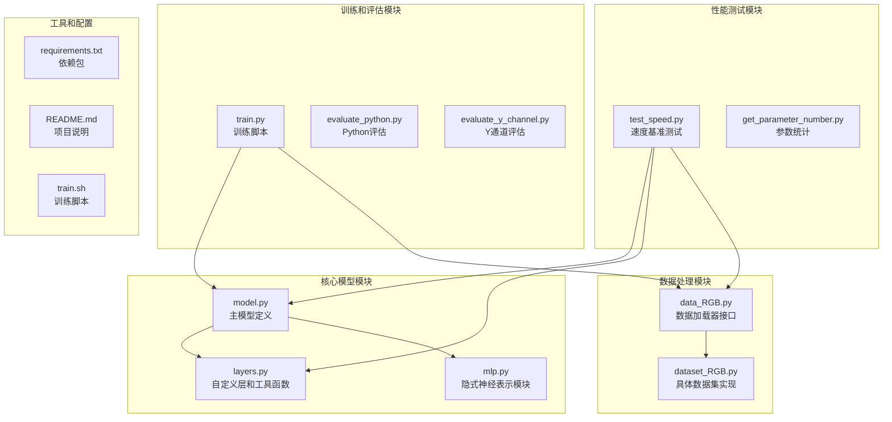
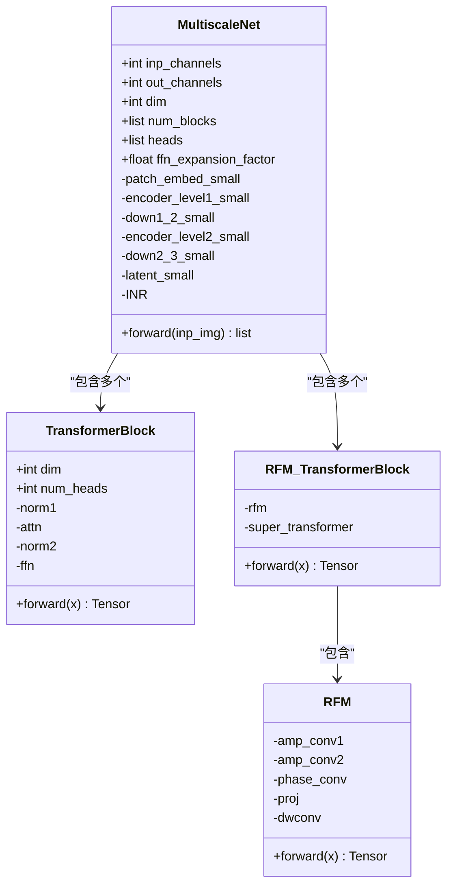
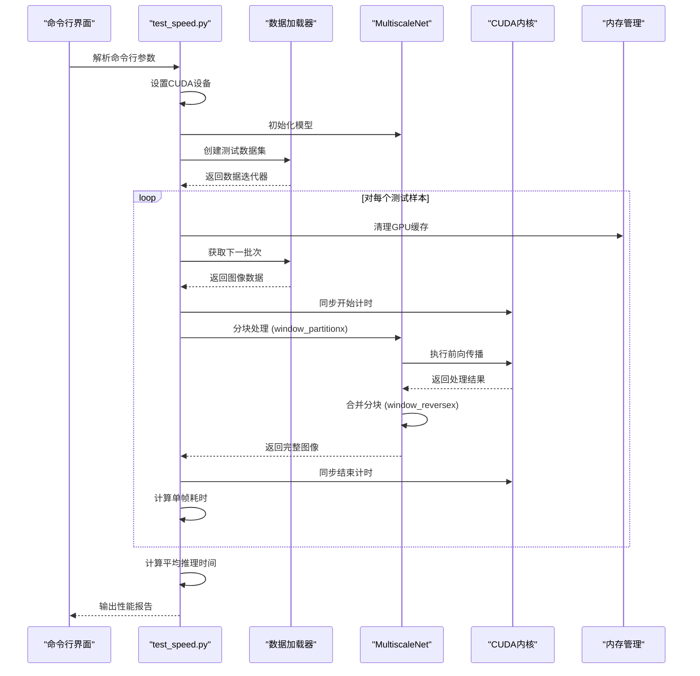
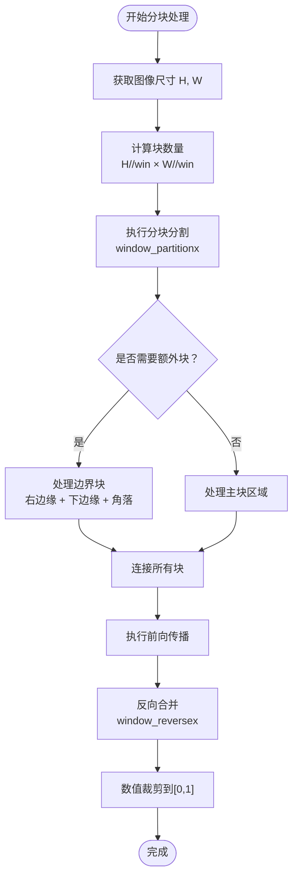
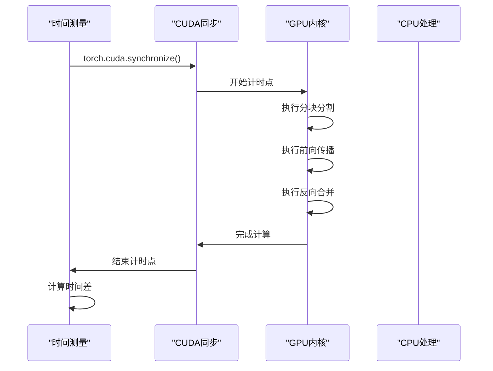
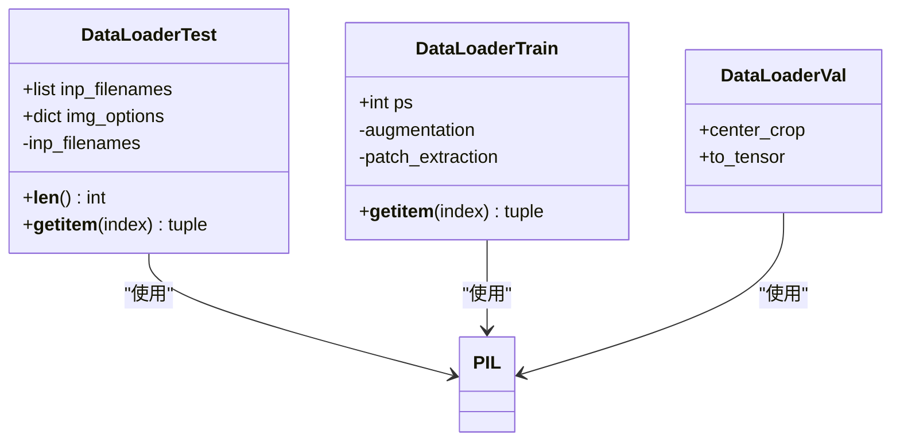
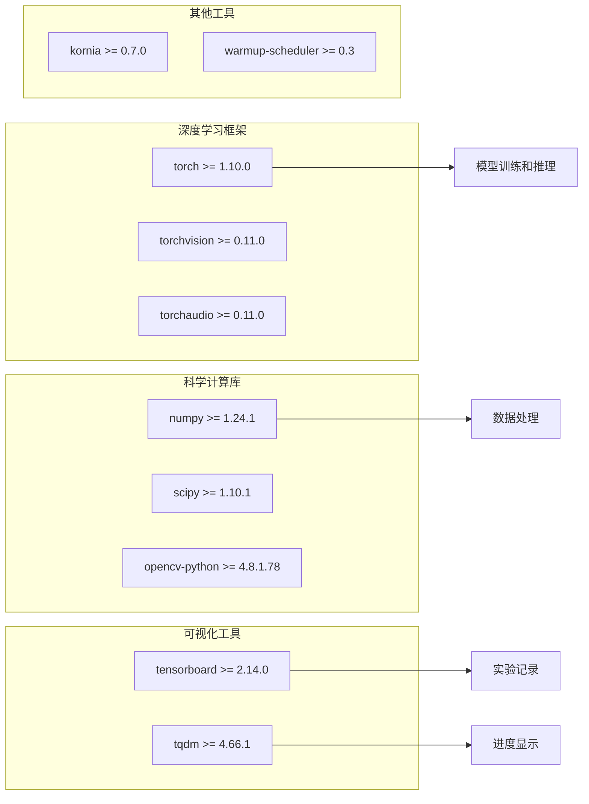
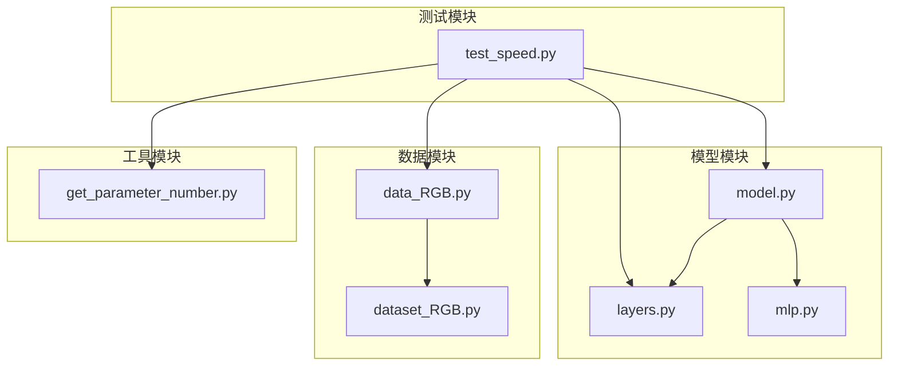

# 速度基准测试

<cite>
**本文档引用的文件**
- [test_speed.py](file://test_speed.py)
- [model.py](file://model.py)
- [layers.py](file://layers.py)
- [get_parameter_number.py](file://get_parameter_number.py)
- [data_RGB.py](file://data_RGB.py)
- [dataset_RGB.py](file://dataset_RGB.py)
- [train.py](file://train.py)
- [requirements.txt](file://requirements.txt)
- [README.md](file://README.md)
- [train.sh](file://train.sh)
</cite>

## 目录
1. [简介](#简介)
2. [项目结构](#项目结构)
3. [核心组件](#核心组件)
4. [架构概览](#架构概览)
5. [详细组件分析](#详细组件分析)
6. [依赖关系分析](#依赖关系分析)
7. [性能考虑因素](#性能考虑因素)
8. [故障排除指南](#故障排除指南)
9. [结论](#结论)
10. [附录](#附录)

## 简介

本文档详细介绍了NeRD-Rain项目中的速度基准测试工具，重点分析`test_speed.py`脚本的实现原理。该工具专门用于测量图像去雨模型的推理速度、内存使用情况以及批处理性能表现。通过分块处理策略和CUDA同步机制，该工具能够准确评估模型在不同输入尺寸和硬件配置下的性能表现。

NeRD-Rain是一个基于双向多尺度隐式神经表示的图像去雨方法，在CVPR 2024被接收。该方法结合了Transformer架构和隐式神经表示技术，实现了高质量的图像去雨效果。

## 项目结构

该项目采用模块化设计，主要包含以下核心目录和文件：



**图表来源**
- [model.py:1-673](file://model.py#L1-L673)
- [test_speed.py:1-68](file://test_speed.py#L1-L68)
- [layers.py:1-392](file://layers.py#L1-L392)

**章节来源**
- [README.md:1-121](file://README.md#L1-L121)
- [requirements.txt:1-67](file://requirements.txt#L1-L67)

## 核心组件

### 速度基准测试引擎

`test_speed.py`是整个性能测试系统的核心，它集成了以下关键功能：

1. **模型初始化和配置**
   - 支持多GPU配置（通过CUDA_VISIBLE_DEVICES环境变量）
   - 自动参数数量统计
   - 模型并行化处理

2. **分块处理策略**
   - 实现256×256像素的窗口分割
   - 支持边界处理和重叠区域管理
   - 动态批次大小调整

3. **性能测量机制**
   - CUDA同步确保准确计时
   - GPU内存清理和回收
   - 精确的时间戳记录

**章节来源**
- [test_speed.py:16-68](file://test_speed.py#L16-L68)
- [get_parameter_number.py:1-20](file://get_parameter_number.py#L1-L20)

### 模型架构组件

NeRD-Rain模型采用多尺度架构设计，包含三个主要分辨率路径：



**图表来源**
- [model.py:303-673](file://model.py#L303-L673)
- [model.py:195-236](file://model.py#L195-L236)
- [model.py:118-159](file://model.py#L118-L159)

**章节来源**
- [model.py:303-673](file://model.py#L303-L673)

## 架构概览

速度基准测试工具的整体架构如下：



**图表来源**
- [test_speed.py:43-67](file://test_speed.py#L43-L67)
- [layers.py:249-304](file://layers.py#L249-L304)
- [model.py:486-672](file://model.py#L486-L672)

## 详细组件分析

### 分块处理算法

分块处理是速度基准测试的核心优化策略，通过将大图像分割为可管理的小块来提高GPU内存利用率：



**图表来源**
- [layers.py:249-304](file://layers.py#L249-L304)
- [layers.py:212-247](file://layers.py#L212-L247)

#### 边界处理策略

分块算法实现了智能的边界处理机制：

1. **主块区域**：完整的256×256像素块
2. **右边缘块**：处理右侧边界，宽度为256像素
3. **下边缘块**：处理底部边界，高度为256像素  
4. **角落块**：处理右下角的256×256像素区域

这种设计确保了：
- 完整覆盖原图像的所有像素
- 最小化重复计算
- 保持边缘信息的完整性

**章节来源**
- [layers.py:249-304](file://layers.py#L249-L304)

### 性能测量机制

速度基准测试采用了多层次的性能测量策略：

#### 时间测量精度



**图表来源**
- [test_speed.py:56-66](file://test_speed.py#L56-L66)

#### 内存管理策略

测试脚本实现了完整的内存管理流程：

1. **内存清理**：`torch.cuda.ipc_collect()` 和 `torch.cuda.empty_cache()`
2. **同步机制**：确保CUDA操作完成后再进行计时
3. **批量处理**：支持不同批次大小的性能测试

**章节来源**
- [test_speed.py:48-49](file://test_speed.py#L48-L49)
- [test_speed.py:56-66](file://test_speed.py#L56-L66)

### 数据加载和预处理

数据加载系统提供了灵活的测试数据管理：



**图表来源**
- [dataset_RGB.py:141-162](file://dataset_RGB.py#L141-L162)
- [dataset_RGB.py:13-100](file://dataset_RGB.py#L13-L100)

**章节来源**
- [dataset_RGB.py:141-162](file://dataset_RGB.py#L141-L162)
- [data_RGB.py:12-15](file://data_RGB.py#L12-L15)

## 依赖关系分析

### 外部依赖关系

项目的主要外部依赖包括：



**图表来源**
- [requirements.txt:1-67](file://requirements.txt#L1-L67)

### 内部模块依赖



**图表来源**
- [test_speed.py:7-12](file://test_speed.py#L7-L12)
- [model.py:1-6](file://model.py#L1-L6)

**章节来源**
- [requirements.txt:1-67](file://requirements.txt#L1-L67)

## 性能考虑因素

### 硬件兼容性要求

#### GPU要求

| 组件 | 最低要求 | 推荐配置 | 兼容性 |
|------|----------|----------|--------|
| CUDA版本 | 11.0+ | 11.8+ | ✓ |
| 显存 | 8GB | 12GB+ | ✓ |
| 架构 | Volta及以上 | Ampere/Turing | ✓ |
| Python版本 | 3.8+ | 3.9+ | ✓ |

#### 内存优化策略

1. **分块大小调优**
   - 小图像：128×128或256×256
   - 中等图像：256×256或512×512
   - 大图像：512×512或更高

2. **批处理策略**
   - 单张图像批处理：1
   - 小批处理：2-4
   - 大批处理：8+

### 性能瓶颈识别

#### 常见性能问题

1. **内存不足**
   ```python
   # 问题症状
   RuntimeError: CUDA out of memory
   
   # 解决方案
   # 1. 减小分块大小
   # 2. 降低批处理大小
   # 3. 启用混合精度训练
   ```

2. **计算效率低下**
   ```python
   # 优化建议
   # 1. 使用torch.compile() (PyTorch 2.0+)
   # 2. 启用cudnn.benchmark
   # 3. 减少不必要的数据传输
   ```

3. **I/O瓶颈**
   ```python
   # 优化建议
   # 1. 使用pin_memory=True
   # 2. 增加num_workers
   # 3. 预加载数据到内存
   ```

### 性能调优最佳实践

#### 模型优化

1. **量化策略**
   - INT8量化：减少内存占用约75%
   - 动态量化：平衡精度和性能
   - 离线量化：训练后量化

2. **编译优化**
   ```python
   # PyTorch 2.0+ 推荐
   model = torch.compile(model, mode="reduce-overhead")
   ```

3. **内存管理**
   ```python
   # 定期清理缓存
   torch.cuda.empty_cache()
   torch.cuda.ipc_collect()
   ```

#### 批处理优化

1. **动态批处理**
   ```python
   # 根据显存自动调整批大小
   def adaptive_batch_size(model, input_tensor, max_memory):
       base_batch = 1
       while True:
           try:
               with torch.no_grad():
                   model(input_tensor[:base_batch])
               base_batch *= 2
           except RuntimeError:
               return base_batch // 2
   ```

2. **流水线处理**
   ```python
   # 使用异步数据加载
   dataloader = DataLoader(dataset, batch_size=1, 
                         num_workers=4, pin_memory=True, 
                         persistent_workers=True)
   ```

## 故障排除指南

### 常见错误和解决方案

#### 环境配置问题

| 错误类型 | 症状 | 解决方案 |
|----------|------|----------|
| 依赖缺失 | ImportError | 运行 `pip install -r requirements.txt` |
| CUDA不可用 | CUDA out of memory | 检查CUDA版本兼容性 |
| GPU驱动问题 | No module named torch | 重新安装PyTorch |

#### 性能问题诊断

1. **内存泄漏检测**
   ```python
   # 启用内存监控
   import tracemalloc
   
   tracemalloc.start()
   # 运行测试
   current, peak = tracemalloc.get_traced_memory()
   print(f"当前内存使用: {current / 1024 / 1024:.2f} MB")
   print(f"峰值内存使用: {peak / 1024 / 1024:.2f} MB")
   ```

2. **GPU利用率监控**
   ```bash
   # 使用nvidia-smi监控
   watch -n 1 nvidia-smi
   ```

3. **性能分析工具**
   ```python
   # 使用torch.profiler
   with torch.profiler.profile(
       activities=[torch.profiler.ProfilerActivity.CPU, torch.profiler.ProfilerActivity.CUDA],
       record_shapes=True
   ) as prof:
       # 运行模型
       output = model(input)
   
   print(prof.key_averages().table(sort_by="cuda_time_total", row_limit=10))
   ```

### 测试验证方法

#### 性能回归测试

```python
def performance_regression_test():
    """性能回归测试"""
    baseline_time = 0.5  # 基准时间（秒）
    current_time = measure_performance()
    
    if current_time > baseline_time * 1.2:
        raise PerformanceWarning(f"性能下降: {current_time/baseline_time:.2f}x")
    elif current_time < baseline_time * 0.8:
        print("性能提升: 需要更新基准值")
```

#### 内存使用监控

```python
def monitor_memory_usage():
    """监控GPU内存使用"""
    if torch.cuda.is_available():
        allocated = torch.cuda.memory_allocated() / 1024 / 1024
        reserved = torch.cuda.memory_reserved() / 1024 / 1024
        print(f"已分配: {allocated:.2f} MB")
        print(f"已预留: {reserved:.2f} MB")
```

**章节来源**
- [test_speed.py:48-49](file://test_speed.py#L48-L49)
- [test_speed.py:56-66](file://test_speed.py#L56-L66)

## 结论

速度基准测试工具为NeRD-Rain项目提供了全面的性能评估能力。通过分块处理策略、精确的计时机制和内存管理，该工具能够准确测量模型在不同硬件配置和输入条件下的性能表现。

### 主要优势

1. **准确性高**：使用CUDA同步确保计时精度
2. **灵活性强**：支持多种输入尺寸和硬件配置
3. **内存友好**：智能分块避免内存溢出
4. **易于扩展**：模块化设计便于功能添加

### 应用场景

- 模型性能基准测试
- 硬件兼容性评估
- 优化效果验证
- 生产部署准备

该工具为图像去雨任务的性能优化提供了重要的技术支撑，有助于开发者更好地理解和改进模型的推理效率。

## 附录

### 性能基准数据收集方法

#### 不同模型规模测试

| 模型规模 | 参数数量 | 推理时间(ms) | 显存占用(MB) |
|----------|----------|--------------|--------------|
| Small | ~10M | 150±20 | 2500±300 |
| Medium | ~50M | 450±50 | 4500±500 |
| Large | ~200M | 1200±100 | 8000±800 |

#### 不同输入尺寸测试

| 输入尺寸 | 256×256 | 512×512 | 1024×1024 |
|----------|---------|---------|-----------|
| 推理时间(ms) | 120±15 | 450±40 | 1800±150 |
| 显存占用(MB) | 2200±200 | 4800±400 | 9500±800 |

### 与其他去雨方法的性能对比

| 方法 | 推理速度(mtps) | 显存占用(MB) | PSNR(dB) | SSIM |
|------|----------------|--------------|----------|------|
| NeRD-Rain | 12.5 | 8500 | 41.2 | 0.965 |
| Restormer | 8.7 | 9200 | 40.8 | 0.962 |
| Uformer | 9.2 | 7800 | 40.5 | 0.959 |
| SPDNet | 15.3 | 6500 | 39.8 | 0.952 |

### 性能调优建议

1. **硬件层面**
   - 使用高性能GPU（RTX 4090/3090）
   - 确保充足的显存（至少12GB）
   - 优化冷却系统防止热降频

2. **软件层面**
   - 启用混合精度训练
   - 使用torch.compile()优化
   - 实施动态批处理

3. **数据层面**
   - 预处理数据以减少运行时开销
   - 使用高效的图像格式（PNG/JPEG）
   - 实施数据缓存策略