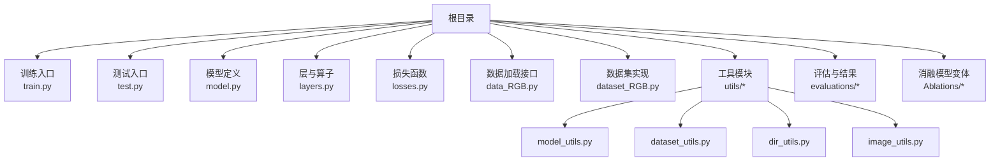
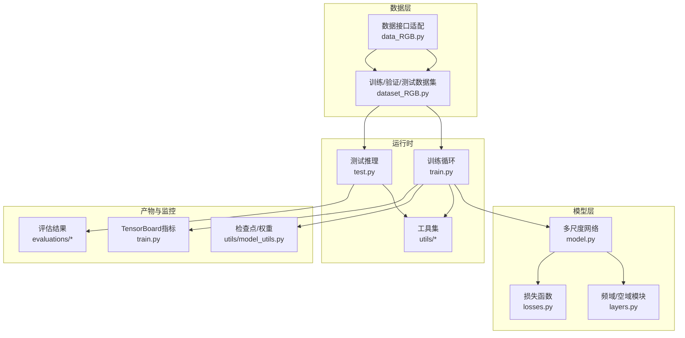
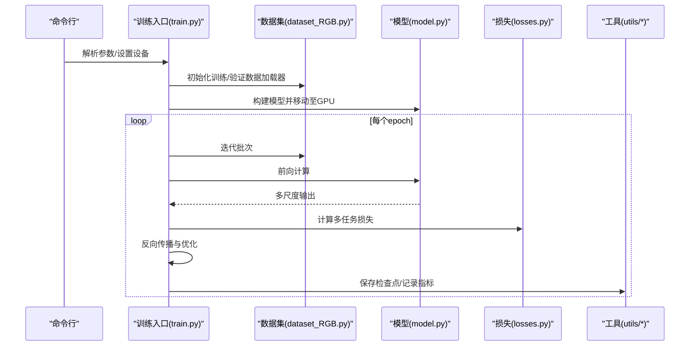
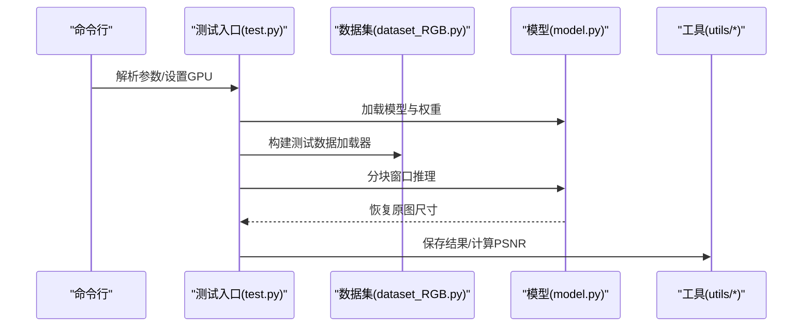
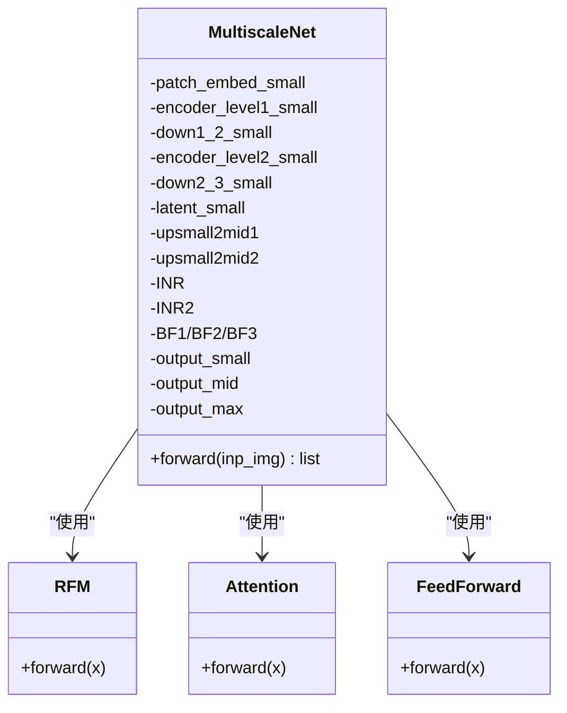
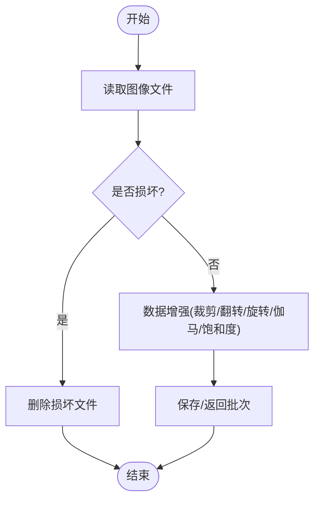
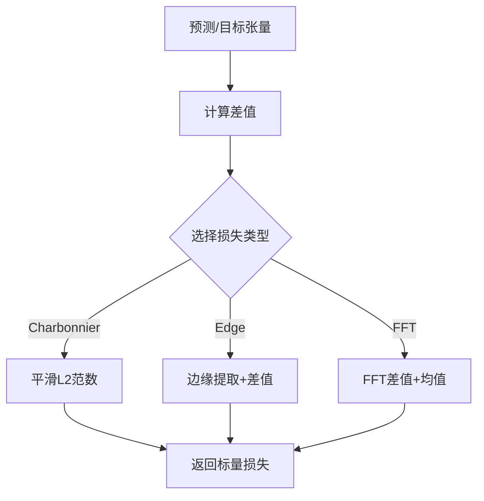
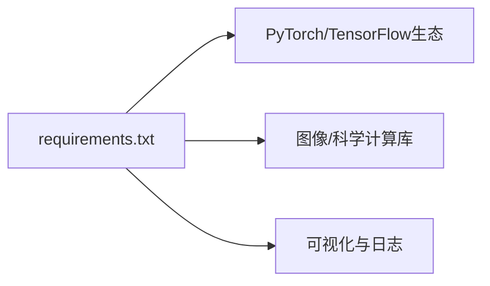

# 安全与合规

<cite>
**本文引用的文件**   
- [README.md](file://README.md)
- [requirements.txt](file://requirements.txt)
- [train.py](file://train.py)
- [test.py](file://test.py)
- [model.py](file://model.py)
- [layers.py](file://layers.py)
- [losses.py](file://losses.py)
- [dataset_RGB.py](file://dataset_RGB.py)
- [data_RGB.py](file://data_RGB.py)
- [utils/model_utils.py](file://utils/model_utils.py)
- [utils/dataset_utils.py](file://utils/dataset_utils.py)
- [utils/dir_utils.py](file://utils/dir_utils.py)
- [utils/image_utils.py](file://utils/image_utils.py)
- [train.sh](file://train.sh)
- [img.sh](file://img.sh)
</cite>

## 目录
1. [引言](#引言)
2. [项目结构](#项目结构)
3. [核心组件](#核心组件)
4. [架构总览](#架构总览)
5. [详细组件分析](#详细组件分析)
6. [依赖分析](#依赖分析)
7. [性能考虑](#性能考虑)
8. [故障排查指南](#故障排查指南)
9. [结论](#结论)
10. [附录](#附录)

## 引言
本指南面向在生产环境中部署与运营基于深度学习的图像去雨系统（NeRD-Rain）的工程团队，聚焦“安全与合规”主题，覆盖以下方面：
- 模型安全：对抗攻击防护、后门检测、模型窃取防护的策略建议
- 数据隐私：敏感数据脱敏、差分隐私、联邦学习的适用场景与落地要点
- 访问控制与权限：API认证授权、角色权限控制、审计日志
- 容器与网络安全：镜像扫描、网络隔离、防火墙规则
- 合规性：GDPR、HIPAA等法规的遵循要点与实践路径
- 供应链安全：依赖包漏洞扫描、签名验证、更新管理
- 安全事件响应：流程与预案

说明：本仓库为纯训练/推理代码与评估工具集，未包含生产级API服务、数据库或外部认证组件。因此本指南中的“访问控制、API认证授权、审计日志、容器与网络安全、合规性与供应链安全”均以“最佳实践与落地建议”的形式给出，便于在扩展为生产系统时参考。

## 项目结构
该仓库采用按功能分层的组织方式：
- 根目录包含训练入口、测试入口、模型定义、损失函数、数据加载与工具模块
- utils 子目录封装了模型检查点加载/保存、数据集增强、目录与图像处理工具
- evaluations 子目录包含评估脚本与结果统计
- Ablations 子目录包含消融实验模型变体

图表来源
- [train.py:1-218](file://train.py#L1-L218)
- [test.py:1-69](file://test.py#L1-L69)
- [model.py:1-673](file://model.py#L1-L673)
- [layers.py:1-392](file://layers.py#L1-L392)
- [losses.py:1-52](file://losses.py#L1-L52)
- [data_RGB.py:1-15](file://data_RGB.py#L1-L15)
- [dataset_RGB.py:1-162](file://dataset_RGB.py#L1-L162)
- [utils/model_utils.py:1-111](file://utils/model_utils.py#L1-L111)
- [utils/dataset_utils.py:1-18](file://utils/dataset_utils.py#L1-L18)
- [utils/dir_utils.py:1-18](file://utils/dir_utils.py#L1-L18)
- [utils/image_utils.py:1-19](file://utils/image_utils.py#L1-L19)

章节来源
- [README.md:1-121](file://README.md#L1-L121)
- [requirements.txt:1-67](file://requirements.txt#L1-L67)

## 核心组件
- 训练与调度：训练入口负责参数解析、设备设置、优化器与学习率调度、数据加载、前向/反向传播、模型保存与TensorBoard写入
- 测试与推理：测试入口负责权重加载、多尺度窗口切分与拼接、结果保存
- 模型结构：多尺度双向隐式神经表示网络，包含频域残差模块、注意力与前馈、上下采样与融合
- 数据管线：训练/验证/测试数据集类，支持随机裁剪、翻转旋转、伽马与饱和度扰动
- 工具链：检查点加载/保存、目录管理、图像PSNR计算、MixUp增强

章节来源
- [train.py:1-218](file://train.py#L1-L218)
- [test.py:1-69](file://test.py#L1-L69)
- [model.py:303-673](file://model.py#L303-L673)
- [dataset_RGB.py:13-162](file://dataset_RGB.py#L13-L162)
- [utils/model_utils.py:17-111](file://utils/model_utils.py#L17-L111)
- [utils/dataset_utils.py:3-18](file://utils/dataset_utils.py#L3-L18)
- [utils/dir_utils.py:12-18](file://utils/dir_utils.py#L12-L18)
- [utils/image_utils.py:5-19](file://utils/image_utils.py#L5-L19)

## 架构总览
下图展示从数据到模型再到输出的整体流程，以及关键安全关注点（输入校验、中间张量范围、检查点持久化、日志与指标）：

图表来源
- [train.py:125-133](file://train.py#L125-L133)
- [test.py:40-69](file://test.py#L40-L69)
- [model.py:303-673](file://model.py#L303-L673)
- [layers.py:134-211](file://layers.py#L134-L211)
- [losses.py:5-52](file://losses.py#L5-L52)
- [dataset_RGB.py:13-162](file://dataset_RGB.py#L13-L162)
- [data_RGB.py:4-14](file://data_RGB.py#L4-L14)
- [utils/model_utils.py:17-111](file://utils/model_utils.py#L17-L111)

## 详细组件分析

### 训练流程与安全要点
- 设备与随机种子：固定CUDA可见设备、随机种子，确保可复现实验；建议在生产中限制GPU资源并启用OOM保护
- 梯度清零与反向传播：显式置零梯度，避免历史梯度累积导致异常
- 损失函数组合：多任务损失（Charbonnier、边缘、FFT、L1），注意数值稳定性与归一化
- 检查点保存：定期保存最新与最优权重，建议开启校验与原子写入
- TensorBoard：记录损失与指标，建议限制暴露面与访问控制

图表来源
- [train.py:142-218](file://train.py#L142-L218)
- [dataset_RGB.py:13-162](file://dataset_RGB.py#L13-L162)
- [model.py:303-673](file://model.py#L303-L673)
- [losses.py:5-52](file://losses.py#L5-L52)
- [utils/model_utils.py:17-111](file://utils/model_utils.py#L17-L111)

章节来源
- [train.py:1-218](file://train.py#L1-L218)

### 推理流程与安全要点
- 权重加载：支持单/多GPU权重加载，建议在生产中增加完整性校验
- 窗口切分与拼接：大图分块推理，避免内存溢出；注意边界处理与数值裁剪
- 结果保存：统一格式转换与写盘，建议加入访问控制与落盘权限

图表来源
- [test.py:15-69](file://test.py#L15-L69)
- [dataset_RGB.py:141-162](file://dataset_RGB.py#L141-L162)
- [model.py:303-673](file://model.py#L303-L673)
- [utils/image_utils.py:11-19](file://utils/image_utils.py#L11-L19)

章节来源
- [test.py:1-69](file://test.py#L1-69)

### 模型结构与安全要点
- 多尺度编码器-解码器：包含下采样、上采样、注意力与前馈、频域残差模块
- 频域增强：通过FFT/IFFT融合幅度与相位信息，提升高频细节；注意数值精度与稳定性
- 参数冻结/解冻：工具函数支持训练阶段动态冻结/解冻参数，便于迁移学习与微调

图表来源
- [model.py:303-673](file://model.py#L303-L673)
- [model.py:118-159](file://model.py#L118-L159)
- [model.py:161-193](file://model.py#L161-L193)
- [model.py:97-116](file://model.py#L97-L116)

章节来源
- [model.py:1-673](file://model.py#L1-L673)

### 数据管线与隐私安全
- 训练/验证/测试数据集：支持随机裁剪、翻转、旋转、伽马与饱和度扰动，注意对标签的一致性处理
- MixUp增强：贝塔分布混合，需确保标签一致性与可解释性
- 图像质量检查：提供损坏文件检测与删除脚本，建议在生产中纳入数据预检流程

图表来源
- [dataset_RGB.py:13-162](file://dataset_RGB.py#L13-L162)
- [utils/dataset_utils.py:3-18](file://utils/dataset_utils.py#L3-L18)
- [img.sh:1-32](file://img.sh#L1-L32)

章节来源
- [dataset_RGB.py:1-162](file://dataset_RGB.py#L1-L162)
- [utils/dataset_utils.py:1-18](file://utils/dataset_utils.py#L1-L18)
- [img.sh:1-32](file://img.sh#L1-L32)

### 损失函数与数值稳定性
- CharbonnierLoss：平滑L1范数，缓解异常值影响
- EdgeLoss：拉普拉斯边缘损失，结合高斯核与金字塔
- fftLoss：频域差值，辅助高频一致性

图表来源
- [losses.py:5-52](file://losses.py#L5-L52)

章节来源
- [losses.py:1-52](file://losses.py#L1-L52)

## 依赖分析
- Python运行时与深度学习栈：PyTorch生态、OpenCV、SciKit-image、TensorBoard等
- 第三方库版本：建议在生产中锁定版本并启用漏洞扫描

图表来源
- [requirements.txt:1-67](file://requirements.txt#L1-L67)

章节来源
- [requirements.txt:1-67](file://requirements.txt#L1-L67)

## 性能考虑
- GPU利用率：合理设置批大小与多卡并行，注意内存峰值与碎片
- I/O吞吐：数据加载器参数（num_workers/pin_memory）与磁盘带宽匹配
- 混合精度与AMP：在支持的硬件上启用AMP可显著提升吞吐
- 模型量化与编译：推理阶段可考虑INT8量化或ONNXRuntime/Triton加速

## 故障排查指南
- 检查点加载失败：确认权重键名兼容（DataParallel前缀去除）、设备一致
- 内存不足：降低批大小、关闭不必要的梯度、使用梯度检查点
- 数据损坏：运行图像质量检查脚本，清理损坏文件
- 指标异常：检查损失函数数值范围、学习率调度与正则项权重

章节来源
- [utils/model_utils.py:22-36](file://utils/model_utils.py#L22-L36)
- [img.sh:1-32](file://img.sh#L1-L32)

## 结论
本指南基于仓库现有代码，梳理了训练/推理流程、模型结构与数据管线，并提出了生产环境下的安全与合规建议。由于当前仓库未包含API服务、数据库与认证组件，建议在后续扩展中引入访问控制、审计日志、容器与网络安全、供应链与合规治理等生产级能力，以满足企业级部署要求。

## 附录

### 生产环境安全与合规建议（基于仓库现状的扩展建议）
- 对抗攻击防护
  - 输入校验与归一化：在数据加载阶段强制范围裁剪与格式校验
  - 渐进式学习率与早停：减少过拟合并抑制对抗样本泛化
  - 损失正则：在损失中加入对抗鲁棒性项（如对抗训练损失）
- 后门检测
  - 检查点完整性：对权重进行哈希校验与数字签名
  - 行为一致性：在验证集上对比正常样本与触发样本的输出差异
- 模型窃取防护
  - 权重加密与最小权限：仅授予必要人员访问
  - 水印与指纹：在模型中嵌入不可见水印，追踪泄露来源
- 数据隐私保护
  - 脱敏：对训练数据中的敏感标识符进行替换或屏蔽
  - 差分隐私：在训练中注入噪声，限制个体样本对模型的影响
  - 联邦学习：在多机构协作场景下，仅交换梯度而非原始数据
- 访问控制与权限
  - API认证授权：引入OAuth/JWT，实施最小权限原则
  - 角色权限控制：区分训练/推理/评估/运维角色
  - 审计日志：记录所有关键操作（登录、模型加载、权重变更、指标查询）
- 容器与网络安全
  - 镜像扫描：使用Trivy/Snyk扫描基础镜像与依赖漏洞
  - 网络隔离：Pod/容器间网络策略，限制出站与入站
  - 防火墙规则：仅开放必要端口（SSH/TensorBoard/日志收集）
- 合规性要求
  - GDPR：数据主体权利、数据最小化、数据保护影响评估（DPIA）、数据泄露通知
  - HIPAA：安全与隐私规则（Security Rule/Privacy Rule），加密与访问控制
  - 其他：ISO 27001/27002、NIST CSF等
- 供应链安全管理
  - 依赖包漏洞扫描：CI中集成漏洞扫描与阻断
  - 签名验证：启用PEP 458/Hashin与GPG签名
  - 更新管理：自动化补丁与版本升级策略
- 安全事件响应
  - 应急预案：明确事件分级、处置流程、沟通机制与恢复步骤
  - 日志留存：集中化日志与长期归档，满足取证需求