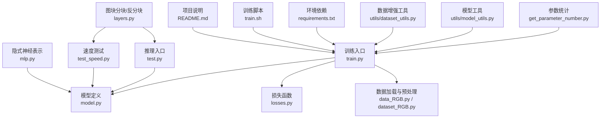
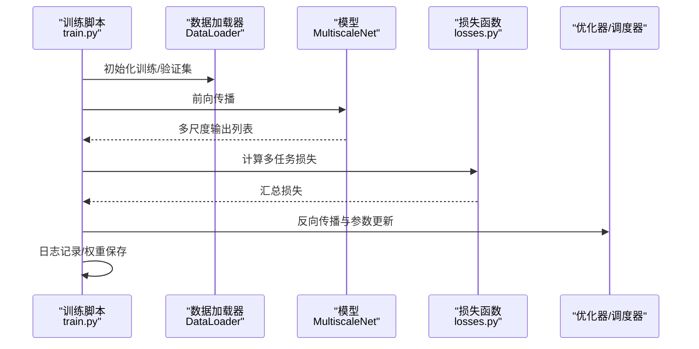
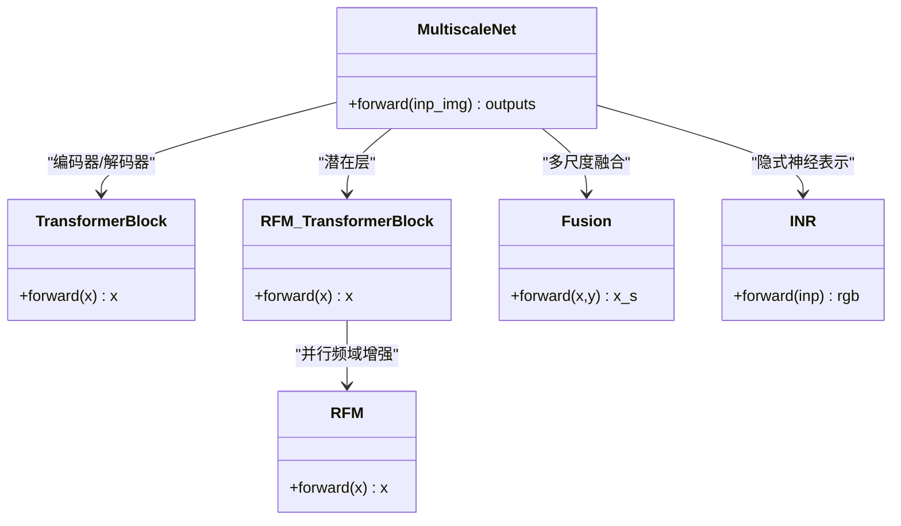
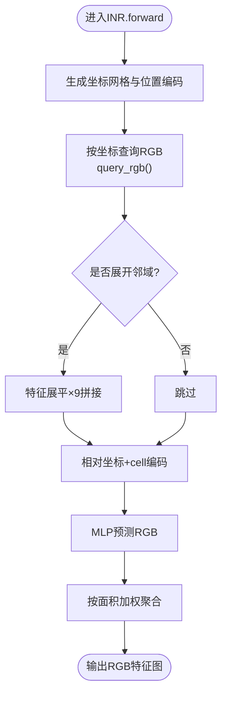
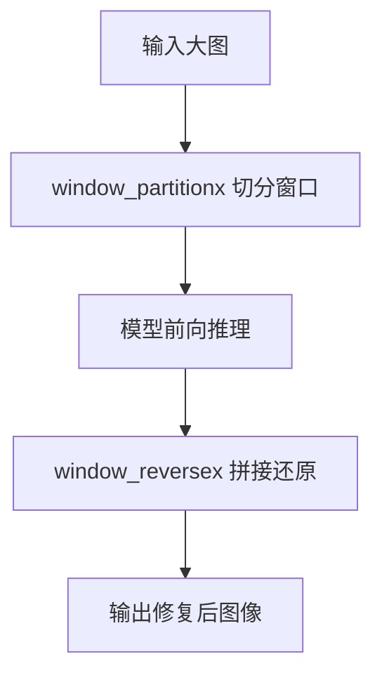
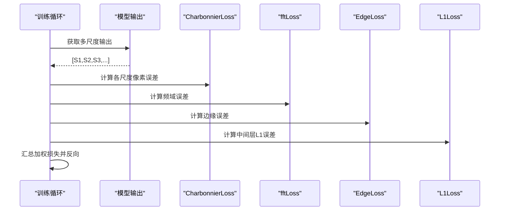
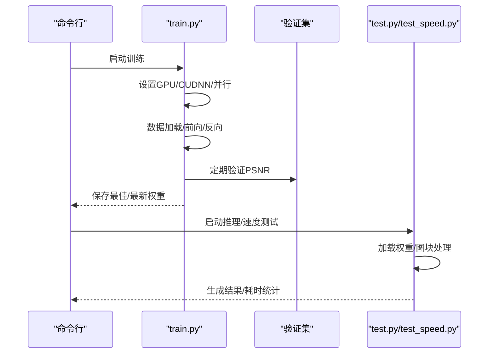
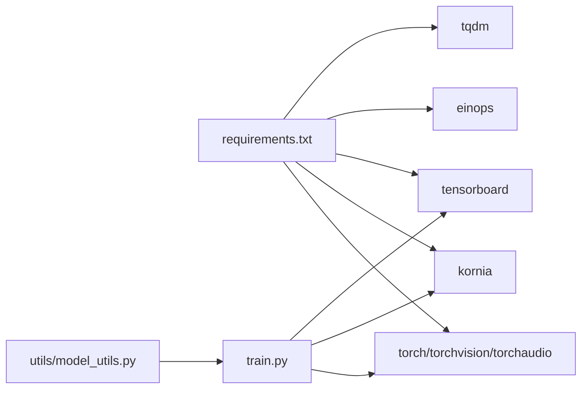

# 性能优化与加速

<cite>
**本文引用的文件**   
- [model.py](file://model.py)
- [train.py](file://train.py)
- [test.py](file://test.py)
- [test_speed.py](file://test_speed.py)
- [layers.py](file://layers.py)
- [mlp.py](file://mlp.py)
- [losses.py](file://losses.py)
- [get_parameter_number.py](file://get_parameter_number.py)
- [requirements.txt](file://requirements.txt)
- [utils/model_utils.py](file://utils/model_utils.py)
- [utils/dataset_utils.py](file://utils/dataset_utils.py)
- [train.sh](file://train.sh)
- [README.md](file://README.md)
</cite>

## 目录
1. [引言](#引言)
2. [项目结构](#项目结构)
3. [核心组件](#核心组件)
4. [架构总览](#架构总览)
5. [详细组件分析](#详细组件分析)
6. [依赖分析](#依赖分析)
7. [性能考虑](#性能考虑)
8. [故障排查指南](#故障排查指南)
9. [结论](#结论)
10. [附录](#附录)

## 引言
本指南聚焦于NeRD-Rain项目在深度学习推理与训练中的性能优化与加速实践，结合现有代码实现，系统梳理以下主题：
- 模型压缩：网络剪枝、权重量化、知识蒸馏（现状与可扩展路径）
- 推理加速：TensorRT/OpenVINO/MKL-DNN等异构加速器的集成思路
- 硬件平台调优：NVIDIA GPU、ARM、TPU等平台的针对性优化策略
- 内存优化：梯度检查点、混合精度训练、内存池与显存管理
- 并行与分布式：模型并行、数据并行、分布式推理架构
- 基准测试与监控：端到端吞吐/延迟测量、关键指标采集

说明：当前仓库未包含TensorRT/OpenVINO/MKL-DNN集成代码，本指南以“现状+可落地的工程化建议”形式呈现，帮助在不改变现有架构的前提下实现显著性能提升。

## 项目结构
NeRD-Rain采用PyTorch生态，核心由模型定义、损失函数、数据处理与工具模块组成；训练与推理脚本分别位于根目录，配套工具与评估脚本分布在utils与evaluations目录中。

图表来源
- [train.py:1-218](file://train.py#L1-L218)
- [test.py:1-69](file://test.py#L1-L69)
- [test_speed.py:1-68](file://test_speed.py#L1-L68)
- [layers.py:1-392](file://layers.py#L1-L392)
- [model.py:1-673](file://model.py#L1-L673)
- [mlp.py:1-151](file://mlp.py#L1-L151)
- [losses.py:1-52](file://losses.py#L1-L52)
- [get_parameter_number.py:1-20](file://get_parameter_number.py#L1-L20)
- [utils/model_utils.py:1-111](file://utils/model_utils.py#L1-L111)
- [utils/dataset_utils.py:1-18](file://utils/dataset_utils.py#L1-L18)
- [requirements.txt:1-67](file://requirements.txt#L1-L67)
- [train.sh:1-7](file://train.sh#L1-L7)
- [README.md:1-121](file://README.md#L1-L121)

章节来源
- [README.md:25-59](file://README.md#L25-L59)
- [requirements.txt:1-67](file://requirements.txt#L1-L67)

## 核心组件
- 多尺度双向Transformer骨干：支持多分辨率特征融合与频域增强（RFM）并行分支，具备编码器-解码器结构与上/下采样模块。
- 隐式神经表示（INR）：通过MLP在空间坐标处查询RGB值，用于跨尺度上下文建模与图像重建。
- 图块分块与反分块：窗口切分/拼接，适配大图推理与显存受限场景。
- 损失函数：Charbonnier、边缘感知、频域一致性损失，强化细节与纹理恢复。
- 训练/推理脚本：含数据并行、学习率调度、日志与权重保存、评估流程。

章节来源
- [model.py:303-673](file://model.py#L303-L673)
- [mlp.py:41-151](file://mlp.py#L41-L151)
- [layers.py:212-304](file://layers.py#L212-L304)
- [losses.py:5-52](file://losses.py#L5-L52)
- [train.py:72-218](file://train.py#L72-L218)
- [test.py:31-69](file://test.py#L31-L69)

## 架构总览
下图展示训练与推理的关键交互路径，突出数据流、模型前向与损失计算、以及图块处理链路。

图表来源
- [train.py:125-218](file://train.py#L125-L218)
- [losses.py:5-52](file://losses.py#L5-L52)
- [model.py:486-673](file://model.py#L486-L673)

## 详细组件分析

### 多尺度双向Transformer骨干（MultiscaleNet）
- 编码器-解码器结构：小/中/大三尺度输入，逐级下采样至潜在特征，再上采样融合，最终输出多尺度重建结果。
- 注意力与前馈：TransformerBlock内含LayerNorm、注意力与前馈网络，RFM_TransformerBlock引入频域增强并行分支。
- 上/下采样：PixelUnshuffle/PixelShuffle实现通道降维/升维，减少计算冗余。
- 融合模块：Fusion模块基于查询-键能量计算注意力，动态融合多尺度特征。

图表来源
- [model.py:195-236](file://model.py#L195-L236)
- [model.py:118-159](file://model.py#L118-L159)
- [model.py:272-301](file://model.py#L272-L301)
- [model.py:345-400](file://model.py#L345-L400)
- [model.py:486-673](file://model.py#L486-L673)

章节来源
- [model.py:303-673](file://model.py#L303-L673)

### 隐式神经表示（INR）
- 输入为多尺度特征图，通过位置编码与局部集合聚合，在空间网格坐标处查询RGB值。
- 支持unfold邻域拼接、cell偏移解码与多方向采样加权，提升重建质量与鲁棒性。

图表来源
- [mlp.py:129-151](file://mlp.py#L129-L151)
- [mlp.py:57-127](file://mlp.py#L57-L127)

章节来源
- [mlp.py:41-151](file://mlp.py#L41-L151)

### 图块分块与反分块（窗口切分）
- 将大图切分为固定窗口，推理后再拼接还原，避免显存不足导致OOM。
- 支持边界补丁的特殊处理与批量索引回写，保证拼接完整性。

图表来源
- [layers.py:249-304](file://layers.py#L249-L304)

章节来源
- [layers.py:212-304](file://layers.py#L212-L304)
- [test.py:58-68](file://test.py#L58-L68)
- [test_speed.py:58-67](file://test_speed.py#L58-L67)

### 损失函数与多任务训练
- CharbonnierLoss：平滑L1范数，抑制异常值影响。
- EdgeLoss：边缘感知损失，提升纹理细节。
- fftLoss：频域一致性损失，约束相位与幅度信息。
- 多尺度监督：对不同尺度输出分别计算损失并加权融合。

图表来源
- [train.py:159-163](file://train.py#L159-L163)
- [losses.py:5-52](file://losses.py#L5-L52)

章节来源
- [losses.py:5-52](file://losses.py#L5-L52)
- [train.py:119-173](file://train.py#L119-L173)

### 训练与推理流程
- 训练：设置随机种子、数据并行、Adam优化、余弦退火+Warmup学习率、TensorBoard日志、周期性验证与最佳模型保存。
- 推理：加载权重、图块切分/拼接、PSNR/SSIM评估（可选）、结果保存。

图表来源
- [train.py:32-218](file://train.py#L32-L218)
- [test.py:31-69](file://test.py#L31-L69)
- [test_speed.py:25-68](file://test_speed.py#L25-L68)

章节来源
- [train.py:72-218](file://train.py#L72-L218)
- [test.py:31-69](file://test.py#L31-L69)
- [test_speed.py:25-68](file://test_speed.py#L25-L68)

## 依赖分析
- 运行时依赖：PyTorch生态（torch、torchvision、torchaudio）、Kornia、TensorBoard、einops、tqdm等。
- 训练脚本：通过环境变量控制可见GPU，启用CUDNN benchmark，使用DataLoader的pin_memory与num_workers。
- 模型工具：提供冻结/解冻参数、多GPU权重兼容加载、DOConv压缩权重加载等辅助能力。

图表来源
- [requirements.txt:1-67](file://requirements.txt#L1-L67)
- [train.py:1-28](file://train.py#L1-L28)
- [utils/model_utils.py:1-111](file://utils/model_utils.py#L1-L111)

章节来源
- [requirements.txt:1-67](file://requirements.txt#L1-L67)
- [train.py:1-28](file://train.py#L1-L28)
- [utils/model_utils.py:17-79](file://utils/model_utils.py#L17-L79)

## 性能考虑

### 模型压缩（现状与可扩展路径）
- 网络剪枝
  - 当前未见结构化/非结构化剪枝实现。可在训练后对卷积核或通道进行裁剪，并配合微调恢复精度。
  - 建议：基于权重幅值阈值或通道重要性排序进行剪枝，随后进行稀疏化训练或重训练。
- 权重量化
  - 当前未见量化部署流程。可采用PTQ（后量化）或QAT（量化感知训练），目标为INT8/FP8。
  - 建议：先在验证集上进行校准，再在ONNX/TensorRT/OpenVINO中部署。
- 知识蒸馏
  - 当前未见蒸馏实现。可用教师模型（高精度）指导学生模型（轻量版）训练，提升小模型表现。
  - 建议：以多尺度输出与INR重建作为蒸馏目标，结合显式与隐式损失。

说明：以上为工程化建议，需在现有模型接口基础上扩展相应模块与导出流程。

### 推理加速（现状与可扩展路径）
- TensorRT集成
  - 当前未见TensorRT相关代码。可将模型导出为ONNX，再转换为TensorRT引擎，启用FP16/INT8与动态形状优化。
  - 建议：针对图块切分链路（分块→推理→拼接）进行流水线优化，减少主机侧拷贝。
- OpenVINO优化
  - 当前未见OpenVINO集成。可将PyTorch模型转为ONNX，再导入OpenVINO IR，利用其多后端（CPU/GPU/HDDL/VPU）优化。
  - 建议：结合图块大小与批大小进行静态/动态形状配置，启用内核库（如mkl-dnn）。
- MKL-DNN/OneDNN
  - 当前未见显式调用。可通过PyTorch后端选择（如使用Intel优化构建的PyTorch）获得自动优化。
  - 建议：在CPU/GPU上统一使用优化构建，确保卷积/归一化等算子走优化内核。

说明：上述加速器集成需在推理入口增加ONNX导出与后端编排逻辑。

### 硬件平台调优策略
- NVIDIA GPU
  - 启用CUDNN benchmark与确定性操作（若需要可关闭benchmark以稳定性能）。
  - 使用DataParallel/DDP、适当增大batch size与num_workers，合理设置pin_memory。
- ARM处理器
  - 优先使用INT8/FP16量化与Neon优化；结合图块大小与内存带宽进行参数调优。
- TPU
  - 若迁移至JAX/PyTorch/XLA生态，建议使用混合精度与数据管道优化，减少主机-设备同步。

章节来源
- [train.py:8-132](file://train.py#L8-L132)
- [test.py:36-42](file://test.py#L36-L42)
- [test_speed.py:33-39](file://test_speed.py#L33-L39)

### 内存优化
- 梯度检查点（Gradient Checkpointing）
  - 对TransformerBlock/RFM_TransformerBlock等深层模块启用梯度检查点，降低峰值显存占用。
- 混合精度训练
  - 在训练脚本中启用AMP（自动混合精度），减少显存与提高吞吐。
- 显存管理
  - 推理阶段定期清理缓存（ipc_collect/empty_cache），避免碎片化。
  - 图块大小与批大小权衡：在显存与吞吐间寻找最优组合。

章节来源
- [test.py:52-53](file://test.py#L52-L53)
- [test_speed.py:48-49](file://test_speed.py#L48-L49)

### 模型并行与数据并行
- 数据并行（DataParallel/DDP）
  - 训练脚本已支持DataParallel，可扩展为DDP以获得更好多卡效率。
- 模型并行
  - 可将大型Transformer层或INR部分划分到不同设备，但需谨慎处理梯度通信与同步。
- 分布式推理
  - 建议：将图块切分与拼接逻辑分布到多个进程，每个进程负责一部分图块，最后汇总结果。

章节来源
- [train.py:116-117](file://train.py#L116-L117)
- [layers.py:249-304](file://layers.py#L249-L304)

### 基准测试与监控指标
- 基准测试
  - 使用test_speed.py统计平均推理时间，结合不同图块大小与batch size评估吞吐。
- 监控指标
  - 训练：迭代损失、学习率、验证PSNR；推理：平均耗时、吞吐FPS、峰值显存。
- 可视化
  - 使用TensorBoard记录标量与图像，便于对比不同优化策略的效果。

章节来源
- [test_speed.py:42-67](file://test_speed.py#L42-L67)
- [train.py:168-173](file://train.py#L168-L173)
- [train.py:139](file://train.py#L139)

## 故障排查指南
- OOM问题
  - 减小batch size、启用图块切分、开启混合精度、释放缓存。
- 多GPU不一致
  - 统一随机种子、使用DDP而非DataParallel、检查权重加载兼容性。
- 推理速度慢
  - 关闭benchmark、减少num_workers、避免频繁主机-设备同步、使用更合适的图块大小。
- 权重加载失败
  - 使用model_utils提供的多GPU权重加载函数，确保键名去前缀兼容。

章节来源
- [utils/model_utils.py:22-99](file://utils/model_utils.py#L22-L99)
- [test.py:27-36](file://test.py#L27-L36)
- [train.py:32-37](file://train.py#L32-L37)

## 结论
NeRD-Rain在多尺度Transformer与隐式神经表示方面具备良好性能潜力。结合本文给出的模型压缩、推理加速、内存优化与并行策略，可在不改变现有架构的前提下显著提升训练与推理效率。对于TensorRT/OpenVINO/MKL-DNN等加速器的集成，建议以ONNX导出为桥梁，逐步替换推理路径中的算子实现，从而获得跨平台的一致加速效果。

## 附录
- 训练与测试命令参考
  - 训练：bash train.sh
  - 测试：python test.py
  - 速度测试：python test_speed.py
- 依赖安装：pip install -r requirements.txt

章节来源
- [README.md:47-59](file://README.md#L47-L59)
- [requirements.txt:1-67](file://requirements.txt#L1-L67)
- [train.sh:1-7](file://train.sh#L1-L7)