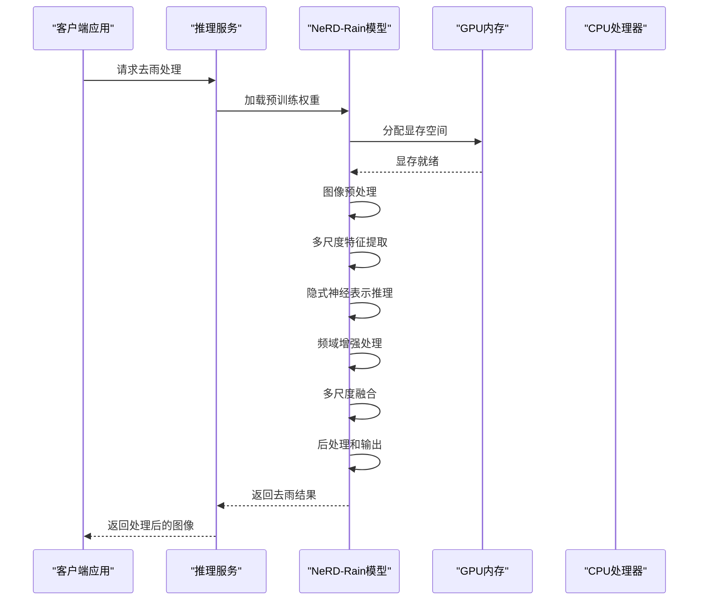
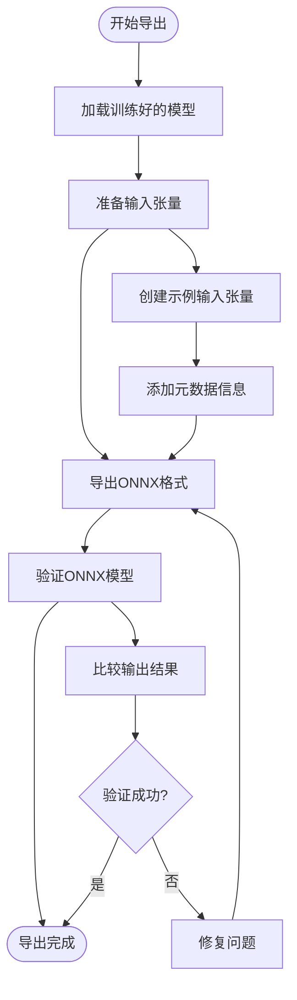
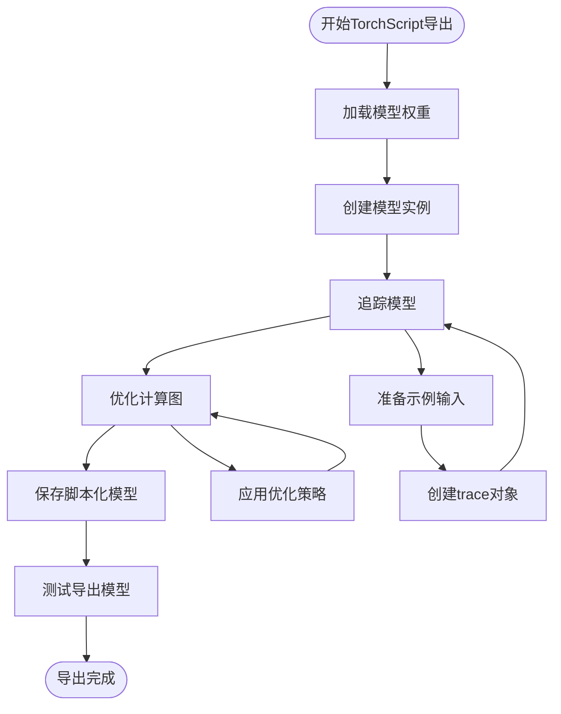
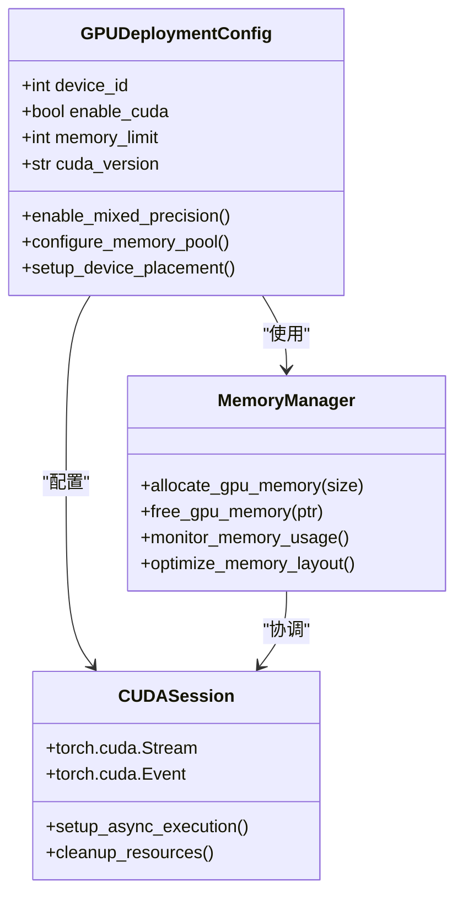
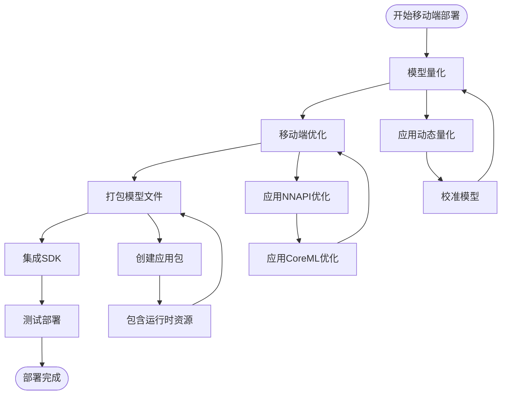
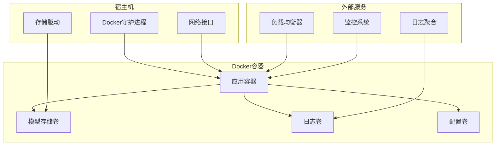
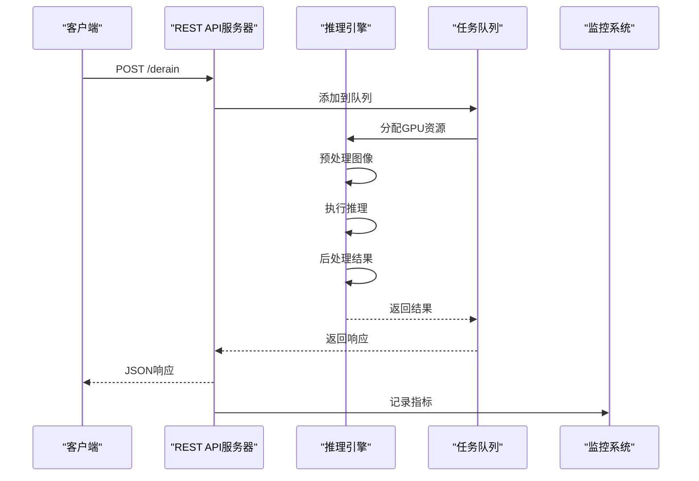
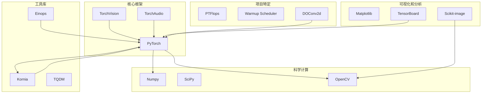
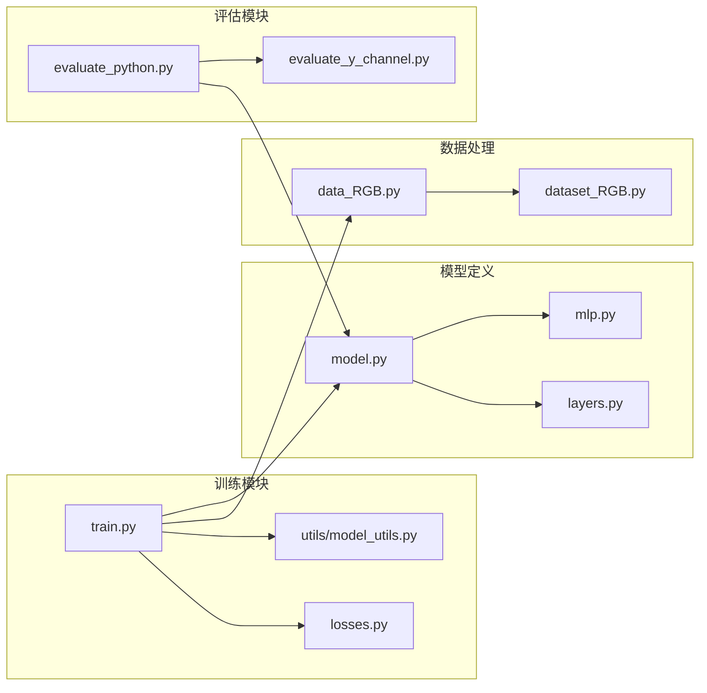
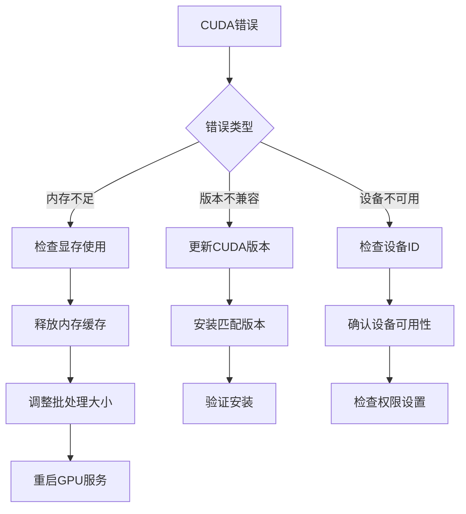

# 模型导出与部署

<cite>
**本文档引用的文件**
- [model.py](file://model.py)
- [train.py](file://train.py)
- [test.py](file://test.py)
- [requirements.txt](file://requirements.txt)
- [README.md](file://README.md)
- [mlp.py](file://mlp.py)
- [utils/model_utils.py](file://utils/model_utils.py)
- [layers.py](file://layers.py)
- [get_parameter_number.py](file://get_parameter_number.py)
- [train.sh](file://train.sh)
- [evaluate_python.py](file://evaluate_python.py)
</cite>

## 目录
1. [简介](#简介)
2. [项目结构](#项目结构)
3. [核心组件](#核心组件)
4. [架构概览](#架构概览)
5. [详细组件分析](#详细组件分析)
6. [依赖关系分析](#依赖关系分析)
7. [性能考虑](#性能考虑)
8. [故障排除指南](#故障排除指南)
9. [结论](#结论)
10. [附录](#附录)

## 简介

NeRD-Rain是一个基于双向多尺度隐式神经表示的图像去雨深度学习模型。该模型通过结合时域变换器和频域增强模块，实现了高质量的图像去雨效果。本文档提供了完整的模型导出与部署指南，涵盖从训练到生产环境部署的全过程。

## 项目结构

NeRD-Rain项目采用模块化的Python架构，主要包含以下核心组件：

```mermaid
graph TB
subgraph "核心模型模块"
A[model.py<br/>主模型定义"]
B[mlp.py<br/>隐式神经表示(INR)"]
C[layers.py<br/>自定义层和工具函数"]
end
subgraph "训练和测试模块"
D[train.py<br/>训练脚本"]
E[test.py<br/>测试脚本"]
F[evaluate_python.py<br/>评估工具"]
end
subgraph "工具和配置"
G[utils/model_utils.py<br/>模型工具"]
H[get_parameter_number.py<br/>参数统计"]
I[requirements.txt<br/>依赖管理"]
J[train.sh<br/>训练脚本"]
end
subgraph "数据处理"
K[data_RGB.py<br/>数据加载器"]
L[dataset_RGB.py<br/>数据集定义"]
end
A --> B
A --> C
D --> A
E --> A
F --> E
G --> A
H --> A
```

**图表来源**
- [model.py:1-673](file://model.py#L1-L673)
- [train.py:1-218](file://train.py#L1-L218)
- [test.py:1-69](file://test.py#L1-L69)

**章节来源**
- [README.md:1-121](file://README.md#L1-L121)
- [requirements.txt:1-67](file://requirements.txt#L1-L67)

## 核心组件

### 主要模型架构

NeRD-Rain的核心是MultiscaleNet类，它实现了双向多尺度隐式神经表示网络：

- **多尺度编码器-解码器结构**：支持小、中、大三种尺度的特征提取
- **隐式神经表示(INR)**：使用MLP网络进行像素级预测
- **频域增强模块(RFM)**：通过傅里叶变换增强高频细节
- **注意力机制**：自注意力和前馈网络相结合

### 关键技术特性

1. **双向处理路径**：从低分辨率到高分辨率的渐进式去雨
2. **多尺度融合**：通过融合模块整合不同尺度的信息
3. **窗口分割算法**：处理大尺寸图像的内存优化策略
4. **位置编码**：提高模型的空间感知能力

**章节来源**
- [model.py:303-673](file://model.py#L303-L673)
- [mlp.py:41-151](file://mlp.py#L41-L151)

## 架构概览



**图表来源**
- [model.py:486-673](file://model.py#L486-L673)
- [test.py:31-69](file://test.py#L31-L69)

## 详细组件分析

### 模型导出组件

#### ONNX导出流程



**图表来源**
- [model.py:345-400](file://model.py#L345-L400)
- [utils/model_utils.py:22-36](file://utils/model_utils.py#L22-L36)

#### TorchScript导出流程



**图表来源**
- [utils/model_utils.py:17-21](file://utils/model_utils.py#L17-L21)
- [test.py:31-36](file://test.py#L31-L36)

### CUDA配置和内存管理

#### GPU部署配置



**图表来源**
- [train.py:3-8](file://train.py#L3-L8)
- [test.py:24-25](file://test.py#L24-L25)

### 移动端部署组件

#### Android/iOS部署流程



**图表来源**
- [model.py:345-400](file://model.py#L345-L400)
- [layers.py:212-304](file://layers.py#L212-L304)

### Docker容器化部署

#### 容器化架构



**图表来源**
- [requirements.txt:1-67](file://requirements.txt#L1-L67)
- [train.sh:1-7](file://train.sh#L1-L7)

### 服务化部署组件

#### REST API接口设计



**图表来源**
- [test.py:47-69](file://test.py#L47-L69)
- [utils/model_utils.py:22-36](file://utils/model_utils.py#L22-L36)

## 依赖关系分析

### 核心依赖关系



**图表来源**
- [requirements.txt:1-67](file://requirements.txt#L1-L67)
- [model.py:1-7](file://model.py#L1-L7)

### 模块间依赖关系



**图表来源**
- [train.py:18-27](file://train.py#L18-L27)
- [model.py:1-7](file://model.py#L1-L7)
- [test.py:6-13](file://test.py#L6-L13)

**章节来源**
- [requirements.txt:1-67](file://requirements.txt#L1-L67)
- [model.py:1-673](file://model.py#L1-L673)

## 性能考虑

### CUDA性能优化

#### 内存管理策略

1. **显存分配优化**：
   - 使用`torch.cuda.empty_cache()`定期清理缓存
   - 实施批处理大小自适应调整
   - 利用`pin_memory=True`减少数据传输时间

2. **计算优化**：
   - 启用`torch.backends.cudnn.benchmark = True`
   - 使用混合精度训练和推理
   - 实施异步执行和流管理

3. **内存监控**：
   ```python
   # 内存使用监控示例
   def monitor_memory():
       if torch.cuda.is_available():
           print(f"GPU内存已用: {torch.cuda.memory_allocated()/1024**3:.2f} GB")
           print(f"GPU内存缓存: {torch.cuda.memory_reserved()/1024**3:.2f} GB")
   ```

### 推理性能优化

#### 模型压缩技术

1. **知识蒸馏**：
   - 使用教师-学生网络架构
   - 保持关键特征表示能力
   - 优化推理速度

2. **剪枝技术**：
   - 结构化剪枝
   - 通道剪枝
   - 参数共享

3. **量化策略**：
   - 动态量化
   - 静态量化
   - 混合精度

### 移动端性能优化

#### 轻量化设计原则

1. **模型架构优化**：
   - 使用深度可分离卷积
   - 实施通道注意力机制
   - 减少参数数量

2. **计算图优化**：
   - 删除冗余操作
   - 合并相似操作
   - 应用算子融合

3. **内存访问优化**：
   - 改善数据布局
   - 减少内存带宽需求
   - 实现高效的数据重用

## 故障排除指南

### 常见问题诊断

#### CUDA相关问题



**图表来源**
- [train.py:3-8](file://train.py#L3-L8)
- [test.py:24-25](file://test.py#L24-L25)

#### 模型导出问题

1. **ONNX导出失败**：
   - 检查输入张量形状
   - 验证模型状态
   - 确认依赖版本兼容

2. **TorchScript导出问题**：
   - 使用`torch.jit.trace`替代`torch.jit.script`
   - 简化模型复杂度
   - 检查动态控制流

3. **量化模型精度下降**：
   - 调整量化参数
   - 实施校准数据集
   - 优化量化范围

### 性能调优建议

#### 内存优化策略

1. **批处理优化**：
   ```python
   # 自适应批处理大小
   def adjust_batch_size(current_size, memory_usage):
       if memory_usage > 0.8:
           return max(1, current_size // 2)
       elif memory_usage < 0.4:
           return min(max_batch_size, current_size * 2)
       return current_size
   ```

2. **数据加载优化**：
   - 使用`num_workers=0`避免多进程问题
   - 实施数据预取
   - 优化数据管道

3. **GPU资源管理**：
   - 设置`CUDA_VISIBLE_DEVICES`
   - 配置GPU内存限制
   - 实施GPU亲和性设置

**章节来源**
- [train.py:77-83](file://train.py#L77-L83)
- [test.py:52-53](file://test.py#L52-L53)
- [utils/model_utils.py:22-36](file://utils/model_utils.py#L22-L36)

## 结论

NeRD-Rain项目提供了完整的深度学习模型开发和部署解决方案。通过本文档的指导，开发者可以：

1. **高效导出模型**：支持多种格式的模型导出，满足不同部署需求
2. **优化性能表现**：实施内存管理和计算优化策略
3. **扩展部署场景**：覆盖CPU/GPU、移动端和云端部署
4. **确保可靠性**：建立完善的监控和故障排除机制

关键成功因素包括：
- 充分利用PyTorch的优化功能
- 实施适当的内存管理策略
- 选择合适的部署架构
- 建立完整的监控体系

## 附录

### 快速开始指南

#### 环境准备
```bash
# 安装依赖
pip install -r requirements.txt

# 安装warmup调度器
cd pytorch-gradual-warmup-lr
python setup.py install
cd ..

# 验证安装
python -c "import torch; print(torch.__version__)"
```

#### 训练模型
```bash
# 使用脚本训练
bash train.sh

# 或直接运行
python train.py --train_dir ./data/Rain200L/train/ \
                --val_dir ./data/Rain200L/test/ \
                --batch_size 1 \
                --num_epochs 3000
```

#### 测试模型
```bash
python test.py --input_dir ../data/Rain200L/test/input/ \
               --output_dir ./evaluations/results/ \
               --weights ./change2/checkpoints/Deraininig/models/Multiscale/model_best.pth \
               --gpus '0'
```

### 最佳实践清单

1. **模型导出**：
   - 始终验证导出模型的正确性
   - 记录导出时的环境信息
   - 测试不同输入尺寸的兼容性

2. **部署优化**：
   - 实施渐进式部署策略
   - 建立回滚机制
   - 监控关键性能指标

3. **维护策略**：
   - 定期更新依赖版本
   - 实施模型版本管理
   - 建立性能基准测试