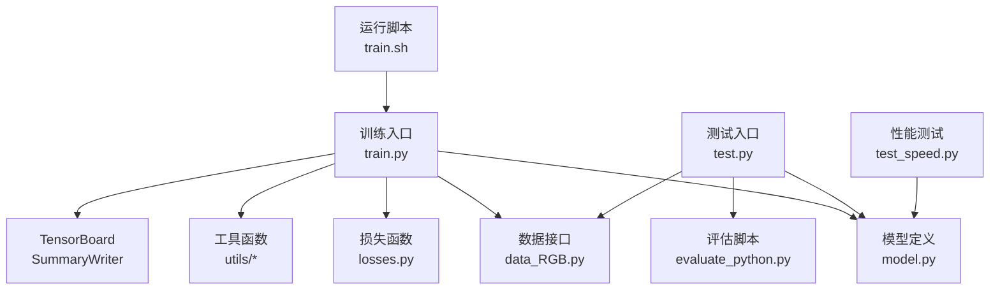
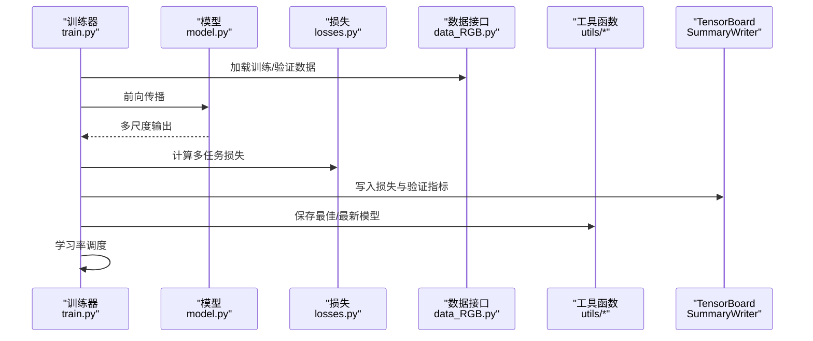
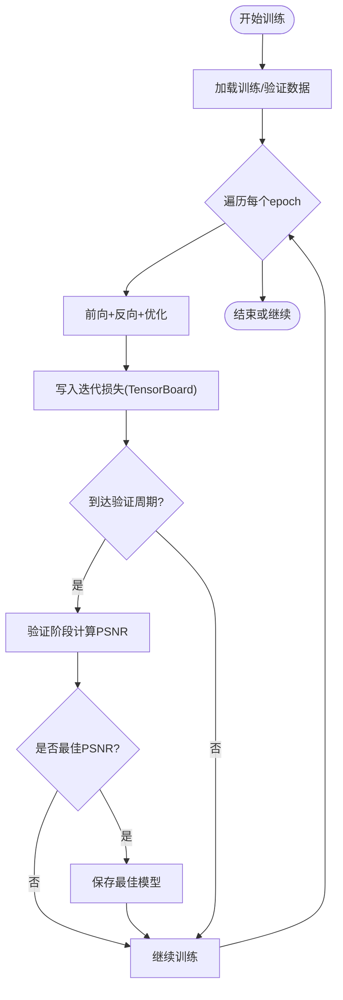
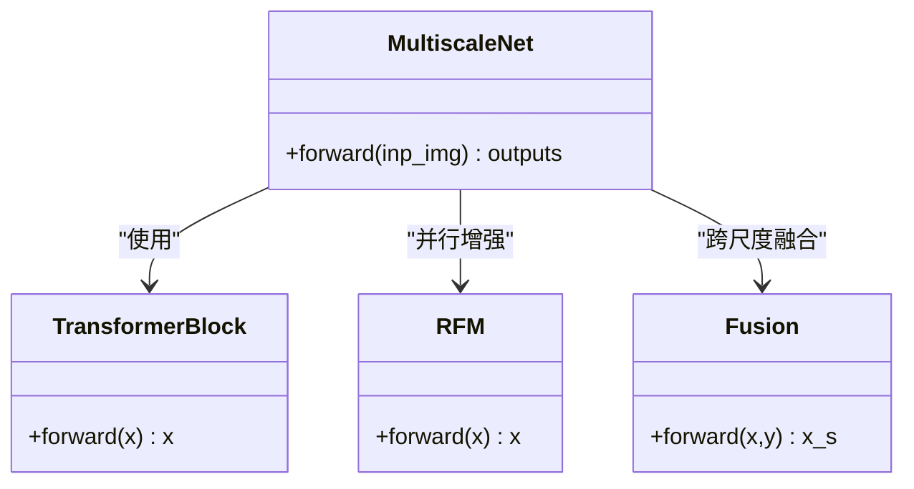
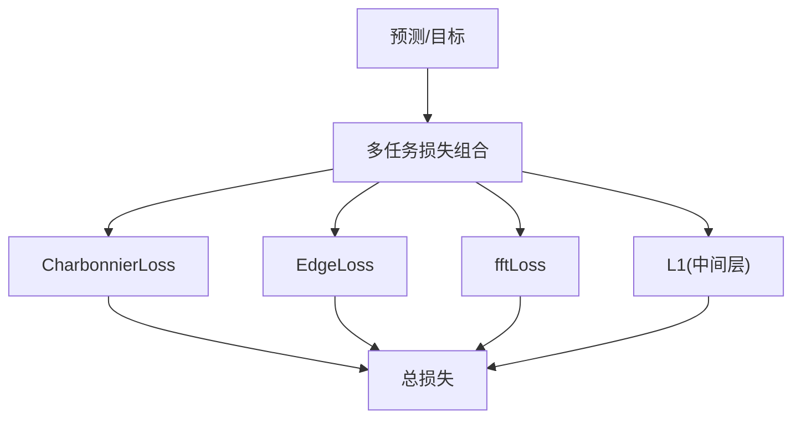
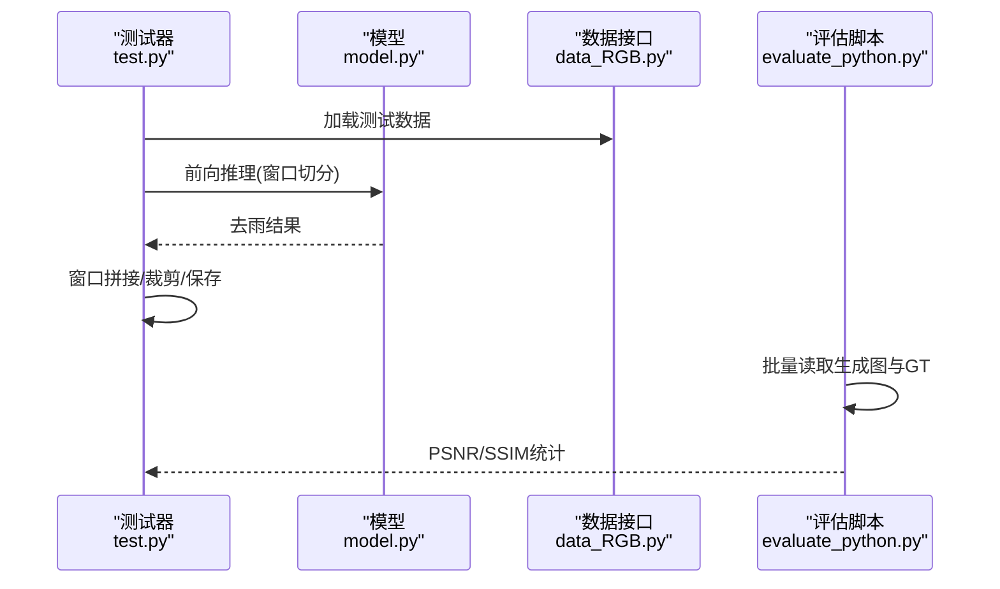
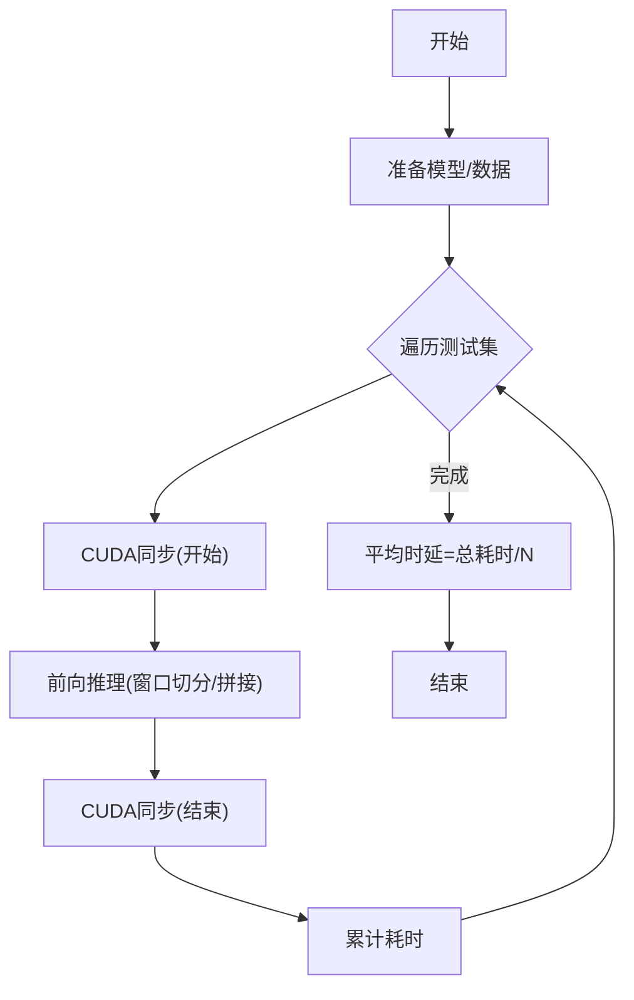
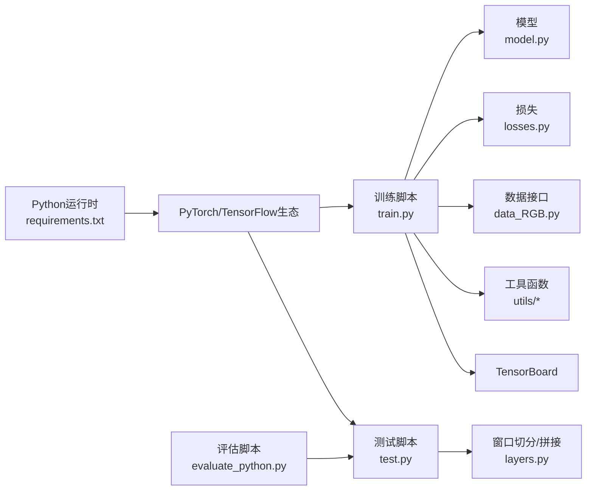

# 监控与维护

<cite>
**本文引用的文件**   
- [README.md](file://README.md)
- [requirements.txt](file://requirements.txt)
- [train.py](file://train.py)
- [test.py](file://test.py)
- [test_speed.py](file://test_speed.py)
- [model.py](file://model.py)
- [losses.py](file://losses.py)
- [layers.py](file://layers.py)
- [data_RGB.py](file://data_RGB.py)
- [utils/model_utils.py](file://utils/model_utils.py)
- [utils/image_utils.py](file://utils/image_utils.py)
- [evaluate_python.py](file://evaluate_python.py)
- [train.sh](file://train.sh)
</cite>

## 目录
1. [简介](#简介)
2. [项目结构](#项目结构)
3. [核心组件](#核心组件)
4. [架构总览](#架构总览)
5. [组件详解](#组件详解)
6. [依赖关系分析](#依赖关系分析)
7. [性能考量](#性能考量)
8. [故障排查指南](#故障排查指南)
9. [结论](#结论)
10. [附录](#附录)

## 简介
本指南面向生产环境的监控与维护，围绕图像去雨任务构建一套可落地的监控体系与运维实践。内容涵盖：
- 模型性能监控：推理延迟、吞吐量、PSNR/SSIM等关键指标采集与分析
- 版本管理与发布：版本控制、A/B测试、灰度发布策略
- 异常检测与告警：模型退化检测、数据漂移监控、系统健康检查
- 日志记录与分析：访问日志、错误日志、性能日志的结构化处理
- 自动化运维与CI/CD：训练与测试脚本、日志归档、模型保存与加载
- 灾难恢复与备份：权重备份、断点续训、多GPU容错
- 故障排查流程与常见问题

## 项目结构
该项目为图像去雨研究与工程化训练/测试示例，核心文件职责如下：
- 训练入口：train.py（含TensorBoard写入、验证周期、最佳模型保存）
- 测试入口：test.py（含窗口切分/拼接、结果保存）
- 性能测试：test_speed.py（含CUDA同步、平均时延统计）
- 模型定义：model.py（多尺度编码器-解码器、INR融合、频域残差模块等）
- 损失函数：losses.py（Charbonnier、边缘、FFT损失）
- 数据接口：data_RGB.py（训练/验证/测试数据集封装）
- 工具函数：utils/*（模型加载/保存、PSNR计算、图像读写）
- 评估脚本：evaluate_python.py（PSNR/SSIM批量计算）
- 运行脚本：train.sh（批处理作业提交与日志输出）

**图示来源**
- [train.py:1-218](file://train.py#L1-L218)
- [test.py:1-69](file://test.py#L1-L69)
- [test_speed.py:1-68](file://test_speed.py#L1-L68)
- [model.py:1-673](file://model.py#L1-L673)
- [losses.py:1-52](file://losses.py#L1-L52)
- [data_RGB.py:1-15](file://data_RGB.py#L1-L15)
- [evaluate_python.py:1-119](file://evaluate_python.py#L1-L119)
- [train.sh:1-7](file://train.sh#L1-L7)

**章节来源**
- [README.md:1-121](file://README.md#L1-L121)
- [requirements.txt:1-67](file://requirements.txt#L1-L67)

## 核心组件
- 训练与验证循环：迭代训练、周期性验证、最佳模型与最新模型保存、学习率调度
- 模型结构：多尺度编码器-解码器、Transformer块、频域残差模块、INR上下文融合
- 损失函数：多任务组合损失（Charbonnier、边缘、FFT、L1），用于提升去雨质量
- 数据加载：训练/验证/测试数据集封装，支持批大小与窗口切分
- 工具函数：模型加载/保存、冻结/解冻参数、PSNR计算、图像读写
- 评估脚本：批量计算PSNR/SSIM，支持多数据集聚合

**章节来源**
- [train.py:142-218](file://train.py#L142-L218)
- [model.py:303-673](file://model.py#L303-L673)
- [losses.py:1-52](file://losses.py#L1-L52)
- [data_RGB.py:1-15](file://data_RGB.py#L1-L15)
- [utils/model_utils.py:1-111](file://utils/model_utils.py#L1-L111)
- [utils/image_utils.py:1-19](file://utils/image_utils.py#L1-L19)
- [evaluate_python.py:1-119](file://evaluate_python.py#L1-L119)

## 架构总览
下图展示从训练到测试的关键交互路径，以及日志与指标写入位置。

**图示来源**
- [train.py:125-218](file://train.py#L125-L218)
- [model.py:486-673](file://model.py#L486-L673)
- [losses.py:1-52](file://losses.py#L1-L52)
- [data_RGB.py:1-15](file://data_RGB.py#L1-L15)
- [utils/model_utils.py:17-36](file://utils/model_utils.py#L17-L36)

## 组件详解

### 训练与验证组件
- 训练循环：迭代遍历训练集，前向传播、反向传播、优化器更新；周期性验证，计算PSNR并保存最佳模型
- 指标写入：使用TensorBoard写入迭代损失与轮次损失，验证阶段写入PSNR
- 断点续训：从最新检查点恢复训练，加载优化器状态与学习率调度器
- 多GPU：DataParallel自动分布式训练

**图示来源**
- [train.py:142-218](file://train.py#L142-L218)

**章节来源**
- [train.py:71-118](file://train.py#L71-L118)
- [train.py:125-218](file://train.py#L125-L218)

### 模型组件
- 多尺度网络：小/中/大三尺度输入，编码器-潜空间-解码器链路，INR上下文融合，残差频域增强
- 关键模块：Transformer块、频域残差模块（RFM）、注意力、前馈网络、像素重排/打散、通道融合

**图示来源**
- [model.py:303-673](file://model.py#L303-L673)

**章节来源**
- [model.py:118-236](file://model.py#L118-L236)
- [model.py:303-673](file://model.py#L303-L673)

### 损失函数组件
- CharbonnierLoss：平滑L1范数，抑制异常值影响
- EdgeLoss：基于拉普拉斯金字塔的边缘一致性损失
- fftLoss：频域一致性损失，辅助高频细节恢复

**图示来源**
- [losses.py:1-52](file://losses.py#L1-L52)
- [train.py:159-163](file://train.py#L159-L163)

**章节来源**
- [losses.py:1-52](file://losses.py#L1-L52)
- [train.py:119-124](file://train.py#L119-L124)

### 测试与评估组件
- 测试流程：加载权重、DataParallel、窗口切分/拼接、裁剪至[0,1]、保存结果
- 评估脚本：批量读取生成图像与目标图像，计算PSNR/SSIM并聚合

**图示来源**
- [test.py:31-69](file://test.py#L31-L69)
- [layers.py:249-304](file://layers.py#L249-L304)
- [evaluate_python.py:60-119](file://evaluate_python.py#L60-L119)

**章节来源**
- [test.py:15-69](file://test.py#L15-L69)
- [evaluate_python.py:1-119](file://evaluate_python.py#L1-L119)

### 性能测试组件
- 性能测试：固定窗口大小，CUDA同步前后计时，统计平均推理时延

**图示来源**
- [test_speed.py:43-68](file://test_speed.py#L43-L68)

**章节来源**
- [test_speed.py:1-68](file://test_speed.py#L1-L68)

## 依赖关系分析
- Python运行时与深度学习栈：PyTorch、TensorBoard、SciPy、OpenCV、tqdm等
- 训练与测试脚本依赖模型、损失、数据接口与工具函数
- 训练过程通过TensorBoard记录指标，便于可视化与回归检测

**图示来源**
- [requirements.txt:1-67](file://requirements.txt#L1-L67)
- [train.py:1-28](file://train.py#L1-L28)
- [test.py:1-14](file://test.py#L1-L14)
- [evaluate_python.py:1-119](file://evaluate_python.py#L1-L119)

**章节来源**
- [requirements.txt:1-67](file://requirements.txt#L1-L67)
- [train.py:1-28](file://train.py#L1-L28)
- [test.py:1-14](file://test.py#L1-L14)

## 性能考量
- 推理延迟与吞吐量
  - 使用CUDA同步计时，统计平均单张耗时，结合批大小推导吞吐量
  - 窗口切分策略在大图推理中平衡显存与速度，需根据GPU显存调优窗口尺寸
- 训练性能
  - 多GPU DataParallel提升吞吐，注意梯度同步开销
  - TensorBoard写入与验证周期频率会影响I/O开销
- 指标稳定性
  - PSNR/SSIM作为质量指标，建议长期跟踪并建立基线阈值
  - 损失曲线应保持收敛且波动在合理范围

[本节为通用性能指导，不直接分析具体文件]

## 故障排查指南
- 权重加载失败
  - 现象：加载checkpoint时报错
  - 排查：确认权重文件存在；检查DataParallel导致的“module.”前缀差异；使用工具函数进行兼容加载
  - 参考：[utils/model_utils.py:22-36](file://utils/model_utils.py#L22-L36)
- 显存不足
  - 现象：OOM或推理缓慢
  - 排查：减小批大小、降低窗口尺寸、关闭不必要的调试输出
  - 参考：[test.py:42-43](file://test.py#L42-L43)、[test_speed.py:38-39](file://test_speed.py#L38-L39)
- 验证指标异常
  - 现象：PSNR骤降或波动异常
  - 排查：检查数据分布变化、损失权重、学习率调度；对比历史最佳模型
  - 参考：[train.py:175-199](file://train.py#L175-L199)、[utils/image_utils.py:5-9](file://utils/image_utils.py#L5-L9)
- TensorBoard不可用
  - 现象：无法查看指标
  - 排查：确认安装与路径正确；检查写入权限
  - 参考：[train.py:139](file://train.py#L139)、[requirements.txt:52](file://requirements.txt#L52)

**章节来源**
- [utils/model_utils.py:22-36](file://utils/model_utils.py#L22-L36)
- [test.py:27-36](file://test.py#L27-L36)
- [test_speed.py:38-39](file://test_speed.py#L38-L39)
- [train.py:175-199](file://train.py#L175-L199)
- [utils/image_utils.py:5-9](file://utils/image_utils.py#L5-L9)
- [requirements.txt:52](file://requirements.txt#L52)

## 结论
本指南基于仓库现有实现，给出了生产环境监控与维护的系统化方案。通过训练期指标写入、测试期窗口切分与评估脚本、性能测试脚本与工具函数，可形成闭环的质量与性能保障体系。建议在此基础上扩展异常检测、数据漂移监控与自动化告警，以满足线上稳定运行需求。

[本节为总结性内容，不直接分析具体文件]

## 附录

### A. 模型性能监控清单
- 关键指标
  - 推理延迟：平均单帧耗时、吞吐量
  - 质量指标：PSNR/SSIM（建议按数据集与场景分别统计）
  - 训练指标：多任务损失、学习率、验证PSNR
- 采集方式
  - 性能：test_speed.py计时
  - 质量：evaluate_python.py批量评估
  - 训练：train.py写入TensorBoard

**章节来源**
- [test_speed.py:43-68](file://test_speed.py#L43-L68)
- [evaluate_python.py:60-119](file://evaluate_python.py#L60-L119)
- [train.py:139-199](file://train.py#L139-L199)

### B. 版本管理与发布策略
- 版本控制
  - 以模型权重文件命名区分版本（如model_epoch_*.pth、model_best.pth）
  - 使用目录结构区分会话与任务（如model_dir/session）
- A/B测试与灰度发布
  - 将不同版本权重部署至独立服务实例，按流量比例分流
  - 对比PSNR/SSIM与延迟，动态调整流量权重
- 断点续训
  - 从最新检查点恢复训练，避免重复劳动

**章节来源**
- [train.py:58-67](file://train.py#L58-L67)
- [train.py:103-114](file://train.py#L103-L114)
- [utils/model_utils.py:17-36](file://utils/model_utils.py#L17-L36)

### C. 异常检测与告警机制
- 模型退化检测
  - 设定PSNR阈值下限，低于阈值触发告警与回滚
- 数据漂移监控
  - 对输入/输出统计特征（均值、方差、直方图）并比较历史分布
- 系统健康检查
  - GPU利用率、显存占用、磁盘空间、网络I/O
- 告警渠道
  - 邮件、IM机器人、运维平台

[本节为概念性内容，不直接分析具体文件]

### D. 日志记录与分析
- 访问日志
  - 请求时间、请求体大小、响应状态码、耗时
- 错误日志
  - 异常堆栈、关键参数、时间戳
- 性能日志
  - 推理时延、吞吐量、损失曲线、GPU指标
- 结构化处理
  - JSON格式存储，统一字段命名，便于检索与可视化

[本节为概念性内容，不直接分析具体文件]

### E. 自动化运维与CI/CD
- 训练流水线
  - 触发条件：代码变更、数据集更新
  - 步骤：环境准备、数据准备、训练、模型保存、指标上传
- 测试流水线
  - 触发条件：模型权重更新
  - 步骤：加载权重、窗口切分推理、评估、报告生成
- 运行脚本
  - train.sh用于批处理作业提交与日志输出

**章节来源**
- [train.sh:1-7](file://train.sh#L1-L7)

### F. 灾难恢复与备份
- 权重备份
  - 定期归档最佳模型与最新模型
- 断点续训
  - 保存优化器状态与学习率调度器状态
- 多GPU容错
  - DataParallel自动分布式；必要时切换单卡运行

**章节来源**
- [train.py:193-204](file://train.py#L193-L204)
- [train.py:103-114](file://train.py#L103-L114)
- [utils/model_utils.py:101-111](file://utils/model_utils.py#L101-L111)