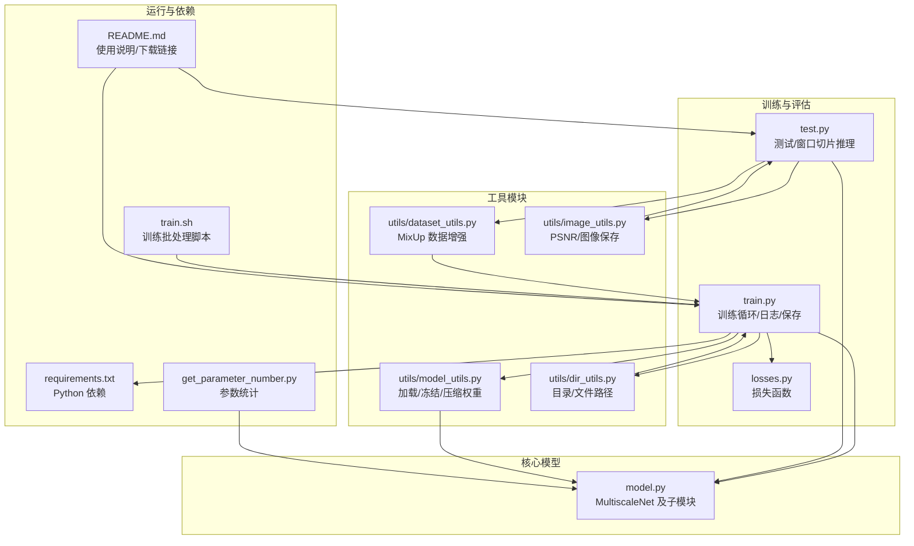
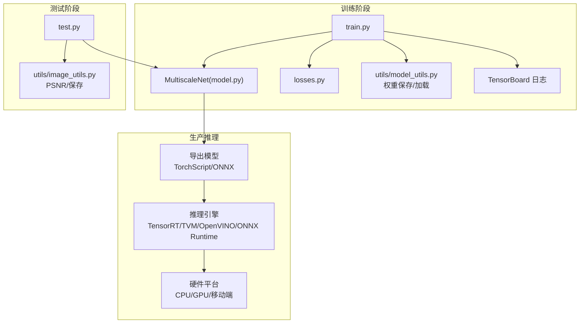
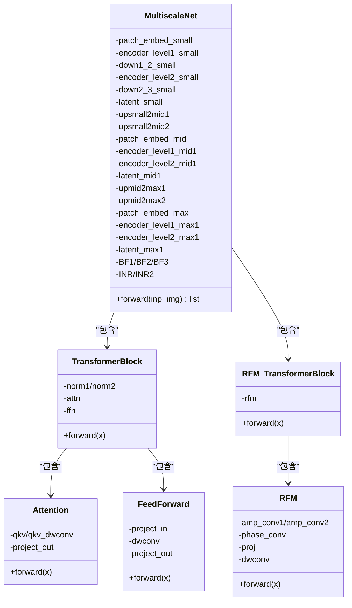
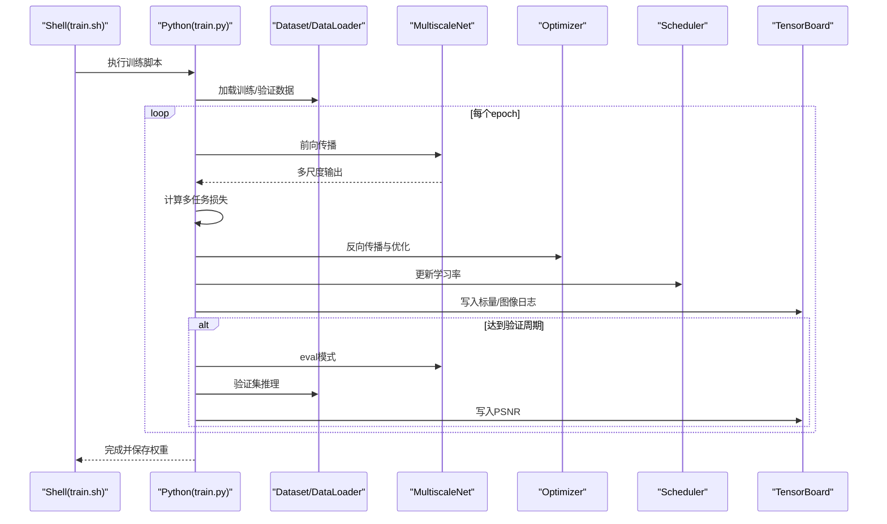
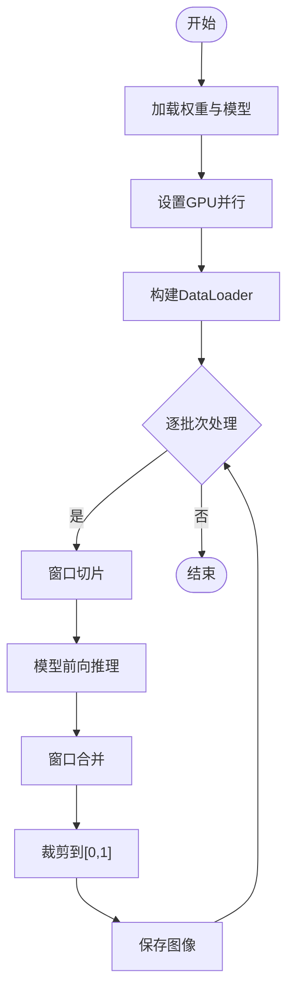
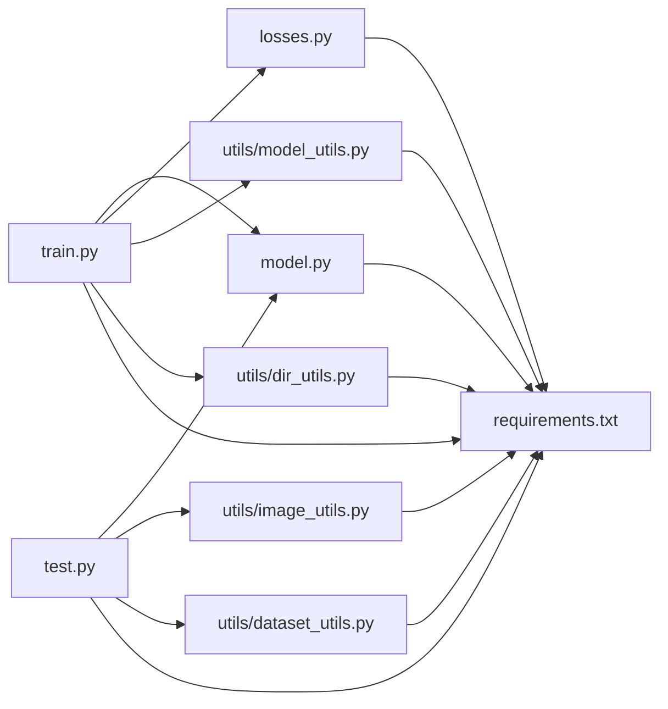

# 部署与生产环境

<cite>
**本文引用的文件**   
- [model.py](file://model.py)
- [train.py](file://train.py)
- [test.py](file://test.py)
- [requirements.txt](file://requirements.txt)
- [README.md](file://README.md)
- [utils/model_utils.py](file://utils/model_utils.py)
- [utils/dataset_utils.py](file://utils/dataset_utils.py)
- [utils/dir_utils.py](file://utils/dir_utils.py)
- [utils/image_utils.py](file://utils/image_utils.py)
- [losses.py](file://losses.py)
- [train.sh](file://train.sh)
- [get_parameter_number.py](file://get_parameter_number.py)
</cite>

## 目录
1. [简介](#简介)
2. [项目结构](#项目结构)
3. [核心组件](#核心组件)
4. [架构总览](#架构总览)
5. [组件详解](#组件详解)
6. [依赖关系分析](#依赖关系分析)
7. [性能考量](#性能考量)
8. [故障排查指南](#故障排查指南)
9. [结论](#结论)
10. [附录](#附录)

## 简介
本指南面向将训练好的图像去雨模型（NeRD-Rain）部署到生产环境的工程团队，覆盖从模型导出、格式转换、推理引擎选择，到多硬件平台（CPU/GPU/移动端）的部署策略与性能优化；同时深入解析模型压缩与加速技术（量化、剪枝、知识蒸馏）在本项目中的应用思路；最后给出监控与维护策略（性能指标跟踪、模型版本管理、A/B 测试）、容器化部署（Docker/Kubernetes）流程以及安全与权限最佳实践，并提供可扩展的大规模部署架构与运维建议。

## 项目结构
该项目采用“按功能分层”的组织方式：核心网络定义位于模型文件中，训练与评估脚本分别负责训练循环、验证与日志记录，工具模块提供数据集增强、目录与文件操作、指标计算等通用能力，依赖通过 requirements 文件统一管理。

**图表来源**
- [model.py:303-673](file://model.py#L303-L673)
- [train.py:1-218](file://train.py#L1-L218)
- [test.py:1-69](file://test.py#L1-L69)
- [losses.py:1-52](file://losses.py#L1-L52)
- [utils/model_utils.py:1-111](file://utils/model_utils.py#L1-L111)
- [utils/dataset_utils.py:1-18](file://utils/dataset_utils.py#L1-L18)
- [utils/dir_utils.py:1-18](file://utils/dir_utils.py#L1-L18)
- [utils/image_utils.py:1-19](file://utils/image_utils.py#L1-L19)
- [requirements.txt:1-67](file://requirements.txt#L1-L67)
- [train.sh:1-7](file://train.sh#L1-L7)
- [get_parameter_number.py:1-20](file://get_parameter_number.py#L1-L20)
- [README.md:1-121](file://README.md#L1-L121)

**章节来源**
- [README.md:25-59](file://README.md#L25-L59)
- [requirements.txt:1-67](file://requirements.txt#L1-L67)

## 核心组件
- 多尺度去雨网络（MultiscaleNet）
  - 包含多分辨率编码器-解码器、跨尺度融合、残差傅里叶模块（RFM）与注意力-前馈块组合，支持多尺度输出与隐式神经表示（INR）辅助。
- 训练与验证流程
  - 使用多种损失（Charbonnier、边缘、频域）联合优化；周期性验证并保存最优/最新权重；TensorBoard 日志记录。
- 推理与测试
  - 支持窗口切片（window partition/reverse）以提升大图推理效率；支持多 GPU 并行推理。
- 工具链
  - 权重加载/冻结/压缩、MixUp 数据增强、目录与文件管理、PSNR 计算与图像保存。

**章节来源**
- [model.py:303-673](file://model.py#L303-L673)
- [train.py:70-218](file://train.py#L70-L218)
- [test.py:31-69](file://test.py#L31-L69)
- [utils/model_utils.py:1-111](file://utils/model_utils.py#L1-L111)
- [utils/dataset_utils.py:1-18](file://utils/dataset_utils.py#L1-L18)
- [utils/image_utils.py:1-19](file://utils/image_utils.py#L1-L19)

## 架构总览
下图展示从训练到生产的典型路径：训练脚本驱动模型训练与权重保存，测试脚本用于离线评估与结果生成；生产推理阶段可基于导出的 TorchScript 或 ONNX 运行于 CPU/GPU/移动端。

**图表来源**
- [train.py:70-218](file://train.py#L70-L218)
- [test.py:31-69](file://test.py#L31-L69)
- [model.py:303-673](file://model.py#L303-L673)
- [losses.py:1-52](file://losses.py#L1-L52)
- [utils/model_utils.py:17-36](file://utils/model_utils.py#L17-L36)
- [utils/image_utils.py:1-19](file://utils/image_utils.py#L1-L19)

## 组件详解

### 多尺度去雨网络（MultiscaleNet）
- 结构要点
  - 多分辨率嵌入与下采样/上采样堆叠，多尺度特征融合，残差傅里叶模块（RFM）增强频域细节，注意力-前馈块组合稳定优化。
  - 引入隐式神经表示（INR）模块辅助多尺度重建。
- 关键类与关系

**图表来源**
- [model.py:195-236](file://model.py#L195-L236)
- [model.py:118-159](file://model.py#L118-L159)
- [model.py:161-193](file://model.py#L161-L193)
- [model.py:97-116](file://model.py#L97-L116)
- [model.py:303-480](file://model.py#L303-L480)

**章节来源**
- [model.py:303-673](file://model.py#L303-L673)

### 训练流程（train.py）
- 关键流程
  - 设置随机种子、设备与并行策略；定义损失函数（Charbonnier、Edge、FFT、L1）；数据加载与验证；周期性保存最优/最新权重；学习率调度与 Warmup。
- 训练序列时序图

**图表来源**
- [train.py:142-218](file://train.py#L142-L218)
- [losses.py:1-52](file://losses.py#L1-L52)
- [utils/model_utils.py:17-36](file://utils/model_utils.py#L17-L36)

**章节来源**
- [train.py:70-218](file://train.py#L70-L218)

### 测试与评估（test.py）
- 关键流程
  - 加载权重、设置 GPU 设备、DataLoader；窗口切片（window partition/reverse）推理；裁剪到[0,1]并保存结果。
- 推理流程图

**图表来源**
- [test.py:31-69](file://test.py#L31-L69)

**章节来源**
- [test.py:1-69](file://test.py#L1-L69)

### 模型导出与格式转换
- TorchScript 导出
  - 使用 torch.jit.script 或 torch.jit.trace 将模型封装为 TorchScript，便于跨平台部署与最小化 Python 依赖。
- ONNX 导出
  - 使用 torch.onnx.export 导出 ONNX，适配 TensorRT、OpenVINO、ONNX Runtime 等推理引擎。
- 导出注意事项
  - 固定输入形状或支持动态维度；确保所有算子被目标推理引擎支持；进行精度校验（数值误差对比）。

[本节为概念性内容，不直接分析具体文件，故无“章节来源”]

### 推理引擎选择与硬件策略
- CPU
  - 适合低吞吐、边缘侧或资源受限场景；可结合 OpenVINO、ONNX Runtime 进行优化。
- GPU
  - 利用 CUDA/TensorRT 提升吞吐；支持 FP16/INT8 量化与张量核心加速。
- 移动端
  - 优先 ONNX Runtime/NCNN/TNN；结合通道裁剪、深度可分离卷积、轻量化模块替换。

[本节为概念性内容，不直接分析具体文件，故无“章节来源”]

### 模型压缩与加速技术
- 量化（QAT/SPT）
  - 在训练中引入量化感知（QAT）或推理后静态量化（PTQ），降低存储与带宽开销。
- 剪枝
  - 结构化/非结构化剪枝减少冗余参数；可配合微调恢复精度。
- 知识蒸馏
  - 使用教师网络（大模型）指导学生网络（小模型）训练，保持性能的同时显著减小体积。
- 本项目应用建议
  - 对 MultiscaleNet 的 FFN/注意力子层进行量化；对低秩近似替代部分卷积；在解码器阶段引入更轻量的融合模块。

[本节为概念性内容，不直接分析具体文件，故无“章节来源”]

### 生产监控与维护
- 性能指标
  - PSNR/SSIM、延迟分布（P50/P95/P99）、吞吐、显存占用、CPU 占用。
- 模型版本管理
  - 采用语义化版本（如 v1.0.0）与 Git 标签；每次发布记录导出格式、推理引擎版本、硬件配置。
- A/B 测试
  - 通过流量切分对比新旧模型；自动回滚与告警阈值设置。
- 日志与可观测性
  - 结合 TensorBoard/自定义指标上报（Prometheus/Grafana）与分布式追踪（Jaeger）。

[本节为概念性内容，不直接分析具体文件，故无“章节来源”]

### 容器化部署（Docker/Kubernetes）
- Docker 镜像构建
  - 基于 requirements.txt 安装依赖；复制模型权重与导出文件；暴露推理接口（FastAPI/Flask）。
- Kubernetes 部署
  - 使用 Deployment/Service/HPA；GPU 节点调度（nvidia-device-plugin）；持久化存储挂载权重与日志。
- 最佳实践
  - 多阶段构建减小镜像体积；只读根文件系统；限制资源请求与限制；健康检查与就绪探针。

[本节为概念性内容，不直接分析具体文件，故无“章节来源”]

### 安全与权限管理
- 权限最小化
  - 仅授予容器访问必要卷与端口；避免 root 用户运行；禁用不必要的系统调用。
- 数据安全
  - 传输加密（TLS）、访问鉴权（JWT/OAuth）、敏感日志脱敏。
- 模型保护
  - 权重与模型文件加密存储；导出前进行完整性校验；审计日志记录模型加载与更新。

[本节为概念性内容，不直接分析具体文件，故无“章节来源”]

## 依赖关系分析
- 训练脚本依赖
  - 模型定义、损失函数、权重工具、目录工具、TensorBoard、warmup 调度器。
- 测试脚本依赖
  - 模型定义、图像工具、窗口切片工具（layers.py）、数据集加载。
- 运行时依赖
  - PyTorch 生态、OpenCV、Scikit-image、TensorBoard、tqdm、kornia。

**图表来源**
- [train.py:18-28](file://train.py#L18-L28)
- [test.py:7-13](file://test.py#L7-L13)
- [model.py:1-10](file://model.py#L1-L10)
- [losses.py:1-5](file://losses.py#L1-L5)
- [utils/model_utils.py:1-5](file://utils/model_utils.py#L1-L5)
- [utils/dataset_utils.py:1-5](file://utils/dataset_utils.py#L1-L5)
- [utils/dir_utils.py:1-5](file://utils/dir_utils.py#L1-L5)
- [utils/image_utils.py:1-5](file://utils/image_utils.py#L1-L5)
- [requirements.txt:1-67](file://requirements.txt#L1-L67)

**章节来源**
- [train.py:18-28](file://train.py#L18-L28)
- [test.py:7-13](file://test.py#L7-L13)
- [requirements.txt:1-67](file://requirements.txt#L1-L67)

## 性能考量
- 训练阶段
  - 启用 cudnn benchmark；合理设置 batch size；使用混合精度（AMP）与梯度累积；Warmup 与余弦退火调度。
- 推理阶段
  - 使用 torch.jit.optimize；启用 TensorRT/ONNX Runtime FP16；窗口切片减少显存峰值；多 GPU 并行；缓存 IPC 清理与空闲内存回收。
- 模型复杂度与参数
  - 使用参数统计工具评估模型规模；结合 FLOPs/参数量进行容量规划。

**章节来源**
- [train.py:8-88](file://train.py#L8-L88)
- [test.py:52-53](file://test.py#L52-L53)
- [get_parameter_number.py:1-20](file://get_parameter_number.py#L1-L20)

## 故障排查指南
- 权重加载失败
  - 检查 DataParallel 前缀（module.）去除逻辑；确认权重文件路径存在；兼容单/多 GPU 权重格式。
- 显存不足
  - 减小 batch size；开启 cudnn benchmark；使用窗口切片；释放缓存与 IPC。
- 指标异常
  - 核对 PSNR 实现与裁剪范围；检查数据预处理与标签一致性；确认验证集划分。
- 训练不收敛
  - 检查学习率调度与 Warmup；损失权重比例；MixUp 增强是否合适；数据质量与噪声水平。

**章节来源**
- [utils/model_utils.py:22-36](file://utils/model_utils.py#L22-L36)
- [utils/model_utils.py:92-99](file://utils/model_utils.py#L92-L99)
- [test.py:52-53](file://test.py#L52-L53)
- [utils/image_utils.py:5-9](file://utils/image_utils.py#L5-L9)
- [utils/dataset_utils.py:3-17](file://utils/dataset_utils.py#L3-L17)

## 结论
本指南提供了从模型训练到生产部署的完整路径：明确导出与推理引擎选择、多硬件平台部署策略、压缩与加速技术应用思路、监控与版本管理、容器化与安全实践，并给出可扩展的大规模架构建议。结合仓库现有脚本与工具模块，团队可快速落地高质量的生产级去雨推理服务。

## 附录
- 快速参考
  - 训练命令：参见 README 的训练与测试说明。
  - 依赖安装：requirements.txt。
  - 权重加载：utils/model_utils.py 提供多场景加载函数。
  - 参数统计：get_parameter_number.py。

**章节来源**
- [README.md:47-59](file://README.md#L47-L59)
- [requirements.txt:1-67](file://requirements.txt#L1-L67)
- [utils/model_utils.py:17-36](file://utils/model_utils.py#L17-L36)
- [get_parameter_number.py:1-20](file://get_parameter_number.py#L1-L20)