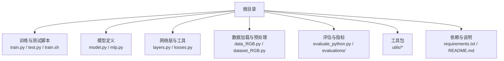
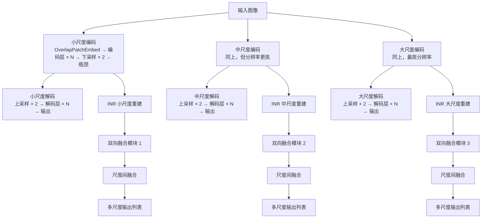
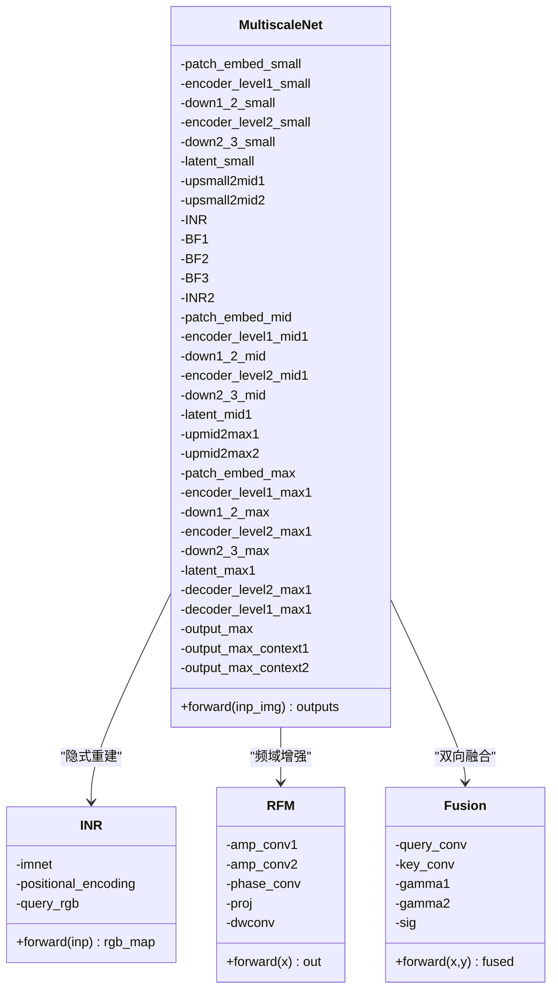
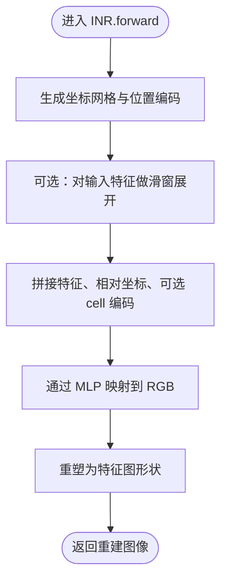
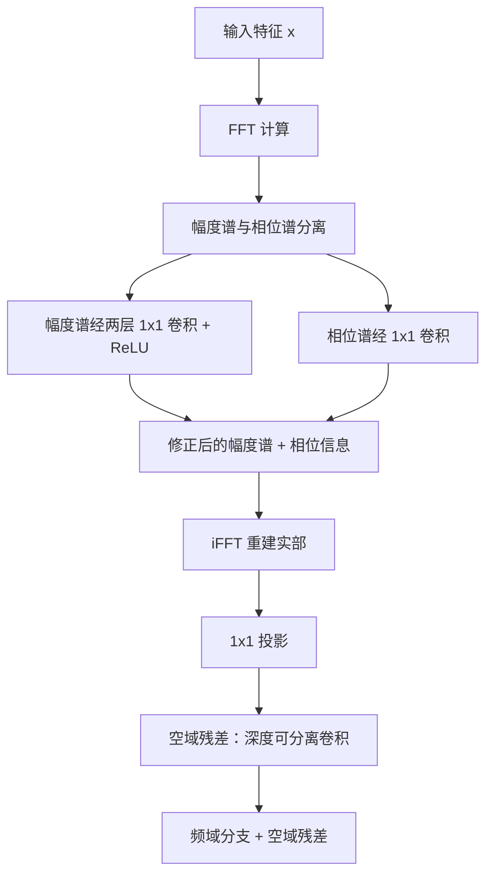
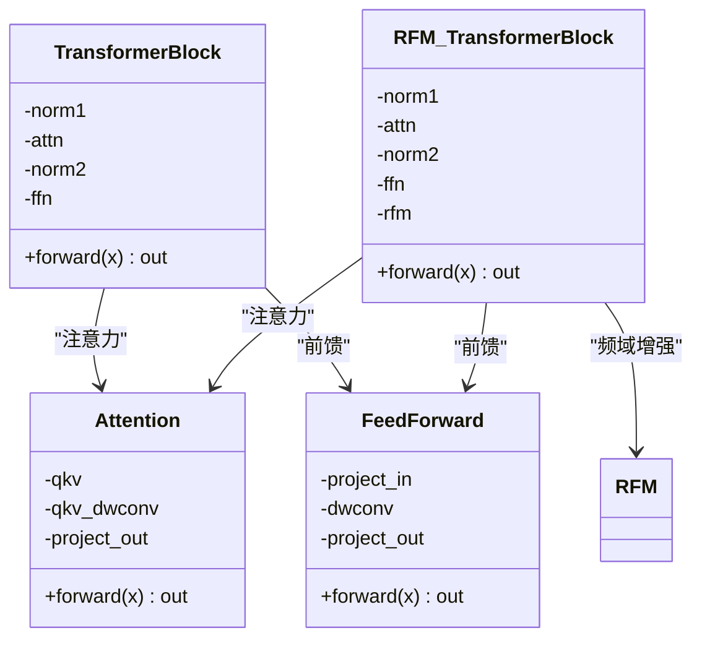
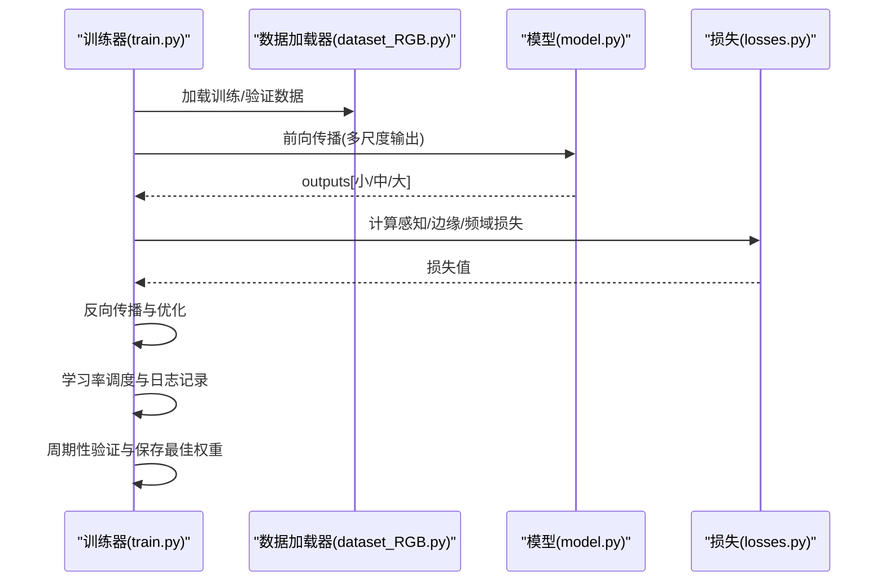
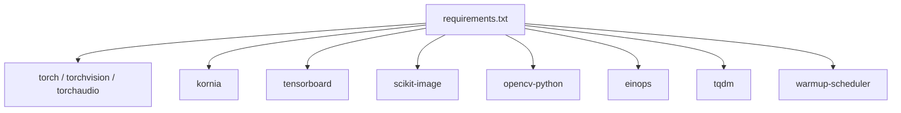

# 项目概述

<cite>
**本文引用的文件**
- [README.md](file://README.md)
- [model.py](file://model.py)
- [train.py](file://train.py)
- [test.py](file://test.py)
- [layers.py](file://layers.py)
- [mlp.py](file://mlp.py)
- [losses.py](file://losses.py)
- [requirements.txt](file://requirements.txt)
- [train.sh](file://train.sh)
- [data_RGB.py](file://data_RGB.py)
- [dataset_RGB.py](file://dataset_RGB.py)
- [evaluate_python.py](file://evaluate_python.py)
- [utils/__init__.py](file://utils/__init__.py)
- [utils/dir_utils.py](file://utils/dir_utils.py)
- [utils/image_utils.py](file://utils/image_utils.py)
- [utils/model_utils.py](file://utils/model_utils.py)
</cite>

## 目录
1. [引言](#引言)
2. [项目结构](#项目结构)
3. [核心组件](#核心组件)
4. [架构总览](#架构总览)
5. [详细组件分析](#详细组件分析)
6. [依赖分析](#依赖分析)
7. [性能考虑](#性能考虑)
8. [故障排查指南](#故障排查指南)
9. [结论](#结论)
10. [附录](#附录)

## 引言
NeRD-Rain 是面向图像去雨任务的双向多尺度隐式神经表示（Implicit Neural Representation, INR）方法，已在 CVPR 2024 会议上发表。该项目围绕“双向多尺度”与“隐式神经表示”的核心思想，结合频域增强与注意力机制，构建了高效的端到端去雨系统。其主要目标是：
- 在保持高分辨率细节的同时，有效去除图像中的雨条纹与雨滴；
- 通过多尺度特征金字塔与跨尺度融合，提升复杂场景下的鲁棒性；
- 利用隐式神经表示对连续空间进行建模，提高对稀疏观测的插值与重建能力；
- 在多个公开数据集上取得优异的客观指标与主观质量。

技术亮点概览：
- 双向多尺度架构：自底向上编码器与自顶向下解码器配合，形成多分辨率特征流；
- 注意力与前馈网络：Transformer 块内嵌注意力与前馈子层，提升通道与空间交互；
- 频域增强模块（RFM）：在频域对振幅与相位进行分别处理，增强高频细节；
- 隐式神经表示（INR）：以 MLP 为核心，对中间特征进行隐式采样与重建，辅助多尺度融合；
- 多任务损失：结合感知损失、边缘损失与频域损失，稳定训练并提升去雨效果。

应用场景：
- 智能交通监控（雨天视频清晰化）
- 自动驾驶视觉感知（提升夜间/雨天成像质量）
- 影像修复与增强（历史影像、低质量视频）
- 安防与公共安全（恶劣天气下目标识别）

## 项目结构
仓库采用按功能分层组织的方式，核心目录与文件职责如下：
- 根目录脚本与配置：训练入口、测试入口、环境安装、训练脚本等
- 模型与网络：主干网络、注意力与频域模块、隐式神经表示、损失函数
- 数据与评估：数据加载器、评估脚本、工具函数
- 可选消融实验：不同变体模型与对比方法

图表来源
- [train.py:1-218](file://train.py#L1-L218)
- [test.py:1-69](file://test.py#L1-L69)
- [model.py:1-673](file://model.py#L1-L673)
- [layers.py:1-392](file://layers.py#L1-L392)
- [mlp.py:1-151](file://mlp.py#L1-L151)
- [losses.py:1-52](file://losses.py#L1-L52)
- [data_RGB.py:1-15](file://data_RGB.py#L1-L15)
- [dataset_RGB.py:1-162](file://dataset_RGB.py#L1-L162)
- [evaluate_python.py:1-119](file://evaluate_python.py#L1-L119)
- [utils/__init__.py:1-5](file://utils/__init__.py#L1-L5)
- [requirements.txt:1-67](file://requirements.txt#L1-L67)
- [README.md:1-121](file://README.md#L1-L121)

章节来源
- [README.md:25-60](file://README.md#L25-L60)
- [requirements.txt:1-67](file://requirements.txt#L1-L67)

## 核心组件
- 主干网络 MultiscaleNet：包含三套并行的编码-解码路径（小/中/大），每条路径均包含多尺度 Transformer 块与 RFM 频域增强；在瓶颈处引入 INR 对特征进行隐式重建；通过双向融合模块（Fusion）聚合多尺度上下文。
- 隐式神经表示 INR：基于 MLP 的位置编码与局部集合查询，对中间特征进行像素级隐式重建，辅助多尺度融合与细节恢复。
- 频域增强模块 RFM：对输入图像进行二维傅里叶变换，分别对幅度谱与相位谱进行卷积处理后重建，再与空域残差分支相加，增强高频细节。
- 注意力与前馈：Transformer 块内含注意力子层与前馈子层，配合 LayerNorm 与残差连接，提升特征交互与非线性表达能力。
- 数据与损失：数据加载器支持训练/验证/测试三种模式；损失函数包含感知损失、边缘损失与频域损失，训练时对多尺度输出施加联合损失。

章节来源
- [model.py:303-673](file://model.py#L303-L673)
- [mlp.py:41-151](file://mlp.py#L41-L151)
- [model.py:118-159](file://model.py#L118-L159)
- [model.py:195-236](file://model.py#L195-L236)
- [losses.py:5-52](file://losses.py#L5-L52)
- [dataset_RGB.py:13-162](file://dataset_RGB.py#L13-L162)

## 架构总览
下图展示了从输入到多尺度输出的整体流程，以及 INR 与 RFM 的插入位置与融合策略。

图表来源
- [model.py:486-673](file://model.py#L486-L673)
- [model.py:345-400](file://model.py#L345-L400)
- [model.py:505-527](file://model.py#L505-L527)
- [model.py:525-541](file://model.py#L525-L541)
- [model.py:583-621](file://model.py#L583-L621)

## 详细组件分析

### 组件一：双向多尺度隐式神经表示网络（MultiscaleNet）
- 结构要点
  - 三套并行编码-解码路径，分别对应小、中、大三种尺度输入；
  - 瓶颈阶段引入 INR 对特征进行隐式重建，提升细节与连续性；
  - 使用 RFM 在瓶颈处进行频域增强，改善高频细节；
  - 通过双向融合模块（Fusion）对相邻尺度的特征进行注意力加权融合。
- 关键流程
  - 小尺度先经 INR 重建并上采样至中尺度，与中尺度输入相加；
  - 中尺度经 INR 再上采样至大尺度，与大尺度输入相加；
  - 大尺度解码后，使用双向融合模块聚合相邻尺度的瓶颈特征；
  - 最终输出多尺度重建结果列表，便于多任务损失与可视化。

图表来源
- [model.py:303-673](file://model.py#L303-L673)
- [mlp.py:41-151](file://mlp.py#L41-L151)
- [model.py:118-159](file://model.py#L118-L159)
- [model.py:272-301](file://model.py#L272-L301)

章节来源
- [model.py:303-673](file://model.py#L303-L673)

### 组件二：隐式神经表示（INR）
- 设计动机：对中间特征进行连续空间建模，提升插值与细节恢复能力；
- 实现方式：以 MLP 为核心，结合位置编码与局部集合查询，对每个像素坐标进行隐式采样；
- 特性：支持特征展开、相对坐标编码、可选的 cell 解码，实现稳健的空间映射。

图表来源
- [mlp.py:129-151](file://mlp.py#L129-L151)
- [mlp.py:57-127](file://mlp.py#L57-L127)

章节来源
- [mlp.py:41-151](file://mlp.py#L41-L151)

### 组件三：频域增强模块（RFM）
- 设计动机：利用傅里叶变换在频域对振幅与相位分别建模，增强高频细节；
- 实现方式：对输入进行二维 FFT，分离幅度与相位谱，分别经卷积处理后重建，再与空域残差分支相加。

图表来源
- [model.py:118-159](file://model.py#L118-L159)

章节来源
- [model.py:118-159](file://model.py#L118-L159)

### 组件四：注意力与前馈（TransformerBlock 与 RFM_TransformerBlock）
- 注意力子层：多头注意力配合归一化与残差；
- 前馈子层：深度卷积与门控激活；
- RFM_TransformerBlock：在前馈分支旁路加入 RFM，实现频域增强与通道混合的协同。

图表来源
- [model.py:161-193](file://model.py#L161-L193)
- [model.py:97-116](file://model.py#L97-L116)
- [model.py:195-236](file://model.py#L195-L236)
- [model.py:118-159](file://model.py#L118-L159)

章节来源
- [model.py:161-236](file://model.py#L161-L236)

### 组件五：训练与推理流程
- 训练流程：数据加载、多尺度标签构建、多任务损失计算、优化器更新、学习率调度、周期性验证与最佳模型保存；
- 推理流程：窗口分割（避免长宽非整除）、模型推理、窗口合并、裁剪与写回。

图表来源
- [train.py:142-218](file://train.py#L142-L218)
- [dataset_RGB.py:13-162](file://dataset_RGB.py#L13-L162)
- [model.py:486-673](file://model.py#L486-L673)
- [losses.py:5-52](file://losses.py#L5-L52)

章节来源
- [train.py:1-218](file://train.py#L1-L218)
- [test.py:1-69](file://test.py#L1-L69)
- [layers.py:249-304](file://layers.py#L249-L304)

## 依赖分析
- Python 依赖集中在 PyTorch 生态与计算机视觉工具链，包括张量运算、数据加载、图像处理与可视化；
- 训练脚本依赖 Kornia 进行多尺度金字塔构建，TensorBoard 进行训练日志记录；
- 测试脚本依赖窗口切分与反切分函数，避免边界效应。

图表来源
- [requirements.txt:1-67](file://requirements.txt#L1-L67)

章节来源
- [requirements.txt:1-67](file://requirements.txt#L1-L67)

## 性能考虑
- 训练稳定性：采用余弦退火学习率与渐进式热身，结合多任务损失平衡不同分支；
- 计算效率：窗口切分策略减少显存占用，适合大尺寸图像推理；
- 模型规模：通过多尺度与 INR 的组合，在精度与速度之间取得平衡；
- 可扩展性：模块化设计便于替换注意力、频域或融合策略，适配不同硬件条件。

## 故障排查指南
- 权重加载失败：检查是否为多卡训练保存的带 module 前缀权重，工具函数已内置兼容处理；
- GPU 显存不足：调整批大小或使用窗口切分策略；确保关闭不必要的可视化与调试输出；
- 数据路径错误：确认训练/测试数据目录结构与文件名匹配；
- 指标计算异常：评估脚本默认在 Y 通道计算 PSNR/SSIM，确保输入图像格式正确。

章节来源
- [utils/model_utils.py:22-36](file://utils/model_utils.py#L22-L36)
- [utils/model_utils.py:92-99](file://utils/model_utils.py#L92-L99)
- [evaluate_python.py:20-58](file://evaluate_python.py#L20-L58)
- [test.py:27-30](file://test.py#L27-L30)

## 结论
NeRD-Rain 将双向多尺度与隐式神经表示相结合，提出了一种高效且鲁棒的图像去雨框架。通过频域增强与注意力机制的协同，显著提升了复杂雨景下的重建质量。项目在 CVPR 2024 的技术贡献体现在：
- 提出双向多尺度隐式神经表示范式；
- 频域增强模块与注意力机制的深度融合；
- 在多个基准数据集上的优异表现与广泛可复现性。

该框架既适合初学者快速上手，也为专家提供了可扩展的模块化实现与丰富的消融实验基线。

## 附录
- 快速开始
  - 安装依赖：pip install -r requirements.txt
  - 安装热身调度器：cd pytorch-gradual-warmup-lr; python setup.py install; cd ..
  - 准备数据集并放置于指定目录
  - 训练：bash train.sh 或直接运行 python train.py
  - 测试：python test.py
- 预训练模型与结果链接见 README 中的“预训练模型”与“可视化结果”部分

章节来源
- [README.md:25-121](file://README.md#L25-L121)
- [train.sh:1-7](file://train.sh#L1-L7)
- [train.py:72-78](file://train.py#L72-L78)
- [test.py:31-37](file://test.py#L31-L37)